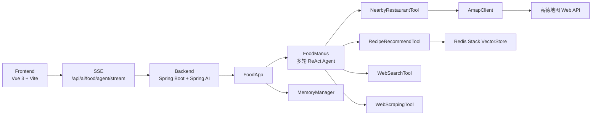

# Super AI Agents

一个面向美食场景的 AI Agent 项目，当前稳定版本聚焦于“馋嘴小迪”美食助手。

项目采用前后端分离架构：

- `frontend/`：Vue 3 + Vite 聊天界面
- `backend/`：Spring Boot + Spring AI 多轮 Food Agent

当前前端聊天只保留一个 SSE 流式入口，统一走美食 Agent：

- `GET /api/ai/food/agent/stream`

## 当前能力

- 附近餐厅推荐
  - 基于高德 Web API
  - 支持经纬度定位、POI 周边搜索、逆地理编码、步行路线信息
- 做饭推荐
  - 基于本地 Redis Stack 向量库中的菜谱知识
  - 支持按食材、口味、人数、时长等条件推荐菜谱
- 泛美食问答
  - 由多轮 Agent 自主选择是否使用网页搜索和网页抓取作为兜底
- 多轮会话与用户画像
  - 保留聊天历史、摘要记忆和用户画像信息

## 技术栈

- Frontend: Vue 3, Vue Router, Axios, SSE, Vite
- Backend: Spring Boot, Spring AI, Redis Stack, Tool Calling, ReAct Agent
- External APIs: 高德地图 Web API、网页搜索 API

## 系统架构



## 快速启动

### 1. 启动后端依赖

项目默认依赖 Redis Stack，配置端口为 `6380`。

可以直接使用 Docker：

```bash
docker run -d --name redis-stack -p 6380:6379 redis/redis-stack-server:latest
```

### 2. 配置后端密钥

当前项目约定直接在配置文件中维护密钥，而不是环境变量。

请检查并按需修改以下文件中的配置：

- `/Users/luocl/Desktop/super-ai-agents-root/backend/src/main/resources/application-dev.yml`
- `/Users/luocl/Desktop/super-ai-agents-root/backend/src/main/resources/application-prod.yml`

重点配置项包括：

- `spring.ai.openai.api-key`
- `spring.ai.dashscope.api-key`
- `search-api.api-key`
- `amap.api-key`

### 3. 启动后端

```bash
cd /Users/luocl/Desktop/super-ai-agents-root/backend
mvn spring-boot:run
```

后端默认地址：

- `http://localhost:8123/api`

接口文档：

- [Swagger UI](http://localhost:8123/api/swagger-ui.html)

### 4. 启动前端

```bash
cd /Users/luocl/Desktop/super-ai-agents-root/frontend
npm install
npm run dev
```

前端默认地址：

- [http://localhost:3000](http://localhost:3000)

## 目录说明

```text
.
├── backend/   # Spring Boot 后端，包含 Agent、工具、记忆、接口
├── frontend/  # Vue 3 前端聊天界面
└── README.md
```

## 文档导航

- [前端说明](./frontend/README.md)
- [后端说明](./backend/README.md)

## 当前约束

- 当前美食聊天入口只保留一个 SSE 接口，不再区分“普通聊天 / RAG 模式”
- 前端是否附带定位由消息内容触发，涉及“附近、位置、餐厅”等表达时会尝试请求浏览器定位
- Food Agent 的中间调试步骤不会再直接推给前端，前端只显示最终可读回答

## 构建验证

```bash
cd /Users/luocl/Desktop/super-ai-agents-root/backend
mvn -DskipTests package

cd /Users/luocl/Desktop/super-ai-agents-root/frontend
npm run build
```
