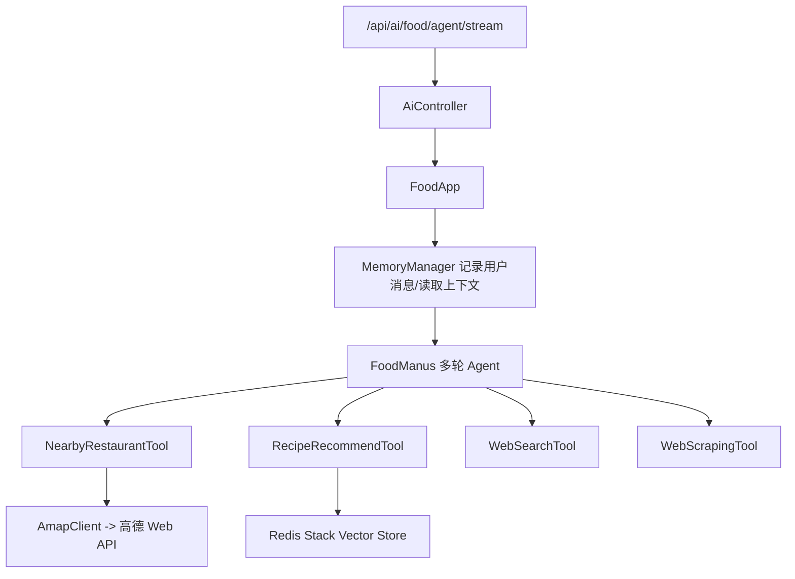

# Backend

`backend/` 是“馋嘴小迪”美食助手的后端服务，基于 Spring Boot + Spring AI 构建。

当前稳定版本以多轮美食 Agent 为核心，统一承接前端聊天请求，并通过 Tool Calling 调用地图、菜谱和网页能力。

## 技术栈

- Java 21
- Spring Boot 3.4
- Spring AI 1.0
- Redis Stack
- Spring AI Redis Vector Store
- SSE
- Hutool
- Jsoup
- Knife4j / SpringDoc

## 后端职责

- 提供单一美食聊天 SSE 接口
- 管理聊天会话与消息持久化
- 管理用户画像与摘要记忆
- 提供多轮 Food Agent 执行链路
- 封装高德地图和本地菜谱推荐工具

## 核心流程



## 环境要求

- Java 21
- Maven 3.x
- Redis Stack

## 配置说明

主配置文件：

- `/Users/luocl/Desktop/super-ai-agents-root/backend/src/main/resources/application.yml`

分环境配置文件：

- `/Users/luocl/Desktop/super-ai-agents-root/backend/src/main/resources/application-dev.yml`
- `/Users/luocl/Desktop/super-ai-agents-root/backend/src/main/resources/application-prod.yml`

当前项目约定直接在配置文件里维护 key，不通过环境变量注入。

重点配置项：

- `server.port`: 默认 `8123`
- `server.servlet.context-path`: 默认 `/api`
- `spring.data.redis.host`
- `spring.data.redis.port`: 默认 `6380`
- `spring.ai.openai.api-key`
- `spring.ai.dashscope.api-key`
- `search-api.api-key`
- `amap.api-key`
- `amap.restaurant.default-radius-meters`
- `amap.restaurant.default-limit`

## 本地启动

### 1. 启动 Redis Stack

```bash
docker run -d --name redis-stack -p 6380:6379 redis/redis-stack-server:latest
```

### 2. 启动 Spring Boot

```bash
cd /Users/luocl/Desktop/super-ai-agents-root/backend
mvn spring-boot:run
```

默认访问地址：

- [http://localhost:8123/api](http://localhost:8123/api)

接口文档：

- [http://localhost:8123/api/swagger-ui.html](http://localhost:8123/api/swagger-ui.html)

## 当前主要接口

### 1. 美食 Agent SSE

- `GET /api/ai/food/agent/stream`

参数：

- `message`
- `chatId`
- `longitude`（可选）
- `latitude`（可选）

说明：

- 当前前端聊天只调用这一条 SSE 接口
- 返回内容为最终可读回答，不再下发中间工具 JSON

### 2. 通用 Manus SSE

- `GET /api/ai/manus/chat`

说明：

- 这是通用多轮 Agent 的实验入口
- 不属于前端美食页面主链路

### 3. 会话管理接口

- `GET /api/chat/conversations`
- `POST /api/chat/conversations`
- `GET /api/chat/conversations/{chatId}`
- `PUT /api/chat/conversations/{chatId}/messages`
- `DELETE /api/chat/conversations/{chatId}`
- `GET /api/chat/current`
- `PUT /api/chat/current/{chatId}`

### 4. 记忆接口

- `GET /api/memory/profile/{userId}`
- `GET /api/memory/summary/{chatId}`
- `POST /api/memory/compress/{chatId}`

## 当前 Food Agent 工具池

Food Agent 当前注入的是 `foodTools`，包括：

- `NearbyRestaurantTool`
  - 附近餐厅推荐
  - 高德 POI 搜索、逆地理编码、路线信息
- `RecipeRecommendTool`
  - 基于本地 Redis 向量库的菜谱推荐
- `WebSearchTool`
  - 外部网页搜索兜底
- `WebScrapingTool`
  - 网页正文抓取兜底

工具注册位置：

- [/Users/luocl/Desktop/super-ai-agents-root/backend/src/main/java/com/example/superaiagents/tools/ToolRegistration.java](/Users/luocl/Desktop/super-ai-agents-root/backend/src/main/java/com/example/superaiagents/tools/ToolRegistration.java)

## 关键代码位置

- Agent 入口：
  - [/Users/luocl/Desktop/super-ai-agents-root/backend/src/main/java/com/example/superaiagents/controller/AiController.java](/Users/luocl/Desktop/super-ai-agents-root/backend/src/main/java/com/example/superaiagents/controller/AiController.java)
- 美食应用编排：
  - [/Users/luocl/Desktop/super-ai-agents-root/backend/src/main/java/com/example/superaiagents/app/FoodApp.java](/Users/luocl/Desktop/super-ai-agents-root/backend/src/main/java/com/example/superaiagents/app/FoodApp.java)
- 多轮 Food Agent：
  - [/Users/luocl/Desktop/super-ai-agents-root/backend/src/main/java/com/example/superaiagents/agent/FoodManus.java](/Users/luocl/Desktop/super-ai-agents-root/backend/src/main/java/com/example/superaiagents/agent/FoodManus.java)
- Agent 执行框架：
  - [/Users/luocl/Desktop/super-ai-agents-root/backend/src/main/java/com/example/superaiagents/agent/BaseAgent.java](/Users/luocl/Desktop/super-ai-agents-root/backend/src/main/java/com/example/superaiagents/agent/BaseAgent.java)
  - [/Users/luocl/Desktop/super-ai-agents-root/backend/src/main/java/com/example/superaiagents/agent/ToolCallAgent.java](/Users/luocl/Desktop/super-ai-agents-root/backend/src/main/java/com/example/superaiagents/agent/ToolCallAgent.java)

## 构建验证

```bash
cd /Users/luocl/Desktop/super-ai-agents-root/backend
mvn -DskipTests package
```

## 当前约束

- 美食聊天主链路只有一个 SSE 接口
- Food Agent 中间步骤保留在后端日志里，不直接暴露给前端
- 高德 key 当前从配置文件读取
- Redis Stack 是菜谱向量检索和记忆能力的关键依赖
