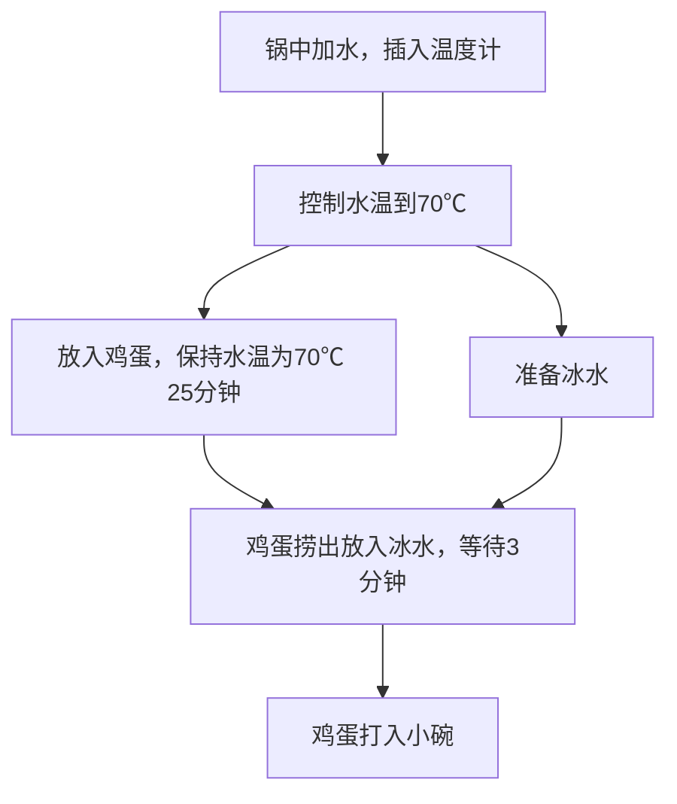
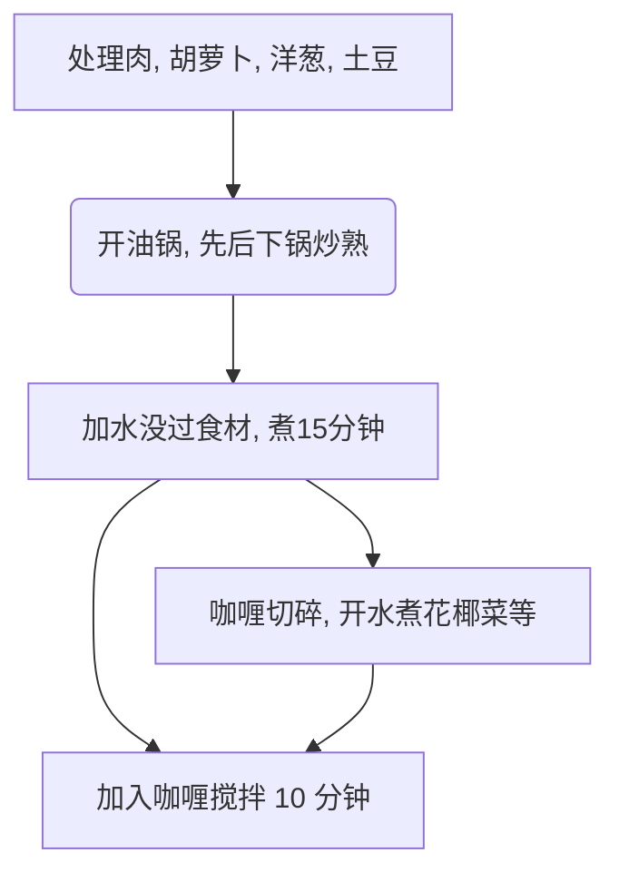
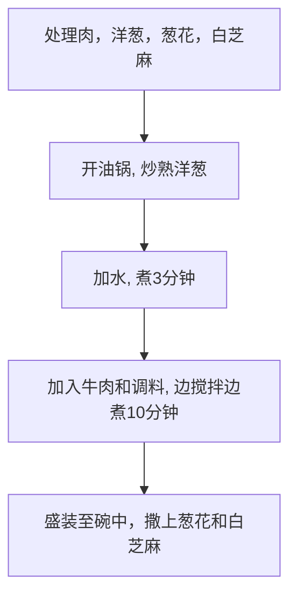

# 咖喱炒蟹的做法

- 来源：Anduin2017/HowToCook
- 来源链接：https://github.com/Anduin2017/HowToCook/blob/master/dishes/aquatic/咖喱炒蟹.md
- 许可证：Unlicense / Public Domain
- 分类：水产
- 原始路径：dishes/aquatic/咖喱炒蟹.md

第一次吃咖喱炒蟹是在泰国的建兴酒家中餐厅，爆肉的螃蟹挂满有蟹黄味道的咖喱，味道真的绝，喜欢吃海鲜的程序员绝对不能错过。操作简单，对沿海的程序员非常友好。

预估烹饪难度：★★★★

## 必备原料和工具

- 青蟹（别称：肉蟹）
- 咖喱块（推介乐惠蟹黄咖喱）
- 洋葱
- 椰浆
- 鸡蛋
- 生粉（别称：淀粉）
- 大蒜

## 计算

每次制作前需要确定计划做几份。一份正好够 1 个人食用

总量：

- 肉蟹 1 只（大约 300g） * 份数
- 咖喱块 15g（一小块）*份数
- 椰浆 100ml*份数
- 鸡蛋 1 个 *份数
- 洋葱 200g *份数
- 大蒜 5 瓣 *份数

## 操作

- 肉蟹掀盖后对半砍开，蟹钳用刀背轻轻拍裂，切口和蟹钳蘸一下生粉，不要太多。撒 5g 生粉到蟹盖中，盖住蟹黄，备用
- 洋葱切成洋葱碎，备用
- 大蒜切碎，备用
- 烧一壶开水，备用
- 起锅烧油，倒入约 20ml 食用油，等待 10 秒让油温升高
- 将螃蟹切口朝下，轻轻放入锅中，煎 20 秒，这一步主要是封住蟹黄，蟹肉。然后翻面，每面煎 10 秒。煎完将螃蟹取出备用
- 将螃蟹盖放入锅中，使用勺子舀起锅中热油泼到蟹盖中，煎封住蟹盖中的蟹黄，煎 20 秒后取出备用
- 不用刷锅，再倒入 10ml 食用油，大火让油温升高至轻微冒烟，将大蒜末，洋葱碎倒入，炒 10 秒钟
- 将咖喱块放入锅中炒化（10 秒），放入煎好的螃蟹，翻炒均匀
- 倒入开水 300ml，焖煮 3 分钟。
- 焖煮完后，倒入椰浆和蛋清，关火，关火后不断翻炒，一直到酱汁变浓稠。
- 出锅

## 附加内容

- 做法参考：[十几年澳门厨房佬教学挂汁的咖喱蟹怎么做](https://www.bilibili.com/video/BV1Nq4y1W7K9)

---

# 吐司果酱的做法

- 来源：Anduin2017/HowToCook
- 来源链接：https://github.com/Anduin2017/HowToCook/blob/master/dishes/breakfast/吐司果酱.md
- 许可证：Unlicense / Public Domain
- 分类：早餐
- 原始路径：dishes/breakfast/吐司果酱.md

饱腹感的懒人快速营养早餐，2 分钟 搞定

预估烹饪难度：★

## 必备原料和工具

- 新鲜吐司
- 果酱
- 面包机

## 计算

- 吐司两片
- 果酱足够涂满一面吐司的量

## 操作

- 将吐司放入面包机
- 设置好档位,时间到了会自动弹出
- 两分钟后吐司加热完成弹出
- 先取出一片吐司,涂满果酱再盖上另一片吐司即可
- 用餐巾纸包一下可以边走边吃也可以吃完再出门

两分钟快速搞定,操作很简单,味道十分美味,十分适合程序员。耗时短,不会产生额外垃圾,也不需要清洗工具什么的。

## 附加内容

面包机一般不会超过一百块,吐司去楼下超市或美团买菜送上门,一般一包十块钱八片,保质期比较短,很干净卫生。

---

# 油泼辣子的做法

- 来源：Anduin2017/HowToCook
- 来源链接：https://github.com/Anduin2017/HowToCook/blob/master/dishes/condiment/油泼辣子/油泼辣子.md
- 许可证：Unlicense / Public Domain
- 分类：调味料
- 原始路径：dishes/condiment/油泼辣子/油泼辣子.md


制作耗时 10 分钟

预估烹饪难度：★★★

## 必备原料和工具

- 蒜头
- 干辣椒面
- 盐
- 熟白芝麻
- 小米椒
- 花生油（可用菜籽油替换）
- 家庭小陶瓷碗
- 家庭铁勺子
- 五香粉 （可选）
- 草寇（可选）
- 小葱 （可选）
- 八角
- 花椒
- 香叶
- 白芷
- 姜片（可选）
- 糖
- 白醋

## 计算

- 蒜头 1 个
- 干辣椒面 100 克
- 盐 5 克
- 熟白芝麻 15 克
- 小米椒 1 个
- 花生油 150 毫升 （可用菜籽油替换）
- 五香粉 10 克（可选）
- 草寇 1 个（可选）
- 小葱 3-5 根（可选）
- 其他配料：八角(1)、花椒（20-50 粒都可，看个人口味）、香叶（2-3 片）、白芷（2-3 片）、姜片（大拇指粗细的姜切片）（可选）
- 糖 30 克
- 白醋 5 ml（大概就是小铁勺子的量）

## 操作

- 拿出蒜头掰 2 个`小蒜头`去皮
- 拿出砧板剁碎`小蒜头`、`小米椒`
- 拿出碗倒入`花生油`
- 油热放入`其他配料`和`小葱`,等到香料变焦，捞出扔掉
- 拿出铁锅将碗内的油放入加热 2 分钟（菜籽油烧至冒烟）
- 此时是空碗
- 往空碗加入`干辣椒面`、`白芝麻`、`蒜末`、`小米椒`、`盐`、`五香粉`、`草寇`作为"调料"
- 关火将油温冷却至 `210` 摄氏度
- 将锅内热油倒入碗内并用勺子搅拌即可（可以在 `165` 摄氏度时加入同样"调料"的碗最后进行混合进行增辣）
- 倒入热油稍微搅拌后放入白醋，此时会重新沸腾。继续进行搅拌，白醋增香。
- 油泼辣子冷却到温热放白糖和味精，白糖可以是辣味柔和，不会那么的呛口

## 附加内容

- 五香粉、草寇作为"调料"加入，可以增加香味，使油泼辣子更香

---

# 反沙芋头的做法

- 来源：Anduin2017/HowToCook
- 来源链接：https://github.com/Anduin2017/HowToCook/blob/master/dishes/dessert/反沙芋头/反沙芋头.md
- 许可证：Unlicense / Public Domain
- 分类：甜品
- 原始路径：dishes/dessert/反沙芋头/反沙芋头.md


反沙芋头是一道著名的潮汕小吃，下午茶，制作起来特别方便，～预计制作时间 20 分钟

预估烹饪难度：★★★

## 必备原料和工具

- 荔浦芋头（电商平台购买即可，实惠新鲜）
- 白砂糖或冰糖
- 水
- 葱

## 计算

- 荔浦芋头 200g
- 白砂糖 30g
- 水 15g

## 操作

- 芋头切长条（稍微大条一点，翻炒过程不容易烂）
- 加入可以没过芋头的油，等油温起来（插入筷子冒小泡即可）
- 放进芋头到油里，去炸到芋头浮起来，一般是微微泛黄并且可以用筷子很轻松戳洞
- 炸芋头的油放起来别浪费，后面炒菜啥的都能用
- 接下来关键的一步，把糖(30g)和水(15g)按照 2：1 比例，加热至不变色且冒小泡
- 倒入葱花和芋头，关火翻炒，此时等温度下来，糖就会有反沙的效果
- 装盘上桌！

## 附加内容

- 刚做好的反沙芋头很烫，小心烫嘴哦
- 再配上茶，啊~真惬意啊

---

# B52轰炸机的做法

- 来源：Anduin2017/HowToCook
- 来源链接：https://github.com/Anduin2017/HowToCook/blob/master/dishes/drink/B52轰炸机.md
- 许可证：Unlicense / Public Domain
- 分类：饮品
- 原始路径：dishes/drink/B52轰炸机.md

B-52 是鸡尾酒中喝法比较独特的一种，要配上短吸管，餐巾纸和打火机。

把酒点燃，用吸管一口气喝完，然后就能体验到先冷后热那种冰火两重天的感觉。那种感觉，只有试过才知道。

用吸管适用于女士，最刺激的喝法是一口喝下，喝的时候注意尽量避免碰到杯口引起烫伤，让火在嘴里灭掉，才能喝出最好的味道。

预估烹饪难度：★★★

## 必备原料和工具

- 甘露咖啡酒
- 爱尔兰百利甜酒
- 蓝天原味伏特加
- 吧勺
- 利口酒杯
- 打火机

## 计算

每份：

- 甘露咖啡酒 10ml
- 爱尔兰百利甜酒 10ml
- 蓝天原味伏特加 10ml

## 操作

- 在利口酒杯的最底层倒入甘露咖啡酒到 1/3 处。(10ml)
- 顺着吧勺缓缓倒入爱尔兰百利甜酒，也是 1/3 处 (10ml)。注意要慢，保证层次分明。（太快甜酒会和咖啡混合）
- 最后在上层倒入蓝天原味伏特加 （10ml)
- 用打火机热一下杯口
- 最后一步点火： 看到淡蓝色的小火苗了吗？

## 附加内容

- 喝的时候，现在酒吧常用的方法是提供一个吸管，在火还燃烧的时候插入，然后快速全部吸入。
- 由于吸管太细，其中氧气不足，所以火苗会灭掉，不必担心。这时候，会感到一股热辣顺着喉咙一直烈到胃，之后就是久久的咖啡奶油回甘。非常刺激又好喝。

---

# 乡村啤酒鸭的做法

- 来源：Anduin2017/HowToCook
- 来源链接：https://github.com/Anduin2017/HowToCook/blob/master/dishes/meat_dish/乡村啤酒鸭.md
- 许可证：Unlicense / Public Domain
- 分类：荤菜
- 原始路径：dishes/meat_dish/乡村啤酒鸭.md


将鸭肉与啤酒一同炖煮成菜，使滋补的鸭肉味道更加浓厚，鸭肉不仅入口鲜香，还带有一股啤酒清香。一般初学者只需要 1 小时即可完成。

预估烹饪难度：★★★★

## 必备原料和工具

- 鸭肉
- 啤酒
- 32 厘米以上的炒锅一个(锅太小难炒
- 青椒
- 红椒
- 大蒜
- 生姜
- 小米椒
- 蒜苗
- 大葱
- 草果
- 桂皮
- 八角
- 香叶
- 干辣椒

## 计算

- 鸭肉（半只,1 kg,让市场老板剁成小块）
- 啤酒 1000 ml （可以买 500 ml 的罐装啤酒两瓶）
- 青椒 2 条,红椒 1 条 （ 长度 10 厘米到 15 厘米 之间都可以）（切段 或者切片都可以, 2 厘米一段）

### 辅料

- 大蒜 4 颗 ,拍散备用
- 生姜 3 厘米长,拍散备用
- 小米辣 3 颗,切两段即可(不吃辣的可以不用
- 蒜苗 2 根 切段备用
- 大葱 2 根  1 根切段,1 根备用

### 香料

- 草果 两颗,拍散去仔备用
- 桂皮 4 厘米一小片
- 八角 3 颗
- 香叶 3 片
- 干辣椒 6 条 (不吃辣可以不用


## 操作

### 鸭肉焯水以去腥去血水

- 鸭肉清洗一遍放进锅中
- 加清水淹没鸭肉
- 加 20 ml 料酒
- 加备用的 1 根 大葱
- 加生姜 ,拍散的 2 厘米
- 开火烧滚
- 捞出浮沫
- 鸭肉捞出,清水洗干净备用

### 开始煮

- 锅清洗感觉烧热,加 60ml 的花生油
- 油温到 60 度的时候,加一把花椒（ 30 颗）
- 加鸭肉翻炒 4 分钟
  - 2 分钟后加入所有的香料
  - 3 分钟的时候加入所有的料头（生姜,大蒜,小米辣）
- 加入 1000 ml 的啤酒
- 烧鸭肉 30 分钟
  - 10 分钟的时候加 盐 （3 克） 生抽( 10 ml ) 老抽( 5 ml)
  - 20 分钟 加入所有的辅料 （青椒和红椒段）
  - 29 分钟加入 蒜苗段 和 大葱段
  - 翻炒 1 分钟
- 出锅

## 附加内容

- 操作时，需要注意观察沸腾的水位线，如发现低于 2/3 的食材应加热水或者加啤酒。

- [厨师长：用土灶烧“乡村啤酒鸭”，味道安逸得不摆了](https://www.bilibili.com/video/BV1R4411u7po?spm_id_from=333.999.0.0)

---

# 凉皮的做法

- 来源：Anduin2017/HowToCook
- 来源链接：https://github.com/Anduin2017/HowToCook/blob/master/dishes/semi-finished/凉皮.md
- 许可证：Unlicense / Public Domain
- 分类：半成品加工
- 原始路径：dishes/semi-finished/凉皮.md

预估烹饪难度：★★★

## 必备原料和工具

* 凉皮、面筋
* 盐、鸡精、蚝油、生抽、老抽、香油、香醋、芝麻酱（原味芝麻酱最佳）
* 黄瓜、大蒜、绿豆芽
* 盆、碗、盘子、蒜臼

## 计算

* 凉皮用量为 300 g/人 向下取整。
* 芝麻酱的用量为 30 g/人 向下取整。
* 黄瓜 100g/人、绿豆芽 50g/人。

## 操作

### 准备工作

* 锅中加入 500ml 水。煮沸。
* 将绿豆芽放入锅中，大火煮 60 秒。豆芽捞出，过凉水，放入盘中备用。
* 黄瓜切丝放入盘中备用
* 将 10g 蒜瓣剥皮、放入蒜臼中加入 1g 盐。锤成蒜泥，加入 10g 自来水。放置备用。
* 注：超市购买来的凉皮表面一般会有食用油，可以使用自来水清洗。面筋同样。
* 注：清洗面筋之后，请用手将面筋中的大量水分挤出（不需过于用力）。

### 盐水调配

* 准备小碗，加入 3g 盐、2g 鸡精、5g 生抽、1g 老抽、1g 香油、2g 蚝油、香醋 5g、（盐、香醋均可根据个人口味酌量添加，以上数据只是大众口味）。
* 以上调料加入 25-35g 温水（据个人咸淡程度），使用筷子将其拌匀、溶解。静置一旁冷却。

### 芝麻酱调配

* 注：以下计量均为一人份，如果有 n 人，请自觉将计量乘以 n
* 拿出小碗，将准备好的芝麻酱放入其中。
* 加入 4g 盐、3g 鸡精、5g 生抽、1g 老抽、3g 蚝油。
* 使用筷子将其调料与芝麻酱拌匀。
* 加入 10g 清水将其拌匀。
* 上一步骤重复 2、3 次（次数根据个人对芝麻酱的浓稠程度而定）。

### 最终步骤

* 拿出之前准备好的小盆，加入之前准备好的凉皮。
* 倒入盐水，使用筷子将其拌匀。随之盛入小碗（盐水一并倒入碗中）。
* 豆芽放置凉皮上、面筋随后放上。
* 将调配好的芝麻酱从面筋上方倒下。
* 撒上黄瓜丝。
* 如有喜爱可以加入辣椒油。
* 色香味俱全的家常凉皮出炉！

## 附加内容

个人口味根据地区、天气、时间均有不同，调料的具体使用量请据个人情况而定。

---

# 勾芡香菇汤的做法

- 来源：Anduin2017/HowToCook
- 来源链接：https://github.com/Anduin2017/HowToCook/blob/master/dishes/soup/勾芡香菇汤/勾芡香菇汤.md
- 许可证：Unlicense / Public Domain
- 分类：汤羹
- 原始路径：dishes/soup/勾芡香菇汤/勾芡香菇汤.md

鲜香菇除了拿来和肉炒外，其实拿来做浓浓的勾芡汤也是非常可口的。

预估烹饪难度：★★★

## 必备原料和工具

* 香菇
* 香葱
* 食用油
* 食用盐
* 鸡精
* 生粉

## 计算

每份：

* 鲜香菇 2 朵
* 香葱 0.5 根
* 鸡精 3 g
* 食用油 10 ml
* 食用盐 3 g
* 开水 350 ml
* 生粉 10 g

## 操作

* 香菇切片（每片厚度 0.5-1 cm,厚点相对薄点更有嚼劲），放入大碗中，倒入 2g 食用盐 浸泡 15 分钟
* 生粉倒入小碗中，加入 50ml 水，搅拌生粉直至融化没有颗粒（即水淀粉）
* 倒掉碗中的盐水，适当去掉香菇本身的水分（方便下一步煎炸）【可选】
* 小火，倒入油，待油开始冒小泡（小火 30s ，看每个锅的功率），倒入香菇，每面煎 10s 【可选】
* 倒入开水 300ml ，调中火再煮 3-5 分钟
* 倒入水淀粉，适当搅拌锅中汤汁后，加入 3g 盐、3 g ，最后撒上葱花出锅


## 附加内容

---

# 中式馅饼的做法

- 来源：Anduin2017/HowToCook
- 来源链接：https://github.com/Anduin2017/HowToCook/blob/master/dishes/staple/中式馅饼/中式馅饼.md
- 许可证：Unlicense / Public Domain
- 分类：主食
- 原始路径：dishes/staple/中式馅饼/中式馅饼.md

预估烹饪难度：★★★★

## 必备原料和工具

* 面粉（非自发粉）
* 肉沫
* 油
* 盐
* 糖
* 生粉
* 酱油
* 风味调料（如鸡粉、孜然、椒盐，可选）
* 蒜头
* 大葱
* 鸡蛋（可选）
* 胡萝卜（可选）
* 平底锅
* 炒锅（可以使用同一个平底锅替代）

## 计算

每一份含：

* 面粉 200g
* 肉沫 50g
* 油 30ml
* 盐 3g
* 糖 5g
* 生粉 10g
* 酱油 5g
* 风味调料 3g
* 蒜头 2 瓣
* 大葱 1/4 根（靠叶部分）
* 鸡蛋 （可选，1 个）

使用上述条件，计算出计划使用的原材料比例。

## 操作

### 准备原料

* 取肉沫（解冻），加入 1/2 所有上述调料（油、盐、糖、酱油、风味调料）和全部的生粉，搅拌均匀，腌制 30 分钟。
* 将面粉加入碗中，加入鸡蛋，加入剩下 1/2 所有上述调料，加入相当于面粉 1/2 的水（使得面粉相对粘稠但可以流动），搅拌均匀。
* 蒜头切为蒜末。
* 大葱切段。
* 胡萝卜切末（作为馅料用，所以要求尽量细碎，可用乱刀）

### 烹饪

* 热锅冷油，宽油起锅。
* 待油烧热后，放入蒜末爆香。
* 加入腌制的肉沫，翻炒，直至断生。
* 将胡萝卜末加入肉沫中一同翻炒，直至油被染为金黄色（这是为了萃取胡萝卜的风味）。
* 关火。冷却 2 分钟。
* 将炒好的肉沫倒入生面糊中，搅匀。
* 重新开火，平底锅铺底油。
* 调至小火，将面糊倒入锅中均匀铺满。保证厚度不要过高。可以端起锅，让面糊流过锅底来完成这一操作。
* 在饼的表面尚为液态时，撒上大葱段。
* 保持小火，直到底面凝固。
* 将饼翻面，继续小火煎烤，直至另一侧凝固。
* 之后，每一面再额外煎 20 秒。
* 关火出锅。

## 附加内容

- 将肉沫和胡萝卜末加入面糊后，应该尽量搅匀，保证味道扩散到饼内各处。
- 肉沫和胡萝卜末即馅料可以使用各类熟馅料替代。

---

# 上汤娃娃菜的做法

- 来源：Anduin2017/HowToCook
- 来源链接：https://github.com/Anduin2017/HowToCook/blob/master/dishes/vegetable_dish/上汤娃娃菜/上汤娃娃菜.md
- 许可证：Unlicense / Public Domain
- 分类：素菜
- 原始路径：dishes/vegetable_dish/上汤娃娃菜/上汤娃娃菜.md

上汤娃娃菜的做法 （素菜、减肥餐）

预估烹饪难度：★★★

## 必备原料和工具

- 娃娃菜
- 皮蛋
- 午餐肉（火腿肠）
- 葱
- 姜
- 蒜
- 盐
- 糖
- 淀粉

## 计算

注意，这道菜仅有足够 2-4 人食用的版本。

- 娃娃菜 700g
- 金针菇 10g（看个人喜好, 不喜欢 see you tomorrow 的就不放 😂）
- 皮蛋 一个（没有也可以不放）
- 午餐肉（火腿肠都可以替代）

## 操作

- 娃娃菜洗净, 竖着切开切成段。
- 葱 3g 切 小段。蒜 10g 切片。姜 10g 切小片。
- 皮蛋切成丁, 火腿肠或者午餐肉切成丁（1cm 大小的丁）
- 金针菇洗净撕开
- 烧热水娃娃菜放进去十秒钟出一下水捞出。
- 热锅凉油, 加热锅倒入油过一遍就倒出来, 重新倒入一点油。
- 调至小火加入葱姜蒜，煎炒出香味即可。
- 加入适 300g 清水（水量没过娃娃菜即可）, 放入娃娃菜, 金针菇, 午餐肉
- 加入调味料蚝油、糖、盐、味精烧开。
- 煮 3 分钟, 煮开后开始装盘, 盛出娃娃菜后皮蛋放在上面把汤汁浇上去就可以了
- 

    拍照技术有限, 味道还是很不错的

## 附加内容

---

# 响油鳝丝的做法

- 来源：Anduin2017/HowToCook
- 来源链接：https://github.com/Anduin2017/HowToCook/blob/master/dishes/aquatic/响油鳝丝.md
- 许可证：Unlicense / Public Domain
- 分类：水产
- 原始路径：dishes/aquatic/响油鳝丝.md

响油鳝丝一道经典的江浙沪风味菜，鳝丝鲜嫩滑爽，以蒜香、姜末和酱汁调味，淋热猪油后香气扑鼻，口感浓郁微甜，超下饭～

预估烹饪难度：★★★

## 必备原料和工具

- 鳝丝
- 大蒜
- 姜末
- 料酒
- 生抽
- 蚝油
- 老抽
- 食用盐
- 白糖
- 胡椒粉
- 淀粉
- 蒜末
- 葱花
- 猪油

## 计算

每次制作前需要确定计划做几份。一份够 2 个人吃。

每份：

- 鳝丝 400 g
- 大蒜 40 g
- 姜末 20 g
- 料酒 13 g
- 生抽 3 g
- 蚝油 2 g
- 老抽 2 g
- 食用盐 2 g
- 白糖 6-15 g
- 胡椒粉 3.5-8 g
- 淀粉 10 g
- 水 50 g
- 蒜末 40 g
- 葱花 15 g
- 猪油 20 g

## 操作

- 将鳝鱼切成三段后切成细丝
- 加入 0.5 g 胡椒粉、3 g 料酒搅拌均匀，再加入 5 g 香油腌制
- 热油滑锅
- 加入植物油，烧到 6 成热
- 加入一半蒜末和全部姜末，翻炒几下
- 加入鳝丝，中火爆炒 30 秒
- 边缘淋入 10 g 料酒，翻炒几下
- 加入生抽，炒匀
- 加入蚝油、老抽，翻炒几下
- 加入食用盐、白糖、3 g 胡椒粉，炒匀
- 淀粉和水混合为水淀粉，倒入锅中，收汁至浓稠
- 装盘，撒上蒜蓉、葱花
- 另起锅烧热，加入猪油，烧至七成热，浇在鳝丝上

## 附加内容

- 不能将鳝鱼的血洗得太干净，否则鳝鱼很容易发黑发臭
- 鳝鱼可以让摊主帮忙宰杀
- 可以多加一些胡椒粉和白糖，有利于去腥增香
- 参考资料：[“响油鳝丝”的家常做法，味道很赞，先收藏了 - YouTube](https://www.youtube.com/watch?v=X2DvbhnWcN4)

---

# 太阳蛋的做法

- 来源：Anduin2017/HowToCook
- 来源链接：https://github.com/Anduin2017/HowToCook/blob/master/dishes/breakfast/太阳蛋.md
- 许可证：Unlicense / Public Domain
- 分类：早餐
- 原始路径：dishes/breakfast/太阳蛋.md

预估烹饪难度：★★

## 必备原料和工具

- 鸡蛋
- 盐
- 油
- 分可控火候微波炉或不可控火候微波炉（定义和分辨方式请见附加内容）
- 筷子或牙签

## 计算

- 鸡蛋的用量为 1 个。
- 盐的用量为 1 g 每个鸡蛋。
- 油的用量为 5 mL 每个鸡蛋。

使用上述条件，计算出计划使用的原材料比例。

## 操作

### 可控火候微波炉

- 准备一个小碗，倒入在上一步计算好的油，撒盐，搅拌均匀。倾斜碗使油沾在碗表面。
- 取出一个鸡蛋，打入小碗。
- 蛋黄表面戳孔。牙签戳 5 个或筷子戳 1 个。
- 放入微波炉，中火 3 分钟。

### 不可控火候微波炉

- 准备一个小碗，倒入在上一步计算好的油，撒盐，搅拌均匀。倾斜碗使油沾在碗表面。
- 取出一个鸡蛋，打入小碗。
- 蛋黄表面戳孔。牙签戳 5 个或筷子戳 1 个。
- 放入微波炉，1 分钟。
- while（太阳蛋 否 大面积成固体状） 用微波炉打(30s);

## 附加内容

while（太阳蛋的熟度 不符合 个人口味） 用微波炉打（1 分钟）;

- 不可控火候微波炉：
  - 定义： 即无法控制火候仅能控制时长的微波炉。
  - 辨别方法： 若在微波炉操作面板上无法找到小火，中火， 大火等字样即为不可控火候微波炉
- 可控火候微波炉：
  - 定义：即能控制火候又能控制时长的微波炉，
  - 辨别方法： 若在微波炉操作面板上能找到小火，中火，大火等字样即为可控火候微波炉

---

# 油酥的做法

- 来源：Anduin2017/HowToCook
- 来源链接：https://github.com/Anduin2017/HowToCook/blob/master/dishes/condiment/油酥.md
- 许可证：Unlicense / Public Domain
- 分类：调味料
- 原始路径：dishes/condiment/油酥.md

油酥是由面粉与热油混合调制的，通常在烙饼时涂点油酥，可以使得饼子层层分明，外酥里软，口感更佳。

预估烹饪难度：★★

## 必备原料和工具

- 面粉
- 油
- 盐

## 计算

- 油 = （要烙饼的张数 * 10ml）
- 盐 = （要烙饼的张数 / 2）g
- 面粉 = （要烙饼的张数 / 0.13）g

## 操作

- 面粉盛小碗里，加入盐
- 加入 200 度的热油
- 用筷子将其搅拌成无固状物体的糊状。

## 附加内容

---

# 咖啡椰奶冻的做法

- 来源：Anduin2017/HowToCook
- 来源链接：https://github.com/Anduin2017/HowToCook/blob/master/dishes/dessert/咖啡椰奶冻/咖啡椰奶冻.md
- 许可证：Unlicense / Public Domain
- 分类：甜品
- 原始路径：dishes/dessert/咖啡椰奶冻/咖啡椰奶冻.md


咖啡椰奶冻是一道简单易于制作的甜品 出品时间约 1 小时（不算冷藏）

预估烹饪难度：★★★★

## 必备原料和工具

- 125ml 淡奶油
- 250ml 椰树牌椰汁
- 35ml espresso 意式浓缩
- 50ml 椰子水
- 10g 吉利丁(gelatin)
- 过滤网（可选）
- （那个...有摆盘需求的话，可以来点蓝莓 and/or 咖啡粉）

## 计算

3-4 人份：

- 125ml 淡奶油(whipping cream, 35% M.E)
- 250ml 椰树牌椰汁
- 35ml espresso 意式浓缩（个人不推荐用 fruity 的咖啡豆）
- 50ml 椰子水（推荐 vita coco coconut water，有条件可以敲一个椰子）
- 10g 吉利丁
- 糖（可选）

## 操作

- 将定量淡奶油，椰树牌椰汁，espresso，椰子水混合备用。
- 将以上液体加热 1 分钟，温度达到 50-60 度即可。
- （可选）如果格外嗜甜可以加额外的糖。
- 倒入吉利丁，搅拌至融化，煮 1 分钟。
- （可选）过筛 （这一步可以让椰奶冻口感更佳顺畅）。
- 放入模具。
- （可选）过滤掉表层的泡泡。这一步可以让椰奶冻口感更好，并且看着也会更棒。
- 放入冰箱冷藏区，等待 3 小时。

## 附加内容

注意事项：请务必不要让液体煮沸！！！也不要冒泡泡！！！
关于厨具清洗：建议直接用洗碗机，如果没有的话可以用温水洗。（因为 gelatin 不好清洗，洗碗机会比较好）

---

# Mojito莫吉托的做法

- 来源：Anduin2017/HowToCook
- 来源链接：https://github.com/Anduin2017/HowToCook/blob/master/dishes/drink/Mojito莫吉托.md
- 许可证：Unlicense / Public Domain
- 分类：饮品
- 原始路径：dishes/drink/Mojito莫吉托.md

Mojito 是一种传统的古巴高球鸡尾酒。

这种调酒有着相对低的酒精含量（大约 10%）。

预估烹饪难度：★★★

## 必备原料和工具

- 打碎的冰块
- 冰镇苏打水
- 压汁器
- 海波杯
- 研杵

## 计算

每份：

- 一块青柠（切成两个半块）
- 五珠薄荷叶
- 糖浆 20ml
- 金色朗姆酒 45ml
- 蓝天原味伏特加 10ml

## 操作

- 将切成半块的青柠之一切成小块，放入海波杯，随后用研杵将其捣出汁；
- 用 3-4 珠薄荷叶沿着杯口涂抹，随后将其放入杯中；
- 加入 糖浆 20ml；
- 加入 金色朗姆酒 45ml；
- 将剩下的半块青柠压出汁水放入杯中；
- 轻轻搅拌，使砂糖/糖浆处于半融合状态；
- 将打碎的冰块放入杯中，直到占杯中 3/4；
- 加入冰镇苏打水直到刚好淹没碎冰；
- 旋转搅拌半分钟；
- 使用碎冰将海波杯补满；
- 将剩下的一株薄荷叶拍醒，插入碎冰，作装饰。

## 附加内容

- 参考资料：[【哔哩哔哩】莫吉托(Mojito)世界上最著名的经典鸡尾酒之一。](https://www.bilibili.com/video/BV1jg4y187kB)

---

# 农家一碗香的做法

- 来源：Anduin2017/HowToCook
- 来源链接：https://github.com/Anduin2017/HowToCook/blob/master/dishes/meat_dish/农家一碗香/农家一碗香.md
- 许可证：Unlicense / Public Domain
- 分类：荤菜
- 原始路径：dishes/meat_dish/农家一碗香/农家一碗香.md


农家一碗香，是一道地道的湖南菜，里面主要食材有青椒、鸡蛋和猪肉。味道咸香下饭，而且这道菜烹饪简单，不需要特别的处理。

农家一碗香是一道中等难度的菜品。预计备菜 7 分钟，烹饪 10 分钟，总计 17 分钟。

预估烹饪难度：★★★

## 必备原料和工具

+ 猪肉（推荐五花肉）
+ 青椒
+ 蒜片
+ 豆瓣酱
+ 酱油
+ 小米椒
+ 白糖
+ 姜片

## 计算

每次制作前需要确定计划做几份。这里一份够 1~2 个人吃。

+ 猪肉 250g
+ 青椒 3 个
+ 蒜片 2 片
+ 豆瓣酱 10g
+ 小米椒 1 个
+ 白糖 5mg
+ 酱油 15ml
+ 姜 2 片

## 操作

+ 备菜阶段：将猪肉切片，最好把肥瘦分开放。同时要把青椒和小米辣切成段，蒜片用刀背拍成末，姜切成丝。鸡蛋打到小碗中，用筷子打散。
+ 备好菜，就可正式煮菜了。先将油倒入锅中，锅中开小火，油热后将蛋液倒入锅中，将鸡蛋炒散，炒至断生即可，放回小碗中备用。
+ 将锅中继续加一点油，开小火，锅热后将之前切的肥猪肉倒入锅中逼出猪油。
+ 肥肉出现金黄色的时候，加大火力到中火，将瘦肉一起放入锅中翻炒。
+ 瘦肉全部炒至变色的时候加入备好的姜丝、蒜末和豆瓣酱翻炒均匀给猪肉上色。
+ 放入青红椒、炒至断生的鸡蛋后加入酱油和白糖，继续将它们翻炒到青椒微微断生，保持青椒清脆口感。
+ 出锅上菜！

## 附加内容

+ 如果第一次炒鸡蛋的时候放的油太多，炒猪肉的时候可以视情况不加油。
+ 参考资料[下厨房](https://www.xiachufang.com/recipe/106817581/)

---

# 半成品意面的做法

- 来源：Anduin2017/HowToCook
- 来源链接：https://github.com/Anduin2017/HowToCook/blob/master/dishes/semi-finished/半成品意面.md
- 许可证：Unlicense / Public Domain
- 分类：半成品加工
- 原始路径：dishes/semi-finished/半成品意面.md

意大利面🍝和中国面条口感上的区别主要是因为它是由小麦品种中最硬质的杜兰(durum)磨粉制成的。

预估烹饪难度：★

## 必备原料和工具

* 1 袋 半成品意大利面（推荐品牌圃美多）
* 50 ml 清水
* 平底锅 或 微波炉

> 不同类型的意面烧制时长有所不同，这里是意大利直面的标准。

## 计算

- 2 人 1 顿 520g（以半成品为准）

> 使用上述条件，按需求（包括但不限于日常食量、心情和饭前运动情况）计算材料用量。

## 操作

### 方法一 - 平底锅

- 热锅
- 将 50 ml 清水倒入平底锅
- 将面条放入，炒 1 分钟
- 将酱料倒入，翻炒 1 分钟
- 装盘即可

### 方法二 - 微波炉

- 将面条放入「可用于微波炉加热」的盘子中
- 将附带的酱料倒在面条上
- 倒入 50 ml 清水
- 700W 加热 2 分钟
- 取出拌匀即可

## 附加内容

- 传统意大利面非常长。20 世纪下半叶开始流行短的意大利粉，典型长度 25–30 cm。
- “Spaghettoni”是较厚的意大利粉。“Spaghettini”较细的意大利面。“capellini”是更细版的意大利面。

---

# 奶油蘑菇汤的做法

- 来源：Anduin2017/HowToCook
- 来源链接：https://github.com/Anduin2017/HowToCook/blob/master/dishes/soup/奶油蘑菇汤.md
- 许可证：Unlicense / Public Domain
- 分类：汤羹
- 原始路径：dishes/soup/奶油蘑菇汤.md

预估烹饪难度：★

## 必备原料和工具

- 白蘑菇  
- 洋葱  
- 黄油  
- 面粉  
- 牛奶  
- 淡奶油  
- 黑胡椒碎  
- 盐  
- 清水

## 计算

每次制作前需要确定计划做几份。一份正好够 1~2 人食用。

总量（按每份）：

- 白蘑菇 200 克  
- 洋葱 50 克  
- 黄油 15 克  
- 面粉 10 克  
- 牛奶 200 毫升  
- 淡奶油 30 毫升  
- 清水 100 毫升  
- 盐 2 克  
- 黑胡椒碎 1 克

## 操作

1. 白蘑菇切片备用，洋葱切末备用。  
2. 平底锅中放入黄油，小火融化后加入洋葱炒至透明。  
3. 加入白蘑菇翻炒至出水变软，撒入面粉搅拌均匀。  
4. 加入牛奶和清水，搅拌均匀后小火煮沸，保持搅拌防止糊底。  
5. 转小火煮约 10 分钟，汤汁浓稠。  
6. 倒入淡奶油继续加热 1 分钟，加入盐和黑胡椒调味。  
7. 熄火后可用料理机打成细腻浓汤（可选）。

## 附加内容

- 可将部分蘑菇预留作为装饰，提前煎香再添加。  
- 使用鸡高汤代替清水风味更佳，建议控制总液体不超过 300 毫升/份。  
- 喜欢浓汤口感可适当增加面粉和淡奶油用量。  
- 建议现做现吃，不建议冷藏或冷冻保存。

---

# 凉粉的做法

- 来源：Anduin2017/HowToCook
- 来源链接：https://github.com/Anduin2017/HowToCook/blob/master/dishes/staple/凉粉/凉粉.md
- 许可证：Unlicense / Public Domain
- 分类：主食
- 原始路径：dishes/staple/凉粉/凉粉.md


伤心凉粉吃了不会让人伤心的哦！

预估烹饪难度：★★★

## 必备原料和工具

- 豌豆淀粉
- 大蒜
- 小米辣
- 辣椒粉
- 酱油
- 醋
- 白糖
- 鸡精
- 盐
- 花生碎
- 香菜

## 计算

下述材料为一人份，每次制作前需要确定计划做几份。一份正好够一个人吃。

- 豌豆淀粉  100g
- 大蒜   3 瓣
- 小米辣  3 颗
- 辣椒粉  10g
- 酱油   10ml
- 醋   10ml
- 白糖  3ml
- 鸡精  3g
- 盐  3g
- 花生碎  5g
- 香菜  5g

## 操作

- 准备食材。

    

- 把豌豆淀粉和水各 100 克混合搅拌。

    

- 往锅中倒入 600g 水，大火煮开后转为小火。

    

- 倒入淀粉水，边倒边不断的搅拌，搅拌到浓稠且色泽均匀。

    

- 找一个容器，在容器中刷一层薄薄的食用油。

    

- 将煮好的淀粉倒入容器中冷藏 2-4 小时。

    

- 冷藏后取出，脱模，切条。

    

- 大蒜和小米辣剁成沫，放上 10g 辣椒粉，5g 花生碎，热油搅拌均匀。

    

- 再加入 10ml 酱油，10ml 醋，5g 白糖，3g 鸡精，3g 盐搅拌均匀。

    

- 将调味料倒在凉粉上，然后撒上香菜即可。

    

## 附加内容

- 参考: [制作凉粉的详细步骤](https://www.zhms.cn/recipe/mzvyy.html?source=2)

---

# 凉拌木耳的做法

- 来源：Anduin2017/HowToCook
- 来源链接：https://github.com/Anduin2017/HowToCook/blob/master/dishes/vegetable_dish/凉拌木耳/凉拌木耳.md
- 许可证：Unlicense / Public Domain
- 分类：素菜
- 原始路径：dishes/vegetable_dish/凉拌木耳/凉拌木耳.md

凉拌木耳，由于发放物资中有很多干货，木耳是较为健康的食物。且凉拌木耳的烹饪方式也相对简单。

预估烹饪难度：★★

## 必备原料和工具

* 干木耳 （湿木耳也可，但不能太久之前泡发的，必须是新鲜的湿木耳）
* 蒜瓣
* 白糖
* 小米辣
* 盐
* 香油
* 生抽
* 醋
* 芥末 （可以不用）

## 计算

每份（1 人量）:

* 干木耳: 20g / 湿木耳: 120g
* 蒜瓣: 2-3 个
* 小米辣: 2 个
* 盐: 2 g
* 糖: 5-10g（依个人口味）
* 生抽: 15ml
* 醋: 15ml
* 香油: 5ml
* 芥末: （约 2cm）

## 操作

* 泡发干木耳, 水量约为 400ml, 泡发约 45 分钟。 （湿木耳跳过此步骤）
* 将泡发好的木耳, 进行去根处理（如图 4, 5, 6）, 并彻底洗净。
* 起锅烧水，水开后放入木耳, 大火煮 1.5-2 分钟。
* 将蒜瓣、小米辣切碎放入碗中 （可选取中大碗）, 并依次加入盐、糖、生抽、醋、香油、芥末, 用量如上。
* 木耳盛出后沥水, 放入上一步碗中。
* 搅拌充分，端盘。


## 附加内容

* 调味品的数量可以根据个人口味进行调整, 如果不喜欢芥末, 可以不加入。
* 等木耳冷却入味后口味更佳, 约 15 分钟。

---

# 小龙虾的做法

- 来源：Anduin2017/HowToCook
- 来源链接：https://github.com/Anduin2017/HowToCook/blob/master/dishes/aquatic/小龙虾/小龙虾.md
- 许可证：Unlicense / Public Domain
- 分类：水产
- 原始路径：dishes/aquatic/小龙虾/小龙虾.md


在家里做的小龙虾，肉质细嫩，鲜嫩多汁，干净卫生。

预估烹饪难度：★★★★

## 必备原料和工具

- 小龙虾
- 油
- 香叶
- 八角
- 桂皮
- 青花椒
- 花椒
- 子弹头辣椒
- 葱姜蒜
- 郫县豆瓣
- 黄豆酱
- 啤酒
- 生抽
- 盐

## 计算

以下是两斤小龙虾的量，按比例调整就好。

- 小龙虾 = 2 斤
- 油 = 70 毫升（这是平时炒菜 3 倍量）
- 香叶 = 两片
- 八角 = 一个
- 桂皮 = 3 克
- 青花椒 = 10 克
- 花椒 = 10 克
- 子弹头辣椒 = 5 克
- 葱 = 一根大葱
- 姜 = 30 克
- 蒜 = 7 瓣大蒜
- 郫县豆瓣 = 30 克
- 黄豆酱 = 30 克
- 啤酒 = 500 毫升
- 生抽 = 30 毫升
- 盐 = 10 克

## 操作

- 小龙虾刷干净去虾线，葱切 2cm 葱段，姜蒜切末。
- 烧油，油微热, 下香叶、八角、桂皮、青花椒、花椒、子弹头辣椒。
- 香料出香气之后下锅葱姜蒜
- 葱姜蒜爆香后，加入郫县豆瓣、黄豆酱，炒出红油。
- 下小龙虾，翻炒至变色。
- 加入啤酒，等啤酒烧开后加入生抽，盐。
- 将小龙虾完全煮熟后出锅。

## 附加内容

饭店应该都是油炸一遍，家庭油炸的话，太浪费了，所以在这个菜谱里用油比炒菜油多一些煎一下，实测同样好吃。

去虾线后的虾肉比不去虾线的虾肉口感差一些，并且小龙虾去虾线对新手是一个挑战，能接受虾线的情况下不去虾线也可以。

---

# 完美水煮蛋的做法

- 来源：Anduin2017/HowToCook
- 来源链接：https://github.com/Anduin2017/HowToCook/blob/master/dishes/breakfast/完美水煮蛋.md
- 许可证：Unlicense / Public Domain
- 分类：早餐
- 原始路径：dishes/breakfast/完美水煮蛋.md


科学家研发的循环水煮法，可同时达到蛋黄绵密、蛋白均匀凝固且保留最多营养素的效果。需精准控制温度与时间，难度较高。

预估烹饪难度：★★★★★

## 必备原料和工具

- 新鲜鸡蛋（推荐 AA 级）
- 100°C 沸水锅（直径≥ 15cm）
- 30°C 温水锅（直径≥ 15cm）
- 定时器
- 漏勺

## 计算

每份：

- 鸡蛋 1 个（约 60g ）
- 100°C 沸水 1500ml
- 30°C 温水 1500ml

## 操作

- 准备两锅水： A 锅维持 100°C 沸水， B 锅维持 30°C 温水
- 用漏勺将鸡蛋放入 A 锅，启动定时器
- 精准**每 2 分钟**将鸡蛋转移至另一锅水
- 重复转移操作共 16 次（总时长 32 分钟）
- 最后一次转移后，在 B 锅静置 30 秒
- 立即放入冰水（ 0 摄氏度）终止加热（维持 30 秒）
- 剥壳时从钝端气室处开始，沿纵轴剥离蛋膜

## 附加内容

- 关键参数：
  - 蛋黄中心温度：67±1°C
  - 蛋白分层温度：
    - 外层：100°C→87°C
    - 中层：87°C→55°C
    - 内层：55°C→30°C
- 营养优势：多酚含量比传统煮法高 23%

---

# 炸串酱料的做法

- 来源：Anduin2017/HowToCook
- 来源链接：https://github.com/Anduin2017/HowToCook/blob/master/dishes/condiment/炸串酱料.md
- 许可证：Unlicense / Public Domain
- 分类：调味料
- 原始路径：dishes/condiment/炸串酱料.md

炸串酱料，号称淋袜子都好吃，新手友好，预计用时 10 分钟。

预估烹饪难度：★★

## 必备原料和工具

- 干辣椒面（粗细都准备）
- 孜然粉
- 胡椒粉
- 五香粉
- 花椒粉
- 十三香
- 麻辣鲜
- 白芝麻

## 计算

- 干辣椒面 60 克
- 孜然粉 20 克
- 胡椒粉 10 克
- 五香粉 15 克
- 食盐 20 克
- 花椒粉 15 克
- 鸡精 8 克
- 十三香 5 克
- 麻辣鲜 5 克
- 白芝麻 30 克

## 操作

- 所有原料在容器内混合，搅拌均匀。
- 锅里烧热油，油的用量以在容器内没过所有原材料为佳。
- 分三次淋入热油，每次 1/3，同时搅拌。
- 最后放入香油 10ml，生抽 10ml，花椒油 10ml，蚝油 10ml。

## 附加内容

- 最后一步的调味可按自己喜好添加。
- 不得一次性倒入所有热油，必须分次倒入并搅拌。
- 原料可按比例缩减。

---

# 奥利奥冰淇淋的做法

- 来源：Anduin2017/HowToCook
- 来源链接：https://github.com/Anduin2017/HowToCook/blob/master/dishes/dessert/奥利奥冰淇淋/奥利奥冰淇淋.md
- 许可证：Unlicense / Public Domain
- 分类：甜品
- 原始路径：dishes/dessert/奥利奥冰淇淋/奥利奥冰淇淋.md

奥利奥冰淇淋是简单但好吃的冰淇淋，纯动物奶油不腻口，预计制作时长半小时（主要消耗在搅打奶油和去除奥利奥夹心上）。

预估烹饪难度：★★★

## 必备原料和工具

- 淡奶油（推荐品牌 安佳动物淡奶油）
- 原味奥利奥
- 电动打蛋器
- 一个容量在 600 毫升以上且直径小（PS: 需要注意能放得下电动打蛋仪）深度深的容器（如准备了冰淇淋模具 容器需要有尖嘴方便转移）
- 小刀（或者可以去除夹心的工具）
- 冰淇淋模具（可选）

## 计算

每份：

- 奥利奥 6 块
- 白砂糖 18 克
- 淡奶油 250 毫升

## 操作

- 将奥利奥拧开后去除利利（夹心），备用
- 用筷子将奥奥剁碎，需要有一半奥奥变成粉状，另一半的奥奥最大长度小于 0.5 厘米，备用（某宝可搜“奥利奥饼干碎”，节省时间精力^-^）
- 将奶油全部倒置于深容器中，并加入准备好的糖
- 开始用电动打蛋器高速挡 搅打至 电动打蛋器提起后下方会出现**悬挂住**的奶油（ 0.5 厘米 - 1 厘米），而不是**全部**像液体一样滴下（部分滴下是正常现象）。
- 搅打完成后将奥奥放入奶油中，搅拌均匀直至底部有奥奥。
- 可选：将混合物倒入冰淇淋模具中
- 放置冰箱冷冻室（ -18 度） 4 小时以上可取出

## 附加内容

- 剁碎奥利奥的容器注意不要使用易碎容器。
- 去除奥利奥夹心时切忌注意割到手。
- 参考资料：[5分钟搞定【奥利奥麦旋风】太解馋叭！](https://www.xiachufang.com/recipe/106178429/)

---

# 冬瓜茶的做法

- 来源：Anduin2017/HowToCook
- 来源链接：https://github.com/Anduin2017/HowToCook/blob/master/dishes/drink/冬瓜茶.md
- 许可证：Unlicense / Public Domain
- 分类：饮品
- 原始路径：dishes/drink/冬瓜茶.md

冬瓜茶是一种清爽的传统饮料，一般初学者需要 4~5 小时完成。

预估烹饪难度：★★

## 必备原料和工具

- 冬瓜
- 冰糖
- 保鲜膜
- 过滤网
- 大锅

## 计算

每次制作前需要确定计划做几份。一份正好够 4-5 个人饮用。

每份：

- 冬瓜 1000g
- 冰糖 300g

## 操作

1. **准备冬瓜**：将冬瓜去皮，去籽，切成小块（每块不超过 4cm）。
2. **加入冰糖**：冬瓜加入冰糖，搅拌均匀，盖上保鲜膜放冰箱冷藏 2 小时以上。
3. **煮冬瓜**： 此时冬瓜出了很多水, 倒入锅中 大火煮开，然后转中小火慢慢熬制 1~2 个小时，中途多搅拌防止糊锅。
4. **过滤冬瓜茶**：使用过滤网将煮好的冬瓜茶液过滤，取出冬瓜块，只保留茶液。
5. **冷却**：将冬瓜茶液放凉后，倒入干净的容器中，放入冰箱冷藏即可。
6. **享用**: 熬好的冬瓜茶液是浓缩汁，根据个人喜好添加水或其他饮品，冷热皆宜。

## 附加内容

- **口感调整**：冰糖的用量可以调整，以达到个人喜好的甜度。
- **保存方法**：冷藏保存，建议 1 周内喝完。

---

# 冬瓜酿肉的做法

- 来源：Anduin2017/HowToCook
- 来源链接：https://github.com/Anduin2017/HowToCook/blob/master/dishes/meat_dish/冬瓜酿肉/冬瓜酿肉.md
- 许可证：Unlicense / Public Domain
- 分类：荤菜
- 原始路径：dishes/meat_dish/冬瓜酿肉/冬瓜酿肉.md


荤素搭配，鲜嫩爽滑,做法简单。一般 30 分钟。

预估烹饪难度：★★★★

## 必备原料和工具

- 冬瓜
- 猪肉末
- 鸡蛋
- 葱
- 葱姜末
- 胡椒粉
- 生抽
- 淀粉

## 计算

每次制作前需要确定计划做几份。一份正好够 2 个人吃。

每份：

- 猪肉末 300g
- 鸡蛋 1 个（可选,不习惯的人可能会有点腥）
- 冬瓜 200g
- 葱花（一根,约 20g）
- 胡椒粉 5g
- 生抽 10ml
- 淀粉 5g
- 水淀粉 25g（淀粉 25g,水 50ml）
- 葱姜末（姜 3-4 片约 30g, 取上面一根葱花中的葱白部分即可）
- 盐 20g

## 操作

- 冬瓜去皮，切成 25cm 长 3cm 厚的片


- 将切好的冬瓜放入碗中，放入 15g 盐，将冬瓜抹匀，放置 10 分钟
- 放置冬瓜的同时，换个碗放入肉末，葱姜末， 5g 盐，淀粉 5g，胡椒粉，生抽，胡椒粉
- 使用筷子在肉末中进行顺时针搅拌，搅拌到食材颜色没有明显对比（约 2 分钟）
- 将腌制好的冬瓜（会变软）使用清水洗三遍


- 拿出 1 片冬瓜片卷起来，并把肉塞进去


- 放入碟子中摆到碟子的边缘


- 打入 1 个鸡蛋到中间圆圈处


- 放入普通铁锅中水烧开后，蒸 15 分钟，盖上锅盖
- 开盖，取出蒸好的冬瓜酿肉
- 将冬瓜酿肉碟子的水倒入锅中，放入水淀粉，加入 50ml 清水倒入锅中烧开
- 淋到冬瓜酿肉上

## 附加内容

- 操作时，拿出冬瓜酿肉时注意碟子很烫，小心操作。
- 参考资料：[b站视频](https://www.bilibili.com/video/BV1oF411F7wD?spm_id_from=333.337.search-card.all.click&vd_source=9f568660d497311d3f945e5dce319705)

---

# 懒人蛋挞的做法

- 来源：Anduin2017/HowToCook
- 来源链接：https://github.com/Anduin2017/HowToCook/blob/master/dishes/semi-finished/懒人蛋挞/懒人蛋挞.md
- 许可证：Unlicense / Public Domain
- 分类：半成品加工
- 原始路径：dishes/semi-finished/懒人蛋挞/懒人蛋挞.md


蛋挞是一道常见的可口甜品，通常而言制作蛋挞是需要调和蛋挞液和制作蛋挞皮的，这个过程比较复杂和耗时，但是网购半成品恰恰解决解决以上的难题，初学者只需大约 40 分就可以完成。从今往后只要家里有烤箱，就可以化身烘焙达人，帮家人烤蛋挞！

预估烹饪难度：★★★

## 必备原料和工具

- 需要烤箱 1 个（有上下火功能的最佳，也可以没有）
- 隔热手套 1 双
- 网购蛋挞液 1 盒，蛋挞皮 1 盒（附近的大超市也可以，比如家乐福、沃尔玛等等）

## 计算

每份：

- 蛋挞皮 1 个
- 蛋挞液约 10ml，到达挞皮的 4/5 最佳

## 操作

- 烤箱 200 度，预热 10 分钟
- 在烤盘上放上蛋挞皮，蛋挞皮中倒入蛋挞液约 10ml，具体分量需要看蛋挞皮大小，通常倒入 4/5 即可
- 将烤盘放入烤箱内，上下火 190 度，烤 10 - 20 分。如果想快速烤出蛋挞液上的焦褐斑点，需要上火更高一些，通常是 200 - 210 度
- 蛋挞液烤出焦褐斑点，蛋挞皮完全蓬松冒油即可

## 附加内容

- 操作时，可以根据焦褐斑大小适当调整时间，如果需要
- 可以在蛋挞中加 10g 碎芝士，就是一道芝士蛋挞啦~

---

# 小米粥的做法

- 来源：Anduin2017/HowToCook
- 来源链接：https://github.com/Anduin2017/HowToCook/blob/master/dishes/soup/小米粥.md
- 许可证：Unlicense / Public Domain
- 分类：汤羹
- 原始路径：dishes/soup/小米粥.md

小米含有多种维生素、氨基酸、脂肪和碳水化合物，营养价值较高，每 100 克小米含蛋白质 9.7 克、脂肪 3.5 克，都不低于稻、麦。

一般粮食中不含有的胡萝卜素，而小米每 100 克含量 0.12 毫克，维生素 B1 的含量位居所有粮食之首。

小米含糖也很高，每 100 克含糖 72.8 克，产热量比大米高许多。另外，小米也富含维生素 B1,B2 等

预估烹饪难度：★★

## 必备原料和工具

- 小米
- 水（山泉水最佳）

## 计算

- 小米 100 克
- 水（山泉水最佳） 2000 克

使用上述条件，计算出计划使用的原材料比例。

## 操作

* 小米 100 克，放入碗中，用水轻淘一遍（用手搅拌一下，将水倒掉，只是去掉外面的浮灰，不可搓洗！！！）
* 水烧开，务必烧开！！！
* 水烧开沸腾时，将小米倒入锅内。（很容易被忽视的一个很重要的环节）
* 搅拌使得小米不会粘连锅底，继续用大火熬 6-10 分钟，注意用中间穿插搅拌几次。
* 改中火、文火熬 15-20 分钟，锅盖要错开一条缝，千万不能让小米油溜掉哟，中间继续搅拌几次，不要糊锅底

## 附加内容

* 这是普通锅熬制（只需 30-35 分钟即可出锅）,味道最佳。高压锅和电饭锅省事，不过效果下降，水量要适当减少，一般 100 克小米+1800 克水
* 小米只需用水去除浮灰，千万不可过分淘，会损失掉小米油的
* 千万记住小米需要在水开的时候下锅
* 不喜欢放碱，更喜欢原汁原味的小米香

---

# 利提巧卡的做法

- 来源：Anduin2017/HowToCook
- 来源链接：https://github.com/Anduin2017/HowToCook/blob/master/dishes/staple/利提巧卡.md
- 许可证：Unlicense / Public Domain
- 分类：主食
- 原始路径：dishes/staple/利提巧卡.md

> Litti Chokha(लिट्टी चोखा)— 比哈尔邦烤麦球配蔬菜泥

利提巧卡是印度比哈尔邦(Bihar)最具代表性的传统主食。"利提"是用全麦面粉包裹烤鹰嘴豆粉(Sattu)馅料烤制而成的面球，"巧卡"是将茄子、番茄、土豆等蔬菜烧烤后捣碎的蘸酱。这是一道古老的食物，曾是士兵们行军时的干粮。制作过程需要耐心，约 60 分钟完成。

预估烹饪难度：★★★★★

## 必备原料和工具

- 全麦面粉(Atta)
- 烤鹰嘴豆粉(Sattu)— 可用炒熟的鹰嘴豆磨粉替代
- 茄子
- 番茄
- 土豆
- 洋葱
- 大蒜
- 生姜
- 青辣椒
- 柠檬
- 香菜
- 芥末油(Mustard Oil)— 可用其他食用油替代
- 孜然籽
- 印度黑盐(Kala Namak)— 可用普通盐替代
- 红辣椒粉
- 芝麻
- 酥油(Ghee)
- 盐
- 烤箱或明火

## 计算

每次制作前需要确定计划做几份。一份正好够 2 个人食用。

每份：

**利提（面球）部分：**

- 全麦面粉 200g
- 烤鹰嘴豆粉 120g
- 洋葱 1 个（约 80g），切极细碎
- 青辣椒 2 根，切极细碎
- 生姜 5g，磨碎
- 芥末油 15ml
- 柠檬汁 10ml
- 香菜叶 10g，切碎
- 孜然籽 3g
- 芝麻 5g
- 红辣椒粉 3g
- 印度黑盐 3g
- 盐 3g
- 温水 约 100ml（用于和面）
- 酥油 30g（烤好后涂抹用）

**巧卡（蔬菜泥）部分：**

- 茄子 1 个（约 250g）
- 番茄 2 个（约 180g）
- 土豆 2 个（约 240g）
- 大蒜 4 瓣（约 12g）
- 青辣椒 1 根
- 芥末油 15ml
- 盐 4g
- 香菜叶 10g

## 操作

### 制作利提馅料

- 在碗中混合烤鹰嘴豆粉 120g、切碎的洋葱、青辣椒、生姜
- 加入孜然籽 3g、芝麻 5g、红辣椒粉 3g、印度黑盐 3g、盐 3g
- 加入芥末油 15ml、柠檬汁 10ml、切碎的香菜叶
- 充分混合均匀，馅料应呈松散但可捏合的状态，备用

### 制作利提面团

- 将全麦面粉 200g 放入大碗中
- 逐渐加入温水，边加边揉，揉成*光滑柔软*的面团
- 面团静置 **15 分钟**
- 将面团分成 8 个等大的小剂子
- 每个剂子用手压成一个直径约 8cm 的圆形面片（中间稍厚）
- 在面片中央放入约 15g 馅料
- 将面片四周收拢包住馅料，封口处捏紧，搓成圆球

### 烤制利提

- 烤箱预热至 200°C
- 将利提放在烤盘上，烤 **25-30 分钟**，期间翻面一次，直至*表面金棕色且有裂纹*
- 如果使用明火：将利提直接放在炭火或煤气灶小火上烤，不断翻转，直至*均匀焦黄*
- 烤好后趁热将每个利提表面涂上酥油，使其*浸润吸收*

### 制作巧卡

- 将茄子、番茄、土豆放在明火上直接烤，或放入 200°C 烤箱烤 **20-25 分钟**，直至*外皮焦黑、内部完全软烂*
- 烤好后去皮，将茄子、番茄、土豆分别用叉子或手捣碎
- 将捣碎的蔬菜混合在一起
- 加入切碎的大蒜、青辣椒、盐 4g、芥末油 15ml
- 充分搅拌混合均匀
- 撒上香菜叶装饰

### 上菜

- 将利提摆盘，旁边放上巧卡蔬菜泥
- 趁热食用，用手掰开利提蘸巧卡

## 附加内容

- 烤鹰嘴豆粉(Sattu)是比哈尔邦的特色食材，营养价值极高，富含蛋白质和纤维。在中国可能较难购买，可以自制：将鹰嘴豆(Chana)干炒至深棕色后磨成粉。
- 传统的利提用牛粪饼火(Cow dung cake fire)烤制，赋予独特的烟熏风味。家用烤箱或明火可以替代。
- 芥末油是这道菜的灵魂，不建议替换。如果买不到芥末油，可以使用菜籽油作为次选。
- 利提巧卡是印度最古老的食物之一，据传已有数千年历史，是古代士兵的行军食粮。

---

# 凉拌油麦菜的做法

- 来源：Anduin2017/HowToCook
- 来源链接：https://github.com/Anduin2017/HowToCook/blob/master/dishes/vegetable_dish/凉拌油麦菜.md
- 许可证：Unlicense / Public Domain
- 分类：素菜
- 原始路径：dishes/vegetable_dish/凉拌油麦菜.md

预估烹饪难度：★

## 必备原料和工具

* 油麦菜
* 芝麻酱
* 酱油
* 醋
* 蚝油
* 白糖
* 香油
* 蒜
* 盐

## 计算

每次制作前需要确定计划做几份。一份正好够 1-2 个人食用

总量：

* 1 颗 油麦菜（约 200g） * 份数
* 15ml 醋 * 份数
* 5ml 酱油 * 份数
* 10ml 芝麻酱 * 份数
* 5ml 香油 * 份数
* 5g 糖 * 份数
* 10ml 蚝油 * 份数
* 两**头**蒜 * 份数

## 操作

* 蒜拍碎切末
* 醋，酱油，芝麻酱，香油，糖，蚝油，蒜末放到碗里搅拌均匀
* 油麦菜切段，每段不超过 4cm
* 油麦菜放到一个大点的盆里,倒入上述碗中酱料,充分搅拌均匀.

## 附加内容

* 芝麻酱可以用花生酱代替
* 芝麻酱一定要和油麦菜混合均匀才更好吃.

---

# 干煎阿根廷红虾的做法

- 来源：Anduin2017/HowToCook
- 来源链接：https://github.com/Anduin2017/HowToCook/blob/master/dishes/aquatic/干煎阿根廷红虾/干煎阿根廷红虾.md
- 许可证：Unlicense / Public Domain
- 分类：水产
- 原始路径：dishes/aquatic/干煎阿根廷红虾/干煎阿根廷红虾.md


平常所见到虾，只有赴“汤”蹈“火”后，才能红！阿根廷虾很任性，一红就红一辈子！跟它住在北极的亲戚，北极虾一样，天生红。

阿根廷红虾，之所以这么红，是因为它生活在深海中，使得它体内含有丰富的碘、磷及珍贵的虾青素等微量元素，能够增强人体免疫力，还对心脏活动具有重要调节作用，可以减少血液中的胆固醇含量。

阿根廷红虾，不仅个大肥美，虾肉白如凝脂，细腻腴滑，口感鲜嫩，味道甜香浓郁，是虾类料理界的宠儿，看着真让人垂(chao)涎(ji)欲(xiang)滴(chi)，快享受这大快朵颐的欢愉吧！

预估烹饪难度：★★★

## 必备原料和工具

- 阿根廷红虾（选用了速冻虾）
- 海盐（研磨装）
- 黑胡椒（研磨装）
- 白葡萄酒
- 生抽
- 香菜
- 柠檬
- 洋葱
- 生姜
- 大蒜

## 计算

- 阿根廷红虾 2-3 只
- 海盐 5g
- 黑胡椒（研磨装）
- 白葡萄酒 20ml
- 生抽 1ml
- 香菜 3 片
- 柠檬 1 片
- 洋葱 10g
- 生姜 10g
- 大蒜 10g

## 操作

- 阿根廷红虾解冻，最好是提前 1 天从速冻取出放到冷藏里自然解冻，能更好保持风味和口感。可买已经开背去虾线的，节省了不少时间
- 解冻好的红虾洗净擦干备用，注意这里一定要沥干水分，赶时间可以用厨房用纸吸干水分
- 生姜切片，洋葱切小方块，香菜洗干净后，叶茎分离，把香菜叶切碎，大蒜压碎切成小块碎末
- 大火热锅，热锅后倒入两调羹橄榄油，等油温升高后，放入生姜片，洋葱块和香菜茎煸炒
- 约 1 分钟后取出生姜，洋葱和香菜茎，弃用
- 调中大火，放入红虾开始煎，注意所有虾需要单面都完整接触平底锅，煎约 2 分钟，同时给每只虾刷上一层油
- 待底面虾壳有微微焦黄时翻面，并撒入大蒜碎末，轻微晃动平底锅使得受热均匀
- 约 1 分钟后添加 20ml 白葡萄酒
- 再煎 1 分钟后调中小火，均匀撒上一层盐和黑胡椒
- 给每只虾滴上一滴生抽
- 撒上香菜叶，装盘
- 切好柠檬片，摆放到盘边即可

## 附加内容

- 柠檬可提升虾的口感，但偏酸，可以根据喜好添加，也可以不用
- 趁热吃

---

# 微波炉荷包蛋的做法

- 来源：Anduin2017/HowToCook
- 来源链接：https://github.com/Anduin2017/HowToCook/blob/master/dishes/breakfast/微波炉荷包蛋.md
- 许可证：Unlicense / Public Domain
- 分类：早餐
- 原始路径：dishes/breakfast/微波炉荷包蛋.md

微波炉荷包蛋是一道简单易做且富含蛋白质的菜。只需要微波炉 120 秒内就可以完成，适合通勤社畜早餐。

预估烹饪难度：★

## 必备原料和工具

- 鸡蛋
- 芝麻油
- 盐

## 计算

每次制作前需要确定计划做几份。一份正好够 1 个人早饭佐餐。

每份：

- 鸡蛋 2 个
- 饮用水 35ml
- 芝麻油 3ml
- 盐 0.8g

## 操作

- 将鸡蛋打入小碗中，用筷子在所有鸡蛋黄上扎 2 个洞，避免加热弄脏微波炉
- 然后向碗内倒入常温饮用水
- 再向碗内倒入食用盐
- 最后加入芝麻油
- 将放好材料的碗放入微波炉中，高火加热 80 秒
- 到达设定时间后，使用抹布垫着手取出成品

## 附加内容

- 微波炉加热前，如果想进一步避免蛋黄和蛋白溅射，可以在碗上盖个盖子避免弄脏微波炉

---

# 简易版炒糖色的做法

- 来源：Anduin2017/HowToCook
- 来源链接：https://github.com/Anduin2017/HowToCook/blob/master/dishes/condiment/简易版炒糖色.md
- 许可证：Unlicense / Public Domain
- 分类：调味料
- 原始路径：dishes/condiment/简易版炒糖色.md

这是简易的糖色的做法。对于更为进阶的技巧和糖色更为进阶的用法，请学习[糖色的炒制](../../tips/advanced/糖色的炒制.md)。

预估烹饪难度：★★★★

## 必备原料和工具

- 糖（任选其一）：
  - 冰糖：炒出来的`糖色`色泽最为鲜艳，红亮，必须水油炒，不加水融化会很慢
  - 白砂糖：必须水油炒，不加水融化会很慢
  - 绵白糖：可以不加水
- 炒糖色过程火不要太大！！！电磁炉温度不够，火候过了发苦，不够发甜

## 计算

- `油`：100ml
- `开水`：500ml
- `糖`（这里以冰糖为例）

## 操作

- 开火，并向锅中倒入 100ml 开水
- 再向锅中倒入 100ml 油，与第一步间隔越短越好，此时锅为大火中火都可以，着急的话可以大火
- 放入冰糖（如果冰糖过于耦合，可以提前敲碎，做到耦合度越低越好）
- 调整火力为中火
- 开始搅拌
  - 要一直一直一直搅拌，变成棕褐色，此时**转为小火**
  - 再变稀，变红茶色，再变成酱红色后起小泡泡，准备好执行下面的`操作1`or`操作2`
  - 小泡泡会逐渐消失，之后会出现大泡泡，大泡泡出现时糖色完成
  - 需要在此时快速进行下一步操作（无论哪种操作都一定要提前准备好并快速！否则火候过大糖色发苦），根据菜品派别以及个人口味作出选择
    - 操作 1：可以直接加 400ml 开水降温
    - 操作 2：也可以加入葱姜蒜花椒等调味品进行翻炒

## 附加内容

---

# 戚风蛋糕的做法

- 来源：Anduin2017/HowToCook
- 来源链接：https://github.com/Anduin2017/HowToCook/blob/master/dishes/dessert/戚风蛋糕/戚风蛋糕.md
- 许可证：Unlicense / Public Domain
- 分类：甜品
- 原始路径：dishes/dessert/戚风蛋糕/戚风蛋糕.md

戚风蛋糕是一道烘焙入门菜品，有一定操作难度。但成功制作后，其口感细腻绵软，令人回味。加上烘烤时间，一般初学者需要 **1.5 - 2 小时**即可完成。

预估烹饪难度：★★★★★

## 必备原料和工具

### 工具

* 烤箱（电饭锅可替代，但大多情况下由于锅胆材质问题易失败）
* 打蛋器（电动最好，手动费力且有一定失败概率）或筷子（非常不推荐）
* 铝合金阳极模具（千万不能选不沾模具，常用尺寸为 6 寸或 8 寸）
* 刮刀（用于翻拌蛋糕糊）

### 原料

- 鸡蛋
- 白糖
- 牛奶（或水）
- 食用油（或黄油，但需加热软化）
- 低筋面粉（推荐惠宜）
- [可选] 柠檬汁或白醋

## 计算

每份（12 个面积单位）：

- 1 个鸡蛋（正常中等大小，约 50g）
- 白糖 16g
- 食用油 8g
- 牛奶 10g
- 低筋面粉 17g

具体来说，对于常见 6 寸及 8 寸蛋糕：

* 6 寸：大小为 3 份（即三个鸡蛋）。面积 36 个单位。
  * 鸡蛋 3 个，白糖 50g，食用油 25g，牛奶 30g，低筋面粉 50g
* 8 寸：大小为 5 份（即五个鸡蛋）。面积 64 个单位。
  * 鸡蛋 5 个，白糖 80g，食用油 40g，牛奶 50g，低筋面粉 90g

## 操作

### 前期分离操作

* 从冰箱中取出新鲜的鸡蛋
* 准备两个容器并擦干，分别盛放蛋清与蛋黄
* 对盛放蛋清的容器，可稍有水珠，但**不能有任何油**；盛放蛋黄的容器不能有水珠
* 打蛋，手工或利用分蛋器，将蛋清与蛋黄分离到两个容器中。
* 分离过程中蛋黄不能破碎，**蛋清中不能混有任何蛋黄**，否则会严重影响打发。（白色系带可进入蛋清，不影响）
* （注意，不使用厨房机的情况下，盛放蛋清的容器也是打蛋的容器，为避免溢出，加入全部蛋清后不要超过容器的 **1/8**）

### 搅拌蛋黄液

* 准备一个新的空碗，加入全部食用油，然后放入低筋面粉搅拌
  * 油会直接阻断面筋的形成
* 将蛋黄加入碗中，再加入牛奶以及 **1/4** 的白糖，用刮刀搅拌均匀
  * 此时加入的牛奶虽然含水，但是不应形成面筋了。
* 准备好低筋面粉，一边慢慢撒入容器一边用刮刀“Z 字形搅拌”（之字形搅拌），即刮刀只能沿着刀刃的方向两侧或前后移动。**不可无序地逆时针或顺时针搅拌**
* 继续，加入全部面粉，仍使用上述搅拌方式，直到混合均匀、无干粉状态。（出现一些团块是正常现象，可继续搅拌使其分散）
* 静置，备用

### 打发蛋白

* 准备好剩余 **3/4** 的白糖。分为三份，每份为总量的 **1/4**
* 蛋清中加入柠檬汁或白醋（可选）
* 打蛋器中速，打发蛋白至有*粗大气泡的状态*，加入**第一份白糖**
* 打蛋器高速，打发蛋白至*气泡较细腻的状态*，加入**第二份白糖**
* 打蛋器高速，打发蛋白至*“湿性发泡”*的状态（此时提起打蛋器头，有长长的弯曲尖角），加入**第三份白糖**
* 打蛋器中低速，打发蛋白至“干性发泡”的状态（提起打蛋器头，有短小直立的尖角；倒扣容器，蛋白可粘住容器不掉下来）
* 此时蛋白打发程度已符合要求
  * 关于蛋白状态的判断可参考附件链接中的图片。）
  * 打蛋器应尽量贴近容器底部，防止出现上面浮着的表层打发，底部仍然是液体的情况）

### 混合搅拌

* 简单搅拌几下蛋黄液
* 用刮刀取 **1/3** 的蛋白霜，加入到蛋黄糊中
* 采用“翻拌”的手法，此手法是为了避免消泡
  * 翻拌手法是
  * 先用右手拿刮刀从搅拌盆中心插入面糊底部
  * 向 8 点钟方向刮去直到碰到盆壁，顺势舀起面糊提到空中，然后再移回盆中心将面糊放入盆内
  * 左手握住搅拌盆从 9 点钟方向转到 7 点钟方向，刚好旋转了 60 度，就完成了一次循环
  * 速度大约是 1 秒钟两下
  * 此方法出自《小岛老师的蛋糕教室》。用接地气的话说就是，像炒菜一样翻炒。
* 将 **1/3** 的蛋白霜与蛋黄液的混合液倒入剩余 **2/3** 的蛋白霜中，继续翻拌均匀
* 将蛋糕糊倒入模具，震荡几下避免大气泡

### 烘烤

* 烘烤总时间：6 寸蛋糕 **30-35** 分钟，8 寸蛋糕 **50** 分钟。根据自己烤箱特性灵活调整，一般不超过 $\pm 5$ 分钟。（最后几分钟时可在烤箱前观察）
* 以**上管 **150** 摄氏度，下管 **160** 摄氏度**预热烘烤，约 10 分钟可到达预定温度。
* 预热完成后，将模具放入烤箱下层
* 选择**变温烘烤**，分为两个阶段。
  * 第一阶段烤箱设定温度为：上管 **150** 摄氏度，下管 **160** 摄氏度；
  * 烘烤总时长的前 **3/5** 为第一阶段烘烤
  * 第二阶段温度为：上管 **160** 摄氏度，下管 **170** 摄氏度；
  * 烘烤总时长的后 **2/5** 为第二阶段烘烤。直接调整烤箱温度即可切换。
* 烤好后，出炉
  * 此操作可能会**烫手**，注意用毛巾辅助

### 冷却与脱模

- （可选） 将模具从高处落下，震出其中的热气
- 模具倒扣 10 分钟，使蛋糕冷却
  - 没有冷却的蛋糕立刻脱模会损伤蛋糕
  - 此操作可能会**烫手**，注意用毛巾辅助
- 脱模，食用

## 附加内容

- 参考了以下教程，文中说明非常详细且有每一步骤的配图。同时，对于为什么做某一个操作、背后的原理也有阐释，以及出现某些问题的分析：
- [为了做好这个戚风蛋糕，用了一整箱鸡蛋，从此告别凹底和塌陷](https://zhuanlan.zhihu.com/p/86865919)
- 对戚风蛋糕而言，蛋清打发是次要问题，关键是**烤制时的温度和时间**。
- 蛋清容器而言，可有水珠，蛋黄容器不能有。
  - 原因：油会影响蛋白的打发，蛋清 85%是水，稍有水珠并不影响打发。
  - 特别新鲜的鸡蛋蛋清会比较硬，应对硬蛋清 5 个鸡蛋配方的话加 15ml 水会帮助蛋清打发（1 个鸡蛋配方则是 3g 水）
- 蛋清打发途中加的糖，实际也是先融于蛋清中的水里，成为糖浆溶液包裹在气泡外，对打发的气泡起保护作用。
- 温度对糖融于水的速率以及溶解度影响较大，刚从冰箱拿出的蛋清不易打发。但温度较低的鸡蛋容易分离蛋清蛋黄，建议分离后恢复室温再进行打发。
- 一些参考图片

  

  

  

  

  

  

  

  

  

---

# 冰粉的做法

- 来源：Anduin2017/HowToCook
- 来源链接：https://github.com/Anduin2017/HowToCook/blob/master/dishes/drink/冰粉/冰粉.md
- 许可证：Unlicense / Public Domain
- 分类：饮品
- 原始路径：dishes/drink/冰粉/冰粉.md


石凉粉，在有些地区也叫作冰粉，是河南省信阳市浉河区的一种著名特色小吃，属于豫菜系。该菜品类似果冻，但因为是天然植物做出来的，所以比果冻更健康，配上薄荷汁、柠檬汁、红豆等调料，清凉解暑。该食物深当地人的喜爱，老少皆宜。

制作方法简单，只是有些耗时，预计制作时长 3 小时（其中包含 2.5 小时静置成型时间）。

预估烹饪难度：★★

## 必备原料和工具

- 冰粉籽 200g
- 过滤豆浆渣的纱布一块
- 凉白开 2000g
- 薄荷汁 10ml / 薄荷粉 10g
- 一次性透明塑料杯（可选）
- 遇水发光冰块（可选）

## 计算

每次制作前需要确定计划做几份。一份够 5 个人吃。

每份：

- 冰粉籽 200g
- 凉白开 2000g
- 薄荷汁 10ml / 薄荷粉 10g

## 操作

- 将凉白开倒入盆中；
- 将冰粉籽全部用纱布包起来，开口处打结
- 将包好的冰粉籽放入凉白开中，在凉白开中用力揉搓 6 分钟
- 然后将凉白开放置 2.5 小时，即可成型
- 随后将石凉粉用勺子装进准备好的一次性透明塑料杯中，加入 10ml 薄荷汁或者 10g 薄荷粉（柠檬汁、山楂汁、桑椹汁也可），再放入遇水发光冰块，用勺子慢慢搅拌均匀

## 附加内容

- 操作时，需要注意观察凉白开的颜色和粘度变化，如颜色过浅或者水不黏，则说明冰粉籽量不足，或者是揉搓力度和时间没有到位。

---

# 冷吃兔的做法

- 来源：Anduin2017/HowToCook
- 来源链接：https://github.com/Anduin2017/HowToCook/blob/master/dishes/meat_dish/冷吃兔.md
- 许可证：Unlicense / Public Domain
- 分类：荤菜
- 原始路径：dishes/meat_dish/冷吃兔.md

预估烹饪难度：★★★★

## 必备原料和工具

- 兔肉
- 盐
- 味精
- 蚝油
- 料酒
- 蒜
- 姜
- 小葱/大葱/洋葱
- 干辣椒
- 青花椒
- 八角
- 桂皮
- 香叶
- 山奈
- 白蔻
- 小茴香
- 白芝麻

## 计算

- 盐量 = 兔肉斤数 * 2 克
- 味精量 = 兔肉斤数 * 1 克
- 蚝油量 = 兔肉斤数 * 5 克
- 料酒量 = 兔肉斤数 * 10 克
- 油量 = 兔肉斤数 * 0.9 ～ 1 升
- 蒜量 = 兔肉斤数 * 二分之一头蒜
- 姜量 = 蒜量
- 小葱/大葱/洋葱总量 = 兔肉斤数 * 15 克
- 干辣椒量 = 辣椒段的总体积等于兔肉的总体积
- 青花椒量 = 3 斤兔肉对应吃饭用的小碗，一整碗花椒
- 八角量 = 兔肉斤数 * 1 粒
- 桂皮量 = 兔肉斤数 * 大拇指长短的一块
- 香叶量 = 兔肉斤数 * 5 片
- 山奈量 = 兔肉斤数 * 黄豆大小的一块
- 白蔻量 = 兔肉斤数 * 2 颗
- 小茴香量 = 兔肉斤数 * 15 克
- 白芝麻量 = 兔肉斤数 * 25 克

使用上述条件，计算出计划使用的原材料比例。

## 操作

1. 蒜、姜扒皮并剁碎备用，八角、桂皮、香叶、山奈、白蔻、小茴香洗净备用。
2. 干辣椒剪成 2 厘米的小段，洗净备用。
3. 小葱/大葱/洋葱洗净，洋葱切成小块。
4. 兔肉剁成 2 厘米的小块，加入盐、料酒、味精调味，腌制 15 分钟。
5. 锅中倒油，油温 4 成热下小葱/大葱/洋葱，中小火煸炒出香味，待到小葱/大葱/洋葱微焦，将其捞出。
6. 开大火升高油温，油温 8 成热时下入兔肉，炸制过程转中小火，炸至兔肉微微焦黄时捞出兔肉。
7. 升高油温，倒入干辣椒、青花椒、八角、桂皮、香叶、山奈、白蔻、小茴香；转小火将辣椒段炸脆。
8. 重新倒入兔肉，加入蚝油、翻炒几分钟。
9. 关火，加入蒜、姜、白芝麻，翻炒均匀。
10. 放置一夜更加入味。

## 附加内容

在操作的第 6 步骤中要注意：油量应该淹没兔肉，若未淹没需要及时补充。

在操作的第 7 步骤中要注意：辣椒极容易炸糊，炸糊会变成黑色，这个过程非常快，所以一定要小火，基本等到没太多水气蒸发时，就可以下兔肉了。

---

# 炸薯条的做法

- 来源：Anduin2017/HowToCook
- 来源链接：https://github.com/Anduin2017/HowToCook/blob/master/dishes/semi-finished/炸薯条/炸薯条.md
- 许可证：Unlicense / Public Domain
- 分类：半成品加工
- 原始路径：dishes/semi-finished/炸薯条/炸薯条.md


薯条🍟是一种土豆🥔\马铃薯🥔\洋芋🥔切成条状之后再油炸而成的快餐食物（在有的国家可能不算快餐），非常适合。相较于油炸，空气炸锅可能会更加易于避免崩溃和实现异步非阻塞。相较于自己动手切土豆再洗去淀粉并喷上油，使用半成品薯条可能会显著减少热量摄入前的热量消耗，四舍五入就是会显著减少热量摄入~~前的热量消耗~~。

预估烹饪难度：★★

## 必备原料和工具

- 1 袋半成品薯条（推荐品牌麦肯）
- 1 个空气炸锅（喜欢脆的切忌小牌子）

> 注意，使用的烹饪工具不同炸薯条可能有不同的做法，这里仅介绍使用「空气炸锅」的做法。

## 计算

- 作为主食，1 人 1 顿 400g（以半成品为准）
- 作为小食，1 人 1 顿 1/4 主食质量+-50g

> 使用上述条件，按需求量（包括但不限于日常食量、心情和饭前运动情况）计算材料用量。

## 操作

### 开封薯条

- 开封大分量半成品薯条注意开口要小，可以有效减少长久储藏下薯条表面结霜。

### 预热空气炸锅

- 插电，200℃预热 5 分钟。
- 预热的目的是为了确保放入食材的时候锅内温度已经处于烹饪所需温度。
- 注意，预热完再拿出薯条，不应等薯条软化后再炸制。

### 炸薯条

- 取出薯条放入空气炸锅，200℃20 分钟。
- 取出薯条的时候注意半成品薯条已经有油，所以要异步去做客户端内刀斯林的话需要使用夹持工具。
- 5~10 分钟时可以拿出锅体晃动使薯条受热均匀也防止粘连。

### 脆化（可选项）

- 10 分钟~15 分钟时，拿出锅体，往已经干了的薯条表面喷 1 层面积为薯条表面积 2/3 的油。

### 取出&装盘

- 喜欢脆薯条的，取出后拿着锅体跳舞让空气经过薯条表面后装盘；喜欢软薯条的直接装盘。配合蘸酱或浇上酱汁更佳。

## 附加内容

- 番茄酱、蛋黄酱、蜂蜜芥末酱、[蒜香酱油](../../condiment/蒜香酱油.md)……炸薯条的晋级之路在于对酱料及酱料组合的探究。

---

# 排骨山药玉米汤的做法

- 来源：Anduin2017/HowToCook
- 来源链接：https://github.com/Anduin2017/HowToCook/blob/master/dishes/soup/排骨山药玉米汤/排骨山药玉米汤.md
- 许可证：Unlicense / Public Domain
- 分类：汤羹
- 原始路径：dishes/soup/排骨山药玉米汤/排骨山药玉米汤.md

排骨山药玉米汤是一道兼具清甜与滋补的经典家常汤品。山药软糯、玉米清甜，搭配排骨的醇厚，具有健脾益胃、增强免疫力的功效。


预估烹饪难度：★★

## 必备原料和工具

- 排骨（推荐精排）
- 山药（推荐铁棍山药）
- 胡萝卜
- 玉米（推荐甜玉米或糯玉米）
- 生姜
- 小葱
- 料酒
- 食盐
- 砂锅或深汤锅

## 计算

每次制作前需要确定计划做几份。一份正好够 2 人喝。

每份：

- 排骨 500g
- 山药 1 根（大约 300g）
- 胡萝卜 1 根（大约 150g）
- 玉米 1 根（大约 250g）
- 生姜（大约 20g，切片备用）
- 小葱（大约 15g，打结或切末备用）
- 料酒 15ml
- 食用油 10ml
- 饮用水 1500ml - 2000ml
- 食盐 6g - 8g

## 操作

- **食材预处理**：
    - 将胡萝卜洗净去皮，切成大约 3cm 的滚刀块。
    - 玉米洗净，剁成大约 4cm 的圆柱状小块。
    - 山药去皮（建议佩戴手套，防止粘液导致皮肤过敏），切成大约 4cm 的长段，备用。
- **排骨焯水**：
    - 锅中加入足量冷水，放入洗净的排骨。
    - 加入大约 10g 姜片、葱结和 15ml 料酒。
    - 大火煮沸，沸腾后**等待 3 分钟**，期间用勺子撇去表面浮沫。
    - 捞出排骨，用大约 40℃ 的温水洗净杂质，沥干备用。
- **翻炒排骨**：
    - 热锅，倒入 10ml 食用油，等待 10 秒让油温升高。
    - 放入剩余大约 10g 姜片爆香。
    - 放入全部准备好的排骨，保持中火翻炒大约 1 分钟，至排骨表面微焦。
- **炖煮过程**：
    - 在锅中一次性加入 1500ml - 2000ml 饮用水。
    - 放入全部准备好的胡萝卜、玉米和山药。
    - 大火烧开后转小火，盖上锅盖，**慢炖 40 分钟**。
- **调味与出锅**：
    - 加入 6g - 8g 食盐，用勺子搅拌均匀。
    - 保持小火继续**炖煮 2 分钟**使盐分入味。
    - 关火，根据个人喜好撒入小葱末，盛盘。

## 附加内容

- **防氧化技巧**：山药去皮后若不立即下锅，应浸泡在清水中，防止接触空气氧化变黑。
- **口感控制**：若喜欢山药极度软糯，可与排骨同时下锅；若喜欢山药成块不散，可在排骨炖煮 20 分钟后再放入山药。
- **补水须知**：炖煮过程中如发现水位低于食材，务必添加热水，避免加入冷水导致肉质纤维瞬间收缩变柴。

---

# 印度烤饼的做法

- 来源：Anduin2017/HowToCook
- 来源链接：https://github.com/Anduin2017/HowToCook/blob/master/dishes/staple/印度烤饼.md
- 许可证：Unlicense / Public Domain
- 分类：主食
- 原始路径：dishes/staple/印度烤饼.md

> Naan(नान)— 印度发酵烤饼

印度烤饼是印度次大陆最常见的面饼之一，传统上在泥炉(Tandoor)中烤制，外表微焦酥脆，内部松软有嚼劲。在家中可以用平底锅或烤箱制作出接近效果的烤饼。这是搭配印度咖喱的完美主食。约 30 分钟完成（面团需发酵 1 小时）。

预估烹饪难度：★★★

## 必备原料和工具

- 中筋面粉（或高筋面粉）
- 酸奶
- 酵母
- 糖
- 盐
- 酥油(Ghee)或黄油
- 温水
- 黑芝麻或白芝麻（可选）
- 香菜叶（可选）
- 大蒜（蒜蓉烤饼版本，可选）
- 平底锅（不粘锅或铸铁锅）
- 擀面杖

## 计算

每次制作前需要确定计划做几份。一份可做 6 张烤饼，够 2-3 个人食用。

每份：

- 中筋面粉 300g
- 酸奶 60ml
- 干酵母 3g
- 糖 10g
- 盐 5g
- 食用油 15ml（和面用）
- 温水 100ml（约 40°C）
- 酥油或黄油 30g（涂抹用）
- 黑芝麻 5g（可选）
- 香菜叶 10g（可选）
- 大蒜 3 瓣（约 9g），切碎（蒜蓉版本可选）

## 操作

### 和面与发酵

- 将干酵母 3g 和糖 10g 溶解在 100ml 温水中（水温约 40°C，不可过烫）
- 静置 **5 分钟**，直至*表面冒出细泡沫*（说明酵母已激活）
- 在大碗中放入中筋面粉 300g 和盐 5g，混合均匀
- 倒入酵母水、酸奶 60ml 和食用油 15ml
- 用手揉成*光滑柔软*的面团（面团应比普通面团稍软，微微粘手是正常的）
- 揉面 **8-10 分钟**
- 在面团表面涂 3ml 油防止干裂
- 用湿布或保鲜膜盖住碗口
- 放置在温暖处发酵 **至少 1 小时**，直至*面团膨胀至约两倍大*

### 分剂与擀制

- 将发酵好的面团取出，轻揉排气
- 分成 6 个等大的小剂子（每个约 80g）
- 取一个剂子，手上沾 3ml 面粉或油
- 用擀面杖擀成长椭圆形或泪滴形面饼，厚度约 4-5mm
- 如果制作蒜蓉烤饼：在面饼表面撒上切碎的大蒜和香菜叶，轻轻擀压使其嵌入面饼
- 可在面饼表面撒上芝麻

### 烤制

**方法一：平底锅（推荐）**

- 将平底锅（铸铁锅最佳）大火加热至*非常烫*（滴水立即蒸发的程度）
- 在面饼一面刷一层薄薄的水
- 将刷水一面朝下放入锅中
- 烤 **1-2 分钟**，直至*底面出现金棕色斑点且面饼开始鼓泡*
- 翻面，继续烤 **1-2 分钟**
- 如果有煤气灶：翻面后可用夹子夹起面饼，将其直接放在明火上烤 **数秒钟**，面饼会迅速鼓起
- 取出后立即在表面涂上酥油或黄油

**方法二：烤箱**

- 烤箱预热至最高温度（通常 250°C）
- 将面饼放在烤盘上
- 烤 **3-5 分钟**，直至*表面金黄且鼓起*
- 取出后涂上酥油或黄油

### 上菜

- 趁热食用
- 适合搭配任何印度咖喱，如黄油鸡、红芸豆咖喱等

## 附加内容

- 面团的柔软度是关键，太硬的面团烤出的饼会干硬。面团应该是湿润且略微粘手的状态。
- 铸铁锅比不粘锅效果更好，能产生更高的温度和更好的焦斑。
- 烤好后必须立刻涂酥油或黄油，这是印度烤饼香气和口感的关键。
- 除了原味 Naan，常见的变体还有：蒜蓉烤饼(Garlic Naan)、芝士烤饼(Cheese Naan)、黄油烤饼(Butter Naan)。
- Naan 在印度有数百年的历史，最早的记载出现在 1300 年，被认为源自波斯文化。

---

# 凉拌莴笋的做法

- 来源：Anduin2017/HowToCook
- 来源链接：https://github.com/Anduin2017/HowToCook/blob/master/dishes/vegetable_dish/凉拌莴笋/凉拌莴笋.md
- 许可证：Unlicense / Public Domain
- 分类：素菜
- 原始路径：dishes/vegetable_dish/凉拌莴笋/凉拌莴笋.md

凉拌莴笋，开胃小菜

预估烹饪难度：★★

## 必备原料和工具

* 莴笋
* 萝卜
* 小米辣
* 姜
* 蒜头
* 盐
* 食用油

## 计算

每份：

* 莴笋 1 根
* 萝卜 0.25 根
* 小米辣 2 个
* 姜 1 片
* 蒜头 2 粒
* 盐 5 g
* 食用油 25 ml

## 操作

* 莴笋削皮，切小条。萝卜切条，一起放入大碗，加入盐搅拌，放置 10 分钟
* 放置后的莴笋用水清洗 1-2 遍
* 起锅烧水，放入莴笋，水煮 1 分钟 捞出，沥干水分，放入大碗
* 起锅烧油，放入姜片、蒜粒、小米椒煸炒 30-45 S ，倒入莴笋中
* 搅拌充分，端盘


## 附加内容

* 萝卜非必须，只是为了增加菜色
* 端盘后，可以根据个人口味，额外增加生抽、白砂糖、香醋、芝麻等佐料
* 莴笋条的大小看个人口感决定，但莴笋皮要尽量多削点，不然真的影响口感
* 冰镇效果更加

---

# 微波葱姜黑鳕鱼的做法

- 来源：Anduin2017/HowToCook
- 来源链接：https://github.com/Anduin2017/HowToCook/blob/master/dishes/aquatic/微波葱姜黑鳕鱼.md
- 许可证：Unlicense / Public Domain
- 分类：水产
- 原始路径：dishes/aquatic/微波葱姜黑鳕鱼.md

这道菜改编自西雅图 Veil 餐厅主厨 Johnny Zhu 的母亲 Margaret Lu 的菜谱。卢女士原菜谱是使用罗非鱼来做这道菜，Johnny 改为鳕鱼，但也可以用大比目鱼鱼排，或者海鲈鱼、鳟鱼等。每种鱼的密度有差别，烹饪时间要做微调。

预估烹饪难度：★★★

## 必备原料和工具

原料：

- 黑鳕鱼，带皮

调味料：

- 青葱
- 姜
- 料酒
- 酱油
- 芝麻油
- 花生油

工具：

- 密封袋

## 计算

每 2 份：

- 黑鳕鱼，带皮，2 片，450g（本菜谱主角，所有调料可根据鳕鱼的实际重量进行比例调整）
- 青葱，葱白，25g。
- 青葱，葱绿，10g。
- 姜，13g。
- 料酒，5mL。
- 酱油，25mL。
- 芝麻油，2mL。
- 花生油，50mL。

## 操作

- 鱼片分别放入密封袋，鱼皮向下放在盘子中。
- 取葱白切丝 25g，姜去皮后切丝，10g，混合在一起后分成两半，分别放在袋内鱼片上。
- 每个袋子倒入 2.5mL 料酒。
- 封好密封袋，放入微波炉中，中火（800 瓦）微波至*不透明且容易散开*时（约 3.5-5 分钟），从袋中取出鱼片。
- 去除青葱和姜。
- 取酱油 25mL，芝麻油 2mL，混合均匀后平均淋在两片鱼片上。
- 取葱绿切细丝 10g，姜去皮后切丝 3g，混合后分成两份撒在鱼片上。
- 取花生油 50mL，在小锅中加热至 190℃。
- 将热油淋到放油葱绿的鱼片上，立刻上桌。

## 附加内容

### 使用海鲈鱼、罗非鱼、大比目鱼或者龙脷鱼

| 鱼类     | 是否切片 | 重量 | 微波时间  |
|----------|----------|------|-----------|
| 海鲈鱼   | 整条     | 450g | 6.5 分钟  |
| 罗非鱼   | 整条     | 800g | 6 分钟    |
| 大比目鱼 | 切片     | 170g | 2.25 分钟 |
| 龙脷鱼   | 切片     | 170g | 1.5 分钟  |

### 其他变化

- 如果想让香气更为浓郁，在微波前可将葱姜与料酒均匀涂抹在鱼片的两侧，再进行微波加热。

---

# 微波炉蒸蛋的做法

- 来源：Anduin2017/HowToCook
- 来源链接：https://github.com/Anduin2017/HowToCook/blob/master/dishes/breakfast/微波炉蒸蛋.md
- 许可证：Unlicense / Public Domain
- 分类：早餐
- 原始路径：dishes/breakfast/微波炉蒸蛋.md

嫩滑细腻、快速上桌的高蛋白早餐，用微波炉即可完成，约 10 分钟完成，适合 1-2 人食用。

预估烹饪难度：★

## 必备原料和工具

- 鸡蛋
- 温水或高汤
- 食盐
- 生抽（可选）
- 香油
- 耐热碗
- 保鲜膜或微波炉专用盖

## 计算

- 鸡蛋 2 个（约 100g 蛋液）
- 温水或高汤 100-120ml（蛋液体积的 1.0-1.2 倍）
- 食盐 1g
- 生抽 2ml（可选）
- 香油 几滴（出锅用）

使用上述条件，计算出计划使用的原材料比例。

## 操作

- 将鸡蛋打散，加入温水/高汤、盐、生抽，轻轻搅匀，尽量不要起泡。
- 将蛋液过筛倒入耐热碗中，表面若有气泡可用牙签轻戳。
- 覆盖保鲜膜并扎 8-10 个小孔，或使用微波炉专用盖（留缝隙）。
- 放入微波炉中加热：
  - 700W：1 分 30 秒 → 视情况再加热 20-30 秒至表面刚凝。
  - 600W：约 1 分 40 秒–2 分 10 秒。
  - 800W：约 1 分 10 秒–1 分 40 秒。
- 加热完成后取出静置 1 分钟，让余温使中心完全熟化。
- 淋上香油，撒葱花即可食用。

> 不同功率和容器会影响时间，建议第一次尝试时少量多次加热，找到适合自己设备的最佳时长。

## 附加内容

- 水温应在 40–50℃ ，不宜过热。
- 蛋液与水比例控制在 1:1 至 1:1.2 之间口感最佳。
- 覆盖保鲜膜并扎孔能防止表面爆开或出现蜂窝。
- 过筛可显著提升细腻度。
- 若表面鼓泡或出水，说明加热过头，下次缩短时间即可。

---

# 糖醋汁的做法

- 来源：Anduin2017/HowToCook
- 来源链接：https://github.com/Anduin2017/HowToCook/blob/master/dishes/condiment/糖醋汁.md
- 许可证：Unlicense / Public Domain
- 分类：调味料
- 原始路径：dishes/condiment/糖醋汁.md

糖醋汁通常情况下由清水、白糖、白醋等制成，有些人喜欢放一些番茄酱来增添不一样的酸甜味或放一些淀粉来增加菜肴汤汁的粘性和浓度，糖醋汁可用于糖醋鱼、糖醋里脊、糖醋排骨等菜品的制作

可依据糖醋汁配制的经典比例 1：2：3：4：5 来调制糖醋汁

预估烹饪难度：★★

## 必备原料和工具

- 清水
- 白糖
- 白醋/米醋
- 料酒
- 生抽

## 计算

- 清水(50ml)
- 生抽(40ml)
- 白糖(30g)
- 白醋(20ml)
- 料酒(10ml)

## 操作

- 按照比例将各调料在小碗中搅拌均匀
- 按不同菜肴的方式处理完毕后，将配制好的糖醋汁倒入锅中
- 根据各菜肴的不同，烹制 5-10 分钟
- 大火收汁，可增加菜的浓度、香味和光泽

## 附加内容

---

# 提拉米苏的做法

- 来源：Anduin2017/HowToCook
- 来源链接：https://github.com/Anduin2017/HowToCook/blob/master/dishes/dessert/提拉米苏/提拉米苏.md
- 许可证：Unlicense / Public Domain
- 分类：甜品
- 原始路径：dishes/dessert/提拉米苏/提拉米苏.md


提拉米苏，是意大利传统甜品。无需烤箱操作简便，烘焙新手也可以零失误获得一份美味的提拉米苏。

预估烹饪难度：★★★★

## 必备原料和工具

- 马斯卡彭芝士
- 手指饼干
- 放凉浓缩咖啡
- 无菌鸡蛋
- 白砂糖
- 可可粉
- 朗姆酒（不喜欢酒的朋友可省略，可按照自己口味调节）
- 一个装成品的容器（这里用的是玻璃乐扣）
- 打蛋器（手劲儿大的朋友也可以锻炼臂力）

## 计算

- 马斯卡彭芝士 450g
- 手指饼干 1 包
- 放凉浓缩咖啡 350ml
- 无菌鸡蛋 4 个
- 白砂糖 50g
- 可可粉 10g
- 朗姆酒 35ml

## 操作

- 分离蛋黄蛋清
- 盛有蛋白的碗中加 10g 白砂糖湿性打发
- 盛有蛋黄的碗中将 40g 白砂糖分三次加入，搅拌至均匀
- 蛋黄中分三次加入马斯卡彭芝士，搅拌至均匀
- 蛋黄中最后加入朗姆酒，搅拌均匀
- 将打发好的蛋白分三次加入蛋黄芝士液中
- 手指饼干两面浸湿咖啡液，平铺入容器
- 两层芝士液两层饼干交替放入容器（这一步按照大家意愿及容器高度酌情处理）
- 放入冰箱冷藏四个小时（心急的小伙伴可以提早拿出来）
- 取出后在表面筛上可可粉，即可享用啦

## 附加内容

- [下厨房蛋白打发具体教程](https://www.xiachufang.com/recipe/101779500/)

---

# 印度奶茶的做法

- 来源：Anduin2017/HowToCook
- 来源链接：https://github.com/Anduin2017/HowToCook/blob/master/dishes/drink/印度奶茶.md
- 许可证：Unlicense / Public Domain
- 分类：饮品
- 原始路径：dishes/drink/印度奶茶.md

> Masala Chai(मसाला चाय)— 印度香料奶茶

印度奶茶是印度国民饮品，几乎每个印度人每天都会喝 2-3 份。"Masala"意为"混合香料"，"Chai"意为"茶"。将红茶与牛奶、生姜、小豆蔻、肉桂等香料一起煮沸，口感浓郁醇厚，带有独特的辛香暖意。在印度的街头，到处都能看到"Chai Wala"（茶摊小贩）在现煮奶茶。大约 10 分钟完成。

预估烹饪难度：★★

## 必备原料和工具

- 红茶（CTC 红茶最佳，或阿萨姆红茶）
- 全脂牛奶
- 生姜
- 小豆蔻（绿色）
- 肉桂棒
- 丁香
- 黑胡椒粒
- 糖
- 小奶锅

## 计算

每次制作前需要确定计划做几份。

每份（大约 200ml）：

- 水 120ml
- 全脂牛奶 120ml
- 红茶 8g（约 2 茶匙）
- 生姜 5g（约 1cm 一块），拍碎
- 绿色小豆蔻 2 颗，拍开
- 肉桂棒 1 小段（约 2cm）
- 丁香 2 颗
- 黑胡椒粒 2 颗，拍碎
- 糖 10-15g（根据个人口味调整）

## 操作

- 将生姜拍碎（不用切太碎，拍开即可释放姜汁）
- 将小豆蔻用刀背拍开，露出里面的籽
- 将黑胡椒粒拍碎
- 在小奶锅中倒入 120ml 水
- 放入拍碎的生姜、小豆蔻、肉桂棒、丁香、黑胡椒粒
- 大火煮沸后转小火，**煮 2 分钟**，让香料的味道充分释出
- 加入红茶 8g，继续小火**煮 2 分钟**，直至*茶汤颜色变深*
- 倒入全脂牛奶 120ml
- 中火加热，**注意观察**，当奶茶开始*冒泡上升*时立即转小火（牛奶极易溢出）
- 小火**煮 2-3 分钟**，期间可以将锅提起倒回（反复提拉 3-4 次），使茶汤与牛奶充分融合
- 加入糖，搅拌溶解
- 关火
- 用滤网过滤到茶盏中，去除茶叶和香料残渣
- 趁热饮用

## 附加内容

- CTC 红茶（Crush, Tear, Curl 工艺制成）是印度奶茶的最佳选择，因为其颗粒细碎，能在短时间内释放浓厚的茶味。中国的祁门红茶或滇红也可以替代。
- 牛奶和水的比例可以根据个人喜好调整。更浓的奶茶用牛奶多水少，更清爽的用水多牛奶少。
- 生姜是印度奶茶的灵魂，不建议省略。
- 印度人喜欢将奶茶煮得很甜，如果不习惯可以减少糖量。
- 在印度，Chai 不仅是饮品，更是一种社交文化。朋友聚会、商务谈判、甚至初次见面，都从一份 Chai 开始。据统计印度每天消耗超过 10 亿份茶。
- 印度街头奶茶摊(Chai Wala)通常使用陶土杯(Kulhad)盛茶，赋予茶汤一种独特的泥土芬芳。

---

# 凉拌鸡丝的做法

- 来源：Anduin2017/HowToCook
- 来源链接：https://github.com/Anduin2017/HowToCook/blob/master/dishes/meat_dish/凉拌鸡丝/凉拌鸡丝.md
- 许可证：Unlicense / Public Domain
- 分类：荤菜
- 原始路径：dishes/meat_dish/凉拌鸡丝/凉拌鸡丝.md


隔离期间的一道快手菜，少油低卡，制作简单，预计制作时间 30 分钟

预估烹饪难度：★★★

## 必备原料和工具

- 鸡胸肉（常温冷冻均可）
- 麻油（花椒油）
- 生抽
- 香醋
- 白糖
- 盐
- 料酒
- 姜
- 凉白开水

## 计算

每份：

- 鸡胸肉 200 克
- 麻油 5 毫升
- 生抽 4 毫升
- 香醋 4 毫升
- 白糖 3 克
- 盐 2 克
- 姜 20 克

## 操作

- 姜切片，备用
- 锅中倒入 4 升水
- 加入鸡胸肉、姜片
- 倒入 20 毫升料酒
- 开大火不盖盖将水烧开
- 水开后转中火，用勺子将浮沫捞出
- 继续煮 **5-7** 分钟，如果是非冷冻肉煮 5 分钟，冷冻肉煮 7 分钟
- 鸡胸肉大小会影响成熟时间，用筷子插入鸡胸肉，如果能轻松插入，代表鸡肉熟了。如果不熟需延长煮制时间


- 用凉白开水冲泡鸡胸肉，使鸡胸肉降至室温
- 顺着鸡胸肉纹理将鸡胸肉撕成细丝


- 准备一个碗
- 碗中加入准备好的麻油、生抽、香醋、白糖、盐
- 搅拌料汁，使糖和盐尽量溶化
- 将料汁倒入鸡丝中，搅拌均匀

## 附加内容

- 这道菜是隔离期间用现有材料做的，有条件可以加入香菜、小葱等进行调味，喜欢吃辣的可以加入辣椒油

---

# 牛油火锅底料的做法

- 来源：Anduin2017/HowToCook
- 来源链接：https://github.com/Anduin2017/HowToCook/blob/master/dishes/semi-finished/牛油火锅底料.md
- 许可证：Unlicense / Public Domain
- 分类：半成品加工
- 原始路径：dishes/semi-finished/牛油火锅底料.md

重庆火锅又称毛肚火锅或麻辣火锅，是中国传统饮食方式之一。

其起源于明末清初的重庆嘉陵江畔，该菜式也是朝天门等码头船工纤夫的粗放餐饮方式。

其主要原料是牛毛肚、猪黄喉、鸭肠、牛血旺等。

一般初学者只需要 1 小时即可完成。

预估烹饪难度：★★★★★

## 必备原料和工具

### 原料

- 牛油 4500 g
- （色拉油 或 菜籽油） 1000 ml
- 纯猪油 500 g
- 豆瓣（郫县） 1000 g
- 糍粑辣椒 3000 g
- 老姜（切片） 250 g
- 大葱（切段） 100 g
- 洋葱（切丝） 100 g
- 大蒜（切片） 200 g
- 豆鼓（剁碎）（永川） 10 g
- 豆母子 140 g
- 红花椒 150 g
- 老油 ? 颗粒香料 100 g : 整形香料 150 g
- 麦芽粉（肉香） 12.5 g
- 白酒(52%VOL) 150 ml
- 老油 ?? 干辣椒面 15 g

### 香料

- 山奈 5 g
- 八角 10 g
- 草果 10 g
- 肉桂 10 g
- 丁香 5 g
- 小茴香 10 g
- 白芷 10 g
- 荜拨 5 g
- 香草 10 g
- 香果 10 g
- 山楂 10 g
- 陈皮 5 g
- 香茅 10 g
- 砂仁 10 g
- 白蔻 10 g
- 香叶 10 g

#### 颗粒香料

以上配料放入粉碎机打碎至大约 4 mm 颗粒备用。

#### 整形香料

以上配料洗净备用。

### 工具

- 粉碎机

## 计算

- 每份原料可制作 7.5 kg 火锅底料/火锅老油

## 操作

- 锅置旺火（大火）放入牛油烧至 八成热(240±10°C) 时放入 `老姜、大葱、洋葱、大蒜 (各100g)`，炸干（吸尽异味（牛油腥味））后捞出扔掉。
- 放入 `(色拉油 || 菜籽油)、纯猪油`，等待锅中油温下降到 五成热(150±10°C) 时放入 `糍粑辣椒` 持续翻炒 5-8 分钟。
- 放入 `豆瓣` 炒散，转用 **中小火** 慢炒至料渣略发白翻砂（发出沙沙声）。
- 油在外观呈现樱桃红时放入 `姜片(150g)、大蒜(100g)` 炒香，大约 15 秒。
- 放入 `豆鼓、豆母子` 炒香，放入 `红花椒、小茴香` 炒香。
- （老油） 此刻放入 颗粒香料
- 放入 `麦芽粉` 炒散，放入 `白酒` 炒散。

### 作为底料

- 起锅装入容器中，静置于温度低的环境(10-20) 5 天后再使用效果最佳。

### 作为老油

- 起锅装入容器中放入 `干辣椒面` 搅匀置放 24 小时，等待制作 **老油**。
- 将底料倒入锅中，加入 3/5 的开水用大火烧开 （底料:2/5 开水:3/5）。
- 烧开后表面会出现泡沫，将泡沫撇净。
- 转用 **中小火** 慢熬出味（约 25-30 分钟），过滤去渣。
- 等待容器中 **油水分离** 后，将表面的 **油** 撇净（将油打出来） 装入另外的容器。
- 将上一步所 **撇** 出来的 **油** 重新倒入 **净锅** 中，直至 **炼干** 油中水分起锅装入容器即为 **火锅老油**。

## 附加内容

- **警告：操作时请擦干手上水滴！以免水进入油锅中发生爆炸！造成严重烧伤！**

---

# 排骨苦瓜汤的做法

- 来源：Anduin2017/HowToCook
- 来源链接：https://github.com/Anduin2017/HowToCook/blob/master/dishes/soup/排骨苦瓜汤/排骨苦瓜汤.md
- 许可证：Unlicense / Public Domain
- 分类：汤羹
- 原始路径：dishes/soup/排骨苦瓜汤/排骨苦瓜汤.md

排骨苦瓜汤是一道味道鲜美且容易烹饪的汤。不过汤的烹饪时间都较长，一般来说最好提前 4 个小时开始进行准备。

预估烹饪难度：★★★★

## 必备原料和工具

可选工具

- 电压力锅（可以极大简化烹饪过程和时间）
- 砂锅（相比于炒锅更适合炖汤）

必须材料

- 排骨
- 苦瓜
- 虾皮

## 计算

每次制作前需要确定计划做几份。一份正好够 4 个人吃。
每份：

- 排骨  250g 到 500g
- 苦瓜 100g 到 200g
- 虾皮 5g 到 15g
- 生姜 5~10g（可选，用于焯水时去腥）

## 操作

- 排骨洗净，切到约 4cm ±2cm * 3 ± 2cm 的小块（如没有剁排骨的工具，可以求助摊主）
- 炒锅倒入冷水 700ml 和排骨一起加热至煮沸，关火捞出排骨
- 苦瓜中间切为两半，清除干净内部的种子和苦瓜瓤，切为 0.5 ± 0.3 cm 的苦瓜条，洗净

  使用汤锅进行烹饪

  - 汤锅倒入水 1100ml 和排骨，大火
  - 等待水沸腾后将苦瓜和虾皮下锅转小火，放等待 120~240 分钟（在 120 分钟之后可以捞出一块肉进行品尝，若肉可以较为轻松的从骨头上分离即可关火）
  - 出锅时加盐和白胡椒，推荐量为每 250ml 0.3 到 0.6g 盐，0.1 到 0.5g 白胡椒

  使用电压力锅进行烹饪

  - 倒入 1000ml 水和排骨，虾皮和苦瓜
  - 选择炖汤功能，进行烹饪（一般为加压烹饪 45 分钟）
  - 出锅，和汤锅一样进行加盐和胡椒

## 附加内容

- 可以使用其他带有鲜味的食材代替虾皮，如瑶柱

---

# 印度焖饭的做法

- 来源：Anduin2017/HowToCook
- 来源链接：https://github.com/Anduin2017/HowToCook/blob/master/dishes/staple/印度焖饭.md
- 许可证：Unlicense / Public Domain
- 分类：主食
- 原始路径：dishes/staple/印度焖饭.md

> Dum Biryani(दम बिरयानी)— 印度香料焖饭

印度焖饭是印度最著名的米饭料理，也是莫卧儿帝国时期流传至今的皇家美食。"Dum"意为"用蒸汽慢焖"，将腌制好的肉类与半熟的巴斯马蒂(Basmati)香米层层叠放，封锅慢焖，使香料的精华完全渗透。这是一道极其芳香、味道层次丰富的主食。约需 90 分钟完成（肉需提前腌制 1 小时）。

预估烹饪难度：★★★★★

## 必备原料和工具

- 巴斯马蒂长粒香米(Basmati Rice)
- 鸡腿肉（去骨，可用羊肉替代）
- 酸奶
- 洋葱
- 番茄
- 生姜
- 大蒜
- 青辣椒
- 香菜
- 薄荷叶
- 藏红花(Saffron)— 可用食用黄色素替代
- 牛奶
- 酥油(Ghee)
- 食用油
- 姜黄粉
- 红辣椒粉
- 印度综合香料粉(Garam Masala)
- 全香料：月桂叶、肉桂棒、小豆蔻、丁香、八角
- 盐
- 厚底锅（带盖，密封用）
- 面团（封锅口用）

## 计算

每次制作前需要确定计划做几份。一份正好够 3-4 个人食用。

每份：

**腌肉部分：**

- 鸡腿肉 500g（去骨，切大块）
- 酸奶 100ml
- 生姜 15g，磨碎
- 大蒜 6 瓣（约 18g），磨碎
- 红辣椒粉 5g
- 姜黄粉 3g
- 印度综合香料粉 5g
- 盐 5g
- 柠檬汁 15ml

**米饭部分：**

- 巴斯马蒂香米 300g（提前浸泡 30 分钟）
- 水 2000ml（煮米用）
- 月桂叶 2 片
- 小豆蔻 3 颗
- 丁香 4 颗
- 肉桂棒 1 根（约 5cm）
- 八角 1 颗
- 盐 10g

**组装部分：**

- 洋葱 3 个（约 300g），切薄片
- 食用油 50ml（炸洋葱用）
- 酥油 30g
- 藏红花 0.5g + 温牛奶 30ml（浸泡用）
- 薄荷叶 20g
- 香菜叶 20g
- 青辣椒 3 根，切缝

## 操作

### 腌制鸡肉（提前 1 小时）

- 在大碗中混合酸奶、磨碎的生姜和大蒜、红辣椒粉、姜黄粉、印度综合香料粉、盐、柠檬汁
- 放入鸡肉块，均匀裹上腌料
- 盖保鲜膜，冷藏腌制**至少 1 小时**（过夜更佳）

### 准备藏红花牛奶和炸洋葱

- 将藏红花 0.5g 放入 30ml 温牛奶中浸泡 **15 分钟**，备用
- 在锅中倒入 50ml 食用油，中火加热
- 放入洋葱薄片，翻炒至*深金棕色且酥脆*（约 12-15 分钟，需耐心）
- 捞出炸洋葱，用厨房纸吸油，备用

### 煮半熟米饭

- 将浸泡好的巴斯马蒂香米沥干
- 在大锅中烧开 2000ml 水
- 加入月桂叶、小豆蔻、丁香、肉桂棒、八角和盐 10g
- 放入米饭，大火煮 **5-6 分钟**，直至*米粒约七成熟*（外部软、芯部仍有硬度）
- 立即沥干，丢弃全香料，备用

### 组装与焖制

- 在厚底锅底部涂抹酥油 15g
- 第一层：将腌制好的鸡肉均匀铺在锅底
- 第二层：铺上一半的半熟米饭
- 撒上一半的炸洋葱、薄荷叶、香菜叶、青辣椒
- 第三层：铺上剩余的米饭
- 撒上剩余的炸洋葱、薄荷叶、香菜叶
- 将藏红花牛奶均匀淋在最上层米饭表面
- 放上剩余的酥油 15g（切小块散放）
- **密封锅盖**：用面粉加水和成面团条，沿锅口边缘封住缝隙（传统方法），或用锡纸包裹锅口再盖锅盖
- 先用大火加热 **3 分钟**，直至锅内开始冒蒸汽
- 然后转最小火，**焖 25-30 分钟**
- 关火后**不要开盖**，再焖 **5 分钟**
- 开盖，用大铲子从底部轻轻翻拌，使各层混合均匀
- 盛盘，搭配酸奶(Raita)食用

## 附加内容

- 巴斯马蒂香米是制作 Biryani 的必备原料，普通大米无法替代其独特的长粒香气。中国各大电商平台均有售。
- 密封焖制(Dum)是这道菜的精髓，蒸汽不能泄漏，否则米饭会干燥。
- 米饭只能煮到七成熟，因为焖制过程中会继续吸水变熟。煮过头会导致最终成品米饭糊烂。
- 印度焖饭(Biryani)的两大流派：海得拉巴(Hyderabadi)式用生肉铺底焖制，勒克瑙(Lucknowi)式先将肉煮熟再与米饭组装。本食谱采用的是最常见的混合做法。
- 此菜在印度是婚礼和节日的必备菜品，被誉为"印度的国菜"。

---

# 凉拌豆腐的做法

- 来源：Anduin2017/HowToCook
- 来源链接：https://github.com/Anduin2017/HowToCook/blob/master/dishes/vegetable_dish/凉拌豆腐.md
- 许可证：Unlicense / Public Domain
- 分类：素菜
- 原始路径：dishes/vegetable_dish/凉拌豆腐.md

凉拌豆腐是一道清爽可口的家常凉菜。富含植物蛋白和钙质，低脂健康，非常适合夏季食用或作为日常佐餐。制作过程简单快捷，一般初学者只需要 10 分钟即可完成。

预估烹饪难度：★★

## 必备原料和工具

- 豆腐 （推荐选用北豆腐或老豆腐）
- 小葱
- 大蒜
- 生抽
- 香油
- 醋（可选）
- 白糖（可选）
- 辣椒油（可选）

## 计算

每次制作前需要确定计划做几份。一份正好够 1 个人吃。

每份：

- 豆腐 250 g （约 1 块常见大小的豆腐）
- 小葱 10 g
- 大蒜 2-3 瓣
- 生抽 15 ml
- 香油 5 ml
- 醋 5 ml（可选）
- 白糖 2 g（可选）
- 辣椒油 5 ml（可选）

## 操作

- 将 豆腐 切成 2 cm 见方的小块，备用。
- 锅中加入 500 ml 饮用水，大火烧开。
- 放入 豆腐 块，煮 **1-2 分钟**，以去除豆腥味并使豆腐口感更紧实。
- 将 煮好的 豆腐 块捞出，沥干水分，放入碗中，备用。
- 将 小葱 洗净，切成葱花，备用。
- 将 大蒜 去皮，切成蒜末，备用。
- 在一个干净的小碗中，加入 15 ml 生抽，5 ml 香油，5 ml 醋（可选），2 g 白糖（可选）。
- 加入切好的 大蒜末。
- 搅拌均匀，使 白糖 充分溶解，酱汁混合均匀。
- 将制作好的酱汁均匀淋在 豆腐 块上。
- 撒上切好的 小葱花。
- 根据个人喜好，淋上 5 ml 辣椒油（可选）。
- 用 筷子 或勺子轻轻拌匀，即可食用。

## 附加内容

- 制作凉拌豆腐时，建议选用质地较硬的北豆腐或老豆腐，不易碎裂，口感更佳。
- 如果喜欢更清淡的口感，可以省略醋和辣椒油。
- 酱汁的比例可以根据个人口味进行调整。

---

# 水煮鱼的做法

- 来源：Anduin2017/HowToCook
- 来源链接：https://github.com/Anduin2017/HowToCook/blob/master/dishes/aquatic/水煮鱼.md
- 许可证：Unlicense / Public Domain
- 分类：水产
- 原始路径：dishes/aquatic/水煮鱼.md

水煮鱼是一道做法中等难度的硬菜。巴沙鱼富含优质蛋白且脂肪含量低，配合各种时令蔬菜十分营养健康。初学者一般需要 2 小时即可完成。

预估烹饪难度：★★★★

## 必备原料和工具

- 巴沙鱼
- 蔬菜（比如土豆片/豆芽/花菜/生菜/……）
- 红油豆瓣酱
- 藤椒油
- 菜籽油
- 白胡椒粉
- 蒜瓣
- 盐
- 糖
- 量杯
- 厨房秤（可选）
- 大不锈钢碗

## 计算

以下用量适合 3 至 5 人食用。

- 巴沙鱼 500g
- 蔬菜（比如土豆片/豆芽/花菜/生菜/……） 可有不同搭配，推荐合计重量 300g 至 500g
- 红油豆瓣酱 40g （不怕辣想多加红油就多加 10 至 20g）
- 豆豉 10g （可选）
- 藤椒油 10ml
- 菜籽油 25ml
- 白胡椒粉 3g
- 大蒜 2 瓣
- 盐 5g
- 糖 2g

## 操作

- 准备：巴沙鱼若是从冷冻柜里取出，需要放室温自然解冻 5 小时再做切片处理。
- 切片：巴沙鱼撇成薄片，约 5cm 长，3cm 宽。
- [腌制](../../tips/learn/学习腌.md)：将切好片的巴沙鱼放入大不锈钢碗中
- 加入 30g 豆瓣酱，3g 盐，10ml 藤椒油，3g 白胡椒粉
- 用手抓匀后加入 5ml 菜籽油收尾封住口味
- 常温静置至少 30 分钟入味。
- 备菜：大蒜切成蒜末。以 300g 花菜，200g 生菜为例，将花菜与生菜洗净。
- 焯水与炒菜：花菜[开水锅焯水](../../tips/learn/学习焯水.md)备用；将生菜洗净晾干，炒熟备用（不用放油）。
- 炒豆瓣酱：热锅冷油（菜籽油 20ml），加入 10g 豆瓣酱，10g 豆豉（可选），加入蒜末，**中火**慢炒。
- 汆鱼片：加入 150ml 热水，水很快开后加入腌制好的鱼片，轻轻翻动让鱼片在水中散开，加入 2g 盐和 2g 糖调味（此时可根据个人口味调整盐的用量）。水再次沸腾后即可盛盘。
- 盛盘：先将熟的蔬菜盛至大碗中，然后将热的鱼片盛在蔬菜上面，浇上锅中剩余热汤即可！

## 附加内容

- 垫底的蔬菜组合及用量可自由发挥，但需要注意各种蔬菜的特点，比如改成土豆的时候，需要将土豆片/土豆块煮熟（可以用筷子戳一戳确认）。
- 红油豆瓣酱（辣度）以及盐的用量可根据个人口味调整。
- 注意切鱼片的时候可以垂直于鱼片长条的方向先剁成 5cm 的鱼块，然后翻转 90 度斜着撇成薄片。
- [腌制](../../tips/learn/学习腌.md)的时候注意不要太用力抓。
- [How to Fillet a Fish 怎样给鱼剔骨](https://www.youtube.com/watch?v=uXSgGtMkgro)

### 参考资料

---

# 微波炉蛋糕的做法

- 来源：Anduin2017/HowToCook
- 来源链接：https://github.com/Anduin2017/HowToCook/blob/master/dishes/breakfast/微波炉蛋糕.md
- 许可证：Unlicense / Public Domain
- 分类：早餐
- 原始路径：dishes/breakfast/微波炉蛋糕.md

微波炉"叮"蛋糕，大约需要 2 分钟 就能搞定！初学者所需时间预计延长至 20 分钟。

预估烹饪难度：★

## 必备原料和工具

- 微波炉
- 能放进微波炉的容器
- 黄油
- 面粉
- 泡打粉（不加吃着像饼）
- 鸡蛋

## 计算

- 鸡蛋🥚 1 个
- 面粉🍚 15g
- 泡打粉🍚 2.5g
- 白（红）糖🍬 10g
- 盐🧂 1g

（口味可选）

- 咖啡粉☕
- 巧克力🍫
- 麦片🍿
- 牛奶🥛
- 坚果🥜
- 饼干屑🍪
- 香蕉🍌
- 非黑暗料理🍆

## 操作

- 加入以下食材，注意不要超过容器的 3/4
  - 挖半个鸡蛋大的黄油放进容器, 在微波炉**加热 15 秒**至融化
  - 将**巧克力/香蕉** 融化/搅碎成 **颗粒/糊状**
  - 打入一个鸡蛋并打散搅和
  - 15g 白（红）糖（甜党可以多加些） （见附 4）
  - 加入 1g 盐 (**如果后续的口味食材含盐需自己斟酌**)
  - 加入 2.5g 泡打粉
  - 加入 15g 面粉（筋度没太大影响）
  - **加入任何喜欢的口味食材!**（坚果与饼干等干食材不是现在放）
  - 搅和至看不见干粉的稠酸奶状
  - 加入可选的干燥食材（不包括冲泡粉）在顶端
- 夸赞一下自己🥰
- 微波炉（高火）加热 **1分钟** （至蓬松蛋糕形态）
- 取出杯子（烫手啊啊啊啊↑）并拍朋友圈就可以吃了

## 附加内容

- 在夸赞自己之前的操作可以重复多遍做出更大的蛋糕
- 泡打粉用来让蛋糕更蓬松 大多不含铝 几块钱一包 可以买了在家备着
- 在 **加入任何喜欢的口味食材！** 这一步骤中 若加入**液体**（如牛奶） 请务必确保下一步可以搅和成**稠酸奶状** 建议少量多次加入以防止水分过量而导致成品湿瘪
- **食材不要超过容器的3/4!!**

---

# 草莓酱的做法

- 来源：Anduin2017/HowToCook
- 来源链接：https://github.com/Anduin2017/HowToCook/blob/master/dishes/condiment/草莓酱/草莓酱.md
- 许可证：Unlicense / Public Domain
- 分类：调味料
- 原始路径：dishes/condiment/草莓酱/草莓酱.md

可以买那种一筐一筐卖的小草莓，主要是便宜。做成酱抹在面包上非常好吃。

预估烹饪难度：★★

## 必备原料和工具

- 草莓
- 白砂糖
- 保鲜膜

## 计算

每份：

- 草莓 1200 克
- 白糖 400 克 （如需要低糖饮食，可以考虑降低到 200g）

## 操作

- 草莓洗净去叶
- 将草莓切碎放入合适的碗中
- 将白糖倒入碗中与草莓搅拌均匀
- 碗用保鲜膜覆盖静置 1 小时
- 将静置的草莓和糖的混合物倒入不粘锅中开大火烧开
- 烧开后转小火不断搅拌直至果酱呈粘稠状关火
- 待草莓酱冷却后装入准备好的密封罐中


## 附加内容

---

# 无厨师机蜂蜜面包的做法

- 来源：Anduin2017/HowToCook
- 来源链接：https://github.com/Anduin2017/HowToCook/blob/master/dishes/dessert/无厨师机蜂蜜面包/无厨师机蜂蜜面包.md
- 许可证：Unlicense / Public Domain
- 分类：甜品
- 原始路径：dishes/dessert/无厨师机蜂蜜面包/无厨师机蜂蜜面包.md


这个菜谱不需要厨师机，只需要等待！可以晚上的时候准备好放入冰箱，第二天再烤。口感虽然不如使用厨师机的但是还行，冰箱保存要吃的时候微波炉叮一下更好。花费时间大多在发面。

预估烹饪难度：★★★★★

## 必备原料和工具

面包本体

- 高筋面粉：400g
- 牛奶: 200g
- 酵母：4g
- 鸡蛋：1 个
- 白砂糖：70g
- 盐: 2g
- 黄油: 30g

蜂蜜水（涂在顶部）

- 蜂蜜：20g
- 水: 20g

可选（洒在顶部）

- 芝麻

## 计算

以下用料烤制时使用一个长方形烤盘（10 x 15 英寸（约 25 x 38 厘米）） + 一个正方形烤盘（9 × 9 英寸（约 23 × 23 厘米）） + 油纸。建议按照需求减少用量，每顿早餐吃大概可以吃两周（冰箱储存）, 冰箱储存会变硬, 微波炉加热 10 - 20s 即可。

## 操作

- 制作面团：将面粉，牛奶（建议加热到 40°，本人使用微波炉 15 - 20s），酵母，鸡蛋，面粉，糖和盐混合起来。
- 搅拌面团，将原料混合均匀成团。
- 加入黄油混合。
- 继续搅拌 + 手揉，均匀混合。
- 开始发面，使用保鲜膜覆盖容器，普通气温(10 - 20°)放置 1 - 2 小时，稍长时间对效果影响不大。
- 明显看到面团发酵变大（2 倍）即可开始切分面团, 此时面团应该不再十分黏手。
- 切分面团：理想状态每一份 60g（美观），可根据喜好适当调整大小。
- 将每一份小面团使用擀面杖擀成舌状后卷起, 再次醒面 10。
- 再次使用擀面杖擀成舌状后卷起, 从中间切开（一个变成两个）。
- 再次使用擀面杖擀成舌状后卷起, 从中间切开（两个变成四个）。（此步骤可以按照自己的时间多擀/卷几次, 把握一份的大小就行）
- 烤盘放入油纸并倒入花生油, （每份卷好的）底部蘸水 + 面粉后放入烤盘。
- 再次醒发（盖上保鲜膜）, 这一步可以放入冰箱, 第二天再烤。
- 刷上蛋液。
- 烤箱 180°(355°F), 18 - 20 分钟。
- 出炉后, 刷上蜂蜜水, 撒上芝麻。

## 附加内容

- 发面时间并不固定, 每 1 小时看一下确认就可以, 明显发酵变大即可, 建议发酵 2 - 2.5 倍大。
- 面团大小不会显著影响口感和烘烤效果，可根据喜好调整。
- 参考资料：下厨房 - 脆底蜂蜜小面包

---

# 可乐桶的做法

- 来源：Anduin2017/HowToCook
- 来源链接：https://github.com/Anduin2017/HowToCook/blob/master/dishes/drink/可乐桶.md
- 许可证：Unlicense / Public Domain
- 分类：饮品
- 原始路径：dishes/drink/可乐桶.md

**饮酒有害健康，未成年人禁止饮酒**

预估烹饪难度：★★

## 必备原料和工具

原料

- 波旁威士忌
- 可口可乐
- 冰块
- 柠檬（可选，提升口感用）

工具

- 手动压汁器

## 计算

一杯分量，约 900 毫升（含冰）

- 威士忌 100 毫升
- 可口可乐 500 毫升
- 柠檬 1 个
- 冰块 300 克

## 操作

柠檬的处理

1. 将柠檬对半切（**刀方向垂直于柠檬的头尾连线**），并从其中的一半中切取一片柠檬备用
2. 再次将柠檬对半切，将得到的 4 角柠檬用压汁器压出柠檬汁置于容器中备用
3. 将挤压过的柠檬置于容器中备用

正式调配

1. 选择一个杯子，建议使用容量在大约 1 升的大型玻璃杯或铁皮酒桶
2. 将冰块和挤压过的柠檬入杯中（可根据个人喜好设计柠檬与冰块的摆放）
3. 倒入 15 毫升柠檬汁（如果喜酸可以加多点或全加）
4. 沿杯壁缓慢倒入可口可乐至距离杯口 3/4 处（控制可乐和威士忌的比例约在 5:1 ）
5. 倒入威士忌直至满杯

## 附加内容

可乐桶因冰块和可乐的口感掩盖了威士忌的酒味，因此不善酒力的人也容易在不知不觉中过量饮酒，请在保证个人与饮酒者的安全下调配。

---

# 卤菜的做法

- 来源：Anduin2017/HowToCook
- 来源链接：https://github.com/Anduin2017/HowToCook/blob/master/dishes/meat_dish/卤菜/卤菜.md
- 许可证：Unlicense / Public Domain
- 分类：荤菜
- 原始路径：dishes/meat_dish/卤菜/卤菜.md

卤菜是一道经典的中式卤味料理，富含蛋白质和多种维生素。肉质鲜嫩多汁，香气四溢，入味程度可根据浸泡时间自行调整。这道菜适合作为凉菜、下酒菜或搭配主食食用，卤水还可多次使用，越陈越香。
本教程以卤牛肉为例，其他肉类同理。


预估烹饪难度：★★★

## 必备原料和工具

- 卤料包（超市即可购买）
- 黄豆酱
- 豆瓣酱
- 蚝油
- 南腐乳
- 洋葱
- 生姜
- 大蒜
- 干辣椒
- 生抽
- 老抽
- 盐
- 白糖（最好是黄冰糖，用于熬糖色）
- 啤酒
- 牛腱子（或其他肉类）
- 高压锅
- 滤网

## 计算

每次制作前需要确定计划做几份。一份约可供 2-3 人食用。

每份：

- 卤料包 1 包（约 10g）
- 黄豆酱 15ml
- 豆瓣酱 15ml
- 蚝油 15ml
- 南腐乳 15ml
- 洋葱 半个（约 100g）
- 生姜 30g
- 大蒜 40g
- 干辣椒 10g
- 生抽 120ml
- 老抽 60ml
- 盐 10-15g
- 白糖 30g（用于熬糖色）
- 啤酒 1 罐(330ml)
- 牛腱子 500g
- 清水 足量（需要没过所有肉类）

## 操作

建议在此之前查看炒[糖色](./../../condiment/糖色.md)教程

- 牛腱子提前浸泡在冷水中 3 小时以上，去除血水

### 准备卤水

- 准备糖色：锅中加入 30g 白糖，小火加热至糖完全融化并呈现棕褐色，加入 150ml 热水，搅拌均匀备用
- 将洋葱切块，生姜和大蒜拍碎，干辣椒掰断备用
- 在锅中加入足量的水，放入卤料包、洋葱、生姜、大蒜、干辣椒，大火烧开
- 加入黄豆酱、豆瓣酱、蚝油和南腐乳各 15ml，搅拌均匀
- 倒入准备好的糖色，混合均匀
- 加入生抽 120ml 和老抽 60ml，搅拌均匀
- 加入 10-15g 盐调味
- 倒入 1 罐啤酒(330ml)，再次烧开

### 卤制牛肉

- 牛腱子放入锅中焯水 2-3 分钟，捞出并用热水冲洗干净表面的浮沫
- 将焯水后的牛腱子放入已烧开的卤水中，确保卤水没过所有肉类
- 盖上高压锅盖，上汽后继续烹饪 25-30 分钟
- 烹饪完成后，不要开盖保温，自然冷却并浸泡一晚上（这样会更入味）
- 将卤好的肉取出放入冰箱冷藏，使其成型
- 食用前取出切片，可直接食用或凉拌

### 保存卤水

- 卤水重复使用方法：每次卤完肉后，将卤水过滤，去除所有固体内容物，重新烧开杀菌，冷却后可冷藏或冷冻保存。使用时按原配方比例重新添加调味料。（加水量根据卤水使用情况而定）
- 卤水保存得当可以使用很长时间，且越老越香。
- **重要提示**：如卤制素菜，必须另取一部分卤水，单独使用，并且卤制完素菜的卤水不可重复使用。

### 凉拌调料

- 将蒜末、葱花、白芝麻、辣椒粉按 1:1:1:1 的比例混合，依个人口味加小米辣，热植物油中加入少量芝麻油或藤椒油，分次泼在调料上，再加入生抽、醋、蚝油各 10ml，5ml 糖，味精/鸡精，最后 15ml 卤汤混合均匀。
- 凉拌时可搭配拍黄瓜、木耳、油炸花生米、香菜等配菜。

## 附加内容

- 卤水可另取一部分做牛肉面，作为白水面条的汤底，再加上自己喜欢的蔬菜，味道极佳。


卤水：


---

# 空气炸锅羊排的做法

- 来源：Anduin2017/HowToCook
- 来源链接：https://github.com/Anduin2017/HowToCook/blob/master/dishes/semi-finished/空气炸锅羊排/空气炸锅羊排.md
- 许可证：Unlicense / Public Domain
- 分类：半成品加工
- 原始路径：dishes/semi-finished/空气炸锅羊排/空气炸锅羊排.md


空气炸锅羊排超级懒人版，味道尚可，主要看羊排的品质。

- 烹饪总时长：40 分钟（准备 5 分钟+腌制 20 分钟+下锅 15 分钟）
- 实际操作时间：10 分钟

预估烹饪难度：★★★

## 必备原料和工具

- 必备：羊排（推荐 JD 购买大庄园 新西兰进口 羔羊法式肩排，500g/袋共三片，JD 打折的话 42 元）
- 必备：黑椒混合牛排调味料（懒）
- 必备：蒜蓉酱（推荐川娃子的，同样是因为懒）
- 必备：厨房纸
- 可选：黄油（JD 买小盒装的，一片一小盒）
- 可选：烧烤料
- 可选：罗勒碎
- 可选：空气炸锅烤架（用烤架油比较少，底下更容易熟，洗起来麻烦。不用的话比较入味。看个人选择啦）

## 计算

- 羊排 1 片约 160g
- 黑椒混合牛排调味料 5g
- 蒜蓉酱 20g
- 黄油 1 小盒 10g 或 烧烤料 20g

## 操作

- 羊排放入碗中清水洗净血水
- 羊排用厨房纸吸干水分，双面抹上黑椒混合调味料、蒜蓉酱，静置腌制 20 分钟
- 锡纸碗放上烤架，羊排放在烤架上，撒上罗勒碎，黄油或烧烤料放在羊排上，空气炸锅 180° 10 分钟
- 羊排翻面，撒上罗勒碎，黄油（从锡纸碗里舀上来）或烧烤料放在羊排上，空气炸锅 180° 5 分钟（可以视个人喜好加一点时间，这里写的是不会焦的时间）

## 附加内容

- 推荐购买温控比较好的空气炸锅，不然可能会糊

---

# 昂刺鱼豆腐汤的做法

- 来源：Anduin2017/HowToCook
- 来源链接：https://github.com/Anduin2017/HowToCook/blob/master/dishes/soup/昂刺鱼豆腐汤/昂刺鱼豆腐汤.md
- 许可证：Unlicense / Public Domain
- 分类：汤羹
- 原始路径：dishes/soup/昂刺鱼豆腐汤/昂刺鱼豆腐汤.md

- 昂刺鱼/沙光鱼 豆腐汤 刺少 肉嫩 营养丰盛、适合任何年龄的小伙伴

预估烹饪难度：★★★

## 必备原料和工具

* 昂刺鱼或者沙光鱼
* 豆腐
* 香葱
* 姜
* 食用油
* 料酒
* 食用盐
* 胡椒粉

## 计算

每份：

* 昂刺鱼或者沙光鱼 一条
* 豆腐 100 g
* 香葱 一根
* 姜  一块
* 胡椒粉 3-5 g
* 食用油 15 ml
* 食用盐 10-15 g
* 开水 1L

## 操作

* 鱼处理好后洗净，（特别注意肚内的血丝、不洗干净会有腥味），放入大碗中，倒入料酒、10g 姜片、5g 盐，腌制 15 分钟
* 豆腐切块，放入凉水浸泡 5 分钟，捞出备用
* 煎鱼前，先用生姜片擦一下锅防止粘锅，倒入油（油量为 15ml * 鱼的条数 ），烧热后放入鱼煎 2~3 分钟，期间需要晃动一下鱼，防止粘底，且需要翻一次身
* 待鱼全部煎好之后，倒入开水、5ml 料酒、姜片，小火转至大火，盖上锅盖、大火煮 10 分钟（水要稍微多一些，后面会蒸发掉一些）
* 见汤变白后倒入准备好的豆腐，调中火再煮 5 分钟，加入 10g 盐、3g 胡椒粉调味，最后撒上葱花出锅


## 附加内容

---

# 可乐炒饭的做法

- 来源：Anduin2017/HowToCook
- 来源链接：https://github.com/Anduin2017/HowToCook/blob/master/dishes/staple/可乐炒饭.md
- 许可证：Unlicense / Public Domain
- 分类：主食
- 原始路径：dishes/staple/可乐炒饭.md

可乐炒饭用可乐代替糖分带来焦香微甜的风味。懒人福音，只需简单几步就能做出独特口感的炒饭，香滑鸡蛋配上浓郁酱汁，每一口都是惊喜。

预估烹饪难度：★★★

## 必备原料和工具

- 米饭
- 可乐（含糖或无糖均可）
- 鸡蛋
- 火腿肠（或午餐肉，可选）
- 油
- 生抽
- 老抽
- 蚝油
- 豆瓣酱（可选）
- 葱花
- 胡椒粉（白胡椒、黑胡椒均可）

## 计算

每次制作前需要确定计划做几份。一份正好够 1 个人吃。

每份：

- 米饭 200 g
- 可乐 160 ml
- 鸡蛋 3 个
- 火腿肠 20-100 g
- 油 25 ml
- 生抽 15 ml
- 老抽 7.5 ml（如果使用无糖可乐，追加 5 ml，如果不使用豆瓣酱，追加 5 ml）
- 豆瓣酱 7.5 ml
- 蚝油 5 ml
- 葱花 5 g
- 胡椒粉 1 g

## 操作

- 将锅烧热后，加入 25 ml 油，放两个鸡蛋，煎至底部完全凝固
- 翻面，煎至两面完全凝固
- 关火，将鸡蛋取出，剪成 2-5 cm² 的小块后放回锅中（也可以直接用锅铲铲碎）
- 重新开火，倒入可乐、生抽、老抽、豆瓣酱、蚝油，搅拌均匀
- 加热到锅内液体剩 1/3，倒入米饭和火腿肠翻炒
- 翻炒均匀后，改小火，锅内食物中心挖一个洞，打入 1 个鸡蛋，盖上锅盖，焖 2 分钟
- 开盖翻炒至第三颗鸡蛋熟透，撒上葱花和胡椒粉，出锅

## 附加内容

- 含糖可乐口感更好
- 如果喜欢干一点，多炒一会儿
- 如果嫌麻烦，可以在第一步直接放 3 个鸡蛋，取消挖洞打另一个鸡蛋的步骤

---

# 凉拌金针菇的做法

- 来源：Anduin2017/HowToCook
- 来源链接：https://github.com/Anduin2017/HowToCook/blob/master/dishes/vegetable_dish/凉拌金针菇.md
- 许可证：Unlicense / Public Domain
- 分类：素菜
- 原始路径：dishes/vegetable_dish/凉拌金针菇.md

凉拌金针菇是一道简单快捷的开胃凉菜。口感脆嫩爽滑，富含膳食纤维和多种维生素。制作过程无需复杂的烹饪技巧，非常适合新手和忙碌时快速准备。一般初学者只需要 10 分钟即可完成。

预估烹饪难度：★★

## 必备原料和工具

- 金针菇
- 小葱
- 大蒜
- 生抽
- 醋
- 白糖（可选）
- 香油（可选）
- 辣椒油（可选）

## 计算

每次制作前需要确定计划做几份。一份正好够 1 个人吃。

每份：

- 金针菇 150 g （约 1 小包）
- 小葱 5 g
- 大蒜 2 瓣
- 生抽 15 ml
- 醋 10 ml
- 白糖 3 g（可选）
- 香油 5 ml（可选）
- 辣椒油 5 ml（可选）

## 操作

- 将 金针菇 根部切除，用清水冲洗干净，备用。
- 将 小葱 洗净，切成葱花，备用。
- 将 大蒜 去皮，切成蒜末，备用。
- 锅中加入 1000 ml 饮用水，大火烧开。
- 放入 金针菇，煮 **1-2 分钟**，至金针菇变软。
- 将 煮好的 金针菇 捞出，沥干水分，放入一个较大的碗中，备用。
- 在另一个干净的小碗中，加入 15 ml 生抽，10 ml 醋，3 g 白糖（可选），5 ml 香油（可选）。
- 加入切好的 大蒜末。
- 搅拌均匀，使 白糖 充分溶解，酱汁混合均匀。
- 将制作好的酱汁均匀淋在 金针菇 上。
- 撒上切好的 小葱花。
- 根据个人喜好，淋上 5 ml 辣椒油（可选）。
- 用 筷子 轻轻拌匀，即可食用。

## 附加内容

- 金针菇焯水时间不宜过长，以免影响口感。
- 酱汁的比例可以根据个人口味喜好进行调整。
- 如果不喜欢吃辣，可以省略辣椒油。

---

# 油焖大虾的做法

- 来源：Anduin2017/HowToCook
- 来源链接：https://github.com/Anduin2017/HowToCook/blob/master/dishes/aquatic/油焖大虾/油焖大虾.md
- 许可证：Unlicense / Public Domain
- 分类：水产
- 原始路径：dishes/aquatic/油焖大虾/油焖大虾.md

预估烹饪难度：★★★★

## 必备原料和工具

- 黑虎虾 or 明虾、
- 葱、姜
- 料酒、盐、冰糖、植物油

## 计算

 1 人食用的版本。

- 虾 10 只
- 花椒 5g
- 葱 50g
- 姜 20g
- 黄酒 30g
- 盐 3g
- 冰糖 10g
- 植物油

## 操作

- 剪虾枪到根上，虾须虾爪都剪掉，沙包挑掉，开背虾线挑出来，洗净备用
- 炸料油
  - 油温三成热放花椒，油热离火，放葱姜（不要让油变色最好）葱稍微变黄沥油 （葱油弄多了可以留着作为拌面使用）。
- 下油，虾摆放整齐，两面变色后轻轻摁虾头
  - 放姜米（姜切成细颗粒）
  - 黄酒 30g
  - 水两小碗
  - 盐 3g
  - 冰糖 10 克
- 大火烧开转小火盖盖子闷（中途不能再加汤水，不要开盖）
- 皮亮虾弯就可以起锅，虾摆盘
- 收汁（过滤后倒回锅里收浓，放葱油 ） 汤汁剩余 1/4 时。
- 浇汁
- 完成
- 
- 开吃✅

## 附加内容

- 做法参考：B 站老饭骨视频[从小吃到大的油焖大虾居然是假的？泰斗级大师还原真·味道](https://www.bilibili.com/video/BV17f4y1W7z9)

---

# 意式香肠北非蛋的做法

- 来源：Anduin2017/HowToCook
- 来源链接：https://github.com/Anduin2017/HowToCook/blob/master/dishes/breakfast/意式香肠北非蛋.md
- 许可证：Unlicense / Public Domain
- 分类：早餐
- 原始路径：dishes/breakfast/意式香肠北非蛋.md

意式香肠北非蛋是一道充满地中海风情的经典料理，鸡蛋卧在浓郁的番茄肉酱中，搭配烤得香脆的面包，营养丰富又令人满足。准备大约需要 10 分钟，烹饪 15-20 分钟即可完成。

预估烹饪难度：★★★

## 必备原料和工具

- 意式猪肉香肠（去肠衣）、辣香肠 (Chorizo) 或切块的午餐肉
- 百味来 (Barilla) 拿坡里意面酱 (Napoletana Sauce)
- 鸡蛋
- 甜椒（青椒或红椒皆可）
- 洋葱
- 橄榄油
- 帕马森干酪（可选）
- 新鲜欧芹（可选）
- 干辣椒碎（可选）
- 面包（推荐酸面团面包 Sourdough、恰巴塔 Ciabatta 或厚切吐司）
- 宽口平底锅（带锅盖）

## 计算

每次制作前需要确定计划做几份。一份正好够 2 个人吃。

每份：

- 肉类（香肠/午餐肉）：100g - 150g
- 百味来拿坡里意面酱：1 罐（400g，提供基本的番茄、洋葱和香草风味）
- 鸡蛋：3 - 4 个
- 甜椒：半个（切细丝）
- 洋葱：半个（切小丁）
- 橄榄油：10ml - 15ml（用于炒菜）

## 操作

- 将意式猪肉香肠去肠衣备用；洋葱切小丁；甜椒切细丝。
- 在宽口平底锅中倒入 10ml - 15ml 橄榄油，中火加热。
- 放入处理好的香肠或午餐肉，翻炒至边缘金黄酥脆（如果使用生香肠，翻炒时用勺子将其捣碎变色）。
- 将洋葱丁和甜椒丝加入锅中与肉一起翻炒，持续翻炒 4 - 5 分钟，直到蔬菜变软，洋葱呈半透明状。
- 倒入百味来拿坡里意面酱，搅拌均匀。将火调至中低火，保持微沸炖煮 2 - 3 分钟。（如果酱汁看起来太稠，可以加入 15ml 水）。
- 用勺子的背面在锅内的酱汁中挖出 3 - 4 个小“坑”。
- 依次小心地将鸡蛋打入每个坑中。
- 盖上平底锅的盖子，利用蒸汽焖熟蛋白。等待 3 - 5 分钟。**注意：请频繁检查状态**。当蛋白变得不透明且凝固，但轻轻摇晃平底锅时蛋黄仍能晃动（溏心状态）时即可结束这一步。
- 关火。根据个人喜好撒上磨碎的帕马森干酪、新鲜欧芹或干辣椒碎。
- 将平底锅直接端上桌，配以硬壳面包蘸取蛋黄与酱汁食用。

## 附加内容

- **肉类选择建议：**
  - **意式香肠**：最能体现正宗风味（推荐寻找配料中含有小茴香籽/Fennel seeds 的香肠）。
  - **午餐肉**：带来咸香、怀旧的口感，并且表面能煎得微脆。
  - **辣香肠 (Chorizo)**：若喜欢烟熏、辛辣的口感，并且能将底油染成诱人的红色，这是最好的选择。

---

# 葱油的做法

- 来源：Anduin2017/HowToCook
- 来源链接：https://github.com/Anduin2017/HowToCook/blob/master/dishes/condiment/葱油.md
- 许可证：Unlicense / Public Domain
- 分类：调味料
- 原始路径：dishes/condiment/葱油.md

葱油是用热油萃取以葱为主的各类香辛料得到的产物，可以用来调制肉馅，做凉拌菜，在热炒菜中作为出锅明油使用。

预估烹饪难度：★★★

## 必备原料和工具

- 油
- 葱（大葱小葱都可以）
- 姜
- 洋葱
- 料酒
- 香菜（可选）
- 开洋（可选）

## 计算

- 油 200g
- 葱 80g
- 姜 20g
- 料酒 10ml
- 洋葱 150g
- 开洋 50g

## 操作

- 开洋泡入 50 度温水中，加入 10ml 料酒去腥，泡 10 分钟后取出沥干水分
- 葱，香菜洗净，切成 5cm 长的段，擦干表面水份
- 洋葱切成丝，在锅里用热水煮 5 分钟，取出沥干水份
- 姜去皮，切成片
- 锅里倒入全部油，放入上述预处理好的材料，开中小火炸 20 分钟

## 附加内容

- 渣后的开洋葱渣也可以食用，葱油可以滤掉这些料渣，也可以保留
- 开洋可以极大提升葱油鲜香，并增加鲜甜风味

---

# 炸鲜奶的做法

- 来源：Anduin2017/HowToCook
- 来源链接：https://github.com/Anduin2017/HowToCook/blob/master/dishes/dessert/炸鲜奶/炸鲜奶.md
- 许可证：Unlicense / Public Domain
- 分类：甜品
- 原始路径：dishes/dessert/炸鲜奶/炸鲜奶.md


炸鲜奶是一种外脆里嫩的甜点，营养价值适中，制作难度中等，预计制作时长约为 20 分钟。

预估烹饪难度：★★★

## 必备原料和工具

- 牛奶
- 玉米淀粉
- 面包糠
- 鸡蛋
- 白糖
- 面包模具（或浅盘子）

## 计算

每次制作前需要确定计划做几份。一份约 12 个。

每份：

- 牛奶 250g
- 玉米淀粉 30g
- 面包糠 100g
- 鸡蛋 2 个
- 白糖 30g

## 操作

- 将牛奶倒入碗中
- 加入玉米淀粉和白糖，搅拌均匀
- 将模具刷上食用油
- 牛奶下锅，中火烧开
- 烧开后转小火，边煮边搅拌
- 牛奶*变粘稠*后出锅，倒入模具
- 将模具放冰箱**冷却 1 小时**
- 拿出，切成大小均匀的条，随后放入碗中
- 向碗中倒入一半的面包糠，奶糊裹上后取出，备用
- 在一个新碗中打入鸡蛋，搅匀，备用
- 将奶糊裹上蛋液和剩余的面包糠
- 锅中倒入足以覆盖奶糊的油，下锅
- 奶糊外观*呈金黄状态*后停火，摆盘

## 附加内容

- 煮牛奶时必须小火慢煮，才能均匀受热
- 奶糊下锅时油温不能过高或过低，最好保持在 5 分热
  
- 参考资料：[王刚的教学视频](https://www.bilibili.com/video/BV1U7411E7LH/)

---

# 奇异果菠菜特调的做法

- 来源：Anduin2017/HowToCook
- 来源链接：https://github.com/Anduin2017/HowToCook/blob/master/dishes/drink/奇异果菠菜特调/奇异果菠菜特调.md
- 许可证：Unlicense / Public Domain
- 分类：饮品
- 原始路径：dishes/drink/奇异果菠菜特调/奇异果菠菜特调.md

预估烹饪难度：★

## 必备原料和工具

- 原料:
  - 奇异果
  - 苹果
  - 菠菜叶（ 2-5 片）
  - 水
  - 白砂糖
- 工具
  - 榨汁机

## 计算

- 饮用水 700ml
- 奇异果 2 个
- 苹果 1/2 个
- 菠菜叶 4 叶
- 白砂糖 12 克

## 操作

- 将猕猴桃切成两半，每半再分四份小块
- 将苹果切丁
- 将菠菜叶去梗，只留叶子部分
- 将菠菜切碎
- 一起倒入榨汁机搅拌杯
- 注水
- 加入白砂糖
- 启动搅拌机，搅拌约 4 个 15 秒（每 15 秒停下看状态）

## 附加内容

- 关于白砂糖的量：全糖为 12g，可根据个人情况在 0-12g 中调整
- 本品是仿照宜家的奇异果菠菜汁自己研制的，没有宜家的好喝，但也不错
- 欢迎改进！

### 成品


---

# 口水鸡的做法

- 来源：Anduin2017/HowToCook
- 来源链接：https://github.com/Anduin2017/HowToCook/blob/master/dishes/meat_dish/口水鸡/口水鸡.md
- 许可证：Unlicense / Public Domain
- 分类：荤菜
- 原始路径：dishes/meat_dish/口水鸡/口水鸡.md


口水鸡（凉菜），炎炎夏日里，热菜难以入口，但又嗜肉如命，
除了口水鸡，实在想不出更好的适合在夏天吃的肉菜了。
被红油包裹的鸡肉，红艳鲜亮，冰爽 Q 弹，鲜美而不腻。夏日米饭杀手当之无愧!
（注：口水鸡做法多样，欢迎补充）

预估烹饪难度：★★★

## 必备原料和工具

- 半只鸡
- 辣椒粉
- 花椒
- 花生
- 葱姜蒜
- 花椒
- 白糖
- 生抽
- 醋
- 味精

## 计算

每份：

- 食用油   20ml
- 鸡     半只(500g)
- 辣椒粉   20g
- 花椒     30 颗(20g)
- 花生     10 颗(30g)
- 小葱     2 颗(50g)
- 姜       1 小块(20g)
- 蒜       2 个 (10g)
- 白糖     5g
- 生抽     5ml
- 醋       5ml
- 味精     5g
- 花椒粉   5g
- 香菜     5g

## 操作

- 姜切片，1 颗小葱，15 颗花椒备用
- 鸡肉洗干净，放入锅中，清水没过鸡肉，放入姜片、小葱和花椒，开大火烧开。
- 大火烧开后，转中小火 20 分钟关火
- 取出鸡肉，放入冰水中，直至冰凉
- 取出鸡肉，切块摆盘子中，备用
- 小火把锅烧热，导入花生，烘烤至表皮爆裂。（注意随时翻动，不要糊了）
- 一颗葱切成段，蒜拍成末，花椒 15 颗，花生去皮切碎。
- 锅内导入油烧热后，放入葱段，花椒和一半蒜末，炒香
- 炒至油温 8 成热，关火，滤出热油
- 将热油倒入放辣椒粉的碗中，搅拌，并滤出红油
- 红油中放入剩余蒜末、生抽、醋、盐、味精、糖、香油、花椒粉。拌匀放凉
- 在鸡肉上撒上花生碎，把红油淋到切好的鸡肉上，撒上香菜。成盘

## 附加内容

- 口水鸡第二种做法待更
-

---

# 空气炸锅鸡翅中的做法

- 来源：Anduin2017/HowToCook
- 来源链接：https://github.com/Anduin2017/HowToCook/blob/master/dishes/semi-finished/空气炸锅鸡翅中/空气炸锅鸡翅中.md
- 许可证：Unlicense / Public Domain
- 分类：半成品加工
- 原始路径：dishes/semi-finished/空气炸锅鸡翅中/空气炸锅鸡翅中.md


空气炸锅做鸡翅中方便，这样自带油脂的食物味道很好，比 KFC 的好吃，吃完不**用洗碗洗锅**。

- 烹饪时长：40 分钟（准备 3 分钟+解冻 20 分钟+下锅 17 分钟）
- 实际操作时间：5 分钟

预估烹饪难度：★★

## 必备原料和工具

- 必备：鸡翅中（推荐买泰森的奥尔良鸡翅中，JD 打折的话 30 多一袋 454g 大概 12 个。上鲜和圣农的也买过，没这个方便。泰森的是腌好的，如果有时间的话可以买没腌的自己腌。）
- 可选：罗勒碎（撒上去纯粹为了好看）
- 可选：云南单山蘸水（代替烧烤料）

## 计算

- 鸡翅中 6 个（泰森奥尔良鸡翅中，其他品牌例如圣农嘟嘟翅可能会大一些，请自行根据食量斟酌）

## 操作

- 鸡翅从冰箱拿出来，鸡翼面朝下放入锡纸烤盘，撒上罗勒碎，盖上保鲜膜自然解冻 20 分钟
- 撒上罗勒碎，空气炸锅 200°C，10 分钟
- 翻面，撒上罗勒碎，空气炸锅 200°C，7 分钟

## 附加内容

- 推荐购买温控比较好的空气炸锅，不然可能会糊

---

# 朱雀汤的做法

- 来源：Anduin2017/HowToCook
- 来源链接：https://github.com/Anduin2017/HowToCook/blob/master/dishes/soup/朱雀汤/朱雀汤.md
- 许可证：Unlicense / Public Domain
- 分类：汤羹
- 原始路径：dishes/soup/朱雀汤/朱雀汤.md

预估烹饪难度：★

## 必备原料和工具

- 鸡蛋
- 香油（芝麻油）
- 白糖
- 水

## 计算

按照 1 人份的份量：

- 一个鸡蛋
- 500ml 水
- 20 克白糖（根据个人口味调整）
- 2ml 香油

## 操作

- 鸡蛋在碗中打散，再倒入香油。
- 水烧开后，在沸腾状态下快速倒入盛有鸡蛋的碗中。
- 放入白糖。


## 附加内容

- 鸡蛋一定要打散，水一定要在沸腾冒泡状态倒入鸡蛋液中，否则汤可能会浑浊影响口感
- 此为豫东地区做法，其他地区有不放白糖放盐的，口味不同，根据个人口味调整
- 此汤乃去火神器！

---

# 咸肉菜饭的做法

- 来源：Anduin2017/HowToCook
- 来源链接：https://github.com/Anduin2017/HowToCook/blob/master/dishes/staple/咸肉菜饭.md
- 许可证：Unlicense / Public Domain
- 分类：主食
- 原始路径：dishes/staple/咸肉菜饭.md

咸肉菜饭的青菜与咸肉在猪油加持下缠绵共舞，米粒吸饱肉汁染成琥珀色，焦香锅巴与清脆菜梗制造双重口感暴击，挖开就是整个童年的灶披间记忆

预估烹饪难度：★★★★

## 必备原料和工具

- 大米
- 青菜（推荐矮脚青菜，又称上海青）
- 咸肉（淡咸肉）
- 冬笋（可选）
- 猪油
- 料酒（可选）
- 白糖（可选）
- 白胡椒粉（可选）

## 计算

每次制作前需要确定计划做几份。一份够 3 个人吃。

每份：

- 大米 300 g
- 水 310 ml（偏硬 300 ml，偏软 325 ml，如果加入冬笋，额外加入 20 ml）
- 青菜 400 g
- 咸肉 150 g
- 冬笋 100 g
- 猪油 15 g
- 料酒 15 ml
- 白糖 0-3 g
- 白胡椒粉 1 g

## 操作

- 如果加入冬笋，切薄片后冷水下锅煮 10 分钟去涩味
- 咸肉切 1 cm 小丁
- 咸肉和冬笋冷锅下 10 g 猪油、料酒、白糖，中小火煸炒到透明冒泡
- 青菜切碎，菜梗和菜叶分开放，菜梗切成 0.5 cm 边长的正方形小块，菜叶切成长 2-3 cm，宽 1-1.5 cm 的长方形小块
- 菜梗下锅炒到翡翠色
- 米淘净后倒进电饭煲，加水
- 把炒好的咸肉和菜梗铺在米上
- 正常煮饭模式启动，最后 10 分钟开盖快速铺入菜叶
- 煮好后焖 5 分钟，再淋 5 g 猪油、白胡椒粉疯狂翻拌均匀

## 附加内容

- 炒好的咸肉和菜梗铺在饭上，煮饭时千万不要搅匀
- 尽量不要买“家乡鲜肉”，可以预期会很咸。如果不是淡咸肉可以混入新鲜五花肉丁，或减少咸肉的用量，或将瘦肉部分切下泡入 5% 糖水 20 分钟。
- 参考资料：[咸肉菜饭 - 维基百科](https://wuu.wikipedia.org/wiki/%E5%92%B8%E8%82%89%E8%8F%9C%E9%A5%AD)

---

# 凉拌黄瓜的做法

- 来源：Anduin2017/HowToCook
- 来源链接：https://github.com/Anduin2017/HowToCook/blob/master/dishes/vegetable_dish/凉拌黄瓜.md
- 许可证：Unlicense / Public Domain
- 分类：素菜
- 原始路径：dishes/vegetable_dish/凉拌黄瓜.md

预估烹饪难度：★

## 必备原料和工具

* 黄瓜
* 醋
* 酱油
* 蒜

## 计算

每次制作前需要确定计划做几份。一份正好够 1 个人食用

总量：

* 黄瓜 200 克  * 份数
* 醋 7.5 ml + 4 ml * 份数
* 酱油 5 ml + 2.5 ml * 份数
* 蒜 3 瓣 * 份数
* 盐 0.4 克 + 0.2 克 * 份数
* 香油 5 ml + 2 ml * 份数
* 蚝油 5 ml

## 操作

* 用菜刀将黄瓜拍扁，再剁成长 3 厘米的碎块
* 将碎黄瓜装入碗中
* 将蒜拍碎切成碎末
* 将醋，酱油，盐，蚝油和蒜依次倒入碗中搅拌均匀并腌制 15 分钟
* 将香油倒入碗中并均匀搅拌

## 附加内容

* 部分情况下黄瓜端头有苦味，请洗净切下后确认
* 做好之后直接开吃，亦可先准备好后放入冰箱冷藏（并非冷冻）后食用
* 若放入冰箱冷藏，则需使用保鲜膜包紧，并在 8 小时内食用完毕，否则黄瓜会因过度腌制失去清脆口感
* 推荐黄瓜去皮，口感更好

---

# 烤鱼的做法

- 来源：Anduin2017/HowToCook
- 来源链接：https://github.com/Anduin2017/HowToCook/blob/master/dishes/aquatic/混合烤鱼/烤鱼.md
- 许可证：Unlicense / Public Domain
- 分类：水产
- 原始路径：dishes/aquatic/混合烤鱼/烤鱼.md

预估烹饪难度：★★★★

## 必备原料和工具

- 草鱼（农贸市场或者超市让店家杀掉，去除不要的器官）
- 大葱
- 料酒
- 白胡椒粉
- 食用盐
- 大蒜
- 桂皮
- 八角
- 香叶
- 青花椒
- 干辣椒段
- 灯笼椒
- 火锅底料（随意）
- 千张
- 绿豆芽
- 洋葱
- 豆瓣酱
- 芹菜段
- 熟花生米
- 白芝麻
- 香菜（放更好吃，根据个人口味可放可不放）

## 计算

每份：

- 草鱼 大约三斤
- 大葱 半根
- 食用油 20ml
- 料酒 10-15ml
- 食用盐 5-10g
- 白胡椒粉 5g-10g
- 桂皮 一小片
- 八角 两个
- 大蒜粒 八个
- 香叶 两张
- 青花椒 一小把
- 干辣椒段 10 个
- 灯笼椒 4 个
- 芹菜段 两根
- 洋葱 半个
- 千张 一张

## 操作

- 草鱼（一般 3 斤 ）从背部切开，两面沿着鱼的背部往下划几刀，不要划到鱼肚皮，不然不易定型
  - 可以用热水浇在鱼身上洗去粘液或者用刷子在流动水龙头下面不停的刷洗，直到摸着没有黏糊糊的手感。
- 把鱼放到容器中，加入料酒，10g 白胡椒粉，5g 食盐抹匀腌制二十分钟入味。
- 把半根大葱切成一块一块，大蒜粒中间切开，和八角香叶桂皮放在一个容器中
- 干辣椒段中间一分为二切开并和灯笼椒装在一个容器中
- 芹菜切小段
- 豆芽焯水
- 千张焯水切成丝
- 洋葱切成丝。
- 烤制鱼
  - 家里有烤箱的可以在烤盘刷上底油，鱼皮朝下，直到烤制两面金黄，然后撒上孜然粉
  - 如果没有烤箱，可以热锅热油，锅的两边撒上 2g 食盐，下入草鱼开始煎，刚下入的时候不要着急翻动，等一面定型后再翻面，煎制两面金黄，撒上孜然粉，出锅装在盘子里准备。
- 锅中撒上 20ml 食用油，等到油热后，把大葱大蒜八角香叶倒入炒香
- 加上一包火锅底料的一半和 15-20g 豆瓣酱，炒出红油
- 加入 5g 白糖，10g 食盐，5ml 生抽调味，倒入和食材齐平的清水煮开
- 依次下入芹菜段，豆芽，千张丝，不用煮熟，稍微烫一下后铺上洋葱丝，放上烤鱼
- 加入干辣椒，灯笼椒，青花椒
- 另一个锅烧油，油热后浇在刚加入的辣椒上面激发出香味
- 最后撒上熟花生米，葱花，白芝麻，香菜
- 煮 5-6 分钟，美味即成。


## 附加内容

- 技术总结：上述
  - 这道菜的食盐，胡椒粉，孜然粉，食用油，生抽，白糖等的使用量，根据个人口味和食材比例做决定，并不需要严格按照上述分量来做。

---

# 手抓饼的做法

- 来源：Anduin2017/HowToCook
- 来源链接：https://github.com/Anduin2017/HowToCook/blob/master/dishes/breakfast/手抓饼.md
- 许可证：Unlicense / Public Domain
- 分类：早餐
- 原始路径：dishes/breakfast/手抓饼.md

预估烹饪难度：★★

## 必备原料和工具

- 普通面粉  
- 开水  
- 冷水  
- 食用油  
- 盐  
- 鸡蛋  
- 生菜  
- 火腿  
- 芝士片

## 计算

每次制作前需要确定计划做几份。一份正好够 1~2 人食用。

总量（按每份）：

- 面粉 200 克  
- 开水 100 毫升  
- 冷水 50 毫升  
- 食用油 15 毫升  
- 盐 3 克  
- 鸡蛋 1 个  
- 生菜 30 克  
- 火腿 30 克  
- 芝士片 1 片

## 操作

1. 面粉放入碗中，加入开水搅拌成絮状，再加入冷水揉成光滑面团，覆盖湿布静置 20 分钟。  
2. 面团分成每份约 100 克，搓圆，擀成薄片。  
3. 表面均匀涂抹食用油，撒上盐，卷成蜗牛状，松弛 10 分钟。  
4. 面团再次擀成薄饼，厚度均匀。  
5. 热锅中倒入油，小火煎至两面金黄起泡。  
6. 煎好的饼依次铺入煎蛋、生菜、火腿、芝士片等配料，卷起即可。

## 附加内容

- 使用开水与冷水混合和面，有助于提升饼皮柔韧度。  
- 面团醒发时间不宜少于 20 分钟，否则不易擀薄。  
- 可根据个人口味增减配料，建议配料总重控制在 100 克以内。  
- 剩余生饼皮可冷藏保存 24 小时，使用时回温擀平即可。

---

# 蒜香酱油的做法

- 来源：Anduin2017/HowToCook
- 来源链接：https://github.com/Anduin2017/HowToCook/blob/master/dishes/condiment/蒜香酱油.md
- 许可证：Unlicense / Public Domain
- 分类：调味料
- 原始路径：dishes/condiment/蒜香酱油.md

预估烹饪难度：★★

## 必备原料和工具

- 蒜头
- 白芝麻
- 花生油
- 酱油
- 蘸料碟

## 计算

- 蒜头 2 瓣
- 白芝麻 5 克
- 花生油 15 毫升
- 酱油 30 毫升
- 蘸料碟 1 个

## 操作

- 拍碎蒜头
- 往蘸料碟中加入酱油
- 起锅，加入花生油，等到油温滚烫后加入拍好的蒜头，炸半分钟
- 半分钟后，关火，把热油倒入蘸料碟，用筷子搅拌即可

## 附加内容

---

# 烤箱版巴斯克芝士蛋糕的做法

- 来源：Anduin2017/HowToCook
- 来源链接：https://github.com/Anduin2017/HowToCook/blob/master/dishes/dessert/烤箱版巴斯克芝士蛋糕/烤箱版巴斯克芝士蛋糕.md
- 许可证：Unlicense / Public Domain
- 分类：甜品
- 原始路径：dishes/dessert/烤箱版巴斯克芝士蛋糕/烤箱版巴斯克芝士蛋糕.md


成品不像网上的图片是黑顶是因为烤箱没有热风/仅上管加热等功能，有这些功能的话可以使用热风上色。

预估烹饪难度：★★

## 必备原料和工具

- 奶油奶酪：212g （这是一块的质量，比较方便，原教程是 250g）
- 白砂糖：60g
- 鸡蛋：2 个
- 鸡蛋黄：1 个
- 淡奶油：120g
- 低筋面粉：10g

可选（巧克力味）

- 巧克力：38g（只尝试过将普通巧克力融化，在淡奶油那一步加入搅拌均匀即可）

## 计算

以下用料使用烤制时使用一个 7 寸圆形模具，原教程使用 6 寸圆形模具。

## 操作

- 奶油奶酪软化，微波炉 10s + 10s。
- 奶油奶酪加入白砂糖，打蛋器打至顺滑。
- 加入 2 个全蛋 + 1 个蛋黄，搅拌均匀。
- 加入淡奶油，搅拌均匀。
- 加入低筋面粉，搅拌均匀。
- 烤箱 220°(425°F)，20 - 25 分钟（本人一般 20 或者 22 分钟）。
- 放凉之后放入冰箱，最好过夜。

## 附加内容

- 烤箱出来成品抖动是正常的，放凉后口感还不是最好的，一定要冷藏才好吃！
- 参考资料：下厨房 - 巴斯克芝士蛋糕『最简单的蛋糕』零失败🔥芝士控

---

# 奶茶的做法

- 来源：Anduin2017/HowToCook
- 来源链接：https://github.com/Anduin2017/HowToCook/blob/master/dishes/drink/奶茶.md
- 许可证：Unlicense / Public Domain
- 分类：饮品
- 原始路径：dishes/drink/奶茶.md

奶茶是一种简单易做的饮料。一般初学者只需要 30 分钟即可完成。

预估烹饪难度：★★

## 必备原料和工具

- 袋泡红茶（推荐立顿黄牌精选红茶）
- 全脂奶粉或淡奶
- 杯子，例如带刻度的杯子，陶瓷杯或保温杯

## 计算

每份：

- 袋泡红茶 2 包（约 4g）
- 奶粉 11-12g
- 砂糖 5-7g

## 操作

- 取袋泡红茶 2 包放入杯中，加入 180-200mL **沸水**。
- **等待 20 - 30 分钟**。
- 称取 11-12g 奶粉和 5-7g 砂糖，分别加入前一步骤得到的液体中。
- 搅拌均匀即可饮用。

## 附加内容

- 加入沸水后，尽量保持杯子内部温暖，例如使用开口较小的杯子或盖上盖子。如果气温较低时，使用量杯量取可能导致沸水在冲入红茶前冷却，则可以不使用量杯量取而直接估计其体积。
- 等待时间结束后可提起或搅动茶包以使冲泡更加均匀。

---

# 可乐鸡翅的做法

- 来源：Anduin2017/HowToCook
- 来源链接：https://github.com/Anduin2017/HowToCook/blob/master/dishes/meat_dish/可乐鸡翅.md
- 许可证：Unlicense / Public Domain
- 分类：荤菜
- 原始路径：dishes/meat_dish/可乐鸡翅.md

预估烹饪难度：★★★

## 必备原料和工具

* 鸡翅中
* 可乐
* 白糖
* 生抽
* 盐
* 生姜
* 料酒或啤酒
* 小葱

## 计算

按照 1 盘的份量：

* 鸡翅 10 ～ 12 只
* 可乐 500ml
* 白糖 10 克
* 生抽 15 克
* 老抽 3 克
* 盐 2 克
* 生姜 2 片
* 料酒 20 毫升
* 小葱挽成结

## 操作

* 鸡翅入锅，倒入冷水淹没。放生姜 1 片和料酒 10 ～ 20 毫升。大火煮开（ 大约 2 分钟 ）后，撇去浮沫，沥出水分
  * 这一步针对冰鲜鸡翅，刚买来的鸡翅直接改刀用生抽进行腌制即可。
* 捞出鸡翅，可用刀将两边各划上两口改刀。生抽约 10 克腌制鸡翅 10 分钟（生抽能完全包裹鸡翅表面入味就行）
* 锅重新小火起油，先将剩余姜片爆香，然后下入腌好的鸡翅。将鸡翅煎至金黄翻面（直到两面金黄），用炒菜勺子翻动一下鸡翅，与姜片一起翻炒 4～5 下（目的是防止鸡翅和姜片粘黏）。
* 鸡翅金黄，倒入可乐没过鸡翅，开大火将锅中可乐煮沸，然后撇去漂浮的黑色浮沫（包含血水）。此时加入葱结。
* 调味：加入食用盐 2 克，白糖 10 克，生抽 3 克调味（可以适当用老抽调底色，3 克）。
* 等到葱结变黄，和姜片一起捞出，转中火继续慢煮可乐鸡翅。
* 等到可乐呈现挂丝状态，关小火让汁牢牢挂在鸡翅上。出锅，装盘。

## 附加内容

* 加入生姜爆香的同时能防止鸡翅粘锅。
* 最后收汁时勿开过大火，防止味道偏苦。
* 本菜品偏甜。

---

# 速冻水饺的做法

- 来源：Anduin2017/HowToCook
- 来源链接：https://github.com/Anduin2017/HowToCook/blob/master/dishes/semi-finished/速冻水饺.md
- 许可证：Unlicense / Public Domain
- 分类：半成品加工
- 原始路径：dishes/semi-finished/速冻水饺.md

饺子是一种源自中国的一种以面皮包馅、形如半月或元宝形的食物。饺子是在农历新年和冬至等节日的重要食品。通常由碎肉和蔬菜馅料包裹成一片薄生面团后包好密封。而饺子的缺点在于难以制作。不妨选择购买速冻水饺来快速在家里吃上热气腾腾的饺子。

预估烹饪难度：★

## 必备原料和工具

* 未过期的一袋速冻水饺

## 计算

* 一般一个人可以食用 7～10 个水饺
* 一个水饺约需要本身体积两倍的水（饺子倒入锅内时，水的高度应一至两倍于饺子的高度，即饺子高度为 1，水高度则为 1~2）

使用上述条件，计算出计划使用的原材料比例。

## 操作

* 中火，将水倒入锅中，静候水煮沸。
* 将饺子倒入锅中。
* 倒入锅前可以适当用水过一下。
* 倒入饺子后，可以用炒菜勺子或铲子搅水，但要注意不要铲到饺子上，以避免粘锅上撕破皮或互相粘连造成粘连处夹生。
* 频率不需要太高，平均每 `30` 秒摇 `3` 秒，饺子浮起后不需要再做此步。
* 饺子浮起及水再次煮沸后，用炒菜勺子盛起一个饺子观察，如果面皮有夹生可用炒菜勺子舀入 80ml 凉水，将水降温，然后继续煮至沸腾，此间重复此观察、搅拌操作，最多加两次水就能全熟。
* 所有饺子浮起后（下饺子后约 8 分钟）用铲子或漏勺把饺子铲入盘或碗中，装盘后即可食用。
* 吃完饺子后，等锅内水温降低，将水倒掉并用洗洁精及时刷锅，不然过段时间锅内煮过的面粉会在锅壁形成黏糊糊的物质。

## 附加内容

这道菜存在一些补充做法，包括但不限于：

额外添加下列材料：

* 黑醋 10ml
* 姜 一小块 50 克
* 香油 2 滴
* 大蒜/蒜泥 3 瓣/人

* 考虑搭配黑醋食用。建议用量：10-20ml。
* 考虑姜切丝，在小碗加入 20ml 的黑醋与姜丝搅拌当蘸料，味道更丰富。
* 考虑搭配黑醋时加入 1~3 滴香油，搅拌当蘸料。
* 考虑搭配黑醋时加入砸好的蒜泥，搅拌当蘸料。（口腔内会残留蒜味，若饭后需要与他人面对面谈话建议放弃或清洁口腔）

---

# 玉米排骨汤的做法

- 来源：Anduin2017/HowToCook
- 来源链接：https://github.com/Anduin2017/HowToCook/blob/master/dishes/soup/玉米排骨汤/玉米排骨汤.md
- 许可证：Unlicense / Public Domain
- 分类：汤羹
- 原始路径：dishes/soup/玉米排骨汤/玉米排骨汤.md

新鲜的排骨除了拿来烧或者炖之外，还可以用来煲汤，搭配玉米和胡萝卜煲出来的汤非常鲜美。

预估烹饪难度：★★★

## 必备原料和工具

* 排骨
* 玉米
* 胡箩卜
* 生姜
* 大葱
* 食用油
* 醋
* 料酒
* 黑胡椒粉
* 食用盐
* 砂锅（没有的话，用铁锅也行）

## 计算

每份：

* 排骨 500-800g
* 玉米一根（喜欢吃玉米的可以多一根）
* 胡萝卜一根（喜欢吃胡箩卜的可以多一根）
* 大葱小半根
* 香葱一根
* 食用油 10 ml
* 黑胡椒粉 4g
* 料酒 10ml
* 醋 10ml
* 食用盐 10-15g（根据最后汤剩余的量而定）
* 开水 1000 ml

## 操作

### 备菜

* 大葱切成 3-4cm 的大段，用刀背拍一下
* 玉米剁成小块
* 胡箩卜切成滚刀块
* 生姜去皮切大片
* 新鲜的排骨砍成小块

### 操作

* 排骨凉水下锅，放入大葱、生姜、料酒开始焯水，大火烧开，撇去浮沫，捞出排骨，沥干水分
* 热锅凉油，切大片的生姜和排骨一起下锅煸炒，待排骨表面微微焦黄，放入醋（可加速肉质软烂），继续煸炒一分钟
* 冲入开水，一次给足，之后就不要再加了，大火烧开
* 先下入玉米，放入胡椒粉，盖盖小火炖二十分钟，然后放入胡萝卜，盖盖继续小火炖四十分钟
* 调味很简单，出锅前三分钟，除了盐什么都不用放，最后撒上一把小葱花即可


## 附加内容

这道菜制作起来并不难，而且食材简单，对新手友好，适合降温的时候来上一大碗。

---

# 基础牛奶面包的做法

- 来源：Anduin2017/HowToCook
- 来源链接：https://github.com/Anduin2017/HowToCook/blob/master/dishes/staple/基础牛奶面包/基础牛奶面包.md
- 许可证：Unlicense / Public Domain
- 分类：主食
- 原始路径：dishes/staple/基础牛奶面包/基础牛奶面包.md


面包是常见的主食。普通面包需要经过长时间的发酵及和面。但本食谱尽量简化了制作步骤，方便新手上手，并尽量保证其风味。当然，要求更高的也可以查阅其的面包食谱。

本食谱**需要的额外的工具较多**，会在后面的章节详细介绍。

本食谱面向**烘焙新手**，难度**中**，预计制作制作时长 **200 分钟**。

预估烹饪难度：★★★★★

## 必备原料和工具

### 所需原料

- 高筋或中筋面粉 *（尽量使用高筋面粉，但**避免使用低筋面粉**。所有无特殊说明的“万能面粉”均为中筋面粉）*
- 鸡蛋 *（不过分要求大小及重量）*
- 糖 *（如有糖浆是最好的。）*
- 干酵母
- 盐
- 牛奶或淡奶油或炼乳或奶粉 *（最好使用**奶粉**，奶香味十足，但**不要使用任何复方奶粉**，如成人奶粉或婴儿奶粉，因为化学性质不稳定。同时可以两种奶制品混合使用。尽量**避免选用额外含糖**的原料，因为实际含糖量会多于本食谱建议加糖量）*
- 黄油或玉米油 *（如果**选用的奶制品含脂量极高可以不加**。黄油尽量选用动脂无盐的。豆油可能会有豆腥味，尽量不要使用。）*
- 谷朊粉（可选）
- 香草精（可选）

### 所必要的工具

- 烤箱 *（**不要使用不带控温的烤箱**）*
- 量杯
- 布
- 擀面杖
- 硅油纸或模具

### 可选材料、工具及材料、工具的介绍

>
>
>烘焙是独立的美食制作门类，因此与日常烹饪的工具有很大差别。下面介绍了常用的工具。
>
>- ①量杯：量取原料。量杯一般会以 cup 为度量单位。量取时不要晃动，防止量取的原料偏少。
>- ②刮刀：又名硅胶铲，用于搅拌和刮净附着在容器边缘的面糊等。
>- ③布：覆盖在面团表面防止在制作过程中损失过多的水分。在制作过程中根据实际情况选择使用潮湿的或干燥的布。建议使用蒸笼的屉布（不是一次性屉布），也可以使用保鲜膜。
>- ④烤箱：烘烤食材。烤箱分为小型的经济型烤箱和大型的专业烤箱。经济型烤箱因密闭性差，因此可能受热不均，这时可以降低温度延长烘焙时间。烤箱必须先预热。后面的章节会展开细说。
>- ⑤刮板：刮去面板上的面和将面团切成适当的大小。也可以用干净的刀代替。
>- ⑥擀面杖：压制面团。
>- ⑦喷壶：使面团或容器表面均匀覆盖上水或油，用于烤制脆皮和防粘。
>- ⑧筛子：使面粉均匀铺开或过滤面粉结块和杂质。
>- ⑨面板或硅胶垫：在其上方进行和面操作，防止污染面团和其地方。
>- ⑩刷子：用于给面团刷蛋液，使成品更加光鲜、亮丽、有光泽。
>- 11.硅油纸：防止烤制时与其物品粘连，使烤制的成品难以脱模。硅油纸是耐高温的，没有安全问题。部分硅油纸是区分正反面的，使用时要注意。
>- 12.模具：帮助面包烘烤时塑形。对于面包烤制的模具无过多要求，但对于蛋糕烤制的模具必须是阳极氧化铝的材质且最好喷油面混合物帮助蛋糕爬升。
>- 谷朊粉：这是从小麦中提取出来的蛋白质，在吸水后会形成网格状结构。在日常中应用广泛，如面筋等。
>- 香草精：香草精是从香草高度提纯的天然食用香精。常用来制作香草味食品外还会用作中和蛋腥味等异味。

## 计算

**注意：虽然给出了原料的具体用量，但室内温度、室内湿度甚至是空气中酵母菌的含量都会影响制作过程。本食谱会在制作过程中尽可能地给予调整建议。**

cup 是常用的烘焙计量单位，因为可以在体积与重量之间轻松进行换算。 1 cup = 250 ml ，一般的， 1 cup 面粉 = 120 g 。更多的换算见附加内容。

在此，用量较大的用 cup ，较小的用 g 。

每份：

- **酵头**
  - 面粉 1 cup （盛一杯后用勺子挂掉多余的部分，不要晃动）
  - 30 ℃ 温水（以不烫手为宜） 1 cup
  - 酵母 2 g
  - 盐 2 g
- **面团**
  - 面粉 2½ cup
  - 鸡蛋 1 个
  - 糖或糖浆 ⅛ cup
  - 奶制品 混合后共 ¼ cup （奶粉需要和水混合。）
  - 黄油或玉米油 ⅛ cup
  - 谷朊粉 ¼ ~ ½ cup （可选）
  - 香草精 3 g （可选）

## 操作

### 酵头的制作

酵头是预发酵的产物，通过预发酵，不仅可以提升成功率，而且更长的发酵时间会让面包的风味更好。如果有条件，酵头应该发酵 4 天以达到最佳风味。但对新手来说， 30 分钟的发酵的酵头所呈现的成品就已经很可观了。接下来制作酵头。


1. 首先，将酵母和 ***30℃ 的温水*** 用刮刀或厨具混合均匀，静置 5 分钟。之后与面粉混合，搅拌均匀。此时的酵头应该是**特别粘稠**的面糊。


2. 用布盖上面糊，将面糊放置到**温暖的地方**进行发酵，时长为 45 ~ 60 分钟。


3. 最终的面糊应该是表面有很多气泡的且体积明显增大。

**发酵失败了？看看这里：**

>1. 确定酵母没有过期
>2. 确定水温合适
>3. 延长发酵时间，可以放在冷藏室内过夜
>4. 可能温度不够，这时可以将烤箱预热至 60℃ ，停止加热后放到烤箱内进行发酵
>5. 可以再加入等量的酵母搅拌均匀再次发酵并延长发酵时间
>6. 可以尝试加入 3g 糖再次发酵

**如何制作“永久的”酵头？**

>有了酵头，随时开烤面包就不是梦！“永久的”酵头可以按下面的方法制作：
>
>1. 按上述方法制作好酵头后，放到阴凉的地方（甚至是冷藏室！）每1-3天在上面撒上薄薄的一层面粉（只要看不见面糊的厚度就可以！）再次搅拌，然后继续盖上布发酵。如果发酵过快体积过大，可以扔掉一部分。
>2. 等到开始制作面包时，只需留下发酵前体积的酵头继续发酵，剩下的用于面包的制作。
>3. 久而久之，酵头就会产生独特的香味，这种香味对于面包来说是最好的“原料”！

### 面团的制作

有了酵头，那就成功一半了！


1.将剩下的原料全部与酵头用刮刀混合、搅拌。在搅拌时一定要刮壁，使其充分混合。在形成面团且没有干粉时，用干净的干燥的一只手按压面团，另一只手扶住容器，使其形成一个大的面团，然后倒在面板或硅胶垫上操作

>此时地面团应该已经成型并且比较软。如果无法成型且很黏，那么说明面粉较少，可以加入 ¼ cup 面粉再次充分搅拌，直至成型。如果的面团成型了或者有很多的干粉，那么说明揉制时间不够。这时可以增加揉制时间。
>
>按压面团时，用拳头推开面团，然后对折再次推开，如此往复，将容器壁的面粉全部揉进面团里。

2.用手掌下部推开面团，然后对折再次推开，直至表面没有干粉结块。这时的面团还不是很光滑。

>如果在此过程中使用面板，可能会有少部分的粘连，这时可以用刮板或者刀将其铲下。
>
>如果的面团成型但却比较硬，那么说明水分过少。这时可以在表面用湿润的手或者喷壶在表面均匀覆盖上水并盖上湿布静置发酵 20 分钟，如此往复。


3.使用喷壶将至少是当前面团三倍大的容器内喷上一层植物油（也可用手涂抹均匀），将面团放入并盖上布，发酵 1 小时。

>如发酵发生问题，请参阅酵头制作下对于发酵失败的解决方法。
>
>发酵后的面团表面应当是有粘性的。如果没有，可在表面用湿润的手或者喷壶在表面均匀覆盖上水并再次发酵 20 分钟。

4.此时面团应该有原来的两倍大。在面板或硅胶垫上撒上薄薄的一层面粉（可以看见面板或硅胶垫的厚度即可），然后将面团拿出，用手压瘪面团排气。
5.之后使用擀面杖，擀成 1 cm 的厚片。并紧实、不留空隙地从一边卷起来。
6.然后旋转 90° ，重复步骤 4、步骤 5 。
7.将面包整形，放到垫了硅油纸的烤盘或者涂抹油脂的模具内。注意接缝处朝下。

>可以在烤盘上用喷均匀喷洒一层油或用黄油涂抹薄薄一层再放上硅油纸。这样硅油纸就不会随意移动了。

8.在托盘或模具内，发酵 30 ~ 45 分钟 。

>如发酵发生问题，请参阅酵头制作下对于发酵失败的解决方法。

9.于此同时，预热烤箱。

>烤箱的预热：将烤箱调到最高温度下空烤至少 20 分钟。

10.在面包上用剪子或者刀划开几条缝作为面包的花纹。
11.用刷子刷上蛋液。（可选）


11.放入烤箱，上下火 180℃ 烤制 30 分钟，然后调 165 ℃ 再烤 10 分钟。

>不同的烤箱的温度不一样。在烤制过程中，观察面包，如果 30 分钟后没有明显的变色，那么温度过低。这时提高 5 ~ 10 ℃ 或多烘烤 5 ~ 10 分钟
>在烤制结束后，品尝面包，如果面包表面发苦（注意，只要不苦都不算烘焙过度），那么温度过高，尝试降低 5 ~ 10 ℃ 或减少 5 ~ 10 分钟的烤制时间;
>如果外部已经呈焦糖色但里面却没有熟，那么降低 5 ~ 15 ℃ 并延长 10 ~ 20 分钟的烤制时间。
>
>如果面包表面很硬或者开裂很严重，可以用锡纸覆盖面包并在最后十分钟拿开锡纸或者倒扣另一个烤盘并安在最上方的位置，然后在最后 10 分钟拿开锡纸或烤盘。

12.放凉后装入食品袋内，可保存一个星期。冷冻可保存一个月。

>当装在食品袋内密闭一晚上后，面包会内部和表面会进一步回软。所以最好的品尝时机是第二天早上。

## 附加内容

1. 常见原料的换算（仅供参考）

| 体积 /cup |原料  |质量 /g   |
|:---------:|:----:|:-------:|
|1          |黄油  |227      |
|1          |面粉  |120      |
|1          |细砂糖|180 ~ 200|
|1          |粗砂糖|200 ~ 220|
|1          |糖粉  |130      |
|1          |碎干果|114      |
|1          |葡萄干|170      |
|1          |蜂蜜  |340      |

2. 如何保存多余的面包

  可以把面包切片进行冷冻，在下次使用时可以放置到常温处等待回温，亦或是直接加热。但**千万不要放到冷藏区！** 在冷藏区面包的水分会迅速流失。

3. 推荐食用方式


a. 取一大块面包，上下一分为二。放入锅中小火加热（一般不需要加油，但如果希望脆皮可在面包表面涂抹黄油后再煎烤） 1 ~ 2 分钟。
b. 锅中用喷壶喷 3 ~ 4 泵油，大火烧至锅中微微冒烟，转最小火。
c. 然后下入一枚鸡蛋，盖盖子。等待 2 ~ 3 分钟。然后翻面再加热 2 ~ 3 分钟。
（这是流心蛋的做法，如需要全熟蛋，可在翻面前加入最多 1 ml 的水，转中小火，直至把水烧干。这样就得到了一个全熟蛋）
d. 将面包双面涂上喜欢的任何酱料，将鸡蛋夹在中间。

---

# 包菜炒鸡蛋粉丝的做法

- 来源：Anduin2017/HowToCook
- 来源链接：https://github.com/Anduin2017/HowToCook/blob/master/dishes/vegetable_dish/包菜炒鸡蛋粉丝/包菜炒鸡蛋粉丝.md
- 许可证：Unlicense / Public Domain
- 分类：素菜
- 原始路径：dishes/vegetable_dish/包菜炒鸡蛋粉丝/包菜炒鸡蛋粉丝.md

包菜炒鸡蛋粉丝，是中国的一道日常生活中所熟知的菜品

预估烹饪难度：★★★

## 必备原料和工具

* 包菜
* 鸡蛋
* 粉丝
* 胡萝卜
* 菜籽油
* 盐、生抽、老抽、蚝油
* 葱、蒜、干辣椒

## 计算

每份：

* 包菜 半 颗
* 鸡蛋 2 个
* 粉丝 1 把
* 胡萝卜 半 根
* 菜籽油 20 ml
* 盐 2 g、生抽 15 ml、老抽 10 ml、蚝油 10 ml
* 葱 半 根、蒜瓣 2 片、干辣椒 5 根

## 操作

* 胡萝卜、包菜切丝备用
* 粉丝先用冷水浸泡 1 小时，然后将粉丝放入锅中，加入开水烧至粉丝烫软捞出备用
* 鸡蛋打入碗中，加入盐后搅拌 15 秒
* 葱、蒜、辣椒切成小粒备用
* 起锅烧油，倒入鸡蛋，打散炒熟盛出
* 再倒入油，放入葱、蒜、干辣椒翻炒 8 秒
* 下胡萝卜、包菜丝儿翻炒 30 秒
* 放入粉丝
* 放调料，生抽 15 ml，老抽 10 ml，蚝油 10 ml，盐 2 克
* 放入之前炒好的鸡蛋，翻炒约 15 秒
* 出锅摆盘


## 附加内容

---

# 清蒸生蚝的做法

- 来源：Anduin2017/HowToCook
- 来源链接：https://github.com/Anduin2017/HowToCook/blob/master/dishes/aquatic/清蒸生蚝.md
- 许可证：Unlicense / Public Domain
- 分类：水产
- 原始路径：dishes/aquatic/清蒸生蚝.md

预估烹饪难度：★★★

## 必备原料和工具

* 生蚝
* 葱
* 蒜
* 姜
* 酱油
* 刷子

## 计算

* 饮用水 1 升
* 生蚝 6 个
* 葱 3 颗
* 蒜 6 瓣
* 姜 1 小块
* 酱油 每个生蚝 1 ml

## 操作

* 将生蚝用刷子刷干净（没有刷子用牙刷）。
* 蒸锅中放水，将蒸屉放上之后，将 6 个生蚝平铺在蒸屉,使用 50%功率，蒸 3 分钟。
* 用右手拿着湿抹布掀开烫锅盖，将每个生蚝的外壳掀开一半去掉，生蚝的凸面向下，平面向上，每个放 1 根姜丝,10g 蒜末放到生蚝上。
* 关上烫锅盖，100%功率蒸 3.5 分钟。
* 停火，用右手拿着抹布掀开烫锅盖，每个放 5ml 酱油。
* 盛盘。

## 附加内容

---

# 桂圆红枣粥的做法

- 来源：Anduin2017/HowToCook
- 来源链接：https://github.com/Anduin2017/HowToCook/blob/master/dishes/breakfast/桂圆红枣粥.md
- 许可证：Unlicense / Public Domain
- 分类：早餐
- 原始路径：dishes/breakfast/桂圆红枣粥.md

桂圆红枣粥，甜口。补血安神，健脑益智，补养心脾。制作时间需要 70 分钟。

预估烹饪难度：★★

## 必备原料和工具

- 糯米（或大米）
- 红枣
- 桂圆

## 计算

每份：

- 糯米 100g
- 红枣 15 颗
- 桂圆 15 颗

## 操作

- 将桂圆肉扒出，用清水洗两次，放入碗中浸泡 10 分钟
- 红枣用清水洗两次，放入碗中浸泡 10 分钟
- 糯米放入电饭锅中，清水淘米两次后，加入 2000ml 水
- 将桂圆和红枣加入电饭锅
- 打开电饭锅煮饭模式，1 小时后粥成

## 附加内容

对粥的稀稠程度有不同喜好的朋友可以酌情增加或减少水的用量，煮出来的粥是甜的，可以通过控制加入桂圆的数量控制甜度

---

# 蔗糖糖浆的做法

- 来源：Anduin2017/HowToCook
- 来源链接：https://github.com/Anduin2017/HowToCook/blob/master/dishes/condiment/蔗糖糖浆/蔗糖糖浆.md
- 许可证：Unlicense / Public Domain
- 分类：调味料
- 原始路径：dishes/condiment/蔗糖糖浆/蔗糖糖浆.md

将糖事先溶解好便于在配制饮料（特别是冷饮）时给饮料增甜

预估烹饪难度：★

## 必备原料和工具

原料

- 白砂糖
- 水

工具

- 可密封容器（建议使用高硼硅试剂瓶，便宜）


## 计算

建议比例=>糖 : 水 = 1 : 1，这样方便进行糖量控制，比如想要 15 克糖，就量取 30 克的糖浆

- 水 100 克
- 白砂糖 100 克

## 操作

1. 将称好的白砂糖的饮用水于容器混匀
2. 容器封盖放冰箱冷藏

## 附加内容

水无论冷热都可，如果比较急用，可用热水溶解后再冷却糖浆。

配制好的糖浆不会轻易变质，在冷藏状态下保存一周通常是没问题的。

---

# 烤蛋挞的做法

- 来源：Anduin2017/HowToCook
- 来源链接：https://github.com/Anduin2017/HowToCook/blob/master/dishes/dessert/烤蛋挞/烤蛋挞.md
- 许可证：Unlicense / Public Domain
- 分类：甜品
- 原始路径：dishes/dessert/烤蛋挞/烤蛋挞.md


烤蛋挞是一道简单易于制作的甜品 且半成品可置于冰箱冷冻长时间保存 随吃随取 出品时间约 1 小时

预估烹饪难度：★★★★

## 必备原料和工具

该配方为整包蛋挞皮所需量 填充后可直接冷冻保存

- 蛋挞皮 品牌不限
- 鸡蛋
- 牛奶
- 淡奶油
- 白砂糖
- 烤箱 大小不限
- 克数称
- 搅拌器 包含且不限于筷子 打蛋器等工具
- 筛网 网孔约为 1 毫米

## 计算

每份：

该配方为整包蛋挞皮所需量 填充后可直接冷冻保存

- 蛋挞皮 品牌不限 整包蛋挞皮约为 30 只
- 鸡蛋 8 个 普通鸡蛋即可
- 牛奶 200 毫升 普通袋装牛奶即可
- 淡奶油 450 毫升 烘焙店或超市即有售
- 白砂糖 80 克 普通砂糖即可 细砂糖更优 易于融化

## 操作

- 将碗置于克数称上 称量 450 克 淡奶油（淡奶油密度在此处记为 1 ）
- 加入 80 克白砂糖 （甜度中等 可按个人口味增减 建议范围 60-100 克）
- 加入 200 克牛奶 （牛奶密度在此处记为 1 ）
- 取 8 个蛋黄加入 蛋清可留作他用
- 均匀搅拌所有材料直至白砂糖全部融化
- 使用网筛对搅拌完成的食材进行过滤 滤除鸡蛋黏膜 鸡蛋壳 未融化的白砂糖 结块的淡奶油
- 此时请将烤箱设置 220 摄氏度开始预热（约 10 分钟） 记得拿出烤盘
- 将蛋挞皮以 0.5 厘米的间隔均匀放置于烤盘中
- 将过滤完成的食材倒入蛋挞皮中 液面距离蛋挞皮上沿 0.5 厘米即可不宜过多
- 截止此步骤 半成品蛋挞的制作已经完成 可直接放入冰箱速冻 12 小时以上保存
- 将半成品蛋挞放入烤箱中进行烤制 温度为 200 摄氏度 时间为 25 分钟
- 烤制结束后即可食用

## 附加内容

操作时 请务必小心烤箱高温 防止烫伤

---

# 杨枝甘露的做法

- 来源：Anduin2017/HowToCook
- 来源链接：https://github.com/Anduin2017/HowToCook/blob/master/dishes/drink/杨枝甘露.md
- 许可证：Unlicense / Public Domain
- 分类：饮品
- 原始路径：dishes/drink/杨枝甘露.md

没用西谷米的原因是家里没有，但是有很多的奇亚籽就拿来代替。而且奇亚籽用泡不用煮，省了很多时间!

预估烹饪难度：★★

## 必备原料和工具

- 杯子
- 水果刀
- 牛奶
- 冰块
- 调理机/果汁机

## 计算

每份：

- 奇亚籽 24g
- 牛奶 50ml
- 冰块 2 小块
- 芒果 1 粒
- 葡萄柚 1/2 粒
- 椰奶 150ml

点缀:

- 切丝芒果干 （可选）
- 切丝柳橙干 （可选）

## 操作

- 奇亚籽泡牛奶 10 分钟。
- 泡籽之时，把半粒芒果、葡萄柚去皮切丁，放入杯中。
- 半粒芒果切小块放入调理机加冰块、椰奶打成泥。
- 倒入杯中，放上点缀材料（如有）。
- 一边享用一边写代码！！

## 附加内容

---

# 台式卤肉饭的做法

- 来源：Anduin2017/HowToCook
- 来源链接：https://github.com/Anduin2017/HowToCook/blob/master/dishes/meat_dish/台式卤肉饭/台式卤肉饭.md
- 许可证：Unlicense / Public Domain
- 分类：荤菜
- 原始路径：dishes/meat_dish/台式卤肉饭/台式卤肉饭.md

糖和脂肪是人类快乐的源泉，富含这二者的台式卤肉饭每一口都能带来直击灵魂的满足感。

本文提供一种操作简单但风味不减的台式卤肉饭做法，预计制作时间 1.5 小时（0.5 小时操作，1 小时炖煮）。

厨房小白可上手。

预估烹饪难度：★★★★★

## 必备原料和工具

- 红葱头（火葱）
- 带皮五花肉 （可用猪绞肉代替）
- 鸡蛋（可选）
- 食用油
- 生抽酱油
- 米酒（可用料酒代替）
- 大蒜
- 香叶
- 八角
- 冰糖
- 白胡椒粉
- 五香粉（可选）
- 米饭

## 计算

每次制作前需要确定计划做几份。以下约莫 2~3 人份。

- 红葱头 25 g
- 带皮五花肉 500g
- 鸡蛋 4 个（可任意修改鸡蛋个数）
- 食用油 15 ml
- 生抽酱油 75 ml
- 米酒 10 + 25 ml
- 大蒜 25 g
- 香叶 2 片
- 八角 1 颗
- 冰糖 20 g
- 白胡椒粉 6 g
- 五香粉 6 g
- 米饭 （根据个人食量决定）

## 操作

- 带皮五花肉切成 $0.7cm（长）\times 0.7cm（宽） \times 2.5cm（高）$ 的细长条


- 红葱头、大蒜切末备用
- 鸡蛋煮熟剥壳，并用刀划破蛋白（便于入味），备用。
- **大火**热锅，锅内放入 15 ml 食用油，让油滑满锅底即可。
  - 放油的目的是防止五花肉刚下锅时粘锅。等待 5s 使油温稍微升高。
- 放入五花肉条，翻炒至肉色稍微变白，沿锅边淋入米酒 10ml 。继续翻炒至五花肉不再出油。
- 将切好的红葱头加入锅中，翻炒 1 分钟爆出油葱香味。
- 将切好的红葱头加入锅中，翻炒 30 秒。
- 把猪肉推到旁边，放入冰糖加热到融化冒泡变成焦糖，再把猪肉一起翻拌，让焦糖均匀附着。
- 加入生抽炒出香气。
- 呛入米酒 25 ml ，水加到淹过猪肉，加入白胡椒粉、五香粉、八角、香叶、水煮蛋，沸腾后转小火卤 1 小时。
  - 注意: 不同酱油的咸淡不一，卤的时候务必试味道，太甜加酱油，太咸加点糖或水调整。
  - 小火炖煮过程中，每隔 15 分钟 搅拌检查一次，防止粘锅。
  - 如发现过干，则可加入 100ml 清水继续炖煮。
- 1 小时后，开大火收汁直到酱汁浓稠，呈现有光泽的琥珀色，即完成。
- 炖煮结束后，乘一碗米饭，将软烂的卤肉浇在米饭上，并加上卤蛋，开始享用。

## 附加内容

- 对于五花肉切条步骤，定义：五花肉带皮面向上摆在桌上，此时肉皮所在平面为长宽形成的平面，垂直此平面的为高。肉条最终效果是肥瘦相间的细长条。（注意：此处肉条一定要细，即长宽较小。细肉条更易于炖煮软糯）。
- 五花肉切条小技巧：
  - 若五花肉是**未冷冻**的，可以放入冰箱**冷冻室 30 分钟** 再取出切条。
  - 若是**冷冻五花肉**，可以在**常温**下放置 **30 分钟** 后再切条。
  - 切条时可以较小的力度将刀刃与肉快速摩擦，如此更易于切割并保护五花肉肥瘦相间的结构。

---

# 速冻汤圆的做法

- 来源：Anduin2017/HowToCook
- 来源链接：https://github.com/Anduin2017/HowToCook/blob/master/dishes/semi-finished/速冻汤圆/速冻汤圆.md
- 许可证：Unlicense / Public Domain
- 分类：半成品加工
- 原始路径：dishes/semi-finished/速冻汤圆/速冻汤圆.md


速冻汤圆是一道简单易做的菜。一般初学者只需要 6 分钟即可完成。

预估烹饪难度：★

## 必备原料和工具

- 速冻汤圆
- 微波炉

## 计算

每份：

- 速冻汤圆：11 个。数量取决于碗的大小。保证放入的汤圆最高不超过碗高度 - 5mm。

## 操作

- 取出速冻汤圆，放入碗中。
- 倒入开水，直至浸没汤圆。
- 微波炉高火 4 分钟。
- 假如汤圆均已吸水膨胀，则已熟。
- 如果没熟，再加热 1 分钟。

## 附加内容

- 注意先加汤圆再加热水，不要颠倒，不然汤圆倒入热水可能会溅出烫伤。以及无法控制水面高度可能溢出。
- 假如微波炉里碗太烫无法取出，可以用毛巾，或者某些微波炉可以连托盘一起取出。

---

# 生汆丸子汤的做法

- 来源：Anduin2017/HowToCook
- 来源链接：https://github.com/Anduin2017/HowToCook/blob/master/dishes/soup/生汆丸子汤.md
- 许可证：Unlicense / Public Domain
- 分类：汤羹
- 原始路径：dishes/soup/生汆丸子汤.md

生汆丸子汤，吃的就是一个鲜、嫩、弹。

预估烹饪难度：★★★★

## 必备原料和工具

### 丸子肉配料

* 前腿肉
* 盐
* 胡椒粉
* 葱姜花椒水
* 一个鸡蛋的鸡蛋清
* 土豆淀粉
* 熟豆油

### 丸子汤配料

* 木耳
* 黄花
* 小香葱
* 泡好的粉丝（放碗底）
* 盐
* 鸡粉
* 胡椒粉
* 香油
* 香菜

## 计算

每份：

* 盐量 = 猪肉斤数 * 6 克
* 胡椒粉量 = 猪肉斤数 * 2 克
* 土豆淀粉 = 多少人的用量 * 40 克，本教程以一人用量算

## 操作

### 剁肉

- 肉改刀切开，肥瘦三七分
- 上刀剁一剁，用刀背砸一砸，把肉筋打开打松疏
- 剁一剁，砸一砸，剁成肉末，要想好吃得自己剁，机器打的太黏糊了

### 调味

- 每斤肉，6 克盐，1 克胡椒粉
- 上手抓匀
- 葱姜花椒水分次加，边加边搅，用手揉匀，让肉吸饱水。每斤肉末 80 克葱姜花椒水
- 放入鸡蛋清，继续顺着一个方向搅
- 加入 40 克土豆淀粉，搅匀
- 加入熟豆油，这是为了保持其嫩滑弹的状态

### 汆丸子

- 起锅烧水，烧开，改小火，似开非开的样子
- 上手，挤丸子，
- 全部漂起来，用小火煮 1 分钟

### 制作丸子汤

- 粉丝放碗底
- 加木耳，黄花，小香葱并用盐、胡椒粉、鸡粉打底调味
- 连汤带丸子冲如碗中
- 淋 3-5 滴香油
- 加一小颗香菜

## 附加内容

参考来自：[生汆丸子汤，吃的就是一个鲜、嫩、弹，学会打丸子的这些技巧，这碗汤才地道](https://www.bilibili.com/video/BV1Ga411C7zg?spm_id_from=333.1007.top_right_bar_window_history.content.click)

* 辣椒油可以根据口味放

---

# 微波炉腊肠煲仔饭的做法

- 来源：Anduin2017/HowToCook
- 来源链接：https://github.com/Anduin2017/HowToCook/blob/master/dishes/staple/微波炉腊肠煲仔饭/微波炉腊肠煲仔饭.md
- 许可证：Unlicense / Public Domain
- 分类：主食
- 原始路径：dishes/staple/微波炉腊肠煲仔饭/微波炉腊肠煲仔饭.md


程序员以单身汉居多 🐶，做再多的菜也会有一个人吃不完的烦恼，因此一份简单的腊肠煲仔饭则刚刚好。

使用微波炉烹制仅需 `15 分钟` ，既营养又美味，这是一道简单且细腻的主食，给 TA 露上一手吧。

预估烹饪难度：★★

## 必备原料和工具

- 工具
  - 微波炉
  - 2 个大碗（推荐微波炉专用碗）
  - 1 个小碗
- 原料
  - 米 200 ml
  - 腊肠 1 根
  - 鸡蛋 1 个
  - 红萝卜 1 个
  - 盐
  - 油 15 ml
  - 生抽 10 ml
  - 香葱 1 颗

## 计算

1 人份。

## 操作

- 将米淘洗干净后倒入 `饭碗` 内，加入 400ml 的水，**盖上盖**
- 放入微波炉，高火，`6` 分钟，煮饭途中准备原料
  - 切好腊肠
  - 洗好青菜
  - 切好红萝卜片
  - 切好葱花
  - `青菜碗` 中放入青菜、红萝卜片，倒入 10 ml 油，放入 5 g 盐
  - `小碗` 中倒入 10 ml 生抽、5 ml 油
- 6 分钟后，用毛巾或隔热手套取出碗，可以看见米饭已经八分熟
- 在米饭上摆入切片的腊肠，继续高火 `2` 分钟
- 取出腊肠饭，放入 `青菜碗`，高火 `4-5` 分钟
- 在腊肠饭上摆好青菜，磕入鸡蛋，看个人喜好继续高火 `40-60` 秒
- 取出腊肠饭，此时已经基本完成。
- 将 `小碗` 放入，继续高火 `30` 秒
- 在腊肠饭上淋上叮热的生抽，撒上葱花即可
- 多余的青菜可以沾着酱油吃

## 附加内容

---

# 印度土豆花菜的做法

- 来源：Anduin2017/HowToCook
- 来源链接：https://github.com/Anduin2017/HowToCook/blob/master/dishes/vegetable_dish/印度土豆花菜.md
- 许可证：Unlicense / Public Domain
- 分类：素菜
- 原始路径：dishes/vegetable_dish/印度土豆花菜.md

> Aloo Gobi(आलू गोभी)— 印度香料干炒土豆花菜

印度土豆花菜是印度最常见的家常素菜之一，也是素食者的最爱。将土豆和花菜用姜黄、孜然等香料干炒，成品色泽金黄，口感干香。这道菜简单快速，是入门印度料理的绝佳选择。约 25 分钟完成。

预估烹饪难度：★★★

## 必备原料和工具

- 土豆
- 花菜（菜花）
- 洋葱
- 番茄
- 生姜
- 大蒜
- 青辣椒
- 香菜
- 食用油
- 孜然籽
- 姜黄粉
- 红辣椒粉
- 香菜粉
- 印度综合香料粉(Garam Masala)
- 盐
- 炒锅（带盖）

## 计算

每次制作前需要确定计划做几份。一份正好够 2-3 个人食用。

每份：

- 土豆 2 个（约 250g），去皮切块（约 2cm 大小）
- 花菜 1 个（约 300g），掰成小朵
- 洋葱 1 个（约 100g），切碎
- 番茄 1 个（约 100g），切碎
- 生姜 8g，磨碎
- 大蒜 3 瓣（约 9g），切碎
- 青辣椒 1 根，切碎
- 食用油 30ml
- 孜然籽 3g
- 姜黄粉 3g
- 红辣椒粉 3g
- 香菜粉 5g
- 印度综合香料粉 3g
- 盐 5g
- 香菜叶 15g（装饰用）

## 操作

- 将土豆去皮切成约 2cm 的块状
- 将花菜掰成均匀的小朵，大朵可用刀切小
- 在炒锅中倒入 30ml 食用油，中火加热
- 油热后放入孜然籽 3g，炸至*孜然籽变深色且散发香味*（约 10 秒，注意不要炸糊）
- 放入切碎的洋葱，翻炒至*洋葱变透明微黄*（约 3-4 分钟）
- 加入生姜、大蒜和青辣椒，翻炒 1 分钟
- 加入切碎的番茄，翻炒至*番茄软烂*（约 2-3 分钟）
- 加入姜黄粉 3g、红辣椒粉 3g、香菜粉 5g、盐 5g
- 翻炒 1 分钟，使香料与蔬菜融合
- 放入土豆块，翻炒 2 分钟使土豆表面裹上香料
- 放入花菜朵，轻轻翻拌均匀
- 盖上锅盖，转中小火，**焖 12-15 分钟**，期间每 3-4 分钟打开翻炒一次防止粘锅
- 当*土豆用筷子可轻松戳透、花菜略有焦边*时，撒入印度综合香料粉 3g
- 翻炒 1 分钟
- 关火，撒上香菜叶，盛盘

## 附加内容

- 这道菜是干炒风格(Dry)，不需要加水。如果觉得太干容易粘锅，可以加入极少量水（约 15-30ml），但不宜过多。
- 土豆块不要切太小，否则容易炒散。
- 花菜的边缘略微焦黄是正常的，反而会增添风味。
- Aloo Gobi 因 2001 年的英国喜剧电影"Bend It Like Beckham"（像贝克汉姆一样踢球）而在西方世界广为人知。
- 这道菜可以搭配印度烤饼(Naan)、印度薄饼(Roti)或米饭食用。

---

# 清蒸鲈鱼的做法

- 来源：Anduin2017/HowToCook
- 来源链接：https://github.com/Anduin2017/HowToCook/blob/master/dishes/aquatic/清蒸鲈鱼/清蒸鲈鱼.md
- 许可证：Unlicense / Public Domain
- 分类：水产
- 原始路径：dishes/aquatic/清蒸鲈鱼/清蒸鲈鱼.md

预估烹饪难度：★★★

## 必备原料和工具

- 鲈鱼（害怕杀鱼的同学可以让店家帮忙杀）
- 香葱
- 姜
- 食用油
- 蒸鱼豉油
- 料酒
- 食用盐

## 计算

每份：

- 鲈鱼 一条
- 香葱 三根
- 姜  一块
- 食用油 10-15ml
- 蒸鱼豉油 10-15ml
- 料酒 10-15ml
- 食用盐 5-10g

## 操作

- 姜切片切丝、香葱的葱白切段，葱绿切丝，切丝后放入冷水浸泡备用。
- 鲈鱼处理好后洗净，用厨房纸擦干，两面分别划几刀，用盐洗掉鱼身的粘液，并用 10g 盐抹遍鱼身的内外，腌制 10 分钟以上。
- 补充一个鲈鱼改刀和摆盘的方法，改刀后可以让鲈鱼立起来蒸，均匀受热，同时吃起来更加方便，无需翻面。
- 
- 
- 鱼肚内塞上姜和葱白，鱼身也撒上姜和葱白，量为备用的一半。蒸鱼的碟子用筷子将鱼跟碟子隔开蒸
- 水烧热感觉到水温后放进入鱼
- 大火清蒸 10 分钟。
- 蒸好的鱼，用干净的盘子装起来并去除身上姜蒜
- 鱼身浇上 15ml 蒸鱼豉油
- 鱼身重新撒上姜和葱丝，锅内加上 10ml 食用油并烧热，将食用油淋至鱼身即可出菜


## 附加内容

- 技术总结：
  - 这道菜属于有手就行，关键点在于火候，鱼的大小跟火候都会相关，太久会导致鱼肉太老极度影响口感，太短会导致部分鱼肉没熟。所以大火蒸鱼一般是 10 分钟内较佳。
  - 切记蒸鱼需要用筷子隔开装鱼的盘子，这样做的好处有两点：
    - 1、鱼在蒸的过程中会将水滴到盘子，如果鱼直接接触会导致鱼食用时会腥。
    - 2、能够将鱼均匀受热。
  - 这道菜难度系数简单，而且味道非常棒哦

---

# 水煮玉米的做法

- 来源：Anduin2017/HowToCook
- 来源链接：https://github.com/Anduin2017/HowToCook/blob/master/dishes/breakfast/水煮玉米.md
- 许可证：Unlicense / Public Domain
- 分类：早餐
- 原始路径：dishes/breakfast/水煮玉米.md

大约 15 分钟可以完成制作。

预估烹饪难度：★★

## 必备原料和工具

- 新鲜玉米
- 放得下玉米的锅
- 水
- 盐
- 糖（可选）

## 计算

- 一个带皮玉米
- 淹过玉米约半节指头的水
- 煮玉米的时候，开始和淡盐水，差不多 2 克盐加 50ml 的水
- 根据口味选择加或者不加糖（可选）

## 操作

- 将新鲜玉米剥去外皮，剩部分玉米皮入锅
- 加入淹过玉米约半节指头的水，加盐和糖
- 水煮开之后转至小火，加盖继续煮 15-20 分钟，玉米煮久点没事。
- 煮熟后沥干水分，冷却后食用。

## 附加内容

---

# 玛格丽特饼干的做法

- 来源：Anduin2017/HowToCook
- 来源链接：https://github.com/Anduin2017/HowToCook/blob/master/dishes/dessert/玛格丽特饼干/玛格丽特饼干.md
- 许可证：Unlicense / Public Domain
- 分类：甜品
- 原始路径：dishes/dessert/玛格丽特饼干/玛格丽特饼干.md


玛格丽特饼干通常作为下午茶点心或伴随热饮享用，是一种经典而受欢迎的点心。它们的酥脆质地和丰富的黄油味道使它们成为许多人喜爱的饼干之一。

预估烹饪难度：★★★

## 必备原料和工具

- 熟蛋黄
- 黄油
- 白砂糖
- 盐
- 低筋面粉
- 玉米淀粉
- 烤箱

## 计算

鉴于这种小甜点的高热量，每次制作前需要确定计划做几份。一份正好够一个人食用。

每份：

- 熟蛋黄 1 个
- 黄油  50 克
- 白砂糖  20 克
- 盐 1 克
- 低筋面粉 50 克
- 玉米淀粉 50 克

## 操作

- 黄油隔热水融化、将蛋黄磨碎备用。
- 在融化的黄油中添加糖、盐、以及碾碎的鸡蛋黄，搅拌均匀
- 加入低筋面粉与玉米淀粉，揉成面团
- 将面团均匀分割成大约 8 克重的小面团，然后将它们搓成球状。
- 使用大拇指轻压在每个小面团上，以形成裂纹。
- 预热烤箱至 150℃，将小面团放入烤箱中，烘烤 20 分钟。
- 微微放凉即可食用

## 附加内容

- 可根据个人口味微调盐与糖的比例，如果喜欢其他风味可以把每份的 3 克玉米淀粉换成可可粉或抹茶粉。
- 如果条件允许可以把蛋黄、低筋面粉等食材过筛，口感会更好。
- 介于材料获取难度选择了白砂糖，如果条件允许可以换成糖粉 30 克。
- 如果没有烤箱可使用微波炉、空气炸锅等，微波炉为高火 2-3 分钟，空气炸锅为 150℃20 分钟
- 参考资料：[第一百种可邮寄的小饼干 酥酥糯糯入口即化~-哔哩哔哩](https://b23.tv/NZCsV0x)

---

# 柠檬水的做法

- 来源：Anduin2017/HowToCook
- 来源链接：https://github.com/Anduin2017/HowToCook/blob/master/dishes/drink/柠檬水/柠檬水.md
- 许可证：Unlicense / Public Domain
- 分类：饮品
- 原始路径：dishes/drink/柠檬水/柠檬水.md


预估烹饪难度：★

## 必备原料和工具

- 原料
  - 柠檬
  - 果蜜
  - 冰（可选）
- 工具
  - 雪克杯

## 计算

一杯分量，约 500 毫升

- 柠檬 40~45 克
- 果蜜 40~45 克
- 冰几块（可选）

## 操作

- 称 40~45 克柠檬，放入雪克杯中
- 雪克杯盖盖子锤大约 10 次
- 加入果蜜 40~45 克
- 补水
- 摇晃均匀
- 最后根据喜好加冰

## 附加内容

- 参考资料：[柠檬水教程](https://v.douyin.com/TVNTcXDi46I)

---

# 咕噜肉的做法

- 来源：Anduin2017/HowToCook
- 来源链接：https://github.com/Anduin2017/HowToCook/blob/master/dishes/meat_dish/咕噜肉.md
- 许可证：Unlicense / Public Domain
- 分类：荤菜
- 原始路径：dishes/meat_dish/咕噜肉.md

咕噜肉是非常下饭的菜肴，只需一道就可以吃得津津有味，大人小孩都爱吃。而这次做的是简易版菠萝咕噜肉，利用简单的材料就可以在家做出特有风味的咕噜肉 。

预估烹饪难度：★★★★

## 必备原料和工具

- 梅头猪肉
- 青椒
- 罐头菠萝片
- 盐
- 茄汁
- 白醋
- 蒜蓉
- 生抽
- 生粉
- 白砂糖

## 计算

每份：

- 1 汤匙 = 15ml
- 1 茶匙 = 5ml

- 梅头猪肉 100g
- 青椒 25g
- 罐头菠萝片 75g
- 盐 1/4 茶匙
- 茄汁 4 汤匙
- 白醋 2 茶匙
- 蒜蓉 1 汤匙
- 生抽 1/2 茶匙
- 生粉 2 1/2 茶匙
- 白砂糖 2 汤匙
- 水 200 毫升

## 操作

- 将梅头猪肉（100 克）洗净，然后用厨房纸抹干水份，将猪肉切成比想要的成品小一圈的大小。
- 用盐（1/2 茶匙）腌制梅头猪肉 20 分钟。
- 将青椒（25 克）切碎。
- 将菠萝片（75 克）切件。
- 在碗中加入茄汁（4 汤匙）﹑白醋（2 茶匙）﹑蒜蓉（1 汤匙）﹑生抽（½ 茶匙）﹑生粉（2½ 茶匙）﹑白砂糖（2 汤匙）﹑盐（¼ 茶匙）和水（200 毫升），拌匀成酱汁。
- 将梅头猪肉粒沾上生粉（6 汤匙）。
- 加入油（500 毫升）中火加热。
- 将梅头猪肉粒放至锅里中火炸 5 分钟，然后盛起。
- 加入梅头猪肉粒，再大火翻炸 1 分钟。
- 加入油（1 茶匙）和酱汁，中火加热 3 分钟。
- 加入青椒和菠萝，大火加热 2 分钟。
- 将已炸好的梅头猪肉粒与酱汁拌匀即可。

## 附加内容

- 想让肉更有层次可以在生粉中加鸡蛋，炸出来会更香脆

---

# 速冻馄饨的做法

- 来源：Anduin2017/HowToCook
- 来源链接：https://github.com/Anduin2017/HowToCook/blob/master/dishes/semi-finished/速冻馄饨.md
- 许可证：Unlicense / Public Domain
- 分类：半成品加工
- 原始路径：dishes/semi-finished/速冻馄饨.md

馄饨是一种起源于中国的一种民间传统面食，[饺子](./速冻水饺.md)由其分化而出，有皮薄馅嫩、汤清味鲜的特点。

预估烹饪难度：★★

## 必备原料和工具

* 未过期的一袋速冻馄饨（自带调味料包更佳）
* 电饭煲（推荐品牌小米智能电饭煲）
* 盐（速冻馄饨无调味料包时）
* 鸡精（速冻馄饨无调味料包时）
* 胡椒粉（速冻馄饨无调味料包时）
* 香油（速冻馄饨无调味料包时）
* 香菜 1 根（可选）

> 注意，使用的烹饪工具不同速冻馄饨可能有不同的做法，这里仅介绍使用「电饭煲」的做法。

## 计算

* 一般一个人一顿可以食用 12～20 个馄饨
* 当所有馄饨放入电饭煲中时，能刚好没过所有馄饨的水乘以 2~3 倍的水量（一人食用的馄饨约需要 600ml 水量）

## 操作

### 烧开水

* 将水倒入电饭煲中，按炖或煮的模式运行 35 分钟，此时揭开电饭煲应看到水为沸腾状态。

### 下馄饨

* 将速冻馄饨小心放入水中，注意不要烫伤。
* 放入电饭煲前可以适当用水过一下。
* 如果馄饨有调料包，此时可一并加入水中。

### 煮馄饨

* 盖上电饭煲，按同样炖或煮的模式运行 20 分钟。

### 盛馄饨

* 将所有馄饨连同能没过所有馄饨的水一同盛入碗中。
* 如果此前没有加入调料包，此时可按自身口味轻重加入盐、鸡精、胡椒粉、香油调味。
* 也可撒上 5~8 片香菜叶佐味（仅适用于对香菜味道不敏感的人）。

## 附加内容

* 出锅后也可以加入水煮荷包蛋（[太阳蛋](../../dishes/breakfast/太阳蛋.md)）一起食用。

---

# 番茄牛肉蛋花汤的做法

- 来源：Anduin2017/HowToCook
- 来源链接：https://github.com/Anduin2017/HowToCook/blob/master/dishes/soup/番茄牛肉蛋花汤.md
- 许可证：Unlicense / Public Domain
- 分类：汤羹
- 原始路径：dishes/soup/番茄牛肉蛋花汤.md

预估烹饪难度：★★★

## 必备原料和工具

- 牛肉
- 番茄
- 鸡蛋
- 葱、姜、蒜
- 盐
- 胡椒粉

## 计算

- 牛肉用量为 150 g/人
- 番茄用量为 1 个/人
- 鸡蛋用量为 1 个/人
- 盐用量为 2 g/人
- 胡椒粉用量为 0.5 g/人

使用上述条件，计算出计划使用的原材料比例。

## 操作

### 配菜处理

- 牛肉切成薄片
- 番茄切成小块
- 葱切成葱花
- 姜切成姜片
- 蒜剁成蒜泥

### 牛肉的预处理

- 牛肉放入碗中
- 加盐、胡椒粉腌制 15-20 分钟

### 煮汤

- 加水煮开
- 加入姜片和牛肉片，煮至牛肉变色
- 加入番茄块，煮至番茄变软
- 打散鸡蛋液，缓慢地倒入锅中，用筷子搅拌形成蛋花
- 加入盐和胡椒粉调味
- 最后加入葱花，即可出锅

## 附加内容

- 可以根据口味加入一定的醋或糖来调整口感
- 如果喜欢辣味，可以加入一定的辣椒或辣椒酱来调味

---

# 意式肉酱面的做法

- 来源：Anduin2017/HowToCook
- 来源链接：https://github.com/Anduin2017/HowToCook/blob/master/dishes/staple/意式肉酱面/意式肉酱面.md
- 许可证：Unlicense / Public Domain
- 分类：主食
- 原始路径：dishes/staple/意式肉酱面/意式肉酱面.md


意式肉酱面是一道非常容易做的菜，做得熟练的话，可以在 15 分钟内完成，从此告别方便面

预估烹饪难度：★

## 必备原料和工具

- 意大利面
- 意大利面酱
- 肉沫
- 白洋葱（紫洋葱也可以）

## 计算

每次制作前需要确定计划做几份。一份正好够 2 个人吃。

每份：

- 意大利面 180 克（可以根据食量上下浮动）
- 肉沫 80 克（可以根据食量上下浮动）
- 洋葱大半个 （大约 150 克，通常是肉的两倍重）
- 意大利面酱 300 克（可以看情况上下浮动）
- 食用油 10-15ml

## 操作

- 锅中加水，烧开后放入意面（等待 6 - 12 分钟）
- 在烧水的时候可以进行下面这些步骤，但请注意煮面的时间
- 洋葱切成小丁
- 空锅中倒油，中火下入洋葱碎
- 时刻搅拌，注意不要让洋葱烧糊，直到洋葱变成半透明状
- 下入肉沫，继续搅拌（搅散），直到肉末变成棕色
- 加入意大利面酱，稍微搅拌一下即可
- 把煮好的意大利面沥干水分并倒入肉酱中搅拌均匀即可（或者直接把做好的肉酱倒在意面上也行）

## 附加内容

- 意大利面分为很多不同的粗细，煮面条之前请注意意面盒子上标注的时间
- 意大利面酱并不是番茄酱，平常用的番茄酱准确是叫番茄沙司，而意大利面酱虽然和番茄沙司都是调味过的番茄酱，但加的调味料不同


---

# 印度葫芦丸子的做法

- 来源：Anduin2017/HowToCook
- 来源链接：https://github.com/Anduin2017/HowToCook/blob/master/dishes/vegetable_dish/印度葫芦丸子.md
- 许可证：Unlicense / Public Domain
- 分类：素菜
- 原始路径：dishes/vegetable_dish/印度葫芦丸子.md

> Lauki Ke Kofte(लौकी के कोफ़्ते)— 印度瓠瓜丸子咖喱

印度葫芦丸子是一道经典的北印度素菜。将瓠瓜（葫芦）磨碎后与鹰嘴豆粉混合制成丸子，油炸后放入浓郁的番茄洋葱咖喱酱汁中炖煮。口感外酥内软，酱汁浓香。适合搭配印度烤饼或米饭食用。大约需要 40 分钟完成。

预估烹饪难度：★★★★

## 必备原料和工具

- 瓠瓜（葫芦）
- 鹰嘴豆粉(Besan)
- 洋葱
- 番茄
- 生姜
- 大蒜
- 青辣椒
- 香菜
- 姜黄粉(Turmeric)
- 红辣椒粉
- 香菜粉(Coriander Powder)
- 孜然粉
- 印度综合香料粉(Garam Masala)
- 盐
- 食用油
- 深锅或炒锅

## 计算

每次制作前需要确定计划做几份。一份正好够 2-3 个人食用。

每份：

**丸子部分：**

- 瓠瓜（葫芦）1 根（约 400g）
- 鹰嘴豆粉 80g
- 盐 3g
- 红辣椒粉 3g
- 香菜粉 3g
- 食用油（炸丸子用）500ml

**酱汁部分：**

- 洋葱 2 个（约 200g），切碎
- 番茄 3 个（约 300g），切碎
- 生姜 10g，磨碎
- 大蒜 4 瓣（约 12g），磨碎
- 青辣椒 1 根，切碎
- 食用油 30ml
- 姜黄粉 3g
- 红辣椒粉 5g
- 香菜粉 5g
- 孜然粉 3g
- 印度综合香料粉 3g
- 盐 5g
- 水 200ml
- 香菜叶（装饰用）10g

## 操作

### 制作丸子

- 将瓠瓜去皮，用刨丝器刨成细丝
- 用手将瓠瓜丝中的水分挤干，*尽量挤干*，否则丸子炸不成型
- 在挤干水分的瓠瓜丝中加入鹰嘴豆粉 80g、盐 3g、红辣椒粉 3g、香菜粉 3g
- 用手充分混合均匀，揉成不粘手的面团状
- 将混合物搓成直径约 3cm 的小丸子，备用
- 在深锅中倒入 500ml 食用油，中火加热至油温约 170°C（放入一小块面团，能快速浮起且冒泡即可）
- 将丸子分批放入油中，**炸 4-5 分钟**，直至*表面金黄酥脆*
- 炸好的丸子用厨房纸吸去多余油分，备用

### 制作酱汁

- 在炒锅中倒入 30ml 食用油，中火加热 10 秒
- 放入切碎的洋葱，翻炒至*洋葱变成金棕色*（约 5-7 分钟）
- 加入磨碎的生姜和大蒜，翻炒 1 分钟至*香味散出*
- 加入切碎的番茄，翻炒至*番茄完全软烂出油*（约 5 分钟）
- 加入姜黄粉 3g、红辣椒粉 5g、香菜粉 5g、孜然粉 3g、盐 5g
- 翻炒 2 分钟，使香料与番茄充分融合
- 加入 200ml 水，搅拌均匀，煮沸后转小火**炖 5 分钟**
- 将炸好的丸子轻轻放入酱汁中，小火**炖 3-5 分钟**，使丸子吸收酱汁
- 撒上印度综合香料粉 3g 和切碎的青辣椒
- 关火，撒上香菜叶装饰，盛盘

## 附加内容

- 瓠瓜挤水是关键步骤，水分过多会导致丸子散开无法成型。
- 丸子不宜在酱汁中炖太久，否则会变软失去口感。
- 此菜在印度通常搭配印度烤饼(Naan)或蒸米饭(Chawal)食用。
- "Kofte"一词源自波斯语/阿拉伯语，意为"压碎、磨碎"，广泛流传于南亚和中东地区。

---

# 白灼虾的做法

- 来源：Anduin2017/HowToCook
- 来源链接：https://github.com/Anduin2017/HowToCook/blob/master/dishes/aquatic/白灼虾/白灼虾.md
- 许可证：Unlicense / Public Domain
- 分类：水产
- 原始路径：dishes/aquatic/白灼虾/白灼虾.md

白灼虾非常适合程序员在沿海地区做，类似于清蒸鱼：简单容错、有营养、有满足感，甚至很好看。

预估烹饪难度：★★

## 必备原料和工具

- 活虾
- 洋葱
- 姜
- 蒜
- 葱
- 食用油
- 酱油
- 料酒
- 芝麻
- 蚝油
- 香醋

## 计算

每次制作前需要确定计划做几份。一份正好够 1 个人食用

总量：

- 虾 250g * 份数（建议 1-2 人份）
- 葱 一根
- 姜 一块
- 洋葱 一头
- 蒜 5-8 瓣
- 食用油 10-15ml
- 料酒 20 ml
- 酱油 10-15ml
- 芝麻 一把
- 香醋 10 ml
- 蚝油 10 ml

## 操作

- 洋葱切小块，姜切片，平铺平底锅。
- 活虾冲洗一下（去除虾线、剪刀减掉虾腿虾须子都是可选操作），控水，铺在平底锅的洋葱、姜片之上。
- 锅内倒入料酒，盖上锅盖，中火 1 分钟，小火 5 分钟，关火 5 分钟。
- 和上一步并行操作，制作蘸料：
  - 葱切成葱花、蒜切碎、倒入酱油、芝麻、香醋，搅拌之。
  - 油烧热，淋入蘸料。
- 虾出锅，用干净的盘子装好。


## 附加内容

- 技术细节：
  - 开始不能大火、防止糊底。
  - 如果锅盖有通气口、时间要相应调节一下（考虑增加 30 秒中火）。
  - 蘸料其实也是可选的、也可以是纯的醋，大自然馈赠的鲜虾在没有水带走冲淡鲜甜的情况下口感味道都非常棒的。

---

# 温泉蛋的做法

- 来源：Anduin2017/HowToCook
- 来源链接：https://github.com/Anduin2017/HowToCook/blob/master/dishes/breakfast/温泉蛋/温泉蛋.md
- 许可证：Unlicense / Public Domain
- 分类：早餐
- 原始路径：dishes/breakfast/温泉蛋/温泉蛋.md

一种传统的日式小吃，可以用于各种佐餐，注意与溏心蛋区分，溏心蛋是蛋黄不熟蛋白熟了，温泉蛋是蛋白不熟蛋黄熟了

预估烹饪难度：★★★

## 必备原料和工具

### 主食材

- 鸡蛋

### 必备工具

- 厨房用温度计（尽量选用带有夹子的温度计）
- 杯子（无特定要求，只要是杯子就行）

### 副食材

额外用作点缀的食材，可选

- 昆布酱油（一种日式的少盐酱油，用于为温泉蛋调味）
- 香葱

## 计算

- 鸡蛋的用量为 1 个，按照您的食量和锅的大小计算。

## 操作

### 煮蛋

- 在锅中盛装一定量自来水，确保水面没过约鸡蛋 3cm，水中插入温度计
- 开火或打开电磁炉，逐渐调整电磁炉功率或火苗大小，使得水温保持在 **70 摄氏度**
- 将鸡蛋放入锅中。鸡蛋不可互相堆叠，应皆在底部，并留有空间可以晃动
- 保持当前温度 **25 分钟**
- 准备一杯冰水
- 捞出鸡蛋，并立刻放入冰水中，**等待 3 分钟**
- 将鸡蛋打入小碗，完成制作

## 附加内容

### 流程图解



### 备注说明

- 若使用机械式温度计（无需供电）则温度计探头需没入水中至少 6cm，若使用电子温度计则无特殊要求
- 锅可以采用稍厚的锅，方便控制温度
- 虽然 70 摄氏度 25 分钟已经完全可以杀死沙门氏菌，但还是要尽量少吃，或购买正规可生食鸡蛋制作

---

# 红柚蛋糕的做法

- 来源：Anduin2017/HowToCook
- 来源链接：https://github.com/Anduin2017/HowToCook/blob/master/dishes/dessert/红柚蛋糕/红柚蛋糕.md
- 许可证：Unlicense / Public Domain
- 分类：甜品
- 原始路径：dishes/dessert/红柚蛋糕/红柚蛋糕.md

红柚蛋糕是空气炸锅基础甜点，一份适合单人食用，食材处理需要 10 分钟，烹饪需要 25 分钟。

预估烹饪难度：★★★

## 必备原料和工具

- 空气炸锅
- 鸡蛋
- 红柚果肉
- 面粉
- 锡纸盘
- 油
- 糖
- 水

## 计算

一份为一人餐，多人餐请等比例增加，本例中锡纸盘直径 18 厘米，若使用更大锡纸盘也请等比例增加材料用量。

一份：

- 鸡蛋 2 个
- 面粉 80g
- 红柚果肉 20g
- 油 15ml
- 水 80ml
- 糖 15g

## 操作

- 锡纸盘里打入鸡蛋 2 个， 加入红柚果肉 20g
- 锡纸盘中倒入 15ml 油并摇晃锡纸盘时期均匀覆盖盘底
- 锡纸盘中放入 10g 糖， 以及 40g 面粉和 40ml 水
- 用筷子顺时针方向搅拌至淡黄色糊状
- 锡纸盘中放入 5g 糖， 以及 40g 面粉和 40ml 水
- 继续用筷子搅拌至淡黄色糊状
- 锡纸盘放入空气炸锅的烤篮上，用 180 摄氏度烤 15 分钟
- 打开空气炸锅，小心取出锡纸盘，用筷子或勺子将蛋糕翻面
- 继续 180 摄氏度烤 8 分钟
- 取出即可食用

## 附加内容

- 如果喜欢较甜的口感可以增加 10g 糖
- 红柚果肉可以酌情添加，但每份最好不超过 40g 以免影响成品观感
- 糊状指没有面粉疙瘩且整体颜色均匀
- 刚出锅的锡纸盘比较烫，请用夹子夹取或使用湿抹布之类的隔热材料拿取

---

# 泰国手标红茶的做法

- 来源：Anduin2017/HowToCook
- 来源链接：https://github.com/Anduin2017/HowToCook/blob/master/dishes/drink/泰国手标红茶/泰国手标红茶.md
- 许可证：Unlicense / Public Domain
- 分类：饮品
- 原始路径：dishes/drink/泰国手标红茶/泰国手标红茶.md


泰国手标红茶是泰国街头随处可见的奶茶，味道香纯，绵密。

预估烹饪难度：★★★

## 必备原料和工具

- 水
- 茶粉
- 炼乳
- 白糖
- 牛奶
- 克称
- 带刻度容器
- 港式奶茶过滤袋

## 计算

每次制作前需要确定计划做几份。一份正好够 1 个人吃。

每份：

- 水(600cc)
- 茶粉(20g)
- 白糖(24g)
- 牛奶(18ml)
- 炼乳(24g)

## 操作

- 600cc 水大火烧开
- 在过滤袋中装入 20g 茶粉，开水倒入过滤袋中，过滤 20 遍
- 使用克称量取 24g 炼乳、24g 白糖和 18ml 牛奶放入 1000ml 以上的水壶中
- 将过滤好的茶水倒入水壶中搅拌，直到白糖融化
- 将水壶放到冰箱 4 小时以上
- 喝前可以加 6-8 颗冰块

## 附加内容

---

# 咖喱肥牛的做法

- 来源：Anduin2017/HowToCook
- 来源链接：https://github.com/Anduin2017/HowToCook/blob/master/dishes/meat_dish/咖喱肥牛/咖喱肥牛.md
- 许可证：Unlicense / Public Domain
- 分类：荤菜
- 原始路径：dishes/meat_dish/咖喱肥牛/咖喱肥牛.md


咖喱肥牛美味营养并且下饭，吃多了炒炸菜后再吃个咖喱肥牛相当美滋滋。

适合在家吃或者做成便当带去公司吃（微波炉加热也不会有太大味道~）。

并且所需材料少，容易购买，新手一般 40 分钟即可出锅。

预估烹饪难度：★★★★

## 必备原料和工具

- 香叶
- 纯牛奶（推荐卫岗鲜奶）
- 洋葱
- 胡萝卜
- 土豆
- 肥牛卷
- 咖喱块

## 计算

每次制作前需要确定计划做几份。一份正好够 2 个人吃。

每份：

- 香叶 1 片
- 纯牛奶 50ml
- 洋葱 100g
- 胡萝卜 150g
- 土豆 200g （挺饱腹的，酌情添加）
- 肥牛卷 300g （喜欢吃肉就多来点）
- 咖喱块 2 块 （大约 100g）

## 操作

- 洋葱切成条状、胡萝卜以及土豆切成块状，备用
- 烧一锅开水，水沸时将肥牛卷下锅，捞出血沫后放在一边沥水，备用
- 热锅，锅内放入 10ml - 15ml 食用油，**等待 10 秒让油温升高**
- 放入洋葱，翻炒至洋葱变软变透明
- 放入土豆以及胡萝卜**翻炒 2 分钟**
- 加入冷水至淹没所有食材即可
- 将香叶、咖喱块投入锅中，盖上锅盖，**待水沸腾后将火调小然后等待直至土豆块以及胡萝卜块炖至软烂（可用筷子确认）**
- 加入肥牛卷以及牛奶，盖上锅盖再小火煮 2-3 分钟即可出锅（用勺子搅拌食材，注意力度，避免肥牛卷破碎）

## 附加内容

- 咖喱块不用捣碎，直接整块投入即可。
- 操作时，需要注意搅拌食材，避免食材调味料不均匀。

---

# 皮蛋瘦肉粥的做法

- 来源：Anduin2017/HowToCook
- 来源链接：https://github.com/Anduin2017/HowToCook/blob/master/dishes/soup/皮蛋瘦肉粥.md
- 许可证：Unlicense / Public Domain
- 分类：汤羹
- 原始路径：dishes/soup/皮蛋瘦肉粥.md

预估烹饪难度：★★★

## 必备原料和工具

* 饮用水
* 皮蛋（松花蛋）
* 瘦肉
* 大米
* 小葱
* 香菜
* 生菜
* 生姜
* 酱油
* 蚝油
* 盐
* 胡椒粉
* 食用油
* 电饭锅
* 小碗若干

## 计算

计量和处理食材时有条件带上一次性手套，生蔬食材建议提前洗净放置一旁

* 饮用水 1 升
* 皮蛋 2 颗
* 瘦肉 100g
* 大米 150ml
* 小葱 1 棵
* 香菜 1 棵
* 生菜 4 叶
* 生姜 1 拇指块
* 酱油 5 ml
* 蚝油 5 ml
* 盐 2g
* 胡椒粉 1g
* 食用油 10ml

## 操作

### 主料

* 大米 - 洗净 - 放入电饭锅内胆 - 加入 1 升 饮用水
* 瘦肉 - 洗净 - 简易晾去水分 - 加入 10ml 食用油 - 揉搓均匀 - 放入电饭锅内胆
* 皮蛋 - 去壳 - 洗净 - 对半切开 - 分离蛋白蛋黄 - 蛋白简单切碎块 - 蛋黄揉碎 - 放入电饭锅内胆
* 生姜 - 洗净 - 削皮 - 去除枯黄枯黑无法食用部分 - 切丝 - 放入电饭锅内胆

### 配料

* 小葱 - 洗净 - 去除根部 - 去除枯黄枯黑无法食用部分 - 切碎 - 放入小碗备用
* 香菜 - 洗净 - 去除根部 - 去除枯黄枯黑无法食用部分 - 切碎 - 放入小碗备用
* 生菜 - 洗净 - 去除根部 - 去除枯黄枯黑无法食用部分 - 切碎 - 放入小碗备用

### 酱料

* 酱油 + 蚝油 + 盐 + 胡椒粉 - 搅拌均匀 - 放入小碗备用

### 烹饪过程

* 主料 - 使用电饭锅煮粥模式煮熟
* 配料 - 待主料煮熟后，生菜单独过一次热水，并与其余配料一同开盖加入主料中搅拌均匀
* 酱料 - 待主料煮熟后，与其余配料一同开盖加入主料中搅拌均匀

## 附加内容

* 作为早餐时可提前一夜准备好主料，保温模式到第二天早餐，再添加配料和酱料

---

# 手工水饺的做法

- 来源：Anduin2017/HowToCook
- 来源链接：https://github.com/Anduin2017/HowToCook/blob/master/dishes/staple/手工水饺.md
- 许可证：Unlicense / Public Domain
- 分类：主食
- 原始路径：dishes/staple/手工水饺.md

饺子是一道非常好吃的主食之一。饱肚且易于根据自己口味进行调味，适合在 US 的同学吃不到水饺解馋。一般初学者需要 3 小时完成，难度较大

预估烹饪难度：★★★★★

## 必备原料和工具

- 擀面杖
- 面粉
- 冷水
- 直径 30cm 以上的盆
- 芝麻香油

## 计算

-单人，约 20 只

每份：

- 面粉 200g
- 冷水 150ml
- 芝麻香油 2-3ml
- 瘦肉末 250g
- 肥肉末 20g #不喜可不加
- 姜 3g
- 葱 15g
- 盐 3g
- 蚝油 2ml
- 香油 2ml
- 生抽 2ml
- 鸡蛋 1 个

## 操作

### 制作饺子皮

- 盆中加入所有面粉
- 加入芝麻香油
- 面粉中央挖小洞
- 分 4-5 次加入水，并搅和，当出现碎末状的稍微干燥面团时
- 取消加水，用手将面团压实
- 面团压实至可把盆周围的面粉纳入即可，此步骤为面光盆光
- 将面团置于桌上，盆倒扣于桌上，环境温度为 25 度，使面团醒发约 45 分钟
- 醒发完成后，将面团搓成条状，合成一团，再次搓成条，重复 3 次
- 擀成条状，切成 20 份均匀大小面团，并搓成直径约 3-3.5cm 的球状
- 压扁面团，在手上，桌上，擀面杖上，及面团上撒上面粉，此步骤防止面团发粘
- 用擀面杖将面团擀平，约 8cm 直径，厚约 2mm，中间略微比四周厚 1mm

### 拌馅

- 猪肉去皮,保留部分肥肉,切成小块
- 菜刀（建议两把）将猪肉剁成肉沫,放入碗中
- 葱、姜切成末,放入肉碗中搅拌均匀
- 韭菜洗净,切短至 3mm 以下长度
- 韭菜和肉沫混合,加入蚝油、生抽、香油各 2ml,加入一个鸡蛋的蛋清,用手混合搅拌均匀
- 放置 30 分钟即可开始包饺子

### 包饺子

- 左手上放面皮，放饺子馅一面尽量不要粘到面粉，防止无法合拢
- 右手用筷子夹约面皮 1/2 直径的馅
- 沿饺子皮圆周进行合拢，捏实，个人吃无需捏花，饺子皮不漏即可

### 煮饺子

- 使用可放下 20 只饺子的锅，或分批量煮
- 烧水，水约 3/4 锅的高度
- 大火烧开水后放入饺子，调至中火
- 第一次放入饺子，且水冒泡后，锅边加入 50ml 冷水（重复此步骤两次）
- 第三次水开后加入冷水 50ml，水开后调至小火等 60s 即可出锅

## 附加内容

- 煮水饺不需要盖锅盖，加三次水就是为了不让饺子一直处于沸腾状态导致表皮破损变成面片。

这道菜存在一些补充做法，包括但不限于：

额外添加下列材料：

* 黑醋 10ml
* 姜 一小块 50 克
* 香油 2 滴
* 大蒜/蒜泥 3 瓣/人

* 考虑搭配黑醋食用。建议用量：10-20ml。
* 考虑姜切丝，在小碗加入 20ml 的黑醋与姜丝搅拌当蘸料，味道更丰富。
* 考虑搭配黑醋时加入 1~3 滴香油，搅拌当蘸料。
* 考虑搭配黑醋时加入砸好的蒜泥，搅拌当蘸料。（口腔内会残留蒜味，若饭后需要与他人面对面谈话建议放弃或清洁口腔）

---

# 地三鲜的做法

- 来源：Anduin2017/HowToCook
- 来源链接：https://github.com/Anduin2017/HowToCook/blob/master/dishes/vegetable_dish/地三鲜.md
- 许可证：Unlicense / Public Domain
- 分类：素菜
- 原始路径：dishes/vegetable_dish/地三鲜.md

预估烹饪难度：★★★

## 必备原料和工具

- 茄子
- 土豆
- 尖椒
- 葱
- 姜
- 蒜
- 豆瓣酱
- 生抽
- 糖
- 淀粉

## 计算

注意，这道菜仅有足够 2-4 人食用的版本。

- 茄子 200g
- 土豆 150g
- 尖椒 3 - 4 个
- 淀粉 8g

使用上述条件，计算出计划使用的原材料比例。

## 操作

### 准备原料

- 土豆、茄子、尖椒洗净。
- 土豆去皮。
- 茄子、土豆均切成 15g 的不规则的小块。
- 尖椒用手顺着纹路撕即可，撕成比土豆、茄子略大 25%的块。
- 尽可能除去青椒表面的水分，避免后续炸的时候炸水。考虑使用厨房纸或风干半小时。
- 葱切 0.5cm 小段，共取 5g。蒜剁碎成蒜蓉取 15g，分成两份，各 7.5g。姜切沫取 5g。
- 拿一个空碗，放入生抽 10ml、糖 10g、淀粉 8g，加入 80ml 清水，彻底搅拌均匀，作为调料碗，备用。

### 初步煎炸

- 热锅，加入 150ml 油。
- 加入土豆，煎炸大约 3-4 分钟，以显示金黄色、筷子能轻松扎透为准。
- 捞出土豆，留下油。
- 加入茄子，煎炸大约 2-3 分钟，待其到大约 7 分熟，以茄子变软、边缘微焦且吐出多余油脂为准。
- 捞出茄子，留下油。（也可能没有残余的油了）
- 如果锅内已经没有流动的油，可以考虑补充 15ml 油。
- 加入尖椒块，煎炸大约 15 秒，边缘稍微起虎皮后，立刻捞出。倒出锅里的油。

### 最终煎炸

- 重新热锅，重新加入 15ml 新底油。
- 放入葱 5g，姜 5g，蒜 7.5g。中小火爆香。
- 放入豆瓣酱 15ml。转小火，炒出红油和酱香味。
- 倒入调料碗。立刻转大火，高速搅拌避免糊锅！大约 10 秒后汤汁就会开始冒泡并变得黏稠。
- 立刻放入之前准备好的全部土豆、茄子和尖椒。
- 翻炒 20 秒，让浓稠的酱汁均匀挂在食材上。
- 关火，撒入 7.5g 蒜。翻拌均匀，盛盘。

## 附加内容

* 糖比淀粉多是非常合理的。淀粉在这里不负责提供味道，它只是一种物理增稠剂。
* 茄子在煎炸以后，体积会缩小 4 倍。所以拿的时候可能会注意到茄子下锅很多，出锅很少。这是正常的。
* 青椒下锅的瞬间可能会爆发很多水分，导致油飞溅。务必下锅时用锅盖当盾牌挡在身前，小心下锅。

---

# 糖醋鲤鱼的做法

- 来源：Anduin2017/HowToCook
- 来源链接：https://github.com/Anduin2017/HowToCook/blob/master/dishes/aquatic/糖醋鲤鱼/糖醋鲤鱼.md
- 许可证：Unlicense / Public Domain
- 分类：水产
- 原始路径：dishes/aquatic/糖醋鲤鱼/糖醋鲤鱼.md

预估烹饪难度：★★★★

## 必备原料和工具

- 鲤鱼
- 番茄酱
- 白糖
- 白醋
- 淀粉
- 盐
- 葱
- 姜
- 料酒
- 香菜一颗
- 盆（两个）
- 菜刀一个
- 笊篱一个、锅铲一个

## 计算

注意，该菜只有 3 人以上版本（过大或太小的鱼都是不合适的），所以不需要公式计算，特别适合家庭聚餐时食用，如年夜饭

- 鲤鱼 = 约 3 斤
- 清水 = 50g
- 番茄酱 = 40g
- 白糖 = 20g
- 白醋 = 10g
- 淀粉 = 10g
- 盐 = 30g
- 大葱 = 30g（约半颗）
- 姜 = 30g
- 料酒 = 25g

## 操作

- 将鱼清洗干净，确保无鱼鳞等异物
- 将鱼头朝左，鱼肚朝下，右手持刀。刀竖直切下 1cm，按紧鱼身往左片 3-4cm，再将鱼片中间轻轻划一刀
- 将鱼放进盆里，然后将大姜切片，大葱切段（随便切切就行了，主要是需要去腥味）
- 用吃奶的力气将大葱大姜里的汁水挤到盆中
- 加入 20g 盐，25g 料酒，然后给鲤鱼搓个澡，涂抹均匀
- 

    （腌鱼时间越长，鱼腥味就越小，推荐腌 30 分钟以上）

- 找个干净的盆，加入 100g 面粉、200g 淀粉、180g 水、5g 盐，用手将其搅拌均匀，面糊此时粘稠呈可拉丝状态，然后打入一个鸡蛋，再次搅匀
- 等待 30 分钟
- 将鱼放在案板上，用干毛巾将鱼身上的水擦干（这样可以更好的挂糊）
- 将盆冲洗干净，用干毛巾擦干
- 起锅烧油，加入约 1L 的油，将油温烧至 7 成热，约 200-240 度
- 捏起鱼的尾巴，将鱼头沉入锅底，用勺子往鱼的身上淋热油，待面糊成型后，将鱼慢慢放入锅中，拿锅铲轻轻铲起鱼的头部，然后垫上笊篱。防止底部炸糊。
- 准备一个盛鱼的盘子，放在锅的旁边。
- 用锅铲从鱼身处轻轻铲入，两个工具配合鱼翻个身。再炸两分钟，还是同样的方式（笊篱托着鱼头，锅铲托着鱼身，将鱼盛入盘中）
- 将锅中的油倒入擦干的盆中，放置一边，然后将锅刷干净
- 将 50g 清水、40g 番茄酱、20g 白糖、10g 白醋放入小碗中，搅拌均匀
- 再准备一个小碗加入 10g 淀粉、10g 水，搅拌成水淀粉
- 开大火将锅烧热，然后倒入之前准备的料汁，大火烧开，转小火
- 加入调好的水淀粉，边倒边搅拌，然后 20 秒后关火
- 将熬好的糖醋汁用勺子均匀地浇在鱼身上，可以加点香菜或葱花点缀，糖醋鲤鱼就做好了
- 

    这里的糖醋汁熬的有点稠了......

## 附加内容

这道菜难度系数算中等吧，对新手还是不太友好的......

---

# 溏心蛋的做法

- 来源：Anduin2017/HowToCook
- 来源链接：https://github.com/Anduin2017/HowToCook/blob/master/dishes/breakfast/溏心蛋.md
- 许可证：Unlicense / Public Domain
- 分类：早餐
- 原始路径：dishes/breakfast/溏心蛋.md

喜欢健身的小伙伴可以在每颗鸡蛋中获得 6 克蛋白质。大约 15 分钟可以完成制作。

预估烹饪难度：★★★

## 必备原料和工具

- 鸡蛋
- 电锅
- 水
- 秒表（可选）

## 计算

- 鸡蛋 1 颗或更多（只要您的电锅装得下，不管有几颗鸡蛋都可以）
- 淹过鸡蛋约 2 公分的冷水

## 操作

- 将鸡蛋放入电锅中。鸡蛋不可互相堆叠，应皆在底部，并留有空间可以晃动
- 倒入淹过鸡蛋约 2 公分的冷水
- 开盖，使用最大功率加热至水滚起（大约 85 - 95 度，稍微滚动，不需完全沸腾）
- 关火，盖上盖子，让鸡蛋静置。
  - 想要中央有流动的蛋黄，需静置 6 分钟
  - 若想要完全煮熟的易碎蛋黄，需静置 10 分钟
- 沥干水分，用冷水冲洗鸡蛋约 1 分钟，即可去壳食用。

## 附加内容

如果觉得鸡蛋不够熟的小伙伴可以依照自己的喜好添加更多的水。

**警告** 溏心蛋有沙门氏菌感染的风险。不建议静置 5 分钟以内。

---

# 胡萝卜甜糕的做法

- 来源：Anduin2017/HowToCook
- 来源链接：https://github.com/Anduin2017/HowToCook/blob/master/dishes/dessert/胡萝卜甜糕.md
- 许可证：Unlicense / Public Domain
- 分类：甜品
- 原始路径：dishes/dessert/胡萝卜甜糕.md

> Gajar Ka Halwa(गाजर का हलवा)— 印度胡萝卜布丁

胡萝卜甜糕是印度最经典的甜品之一，尤其在冬季和节日（如排灯节 Diwali）期间备受喜爱。将新鲜胡萝卜刨丝后用牛奶慢炖，再加入酥油、糖和坚果，最终浓缩成一份色泽金红、香甜浓郁的甜品。制作过程简单但需要耐心，约 45 分钟完成。

预估烹饪难度：★★★

## 必备原料和工具

- 胡萝卜（建议选用红色胡萝卜）
- 全脂牛奶
- 糖
- 酥油(Ghee)— 可用黄油替代
- 小豆蔻粉(Cardamom Powder)
- 腰果
- 杏仁
- 葡萄干
- 刨丝器
- 厚底锅

## 计算

每次制作前需要确定计划做几份。一份正好够 3-4 个人食用。

每份：

- 胡萝卜 500g（约 5-6 根中等大小）
- 全脂牛奶 500ml
- 糖 80g（可根据个人口味调整至 60g-100g）
- 酥油 40g
- 小豆蔻粉 3g
- 腰果 15g
- 杏仁 15g
- 葡萄干 15g

## 操作

- 将胡萝卜去皮，用刨丝器刨成细丝
- 在厚底锅中倒入酥油 20g（一半量），中火加热融化
- 放入胡萝卜丝，翻炒 **3-5 分钟**，直至*胡萝卜丝变软且散发香味*
- 倒入全脂牛奶 500ml，搅拌均匀
- 大火煮沸后转中小火，保持*缓慢沸腾*状态
- **持续翻搅 25-30 分钟**，直至*牛奶几乎完全被胡萝卜吸收蒸发*（这是最关键的步骤，需要耐心且不断搅拌防止糊底）
- 当锅中几乎没有液体时，加入糖 80g，搅拌均匀
- 加糖后会重新出水，继续中小火翻炒 **5-8 分钟**，直至*水分再次蒸发*
- 加入剩余的酥油 20g 和小豆蔻粉 3g，翻炒 2 分钟
- 在另一个小锅中，用少量酥油将腰果、杏仁片和葡萄干分别炸至*金黄*（约 1 分钟），注意葡萄干会膨胀
- 将炸好的坚果和葡萄干的一半拌入胡萝卜甜糕中
- 盛盘，将剩余坚果和葡萄干撒在表面作为装饰

## 附加内容

- 胡萝卜甜糕可以热吃也可以冷吃，两种风味各有特色。
- 使用红色胡萝卜比橙色胡萝卜做出来的色泽更好看。
- 如果想要更浓郁的口感，可以用淡奶油替代部分牛奶。
- 密封冷藏可保存 4-5 天。食用前可用微波炉加热 1 分钟。
- 这道甜品在印度几乎每个家庭都会做，是排灯节(Diwali)和婚礼上必不可少的甜品。

---

# 海边落日的做法

- 来源：Anduin2017/HowToCook
- 来源链接：https://github.com/Anduin2017/HowToCook/blob/master/dishes/drink/海边落日/海边落日.md
- 许可证：Unlicense / Public Domain
- 分类：饮品
- 原始路径：dishes/drink/海边落日/海边落日.md

**饮酒有害健康，未成年人禁止饮酒**

预估烹饪难度：★★★

## 必备原料和工具

原料

- 红石榴糖浆
- NFC 橙汁
- 苏打水
- 白朗姆
- 蓝橙力娇酒
- 柠檬汁
- 冰块
- 柠檬

工具

- 大号的玻璃杯
- 搅拌棒
- 量酒器
- 调酒杯
- 吸管
- 水果刀

## 计算

一杯分量（含冰）

- 红石榴糖浆 15ml
- 橙汁 35~50ml
- 苏打水 50ml
- 白朗姆 30ml
- 蓝橙力娇酒 15ml
- 柠檬汁 15ml
- 大冰块差不多就行
- 柠檬 1 片

## 操作

柠檬的处理

1. 柠檬洗净切出一片

正式调配

1. 选择一个杯子，建议使用容量在 350~400 毫升的透明玻璃杯
2. 放入大冰块，用搅拌棒搅拌冰杯
3. 加入红石榴糖浆
4. 让橙汁沿搅拌棒导入酒杯，到就被一半就行
5. 轻轻搅拌半圈
6. 倒入苏打水
7. 拿出调酒杯，加入白朗姆 + 蓝橙力娇酒 + 柠檬汁 + 冰块。然后 shake，shake
8. 轻轻倒入酒杯中
9. 插上柠檬和吸管

## 附加内容

### 成品


---

# 商芝肉的做法

- 来源：Anduin2017/HowToCook
- 来源链接：https://github.com/Anduin2017/HowToCook/blob/master/dishes/meat_dish/商芝肉.md
- 许可证：Unlicense / Public Domain
- 分类：荤菜
- 原始路径：dishes/meat_dish/商芝肉.md

此菜色泽红润，质地软嫩，肥而不腻，有浓郁的商芝香味，是陕西省商县特有的风味菜。因商芝属于陕西特产，此菜原料获取难度较大，不易制作。

预估烹饪难度：★★★★★

## 必备原料和工具

- 带皮猪五花肉（去骨）
- 商芝（又名紫萁，属蕨类，嫩叶可食）
- 葱
- 姜
- 八角
- 蜂蜜
- 醋
- 料酒
- 味精
- 酱油
- 摊鸡蛋皮
- 精盐
- 鸡汤
- 芝麻油
- 熟猪油

## 计算

每份：两人量

- 带皮猪五花肉: 500 克
- 商芝: 50 克
- 葱: 10 克
- 姜: 2 克
- 八角: 3 个
- 蜂蜜: 15 克
- 醋: 5 克
- 料酒: 15 克
- 味精: 1.5 克
- 酱油: 10 克
- 摊鸡蛋皮:一张约 15 克
- 精盐: 1 克
- 鸡汤: 200 克
- 芝麻油: 10 克
- 熟猪油: 2000 克（消耗约 60 克）

## 操作

- 将肉刮洗干净，入煮锅煮至六成熟（变色为白），捞出趁热用蜂蜜、醋涂抹肉皮。
- 炒锅内放入熟猪油，用旺火烧至八成熟（约 200 度，油表有大量青烟，油状平静），将肉块皮朝下投入，炸至呈金红色时，捞入凉肉煮锅（之前煮完的煮锅）中泡软，放在案板上，切成三寸(10 cm)长、两分(0.6 cm)厚的片，仍然皮朝下，整齐装入蒸碗内。
- 将 5 克大葱切成 2.4 cm 长的段，5 克切成 2.4 cm 长的斜形片。姜去皮洗净，1.5 克切成片，5 克切成末，摊的鸡蛋皮切成 2.4 cm 长的等腰三角形片。
- 商芝入沸水锅中煮软捞出，去除老茎、杂质，淘洗干净，切成 3 cm 长的段，放入碗中,加酱油（5 克）、精盐（1 克）、熟猪油（10 克）拌匀，盖在肉片上，另将鸡汤（100 克）放入一小碗中，加酱油（5 克）、精盐（0.5 克）、料酒（15 克）搅匀，浇入蒸碗，再放入姜片、葱段、八角上笼用旺火蒸约半小时后，转用小火继续蒸约一小时三十分钟，熟烂后取出，拣去姜、葱、八角，倒、过滤原汁，将肉扣入汤盘。
- 炒锅内，放入鸡汤（100 克），加入原汁，用旺火烧沸，下入姜末、葱片、味精后搅匀，投入摊鸡蛋皮，淋芝麻油，浇入汤盘即成。

## 附加内容

- 商芝属于小地方不特别有名的特产，至少本人在其他地方没有见到过，在制作时可换成其他蕨类蔬菜。

---

# 米粥的做法

- 来源：Anduin2017/HowToCook
- 来源链接：https://github.com/Anduin2017/HowToCook/blob/master/dishes/soup/米粥.md
- 许可证：Unlicense / Public Domain
- 分类：汤羹
- 原始路径：dishes/soup/米粥.md

大米粥是一道以大米和水作為主要原料經大火煮沸熬製而成的美食，老少皆宜，米粥具有補脾、和胃、清肺功效。

预估烹饪难度：★★

## 必备原料和工具

* 米
* 水
* 植物油（可选）

## 计算

* 一般一个人可以食用 60ml-110ml 的米。
* 水的体积是米饭的体积的 9-12 倍。
* 一碗容量是 500ml。
* 中断大火加热的最晚时间 T1：1.5  分钟/500ml * 水体积
* 米粥能够食用的最早时间 Tr：10  分钟/500ml * 水体积
* 油的质量 Mo：生米体积 / 10
* 冷藏时间 Tc = 生米体积 /10 ml/分钟。

使用上述条件，计算出计划使用的原材料比例。

## 操作

* （可选）将 Mo ml 的油与洗净的米混合，*尽量确保完全混合，即每粒米上至少都沾上少量油*
* （可选）将 米-油混合物品冷藏保存，冷藏时间 Tc。
* 将米和水加入锅中。
* 开大火，加热到 T1。
* 在 T1 之前将火关小。**如果忘记此步骤，水可能会漫出而熄灭火焰。非常危险！**
* 加热到 Tr。在 Tr 时关闭火源。

## 附加内容

---

# 扬州炒饭的做法

- 来源：Anduin2017/HowToCook
- 来源链接：https://github.com/Anduin2017/HowToCook/blob/master/dishes/staple/扬州炒饭/扬州炒饭.md
- 许可证：Unlicense / Public Domain
- 分类：主食
- 原始路径：dishes/staple/扬州炒饭/扬州炒饭.md

扬州炒饭是蛋炒饭的升级版，制作时间较长，但是制作步骤简单

预估烹饪难度：★★★★

## 必备原料和工具

- 冷饭（干一点的为佳）
- 鸡蛋
- 冷冻去皮基围虾
- 午餐肉罐头
- 青豆
- 胡萝卜
- 玉米粒（可选）
- 葱
- 油
- 盐

## 计算

每次制作前需要确定计划做几份。一份正好够 1-2 个人吃。

每份：

- 冷饭 500g
- 鸡蛋 2-3 个
- 冷冻去头去皮基围虾 10-15 只
- 午餐肉罐头 150g（推荐上海梅林的火腿午餐肉罐头，340g 每罐，一次用半罐）
- 青豆 30g
- 胡萝卜 30g
- 玉米粒 30g
- 葱 1 根
- 油 30-40ml
- 盐 12-15g

## 操作

- 胡萝卜切丁 0.2cm*0.2cm*0.2cm，备用
- 午餐肉切丁 0.2cm*0.2cm*0.2cm，备用
- 葱分别取葱白和葱绿，各切成 0.25-0.5cm 的小段，分开备用
- 在碗中打入鸡蛋液，均匀搅拌，备用
- 将胡萝卜，青豆，玉米粒煮熟捞出，备用（水别倒）
- 将虾煮熟，捞出备用（水可以倒了）
- 热锅热油，可以参考[学习炒与煎](../../../tips/learn/学习炒与煎.md)中的热锅双油
  - 第二次倒油需使用 20-30ml 油，等到第二次凉油热了以后，缓慢倒入鸡蛋（控制碗到油直接的流注直径大约在 0.5cm）不要搅拌
- 鸡蛋凝固后立刻捞出，备用
- 将午餐肉，青豆，胡萝卜，玉米粒，虾倒入锅中翻炒 1-2 分钟，装盘备用
- 水冲一下锅，将杂物冲干净，保证锅内干净（可以有油但是不能有杂质）
- 热锅热油(10ml)，将葱白放入爆香
- 调至小火（如果油温过高可以关火 1-2 分钟），放入米饭，用铲子快速砸击米饭并翻炒，保证米饭均匀沾到油且粒粒分明
- 倒入鸡蛋，继续砸击，使鸡蛋碎开并与米饭充分混合
- 转大火，倒入其他所有备用配料，快速翻炒 1-2 分钟
- 撒入盐，并翻炒至充分混合
- 撒入葱绿，翻炒 1 分钟
- 关火，装盘

## 附加内容

- 如做完后胳膊酸痛为正常现象，需加强上肢锻炼
- 超市有青豆，胡萝卜，玉米粒的混合冷冻包装，可以使用这个省去切丁的烦恼，推荐 Pams Mixed Veges 很便宜，或者类似的都可以用（如下图）


---

# 家常日本豆腐的做法

- 来源：Anduin2017/HowToCook
- 来源链接：https://github.com/Anduin2017/HowToCook/blob/master/dishes/vegetable_dish/家常日本豆腐.md
- 许可证：Unlicense / Public Domain
- 分类：素菜
- 原始路径：dishes/vegetable_dish/家常日本豆腐.md

家常日本豆腐用金黄脆壳裹住日本豆腐的娇嫩，三分钟快炒成就餐桌之光，脆嫩咸香暴击味蕾。

预估烹饪难度：★★★

## 必备原料和工具

- 日本豆腐（玉子豆腐）
- 青椒
- 胡萝卜
- 火腿肠（可选）
- 黑木耳（可选）
- 洋葱（可选）
- 生粉
- 蒜
- 油（煎豆腐用，能没过一大半就行）
- 生抽 8 ml
- 蚝油 15 ml
- 盐（咸鲜口）
- 鸡精（咸鲜口，可选）
- 番茄酱（酸甜口）
- 白砂糖（酸甜口）

## 计算

每次制作前需要确定计划做几份。一份正好够 2 个人吃。

每份：

- 日本豆腐 300 g（约 3 个）  
- 青椒 120 g（中等大小 1 个）
- 胡萝卜 50 g
- 火腿肠 50 g（约 1 根）
- 黑木耳 30 g（干黑木耳约 10 g 泡发）
- 生粉 80 g
- 洋葱 30 g
- 蒜 10 g（约 2 瓣）
- 油 160-165 ml
- 生抽 8 ml
- 蚝油 15 ml
- 盐 2 g（如果添加了鸡精，只放 0.5g 或不放）
- 鸡精 3 g
- 白砂糖 10 g
- 番茄酱 15 ml

## 操作

- 胡萝卜切片，尖椒切薄块，葱蒜碎切好
- 把买好的日本豆腐打开袋子切好，切成大概 1 cm 厚的圆柱体
- 生粉放到平盘中，准备给豆腐裹面
- 轻轻把豆腐放到面粉上，上下两面和周边都裹上面粉，注意不要包裹的太厚
- 在平底锅里放 150 ml 油，油能没过豆腐一大半即可，看边缘颜色变成金黄，翻面煎就可以了
- 两边都煎好的时候捞出来放在干净的盘里备用
- 在炒锅中倒入 10-15 ml 油，放入葱蒜，爆香后放入青椒、胡萝卜、火腿肠、黑木耳
- 加入蚝油、生抽、盐、鸡精、白砂糖、番茄酱
- 轻轻翻炒至颜色均匀

## 附加内容

- 煎好的豆腐不要放太久，提前准备好配料
- 参考资料：[【步骤图】家常红烧日本豆腐～超级下饭菜！🎊的做法_家常红烧日本豆腐～超级下饭菜！🎊的做法步骤_下饭菜_下厨房](https://www.xiachufang.com/recipe/104370279/)

---

# 红烧鱼的做法

- 来源：Anduin2017/HowToCook
- 来源链接：https://github.com/Anduin2017/HowToCook/blob/master/dishes/aquatic/红烧鱼.md
- 许可证：Unlicense / Public Domain
- 分类：水产
- 原始路径：dishes/aquatic/红烧鱼.md

- **WARNING** 如果没有使用过菜刀剁过肉类食物，那么并不推荐使用该菜单！！！
- 在操作中，锋利的菜刀可能会划伤手指，请一定要小心。

- 此做法代表通用红烧鱼做法，材料分为必备和可添加~

预估烹饪难度：★★★★

## 必备原料和工具

- 姜、蒜瓣、干辣椒
- 油、盐、料酒、醋、酱油、白砂糖
- 鱼

### 可额外添加的材料

注意这些材料都是经验计算得出，除了香菜外其他多了并不是一件好事儿

- 蚝油
- 葱
- 香菜
- 小米椒
- 味精（鸡精）

## 计算

* 鱼 建议新手以一条中等大小的鲫鱼上手，提前划好花刀，方便成熟（不然鱼背上容易夹生）
* 姜丝，以正常老姜切 2-3 片，然后片丝即可
* 蒜瓣 3-4 个，拍碎或者切碎或者切片
* 干辣椒（依照个人口味）2-3 个，切碎
* 香菜按照个人口味
* 盐 10g，如果辣椒辣度高，建议多一点
* 醋 5ml
* 酱油 5ml
* 白砂糖 10g
* 葱 1-2 根，正常就撒葱花
* 小米椒 1-2，不放也可以，过来人的经验，最多放 2 个，不然辣度过高要菊花残。
* 味精，看个人口味，不要放多，5g 即可。
* 蚝油，5g 即可，和味精一个道理

## 操作

### 原材料准备

* 姜蒜准备好，切碎
* 干辣椒切碎，和姜蒜一起

### 最终步骤

* 加入 30-50ml 油，等待锅热...
* 放入**擦干水分的鱼**（不想被热油溅一身的话），然后晃动锅，用热油煎鱼，注意这过程一定要小火
* 将鱼翻面，重复上面油煎过程
* 放入姜蒜辣椒，翻炒出香味
* 倒入料酒，稍微多一点，此过程注意安全，会起大量油烟
* 倒入醋（喜欢醋可以多放一点）
* 然后放入白砂糖，酱油（老抽)
* 加入冷水，以刚好淹没鱼身为宜，然后调成中火，盖上锅盖，大概 1 分钟后将鱼翻身，继续盖上锅盖
* 3-4 分钟后，加入盐、小米椒、蚝油（味精、鸡精等），然后继续盖上锅盖，后续继续要翻身
* 当锅内汤汁收汁到鱼的脊背线上的鱼鳍下面一点点的时候（或者汤汁不多的时候），转小火，加入香菜，葱花，然后盖上锅盖 20 秒，关火
* 起锅

## 附加内容

---

# 煎饺的做法

- 来源：Anduin2017/HowToCook
- 来源链接：https://github.com/Anduin2017/HowToCook/blob/master/dishes/breakfast/煎饺.md
- 许可证：Unlicense / Public Domain
- 分类：早餐
- 原始路径：dishes/breakfast/煎饺.md

预估烹饪难度：★★

## 必备原料和工具

- 饺子（速冻水饺）
- 芝麻、葱花（切段）或其他配料

## 计算

每份：

- 饺子一包 （根据个人食量选择， 约 10 - 15 个）

## 操作

- 取出平底锅（不沾平底锅最佳）
- 加入 10ml - 15 ml 食用油
- 开火，放入饺子（尽量平均铺开，不宜堆叠）
- 立刻加入清水，水线没过饺子平均高度的 1/2
- 盖上锅盖（此时炉灶应该处于大火）
- 等待 8 - 10 分钟
- 当锅中水分仅剩 2mm 时， 转中火开始煎制
- 当水分全部蒸发后，摇晃平底锅使饺子受热均匀
- 放入黑芝麻和葱花再焖 10s
- 1 - 2 分钟夹出一个饺子观察底部，若出现金黄色脆皮立即取出

## 附加内容

- 操作时，需时刻观察锅内情况，切记不可分神玩手机。

---

# 芋泥雪媚娘的做法

- 来源：Anduin2017/HowToCook
- 来源链接：https://github.com/Anduin2017/HowToCook/blob/master/dishes/dessert/芋泥雪媚娘/芋泥雪媚娘.md
- 许可证：Unlicense / Public Domain
- 分类：甜品
- 原始路径：dishes/dessert/芋泥雪媚娘/芋泥雪媚娘.md


芋泥雪媚娘是一道甜品，很适合做给孩子吃，无需烤箱，手残党也可以做成功～预计制作时间 2 小时。

预估烹饪难度：★★★★★

## 必备原料和工具

- 荔浦芋头（电商平台购买即可，实惠新鲜）
- 紫薯粉
- 牛奶
- 糯米粉
- 玉米淀粉
- 黄油
- 淡奶油
- 白砂糖
- 料理搅拌机（电动打蛋器也可以）
- 筛网
- 保鲜膜
- 白砂糖

## 计算

- 荔浦芋头 200g
- 紫薯粉 3g
- 牛奶 165g
- 糯米粉 a 50g
- 糯米粉 b 75g
- 玉米淀粉 22g
- 黄油 30g
- 淡奶油（推荐安佳） 145g
- 白砂糖 26g

## 操作

- 芋头切块，大火煮熟至软（40 分钟即可），全部放入料理机
- 向内加入 30g 牛奶，25g 淡奶油，将其打成泥状
- 再向内加入 3g 紫薯粉，18g 白砂糖，继续搅拌打成细腻芋泥
- 取出另一个碗，加入全部糯米粉 b，22g 玉米淀粉，135g 牛奶，50g 白砂糖，混匀并过筛一遍，保鲜膜盖上并扎小洞，中火蒸半个小时
- 在蒸的过程中，将糯米粉 a 放入平底锅小火翻炒至微微发黄（即炒熟），作为手粉备用
- 将中火蒸完半小时的糯米牛奶混合物（果冻状）趁热加入黄油 30g，将黄油揉至面团完全吸收，然后放冰箱冷藏一小时
- 取出另一只碗，加入 120g 淡奶油，8g 白砂糖，打发至有纹路，装进裱花袋备用
- 取出冷藏后的面团，搓揉 5 分钟，分成 30g 一个，均匀撒上 2g 手粉防粘，擀成圆形，先挤上 5g 裱花奶油，然后放上 30g 芋泥，最后将面饼像包包子一样包起来（可以减去多余的皮）
- 包好后再均匀撒 2g 手粉防粘
- 重复以上两步直至原材料用光

## 附加内容

- 制作时最好佩戴不粘手套
- 制作完即可食用，不用再加热

---

# 牛油果拉西的做法

- 来源：Anduin2017/HowToCook
- 来源链接：https://github.com/Anduin2017/HowToCook/blob/master/dishes/drink/牛油果拉西.md
- 许可证：Unlicense / Public Domain
- 分类：饮品
- 原始路径：dishes/drink/牛油果拉西.md

牛油果拉西 (Avocado Lassi) 是一款结合了印度传统酸奶饮品“拉西”与绵密牛油果的健康饮品，口感顺滑、清甜，非常适合作为早餐或下午茶。

预估烹饪难度：★

## 必备原料和工具

- 原味酸奶 (Plain yogurt)
- 熟透的牛油果
- 蜂蜜
- 冷牛奶
- 小豆蔻粉（可选）
- 薄荷叶或坚果碎（可选，用于装饰）
- 搅拌机（破壁机/榨汁机）

## 计算

每次制作前需要确定计划做几份。一份正好够 1 个人饮用。

每份：

- 原味酸奶 120 ml
- 熟透的牛油果 1 个
- 蜂蜜 1 汤匙（可根据口味增减）
- 冷牛奶 60 ml
- 小豆蔻粉 1 撮（可选）

## 操作

- 将牛油果对半切开，去核，剥去外皮，将果肉切成小块备用。
- 在搅拌机中加入 120ml 原味酸奶、切好的牛油果块、1 汤匙蜂蜜以及 60ml 冷牛奶。
- （可选）加入一小撮小豆蔻粉以增加独特风味。
- 启动搅拌机，**搅拌大约 1 分钟**直至液体变得完全顺滑和浓郁。
- 将打好的饮品倒入杯中。
- （可选）在表面放上几片薄荷叶或撒上 5g 切碎的坚果作为装饰。

## 附加内容

- 牛油果必须选择熟透的，这样才能保证饮品的绵密口感和颜色。
- 如果喜欢更冰凉的口感，可以适当减少一点牛奶，加入几块冰块一起搅拌。

---

# 啤酒鸭的做法

- 来源：Anduin2017/HowToCook
- 来源链接：https://github.com/Anduin2017/HowToCook/blob/master/dishes/meat_dish/啤酒鸭/啤酒鸭.md
- 许可证：Unlicense / Public Domain
- 分类：荤菜
- 原始路径：dishes/meat_dish/啤酒鸭/啤酒鸭.md


啤酒鸭不仅入口鲜香,还带有一股啤酒清香。肉久吃不腻,汤久涮而不淡。风味独特,具有热而不浮,香而不腻的独特口味让人赞口不绝。一般初学者需要 1 小时即可完成。

预估烹饪难度：★★★★

## 必备原料和工具

- 鸭肉
- 啤酒
- 生抽酱油
- 老抽酱油
- 姜
- 蒜
- 冰糖
- 干辣椒
- 料酒
- 盐
- 鸡精
- 丁香
- 八角
- 香叶
- 豆瓣酱

## 计算

每份：

- 鸭肉半只（约 1kg）
- 啤酒 800ml
- 生抽酱油 10-15ml
- 老抽酱油 5-10ml
- 姜 5 片
- 蒜头 12 瓣
- 冰糖 10g
- 干辣椒 5 个
- 料酒 30ml
- 盐 8g
- 鸡精 5g
- 丁香 4 颗
- 八角 3 个
- 香叶 3 片
- 豆瓣酱 20g

## 操作

- 把鸭子切成 3 cm 小块，鸭肉冷水下锅，加姜片、料酒，焯一遍水，盛出沥干水分，备用。
- 炒锅烧热，放入约 100ml 食用油，大火待油烧开，鸭肉入锅翻炒至上色。
- 待鸭肉完全变色（肉眼可见泛白），将鸭肉拨到锅的一边，倒入豆瓣酱和糖，小火翻炒出香味和糖色。
- 加入丁香、八角、香叶、干辣椒、生抽、老抽、蒜，翻炒出香味。
- 倒入啤酒，没过鸭肉，加入盐、鸡精，然后中火将鸭子烧 30 分钟（牙口不好的话可以再多烧 5 分钟）。
- 出锅盛盘，上桌食用。

## 附加内容

- 啤酒的量一定要足够把所有鸭肉没过，啤酒最好选择清香型的。

---

# 紫菜蛋花汤的做法

- 来源：Anduin2017/HowToCook
- 来源链接：https://github.com/Anduin2017/HowToCook/blob/master/dishes/soup/紫菜蛋花汤.md
- 许可证：Unlicense / Public Domain
- 分类：汤羹
- 原始路径：dishes/soup/紫菜蛋花汤.md

预估烹饪难度：★★

## 必备原料和工具

* 鸡蛋
* 紫菜
* 葱花
* 水
* 盐
* 油
* 虾仁（个人口味，可加可不加）

## 计算

按照 1 人份的份量：

* 10g 的干紫菜（喜欢紫菜的可以多放些）
* 两个鸡蛋
* 盐 2 克

## 操作

* 干紫菜用清水泡 15 分钟，捞起沥干水份备用。
* 热锅，倒入 1.5 升清水、5ml 油、2g 盐。待水开后放入紫菜。
* 紫菜烧开后 3 分钟，将打好的蛋液徐徐倒入锅内，30 秒既可起锅。
* 撒上葱花，转小火 20 秒。
* 关火，出锅前放入几滴香油，也有的会放入一点虾皮，味道也不错。

## 附加内容

* 水开后，将火关小，将打好的蛋液围绕中间沸腾的水倒入。为了使蛋花比较嫩，锅盖盖上熄灭火等半分钟后再打开.
* 如果喜欢浓稠口感，可加入 2g 淀粉.

---

# 披萨饼皮的做法

- 来源：Anduin2017/HowToCook
- 来源链接：https://github.com/Anduin2017/HowToCook/blob/master/dishes/staple/披萨饼皮/披萨饼皮.md
- 许可证：Unlicense / Public Domain
- 分类：主食
- 原始路径：dishes/staple/披萨饼皮/披萨饼皮.md


披萨制作总体来说比较简单，稍微有点麻烦也是争议最多的就是披萨饼皮，做好了披萨饼皮喜欢吃什么口味的披萨，直接把准备好的食材放上去烤熟就好，所以这里重点说一下披萨饼皮如何制作。

本教程中的饼皮是属于软面团低温隔夜发酵

预估烹饪难度：★★★★

## 必备原料和工具

**原料**

- 中筋面粉
- 水（温水）
- 安琪干酵母粉
- 食用盐
- 橄榄油
- 白砂糖

**工具**

- 烤箱
- 烘焙油纸
- 披萨石（有更好，没有普通烤盘也可以）
- 擀面杖（非必需）

## 计算

一个 8 ~ 9 寸的披萨差不多需要 125g 面粉，差不多是一个人的量（成年男性将将够吃的样子）

原材料的混合比例

```text
面粉 : 水 : 橄榄油 : 酵母粉 : 盐  : 糖
100 : 70 : 7     : 1     : 0.6 : 0.6
```

示例

如果要一次做 4 个饼皮，需要:

- 面粉 125g x 4= 500g，
- 水 70 x 5 = 350g，
- 橄榄油 7 x 5 =35g，
- 酵母粉 1 x 5 = 5g，
- 盐 0.6 x 5 = 3g，
- 糖 0.6 x 5 = 3g

## 操作

- 用准备好的温水把酵母粉化开，稍微搅拌小就好，备用
- 取准备好的面粉，依次添加盐、橄榄油、白砂糖
- 准备混合水和面粉，边加水边搅拌直至水全部加完
- 搅拌至看不到干米粉为止
- 用差不多三倍大面团的容器装好，密封，冰箱冷藏（4 度） **等待 8~12 小时，一般晚上做第二天就可以用**
- 观察面团醒发完毕 **差不多是原始大小大约两倍算醒发完毕**
- 取醒发好的面团，均匀分成四份，分别用保鲜膜盖好，备用
- 案板撒稍微多一点的干面粉，准备开始揉面
- 因为是比较湿的面团，所以粘上干面粉后才没那么粘手，不用揉太多次，面团表面稍微光滑一点就可以了
- 用手拉扯，或者擀面杖擀平，也不一定非得擀圆，只要厚度均匀，烤箱放得进去就好
- 铺好油纸，放上饼皮，依照个人口味，把准备好的食材放上去，撒上芝士碎
- 水果烤箱上 180 度，下 220 度，16 分钟即可
- 肉蔬菜烤箱上 200 度，下 230 度，18 分钟即可
- 挤上沙拉酱或者其他自己喜欢的酱即可享用~

## 附加内容

- 一定要注意水的比例
- 烤箱品质层次不齐，第一次做注意观察火候对披萨的影响
- 一般不特别标注是低筋或高筋面粉，基本都是中筋面粉
- 容易出水的水果不能作为食材，比如西瓜、橘子等

---

# 小炒藕丁的做法

- 来源：Anduin2017/HowToCook
- 来源链接：https://github.com/Anduin2017/HowToCook/blob/master/dishes/vegetable_dish/小炒藕丁/小炒藕丁.md
- 许可证：Unlicense / Public Domain
- 分类：素菜
- 原始路径：dishes/vegetable_dish/小炒藕丁/小炒藕丁.md


小炒藕丁是一道简单易做的菜，莲藕营养丰富，非常适合素食。预计制作时长 20 分钟

预估烹饪难度：★★★

## 必备原料和工具

- 大葱
- 小米辣
- 莲藕
- 生抽
- 老抽
- 耗油
- 油

## 计算

每次制作前需要确定计划做几份。一份正好够 2 个人吃。

每份：

- 大葱 1 段
- 小米辣 1-2 根 （看个人吃辣程度）
- 莲藕 1 段
- 生抽 30 ml
- 老抽 15 ml
- 耗油 15 ml
- 食用油 10-15ml

## 操作

- 大葱、小米辣切小段，备用
- 莲藕去皮，切成不超过 3cm 的小块，放入水中备用（防止氧化发黑）
- 取炒锅，锅内放入 500ml 凉水，煮沸
- 将藕丁下入沸水中，焯水 2 分钟后，取出放入盘中备用
- 将锅中水倒掉后，将锅加热干燥，加入 10-15 ml 食用油
- 待油温升高后，下入葱花，小米辣爆香
- 将处理好的藕丁下入锅中，大火翻炒
- 加入生抽、老抽、耗油
- 翻炒 2 分钟即可出锅

## 附加内容

- 食用莲藕要挑选外皮呈黄褐色、肉肥厚而白的。如果发黑，有异味，则不宜食用。
- 请尽量不要使用铁器，会导致莲藕发黑

---

# 红烧鱼头的做法

- 来源：Anduin2017/HowToCook
- 来源链接：https://github.com/Anduin2017/HowToCook/blob/master/dishes/aquatic/红烧鱼头.md
- 许可证：Unlicense / Public Domain
- 分类：水产
- 原始路径：dishes/aquatic/红烧鱼头.md

- **WARNING** 如果没有使用过菜刀剁过肉类食物，那么并不推荐使用该菜单！！！
- 在操作中，锋利的菜刀可能会划伤手指，请一定要小心。

预估烹饪难度：★★★★

## 必备原料和工具

- 注：如果有可能，尽量另准备一把菜刀，超市或市场上均有廉价且刀片更厚的菜刀，刀片厚度在 5-7mm 为最佳。
- 大葱、姜、大蒜、香菜、美人椒
- 油、盐、鸡精、生抽、老抽、陈醋、黑胡椒粉、料酒
- 八角、干辣椒
- 鱼头一个
- 注：市场直接贩卖的鱼头一般分为两种：白鲢、花鲢。前者价格便宜，后者价格略贵，但口感也更佳！

## 计算

注意，这道菜仅有足够 2 人食用的版本。

* 鱼头一个
* 大葱 200g
* 姜 80g
* 蒜瓣 3-4 个
* 美人椒 1/4 个
* 香菜 4 棵
* 八角两个，干辣椒五个

## 操作

### 原材料准备

* 葱、姜、蒜、香菜、美人椒分别清洗干净。
* 干辣椒与八角稍微冲洗即可。
* 大葱切两半。后半段大葱（葱白处）切段，每段长度约 4cm。前半段（葱叶处）先切段，再将每段劈为四瓣。
* 姜切片，每片厚度约 3mm。
* 大蒜拍碎。
* 拿出两棵香菜去根，切为 1.5cm 香菜碎。
* 将美人椒切为厚度为 3mm 的辣椒圈。
* 干辣椒切四段。

### 腌制鱼头

* 注：下文所述的鱼身是购买鱼头时所附带的鱼肉。
* 将鱼头去鳞，清洗鱼头处未被清理干净的内脏。
* 剁去鱼鳍、清理鱼鳃。
* 将鱼头下巴与鱼身连接的地方剁开，鱼身剁块，鱼头剁成四/六瓣。
  * 注：鱼的处理很难用文字完全表述，可以搜索鱼头处理相关视频。
* 将剁好的鱼头进行清洗，最好洗掉鱼块上滞留的血水。
* 将清洗好的鱼块放入盆中，加入 5g 盐、10g 生抽、10g 料酒。放入葱（前半段切碎的那个）、1/3 姜片。将其拌匀，静置 1-2 小时。

### 最终步骤

* 加入 30ml 油，等待锅热...
* 油热，将锅关至小火
  * 如果不明白为何要这样做，请查看[学习炒与煎](../../tips/learn/学习炒与煎.md)中的翻炒辅料。
* 放入姜片，慢慢翻炒，以姜片中的大部分汁水被炒出，以金黄色为准。
* 放入葱段，翻炒至葱段略显发白。
* 放入蒜碎、八角、干辣椒，翻炒 5 秒。
* 将腌制好的鱼头倒入锅中，翻炒 2-3 分钟。
* 倒入 500ml 清水，加入 2g 盐、3g 鸡精、5g 生抽、3g 老抽、5g 料酒、2g 黑胡椒粉、3g 陈醋。
* 将两棵香菜放入锅中，盖上锅盖。
* 调至大火，将水烧开。
* 调至中火，慢焖入味。
* 当汤汁减少一半时，打开锅盖。
* 调至大火收汁，汤汁剩余 1/3 时，关火盛至小盆中。
* 注：将锅中的汤汁均匀淋到鱼头上，盛盘时可以将锅中煮的香菜放入小盆底部，这样能让成品菜好看又好吃。
* 将香菜放至已经盛出的鱼头上，把切好的美人椒圈放在香菜之上。
* 色香味俱全的红烧鱼头出炉！

## 附加内容

---

# 燕麦鸡蛋饼的做法

- 来源：Anduin2017/HowToCook
- 来源链接：https://github.com/Anduin2017/HowToCook/blob/master/dishes/breakfast/燕麦鸡蛋饼.md
- 许可证：Unlicense / Public Domain
- 分类：早餐
- 原始路径：dishes/breakfast/燕麦鸡蛋饼.md

燕麦鸡蛋饼是极具营养、便于制作、适宜快速制作的早餐。尤其适宜热爱健身的上班族。

预估烹饪难度：★★

## 必备原料和工具

- 鸡蛋
- 燕麦
- 牛奶 50-100g，能够将燕麦搅拌粘稠即可
- 可根据口味选择增加 50g 蔬菜，如菠菜。

## 计算

- 鸡蛋两个，亦可选择两个蛋清，一个蛋黄。
- 纯干燕麦片 50g （大约等同一个鸡蛋的量）
- 牛奶一盒 约 250ml
- 蔬菜碎叶一把

## 操作

- 将牛奶与干燕麦混合搅拌均匀至黏稠状。
- 将鸡蛋搅拌均匀至颜色单一程度。
- 将鸡蛋液倒入燕麦牛奶中继续搅拌至黏稠、均匀。
- 平底锅中加入一层黄油并覆盖均匀。
- 下入搅拌好的食材，并摊开至饼状。
- 小火加热两到三分钟。如想要加入蔬菜，可以在加热过程中加入碎菜叶。
- 翻面继续加热两分钟。
- 出锅，搭配剩下的牛奶作为早餐。

## 附加内容

- 如果口味偏咸口，可以在搅拌鸡蛋液时加入盐，胡椒等调料。
- 煎饼时使用小火，避免燕麦部分煎糊。

### 营养成分

一份上述早餐的预估营养价值（三大营养素）如下，供热爱健身人群参考*。

- 碳水化合物：39g
- 蛋白质：30g
- 脂肪：19g
- 总热量：450kcal

*： 牛奶按照常见的 250ml 计算

---

# 英式司康的做法

- 来源：Anduin2017/HowToCook
- 来源链接：https://github.com/Anduin2017/HowToCook/blob/master/dishes/dessert/英式司康/英式司康.md
- 许可证：Unlicense / Public Domain
- 分类：甜品
- 原始路径：dishes/dessert/英式司康/英式司康.md


英式司康是非常简单快手的下午茶甜品，可以搭配果酱、茶与咖啡。成品以蛋奶香气为主轴风味，糖量适中不会过于甜腻。

预估烹饪难度：★★★

## 必备原料和工具

- 无盐黄油（推荐品牌总统）
- 低筋面粉
- 糖
- 盐
- 泡打粉
- 鸡蛋
- 淡奶油
- 奶油奶酪（可选）

## 计算

每次制作前需要确定计划做几份。一份正好够 4-6 个人吃。

每份：

- 无盐黄油 40g
- 低筋面粉 180g
- 糖 30g
- 盐 1g
- 泡打粉 5g
- 鸡蛋 1 个（约 50g）
- 淡奶油 45g
- 奶油奶酪 50g

## 操作

- 鸡蛋打散，称量出 30g 蛋液放入干净容器中，放入全量淡奶油和奶油奶酪混合均匀。如果奶酪太硬可以水浴加热至大约 40 度再混合。
- 将低筋面粉，盐，糖，泡打粉放入干净容器中混合均匀
- 黄油切成小块，放入上一步的混合物中，用手将黄油捏入混合物中，呈粗玉米粉质地
- 将第一步的蛋奶混合液倒入上一步得到的粉油混合物种，搅拌均接近。叠压成均匀面团
- 面团放到案板上，擀成 1.5cm 厚的面片，用刀或者模具分切成合适的形状
- 用刷子蘸取剩余的 20g 鸡蛋液，刷在司康表面
- 烤箱预热 180 度，烤制 27 分钟

## 附加内容

- 最简单的分切方案是擀成圆形面皮，用刀切成 6 个扇形

---

# 百香果橙子特调的做法

- 来源：Anduin2017/HowToCook
- 来源链接：https://github.com/Anduin2017/HowToCook/blob/master/dishes/drink/百香果橙子特调/百香果橙子特调.md
- 许可证：Unlicense / Public Domain
- 分类：饮品
- 原始路径：dishes/drink/百香果橙子特调/百香果橙子特调.md

茉莉绿茶版本


苏打气泡水版本


预估烹饪难度：★★★

## 必备原料和工具

- 原料:
  - 百香果
  - 橙子
  - 茉莉绿茶茶叶/苏打气泡水二选一
  - 白砂糖
  - 冰块
  - 蜂蜜（可选）
  - 薄荷叶或其他绿叶（可选，装饰使用）
- 工具
  - 手动压汁器

## 计算

- 基于茉莉绿茶版本准备，一杯分量，约 380 毫升
  - 橙子 1 个（约 200 克，拳头大小）
  - 茉莉绿茶茶叶 3~6 克
  - 开水 150 毫升
  - 冰块 160 克以上

- 腌制百香果部分（因为量小不好配置，这里是两次的分量）
  - 百香果 3 个
  - 白砂糖 30 克
  - 蜂蜜 10 克（如果没有可以用 5 克白砂糖代替）

## 操作

- 百香果腌制（因为量小不好配置，这里是两次的分量）
  - 将三个百香果的果肉取出来（里面的汁也不能放过），置于容器中
  - 称量 30 克白砂糖放入
  - 称量 10 克蜂蜜放入（如果没有可以用 5 克白砂糖代替）
  - 搅拌均匀
  - 容器保鲜膜封口，放入冰箱中进行 12~24 小时的腌制
- 茉莉绿茶调配（推荐比例=>茶 : 水 : 冰 = 1~2 : 50 : 30）
  - 称量 3~6 克茶叶置于容器，加入 150 毫升开水，泡 6 分钟
  - 往泡好的绿茶中放入 90 克冰块冷却，可搅拌加速冷却
  - 待冰块消失后，将茶叶过滤得到茉莉绿茶茶水约 240 毫升
- 橙子的处理（可在泡茶期间处理）
  - 将橙子对半切（**刀方向垂直于橙子的头尾连线**），并从其中的一半中切取一片橙子备用
  - 再次将橙子对半切，将得到的 4 角橙子用压汁器压出橙汁置于容器中备用
- 正式调配
  - 选择一个杯子，建议使用容量在 350~400 毫升的透明玻璃杯
  - 将 70 克冰块放置在杯底，并将所有橙汁倒入
  - 将之前准备的一片橙子贴杯内壁放置
  - 将一次分量的腌制百香果浇在冰上
  - 缓慢注入茉莉绿茶直至满杯，便于分层
  - 在液面放置好装饰用的绿叶（可选）

搅拌均匀后享用

## 附加内容

如果缺少或不喜欢茉莉绿茶，可以使用苏打气泡水代替，免去茉莉绿茶的调配流程

---

# 回锅肉的做法

- 来源：Anduin2017/HowToCook
- 来源链接：https://github.com/Anduin2017/HowToCook/blob/master/dishes/meat_dish/回锅肉/回锅肉.md
- 许可证：Unlicense / Public Domain
- 分类：荤菜
- 原始路径：dishes/meat_dish/回锅肉/回锅肉.md

预估烹饪难度：★★★★

## 必备原料和工具

- 五花肉
- 小葱
- 生姜
- 青红椒
- 蒜苗
- 料酒
- 豆瓣酱
- 生抽酱油
- 味精

## 计算

- 五花肉的用量为 0.5 斤/男人 0.3 斤/女人 （正宗回锅肉使用二刀肉[俗称：臀尖]制作，肉质坚实，肥瘦合适）
- 小葱 2 棵
- 生姜 10-40g
- 青红椒（根据受辣程度选择, 0-30g）*注：不建议使用肉厚的菜椒
- 蒜苗 1 把
- 料酒 5ml
- 豆瓣酱 10ml
- 味精 5g
- 生抽 5ml

## 操作

### 五花肉一段处理

- 锅烧热，用手将五花肉紧紧压在锅上炙皮
  - 这一步是为了处理猪皮上的汗腺（或者买肉的时候让师傅烧一下皮，喜欢汗腺的可以无视）
- 用钢丝球把皮刷干净，至黑色部分碳化部分被完全去除，不刷干净会有苦味
- 将五花肉放入锅中，放入能淹没五花肉的冷水，放入生姜片、料酒和小葱（取 2 棵小葱打结）
- 开大火煮，水开后撇去浮沫，继续煮 15 分钟，煮至瘦肉部分可以用筷子轻松刺穿

### 配菜处理

- 青红椒切圈
- 蒜苗切段
- 生姜切小薄片
- 将 5ml 豆瓣酱和 5ml 生抽提前混合

### 五花肉二段处理

- 将煮熟的五花肉捞出放入冷水晾凉
- 擦干五花肉的水，切成上肥下瘦的 2mm 的薄片（切厚了口感不好，而且很油）

### 开始炒肉

注意，此步骤**操作要迅速，小心糊锅**

1. 锅烧热，放入一层底油滑锅
2. 放入五花肉煸炒至肥肉透明，肉片微卷（欲称起灯盏窝），二刀肉效果最佳。
3. 倒入豆瓣生抽混合物，5g 味精翻炒 15 秒
4. 放入青红椒圈和小姜片，放入另 5ml 豆瓣酱翻炒 30 秒
5. 放入蒜苗翻炒 60 秒
6. 出锅

### 简易版本

- 选用冰冻五花肉常量放置 0.5 小时 或者鲜五花肉放冰箱冷藏 1 个小时，切成 2-5 mm 薄片
- 开中火，辣椒放过锅中干煸 30-45 秒后取出
- 锅烧热，放入一层底油滑锅，放入姜片煸炒 15 秒
- 倒入五花肉，间隔 10 S 翻炒一次，待五花肉出现焦黄色（翻炒时间越久五花肉口感越硬）
- 倒入之前干煸过的辣椒、10ml 豆瓣酱，生抽调味，继续翻炒 60 秒
- 倒入切成段的蒜苗翻炒 10 秒
- 出锅


## 附加内容

- 不喜欢蒜苗可以换成洋葱或者其他蔬菜，但是要注意蔬菜的易熟程度将蔬菜提前炒至，不然会出现蔬菜半生不熟的情况
- 如果回锅肉比较大块可以切成 5 厘米见方的块，五花肉煮至筷子稍微用力即可插入猪皮即可
- 回锅肉过冷水晾凉后肉质会更紧致
- 回锅肉擦干水是为了避免炒至的时候爆油溅伤
- 回锅肉切记不要切厚了，不然很腻
-

---

# 罗宋汤的做法

- 来源：Anduin2017/HowToCook
- 来源链接：https://github.com/Anduin2017/HowToCook/blob/master/dishes/soup/罗宋汤.md
- 许可证：Unlicense / Public Domain
- 分类：汤羹
- 原始路径：dishes/soup/罗宋汤.md

罗宋汤是一道源自俄罗斯甜菜汤的汤品，在传入上海后有了本土化的做法。其制作较为简单，初学者只需要 2-3 小时即可完成。

预估烹饪难度：★★★★

## 必备原料和工具

- 蔬菜高汤（欧芹、胡萝卜、洋葱三件套）
- 牛肉高汤（可用〇汤宝代替）
- 牛肉（可选牛腩肉或牛尾肉）
- 番茄（番茄膏、番茄罐头）

## 计算

每份：

- 牛肉高汤 500 mL
- 牛肉 250 g （可选用牛腩肉或牛尾肉）
- 番茄罐头 2 罐 （可用番茄替代、但风味欠佳）
- 番茄膏 5 g （增加番茄风味）
- 马铃薯 400 g
- 洋葱 100 g
- 胡萝卜 100 g
- 欧芹 100 g
- 包菜 200 g
- 红肠 100 - 200 g
- 橄榄油 5 mL （橄榄油用于蔬菜的烹制，可以用植物油代替）
- 植物油 5 mL （植物油用于牛肉的烹制，不能用橄榄油代替）
- 盐 18 g
- 黑胡椒 3 g

## 操作

### 切配准备

- 洋葱、胡萝卜、欧芹切 1cm 见方小丁
- 红肠、马铃薯切 2cm 块
- 包菜去梗后，手撕至 2cm 片
- 牛肉撒盐 3 g 、黑胡椒 3 g 腌制 5 分钟

### 煎制过程

- 平底锅烧热，加入植物油
- 煎制牛肉，直至表面**焦黄色**（可以带生，千万别糊了），取出备用。

### 烹制过程1（前一小时）

- 汤锅烧热，加入橄榄油、洋葱丁、胡萝卜丁、欧芹丁
- 炒至**洋葱透明**，加入番茄膏、番茄罐头
- 加入牛肉、马铃薯丁，翻炒均匀
- 加水没过食材，中火烹制 1 小时

### 烹制过程2（后半小时）

- 开锅加入包菜丁、红肠丁，搅拌均匀
- 中火烹制半小时
- 开盖加入剩余 15 g 盐，混合均匀后盛盘

## 附加内容

- 番茄尽量不用新鲜番茄代替，番茄罐头+番茄膏的组合风味更足
- 除了胡萝卜、洋葱、欧芹、牛肉是必备食材外，其余可自由搭配

---

# 日式咖喱饭的做法

- 来源：Anduin2017/HowToCook
- 来源链接：https://github.com/Anduin2017/HowToCook/blob/master/dishes/staple/日式咖喱饭/日式咖喱饭.md
- 许可证：Unlicense / Public Domain
- 分类：主食
- 原始路径：dishes/staple/日式咖喱饭/日式咖喱饭.md

预估烹饪难度：★★★★

## 必备原料和工具

### 主食材

- 咖喱块（推荐品牌好侍）
- 土豆
- 胡萝卜
- 洋葱
- 肉（猪肉、鸡肉、牛肉均可）
- 蒜头

### 副食材

额外用作点缀的食材，可选

- 花椰菜（清水煮开）
- 培根（即食）
- 煎蛋或[太阳蛋](../../breakfast/太阳蛋.md)

## 计算

食材用量与咖喱成正比，计算部分以 **半盒好侍咖喱块(115g)** 为例。半盒约六碗份，做好的咖喱在冰箱冷藏后风味更佳，不用担心一个人吃不完。

- 洋葱 2 个
- 土豆 2 个
- 胡萝卜 1 根
- 蒜头 2~3 瓣
- 肉 2 斤

## 操作

### 1. 食材准备

- 胡萝卜去头尾，去皮，滚刀切
- 洋葱剥去外层去芯，切成月牙状
- 土豆去皮、切大块
- 肉切块状
- 剥蒜拍平切碎
- 咖喱块切碎，增加接触面积加速溶解

### 2. 烧煮过程

- 热油锅放入蒜和肉，**快速翻炒**至肉*表面变白*
- 加入胡萝卜，**快速翻炒**至均匀受热
- 加入洋葱，**快速翻炒**至洋葱*变透明状*
- 加入土豆，保持翻炒至土豆*变软*（可以用筷子确认）
- 加水没过所有食材，沸腾后**等待 15 分钟**
- 关火，加咖喱并搅拌
- 等待咖喱融化后再开火，缓慢**搅拌 10 分钟**，防止糊锅
- 在外观*呈粘稠状态*关火结束制作

### 3.冷藏后加热

冷藏的咖喱每次取出需要吃的份量，加热后盖在[米饭](../米饭/电饭煲蒸米饭.md)上。

- 微波炉：单人份高火 2-3 分钟
- 锅：需额外加 50ml 水，加热时保持搅拌

## 附加内容

### 备注说明

- 步骤 1-6 可以在 2-5 的等待过程进行，在这个过程也可以用清水锅煮些蔬菜，或做个煎蛋。
- 2-5 到 2-6 之间，需要注意观察沸腾的水位线，如发现低于 2/3 的食材应加热水至没过食材。

### 流程图解



### 成品


### 参考资料

- [世界美食教程的微博视频](http://t.cn/EJ77yFy)

---

# 干锅花菜的做法

- 来源：Anduin2017/HowToCook
- 来源链接：https://github.com/Anduin2017/HowToCook/blob/master/dishes/vegetable_dish/干锅花菜/干锅花菜.md
- 许可证：Unlicense / Public Domain
- 分类：素菜
- 原始路径：dishes/vegetable_dish/干锅花菜/干锅花菜.md


干锅花菜是湘菜常见的一道菜。

预估烹饪难度：★★★

## 必备原料和工具

- 花菜
- 五花肉
- 辣椒
- 生抽
- 白糖
- 蒜
- 盐
- 油

## 计算

每份：

- 花菜 400 g
- 五花肉 100 g
- 辣椒 1-2 根
- 生抽 10 ml
- 白糖 5g
- 蒜瓣 3-4 个
- 盐 2 g
- 油 10 ml

## 操作

- 花菜朵朝下，没入淡盐水中浸泡 20 分钟。然后洗净用小刀拆成小朵
- 入开水锅中焯水 1 分钟，捞出立即用冷水冲淋至完全凉透，沥水备用
- 五花肉切成薄片，大蒜白色切下用刀背拍扁，小红辣椒切成段
- 锅烧热放油，油热下大葱白爆香
- 下五花肉片入锅，用中火煸炒至表面全部变色，继续煸炒一会儿，把肥肉部分的油份逼出一部分
- 倒入红辣椒段和花菜，翻炒几下
- 加入 10 ml 生抽
- 再加入 5 g 白糖，转大火不断翻炒 1 分钟
- 把大蒜叶部分切成段，放入锅中，翻炒几下后，关火盖上盖子焖 1 分钟即可

## 附加内容

---

# 红烧鲤鱼的做法

- 来源：Anduin2017/HowToCook
- 来源链接：https://github.com/Anduin2017/HowToCook/blob/master/dishes/aquatic/红烧鲤鱼.md
- 许可证：Unlicense / Public Domain
- 分类：水产
- 原始路径：dishes/aquatic/红烧鲤鱼.md

预估烹饪难度：★★★★

## 必备原料和工具

- 大葱、姜、大蒜、干辣椒
- 油、盐、生抽、老抽、陈醋、蚝油、料酒、白糖
- 鲤鱼、五花肉

## 计算

 2 人食用的版本。

- 鲤鱼 （大约 2 斤）
- 五花肉 100g
- 大葱 200g
- 姜 80g
- 蒜瓣 3-4 个
- 干辣椒两个
- 白糖 50g

## 操作

注：下文所述的鱼是购买时卖家简易处理后的，已刮鱼鳞已去内脏。

- 葱、姜、蒜、干辣椒分别清洗干净。
- 葱白处切段，每段长度约 4cm，再将每段劈为四瓣。
- 姜切片，每片厚度约 3mm。
- 一个大蒜拍碎切末，其余蒜切为二瓣。
- 干辣椒切四段。
- 五花肉切片，约 4cm*4cm。
- 清洗鱼。
- 鱼背肉厚处拉几道斜口，方便入味
- 锅里多倒点油，烧至 7 成热（刚刚开始冒烟），下入鱼炸 1 分钟至鱼皮稍稍变硬捞出备用（注意不要一下锅就拨弄鱼，等炸一会再拨弄、翻面），炸鱼的油倒出，锅里留一点底油
- 将锅里底油烧热，下入五花肉，煸出香味。
- 放入干辣椒、葱、姜、蒜瓣，翻炒 1 分钟。
- 将炸好的鱼倒入锅中。
- 沿锅边倒入
  - 50ml 料酒
  - 50ml 陈醋
  - 50ml 味极鲜
  - 20ml 老抽调色
  - 5ml 蚝油提鲜
  - 5g 匙盐
  - 50g 白糖
  - 清水没过鱼面。
- 调至中火，将水烧开。
- 调至小火，慢焖入味。
- 15 分钟 后，打开锅盖，挑出锅里的葱、姜、蒜、干辣椒。
- 调至大火收汁，汤汁剩余 1/4 时，撒点蒜末，关火盛出。
- 红烧鲤鱼出锅！

## 附加内容

基于下列原因，需要在红烧鲤鱼中添加五花肉：

- 五花肉煸炒的时候会出猪油，相比较于植物油，动物油脂更香。
- 煸炒至金黄的五花肉炖煮过后吃起来也很香的，相当于配菜。
- 鱼类本身脂肪含量少，所以香味欠缺，着重的是肉质的口感。所以一般做鱼类菜都建议用猪油，想要一锅奶白香醇的鱼汤。猪油是最好的选择~

---

# 牛奶燕麦的做法

- 来源：Anduin2017/HowToCook
- 来源链接：https://github.com/Anduin2017/HowToCook/blob/master/dishes/breakfast/牛奶燕麦.md
- 许可证：Unlicense / Public Domain
- 分类：早餐
- 原始路径：dishes/breakfast/牛奶燕麦.md

高蛋白，粗谷物纤维，饱腹感的懒人快速营养早餐，3 分钟 搞定

预估烹饪难度：★

## 必备原料和工具

- 牛奶（巴氏奶口感更好）
- 燕麦
- 鸡蛋

## 计算

- 🥛 牛奶 280ml/per
- 🍳 鸡蛋 1 个/per
- 🍚 燕麦 40g/per

使用上述条件，计算出计划使用的原材料比例。

## 操作

### 燕麦烹饪常规方法

- 将牛奶倒入早餐杯（冷的即可）
- 准备好 200ml 水，如果是直饮水直接加入燕麦，否则请烧开后加入燕麦
- 水沸后 2 分钟，燕麦煮好
- 煮好的燕麦捞出倒入牛奶中（尽量不要将煮燕麦的水也倒入牛奶，影响口感）

### 燕麦烹饪快速方法

- 将燕麦替换为快煮燕麦
- 将牛奶倒入装有快煮燕麦的容器中并搅拌
- 将混合物放入微波炉中
- 中等火力微波 4 分钟

### 煎蛋烹饪方法

- 热锅，锅内放一层底油，油热后煎鸡蛋，每面煎 20s，考虑调底味（3g 椒盐，可选）
- 关火，装盘

烹饪基本 3 分钟 搞定，做完菜品都是常温，极易入口，一般每次 2 分钟吃完。

> 🥑 水果蔬菜，苏打饼干搭配食用更佳

## 附加内容

- 由于不同微波炉火力不同，故微波炉火力无法精确表明
- 不建议混合物超过容器容量 50%，否则加热过程中内容物极有可能溢出
- 不建议使用玻璃杯进行烹饪，理由同上

---

# 草莓冰淇淋的做法

- 来源：Anduin2017/HowToCook
- 来源链接：https://github.com/Anduin2017/HowToCook/blob/master/dishes/dessert/草莓冰淇淋/草莓冰淇淋.md
- 许可证：Unlicense / Public Domain
- 分类：甜品
- 原始路径：dishes/dessert/草莓冰淇淋/草莓冰淇淋.md

草莓冰淇淋是简单但好吃的冰淇淋，可以做很多不同的口味。这次将用当季的新鲜草莓制作美味，**不需要搅拌**的草莓冰淇淋。

预估烹饪难度：★★

## 必备原料和工具

- 加糖炼乳
- 草莓
- 重奶油
- 香草精
- 冰淇淋模具（可选）

## 计算

一份：

- 草莓糖浆:
- 草莓 500 克
- 白砂糖 45 克
- 香草精 1 克
- 食盐 1 克
- 冰淇淋底料:
- 香草精 5 克
- 食盐 1 克
- 重奶油 6 克
- 加糖炼乳 400 克

## 操作

- 先做草莓糖浆。把草莓洗干净，去掉顶部叶子。将草莓切成 **5mm** 的小块。保留一半切碎的草莓，稍后折叠成冰淇淋。
- 将另一半切碎的草莓和糖一起放入酱汁锅中。用中火搅拌和烹饪，直到草莓释放液体并在锅中形成糖浆。
- 让草莓在糖浆中加热，不时搅拌，直到它们分解并变形，糖浆稍微变稠。
- 当糖浆保持分开 **3秒钟** 时，就已经准备好了。把糖浆从火上移开，加入香草和盐搅拌。将草莓糖浆放在一边冷却。
- 当糖浆冷却时，准备冰淇淋基料。在碗中加入甜炼乳、浓奶油、香草精和盐。使用手动搅拌器搅打混合物，直到它变得轻盈蓬松，并形成柔软的尖峰。
- 将保留的切碎的新鲜草莓折叠到冰淇淋底座中。将生过的冰淇淋底座转移到冷冻安全容器中。将冷却的草莓糖浆淋在冰淇淋上，然后轻轻地将其旋入混合物中。
- 盖上冰淇淋并冷冻 **八小时** ，然后舀取和食用。

## 附加内容

- 制作过程中注意安全，避免割/烫到手。

---

# 砂糖椰子冰沙的做法

- 来源：Anduin2017/HowToCook
- 来源链接：https://github.com/Anduin2017/HowToCook/blob/master/dishes/drink/砂糖椰子冰沙/砂糖椰子冰沙.md
- 许可证：Unlicense / Public Domain
- 分类：饮品
- 原始路径：dishes/drink/砂糖椰子冰沙/砂糖椰子冰沙.md


砂糖椰子冰沙是一种制作极其快速方便的饮料，若原料选择得当则口感丰富。然而制作时动静较大，适合白天在家制作以作为下午茶。

预估烹饪难度：★

## 必备原料和工具

- 瓶装椰汁（瓶口较大为佳）
- 咖啡调糖（黄色粗粒）

## 计算

冰沙最佳份量通常与融化速度有关，300g 在零下 18 度制成的冰沙在室温下通常可维持 30 分钟。

每份：

- 瓶装椰子汁 500ml
- 咖啡调糖 10g（两包太古咖啡调糖）
- 坚果碎（可选）

## 操作

- 500ml 瓶装椰汁倒掉 200ml，立刻拧紧瓶盖。
- 将这瓶椰汁放入冰箱冷冻区并冷冻 10 小时以上。
- 将这瓶椰汁取出，若确认瓶中椰汁已彻底冻结，则在墙角、椅背、桌角等坚硬表面上用力抽打。（请务必确认表面不会因此受到损伤）
- 当抽打到冻结椰汁变成冰沙状态，打开瓶盖倒出冰沙。
- 在冰沙表面均匀撒上咖啡调糖或坚果碎。
- 完成

## 附加内容

- 在以上步骤中，瓶装椰汁可以提前冰冻，但是不宜超过 7 天，否则有变质风险。

---

# 土豆炖排骨的做法

- 来源：Anduin2017/HowToCook
- 来源链接：https://github.com/Anduin2017/HowToCook/blob/master/dishes/meat_dish/土豆炖排骨/土豆炖排骨.md
- 许可证：Unlicense / Public Domain
- 分类：荤菜
- 原始路径：dishes/meat_dish/土豆炖排骨/土豆炖排骨.md

预估烹饪难度：★★★

## 必备原料和工具

* 肋排
* 土豆
* 姜
* 小葱
* 料酒
* 白糖
* 干辣椒
* 八角
* 花椒
* 桂皮
* 生抽
* 老抽
* 蚝油
* 黄豆酱
* 盐
* 食用油

## 计算

注意：以下参数为标准 2-3 人份的精确配置。

* 肋排 = 750g
* 土豆 = 300g
* 姜 = 30g （分为两份：15g 焯水用，15g 炒制用）
* 小葱 = 25g （分为两份：15g 打成葱结，10g 切葱花）
* 料酒 = 25ml （分为两份：15ml 焯水用，10ml 炒制用）
* 白糖 = 10g
* 干辣椒 = 5g
* 八角 = 1g （约 1-2 颗）
* 花椒 = 1g （约 10 粒）
* 桂皮 = 1g （一小块）
* 生抽 = 10ml
* 老抽 = 5ml
* 蚝油 = 5ml
* 黄豆酱 = 5g
* 盐 = 3g （最后收汁调味用）
* 开水 = 700ml
* 食用油 = 20ml

## 操作

### 预处理：食材切配与防氧化

* **处理土豆：** 将 300g 土豆去皮，切成不规则的滚刀块 。**切好后立刻泡入一盆清水中**，隔绝氧气防止表面氧化发黑，备用。
* **处理葱姜：** 将 30g 姜全部切成薄片（分成两份 15g）。将 25g 小葱处理好：15g 挽成一个葱结，剩余 10g 切成细小葱花备用。

### 预处理：调料封装与异步任务

* **封装酱汁碗（一键调用）：** 拿一个小碗，依次加入 10ml 生抽、5ml 老抽、5ml 蚝油、5ml 黄豆酱，彻底搅拌均匀，放在灶台触手可及处备用。
* **封装香料碟（一键调用）：** 拿一个小碟，放入 5g 干辣椒、1g 八角（约 1-2 颗）、1g 花椒（约 10 粒）、1g 桂皮（一小块），以及刚才切好的 15g 姜片，备用。
* **开启异步水程：** 按下电热水壶开关，开始烧制 700ml 开水。（确保炒制完成时，开水刚好就绪）。

### 初步加工：排骨焯水与脱水

* **冷水焯水：** 将 750g 肋排冷水下锅，加入 15g 葱结、15g 姜片、15ml 料酒。大火煮沸后，继续保持沸腾焯水 2 分钟，逼出内部血沫。
* **热洗冷防：** 捞出排骨，**必须用热水**将排骨表面残留的浮沫清洗干净（遇冷水肉质会剧烈收缩变硬）。
* **绝对脱水（防爆防溅）：** 洗净的排骨**必须用厨房纸彻底吸干表面水分**，装盘放在炒锅旁边备用（防止后续下入高温糖色时发生剧烈炸锅）。

### 核心炒制：糖色与爆香（高并发阶段）

* **炒制糖色：** 热锅凉油，加入 20ml 食用油。将 10g 白糖倒入锅中，中小火不停搅拌。翻炒至白糖完全融化冒泡，并呈现红棕色的焦糖色 。
* **上色煎制：** 迅速加入彻底脱水的 750g 排骨，转中大火翻炒。煎制约 2-3 分钟，至排骨两面微微金黄，且均匀裹满焦糖色。
* **一键爆香：** 在锅中拨出一小块空地，**直接倒入【香料碟】**。利用锅底的热油爆香约 10 秒，激发出香料的脂溶性香气。
* **一键调味：** 顺着热锅边缘淋入剩余的 10ml 料酒激发出锅气。紧接着**直接倒入【酱汁碗】**，翻炒约 30 秒，让酱料完全包裹排骨并炒出浓郁酱香。

### 炖煮收汁：挂霜与出锅

* **加水长炖：** 此时电热水壶已沸腾，直接加入 700ml 滚烫的开水（水量需没过排骨），大火烧开。随后盖上锅盖，转小火持续焖煮 40 分钟。
* **加入土豆：** 40 分钟后打开锅盖，将泡在水里的 300g 土豆捞出沥干，下入锅中。重新盖上锅盖，继续小火焖煮 15-20 分钟，直到用筷子能轻松扎透土豆块。
* **调味收汁：** 打开锅盖，加入 3g 盐（此时可尝一下汤汁，根据个人口味酌情微调）。转大火开始翻炒收汁，大约需要 3-5 分钟。直到汤汁变得浓稠，均匀地挂在排骨和土豆上即可关火。
* **点缀出锅：** 盛盘出锅，在表面均匀撒上预处理好的 10g 葱花作为 UI 点缀即可。

## 附加内容

---

# 羊肉汤的做法

- 来源：Anduin2017/HowToCook
- 来源链接：https://github.com/Anduin2017/HowToCook/blob/master/dishes/soup/羊肉汤/羊肉汤.md
- 许可证：Unlicense / Public Domain
- 分类：汤羹
- 原始路径：dishes/soup/羊肉汤/羊肉汤.md


羊肉汤/羊肉汤简单易，有抵御寒冷、温润养胃、开胃健脾的功效，富含钙、铁、蛋白质等营养物质。

预估烹饪难度：★★★

## 必备原料和工具

- 羊肉或羊杂
- 食用油
- 料酒
- 大葱
- 白胡椒粉
- 食用盐
- 孜然粉（可选）
- 香菜（可选）

## 计算

每份：

- 羊肉 300g
- 食用油 10ml
- 料酒 20ml
- 大葱 50g
- 开水 1000ml
- 白胡椒粉 1g
- 食用盐 5g
- 孜然粉 1g
- 香菜 20g

## 操作

- 羊肉切成长 5cm 宽 0.5cm 的块
- 大葱切成小段
- 羊肉放入锅中，加入 1000ml 常温水，加入料酒、大葱
- 煮沸 2 分钟后，捞出羊肉，使用常温水洗净，沥干水分
- 热锅加入食用油，加入羊肉，翻炒 2 分钟至羊肉表面微黄
- 加入开水，开到大火档位
- 5 分钟后，加入白胡椒粉、盐，继续煮沸 5 分钟
- 出锅之后，加入香菜、孜然粉，搅拌均匀

## 附加内容

- 加入开水时，注意要开大火，使油脂与汤汁更好的融合

---

# 日式肥牛丼饭的做法

- 来源：Anduin2017/HowToCook
- 来源链接：https://github.com/Anduin2017/HowToCook/blob/master/dishes/staple/日式肥牛丼饭/日式肥牛丼饭.md
- 许可证：Unlicense / Public Domain
- 分类：主食
- 原始路径：dishes/staple/日式肥牛丼饭/日式肥牛丼饭.md

预估烹饪难度：★★★★

## 必备原料和工具

### 主食材

- 洋葱（务必选用外皮为白黄色的洋葱，不要用紫色的洋葱）
- 肥牛（火锅肥牛即可，也可选用原切肥牛片）
- 葱（也可选用切好的葱段）
- 白芝麻
- 味淋（一种常用日式调料，可在各大电商平台购买，也可用料酒代替）

### 副食材

额外用作点缀的食材，可选

- [温泉蛋](../../breakfast/温泉蛋/温泉蛋.md)
- 出汁（使用柴鱼干和昆布熬制的汤汁，可以用于提鲜）

## 计算

食材用量与米饭成正比，计算部分以 **一杯米(160ml)** 为例。约为二人食用分量，吃不完可以放冰箱冷藏，但可能会没那么好吃

- 洋葱 1 个
- 肥牛 250 克
- 葱 1~2 根
- 白芝麻 5 克

## 操作

### 1. 食材准备

- 洋葱剥去外层去芯，切成月牙状
- 葱洗净切成 0.5cm 的小段
- 热锅直接放入白芝麻，**前后晃动锅体**使芝麻均匀受热至*略呈金黄色*
- 肥牛焯水 1 分钟后捞出
- 将 40g `味淋`（或 30g `料酒`），30g `酱油`，20g `耗油`，5g `糖`，5g `老抽`（可选，用于调色），在碗中搅拌混合成`调料`（该步骤可直接将碗放在电子秤上进行）

### 2. 烧煮过程

- 热油锅放入洋葱，**快速翻炒**至洋葱*变透明状*
- 关小火，加入 250g 水（或出汁），开回大火加热**等待 3 分钟**
- 加入牛肉和`调料`
- **不断翻动**所有食材 **10 分钟**，防止食材粘锅
- 关火
- 盛装肥牛丼至[米饭](../米饭/电饭煲蒸米饭.md)上（注意要把汁水淋一些在饭上）
- 撒上葱花和白芝麻，制作完成。

### 3.冷藏后加热

冷藏的牛丼每次取出需要吃的份量，加热后盖在[米饭](../米饭/电饭煲蒸米饭.md)上。

- 微波炉：单人份高火 2-3 分钟
- 锅：需额外加 50ml 水，加热时需**不断翻动**

## 附加内容

```shell
struct Staple{float 咸度;};
struct Staple 牛丼
牛丼.咸度 = 尝一口汤汁;
while(牛丼.咸度 < 预期) 加入(1 g)酱油; 牛丼.咸度 = 尝一口汤汁;
```

### 备注说明

- 如果用的是比较不错的牛肉，可以选择不焯水，能够更加保留牛肉的风味，因为加入了味淋所以不会很腥，无需担心牛肉不熟，加热 10 分钟肯定熟了
- 如果有条件，选择加入 15g`清酒`

### 流程图解



### 成品


### 参考资料

- [河水洋洋实验室 【牛丼｜肥牛饭】吉野家牛肉饭的正宗做法](https://www.bilibili.com/video/BV1rK4y1d7Fk)
- [夏叔厨房 60秒搞定神仙配方，好吃又下饭的肥牛饭！](https://www.bilibili.com/video/BV1xu4y1676X)

---

# 手撕包菜的做法

- 来源：Anduin2017/HowToCook
- 来源链接：https://github.com/Anduin2017/HowToCook/blob/master/dishes/vegetable_dish/手撕包菜/手撕包菜.md
- 许可证：Unlicense / Public Domain
- 分类：素菜
- 原始路径：dishes/vegetable_dish/手撕包菜/手撕包菜.md

手撕包菜是一道色香味俱全的汉族名菜，属于湘菜系

预估烹饪难度：★★★

## 必备原料和工具

* 包菜
* 五花肉
* 小米辣
* 食用油
* 料酒
* 生抽
* 香醋
* 鸡精
* 姜
* 蒜头
* 蒜苗
* 盐

## 计算

每份：

* 包菜 1 颗
* 五花肉 200 g
* 小米辣 2 根
* 食用油 60 ml
* 料酒 5 ml
* 生抽 5 ml
* 香醋 5 ml
* 鸡精 2 g
* 姜 2 片
* 蒜头 2 粒
* 蒜苗 0.5 根
* 盐 5 g

## 操作

* 包菜对半切开，去掉中间白色部分【参见图一】
* 手撕包菜，碗中放入 2 g 盐，清洗包菜并沥干备用【参见图二】
* 姜片、蒜头、小米辣、蒜苗处理后备用【参见图三】
* 五花肉切片，清水清洗后备用
* 锅中加入 30 ml 食用油，倒入包菜翻炒，大火翻炒 1 分钟 后，加入 3 g 盐 ，继续翻炒 2 分钟 后取出备用
* 锅中加入 30 ml 食用油，倒入五花肉，大火翻炒 1 分钟
* 倒入姜片等材料，翻炒 1 分钟
* 倒入包菜翻炒后，加入 香醋、料酒、鸡精、料酒，大火继续翻炒，2 分钟 后出锅


## 附加内容

* 步骤五中，翻炒时间需要实际情况做调整，一般是炒到包菜七分熟后即可。七分熟是指包菜已经出水质感变软
* 步骤五中，加盐的作用是锁住包菜水分的同时，给包菜上一点味道
* 最后一个步骤中，翻炒时间根据实际情况和个人口感做灵活调整

---

# 肉蟹煲的做法

- 来源：Anduin2017/HowToCook
- 来源链接：https://github.com/Anduin2017/HowToCook/blob/master/dishes/aquatic/肉蟹煲.md
- 许可证：Unlicense / Public Domain
- 分类：水产
- 原始路径：dishes/aquatic/肉蟹煲.md

肉蟹煲是一道酱香浓郁的煲类菜品，以鲜活肉蟹为主角，搭配炖至软糯的土豆和 Q 弹年糕。秘制酱汁慢火炖煮，让蟹肉充分吸收汤汁精华，口感鲜甜微辣，汤汁拌饭更是一绝～富含优质蛋白和微量元素，适合朋友聚餐分享！

预估烹饪难度：★★★★

## 必备原料和工具

- 肉蟹（推荐优先级从高到低：缅甸黑蟹、青蟹、梭子蟹、大闸蟹）
- 虾（可选）
- 土豆
- 年糕（推荐硬年糕，新鲜年糕亦可）
- 洋葱
- 大蒜
- 生姜
- 干辣椒
- 青椒
- 红椒
- 蚝油
- 海鲜酱（可选）
- 黄豆酱（可选）
- 甜面酱（或烧烤酱，可选）
- 番茄酱（没有就挤半颗番茄碾碎）
- 淀粉（玉米淀粉或土豆淀粉）
- 冰糖
- 鸡精
- 白胡椒粉
- 料酒（可使用黄酒替代）
- 生抽
- 老抽
- 啤酒
- 清水

## 计算

每次制作前需要确定计划做几份。一份够 3-4 个人吃。

每份：

- 肉蟹 500 g
- 虾 200 g
- 土豆 450 g
- 年糕 200 g
- 洋葱 100 g
- 大蒜 20 g（如果放了虾，追加 10 g）
- 生姜 15 g
- 干辣椒 5 g
- 青椒 30 g
- 红椒 30 g
- 蚝油 20 g
- 食用油 30-50 ml（如果放了虾，追加 10 ml；油炸另需 500 mL）
- 海鲜酱 15 g（替代：蚝油 12 g + 白砂糖 3 g）
- 黄豆酱 15 g（替代：生抽 12 ml + 老抽 2 ml + 白糖 1 g）
- 甜面酱 10 g（替代：白糖 5.5 g + 生抽 4 ml + 老抽 0.5 ml）
- 番茄酱 10 g
- 淀粉 40 g
- 冰糖 10 g
- 鸡精 3 g
- 白胡椒粉 2 g（如果放了虾，追加 1 g）
- 料酒 15 ml
- 生抽 20 ml
- 老抽 5 ml
- 啤酒 200 ml（如果放了虾，追加 50-100 ml）
- 清水 800 ml（如果放了虾，追加 200 ml）

## 操作

- 土豆切块为各边均为 3 cm 的立方体，青/红椒切成边长 4 cm 的菱形片，洋葱切成 3 cm 宽的月牙瓣，年糕切成 1 cm 厚片
- 螃蟹切成 50-80 g 的块，裹薄淀粉，180 °C 油温炸 1 分钟捞出
- 锅中放油，蒜姜干辣椒爆香，放所有酱料 + 冰糖小火炒出红油，注意别糊底
- 加螃蟹、土豆、啤酒和清水，烧开转小火炖 12 分钟
- 放年糕和青红椒，开大火收汁到汤汁可以附着在物品表面，最后撒白胡椒粉

## 附加内容

- 建议冷冻 20 分钟让螃蟹昏迷（别冻硬！），或用筷子从口器插入破坏神经
- 如果使用的是冷冻蟹，完全解冻蟹脚容易掉，并且容易造成肉质流失。建议半解冻后裹粉油炸，并将油炸时间延长至 2 分钟
- 如果灶具功率较小，食材下油锅后容易迅速降温，建议油温预热到 200 °C，并且分多批次油炸
- 务必去掉蟹胃（三角包）、蟹腮、蟹心（六角形白片）
- 裹淀粉的螃蟹下锅前务必擦干，热油遇水容易飞溅
- 死蟹绝对不能用（买来的就是冷冻的除外，但是解冻后未及时使用的也不行）
- 不与柿子、浓茶同食
- 痛风患者慎食
- 年糕切片后泡冷水，下锅前冲洗不容易粘锅，下锅后放在表面，沉入锅底容易糊锅
- 要是被螃蟹夹了或者烫伤了，先用冷水冲 15 分钟，严重的话及时就医，如果伤口比较深务必就医

---

# 空气炸锅面包片的做法

- 来源：Anduin2017/HowToCook
- 来源链接：https://github.com/Anduin2017/HowToCook/blob/master/dishes/breakfast/空气炸锅面包片.md
- 许可证：Unlicense / Public Domain
- 分类：早餐
- 原始路径：dishes/breakfast/空气炸锅面包片.md

健康饱肚子，适宜正在减脂期的程序员食用

预估烹饪难度：★

## 必备原料和工具

- 面包片
- 空气炸锅

## 计算

每份：

- 面包片（两片）

## 操作

- 取出两片面包片（建议使用粗粮面包片）
- 将面包片**垂直**放入空气炸锅
- 200°C 烘烤 5 分钟
- 取出即可使用

## 附加内容

营养成分表（数据基于全麦面包片）

- 热量 254 千卡
- 蛋白质 12.3 克
- 脂肪 3.5 克
- 碳水化合物 43.1 克
- 膳食纤维 6.0 克

---

# 酸奶意式奶冻的做法

- 来源：Anduin2017/HowToCook
- 来源链接：https://github.com/Anduin2017/HowToCook/blob/master/dishes/dessert/酸奶意式奶冻/酸奶意式奶冻.md
- 许可证：Unlicense / Public Domain
- 分类：甜品
- 原始路径：dishes/dessert/酸奶意式奶冻/酸奶意式奶冻.md


意式奶冻非常适合作为餐后甜品，可以搭配果酱、水果和香草。成品增加了原味酸奶，不会过于甜腻。

预估烹饪难度：★★★★

## 必备原料和工具

- 淡奶油
- 糖
- 原味酸奶
- 吉利丁片
- 筛网

## 计算

每次制作前需要确定计划做几份。一份正好够 3-6 个人吃。

每份：

- 淡奶油 200g
- 糖 40g
- 原味酸奶 250g
- 吉利丁片 6g

## 操作

- 吉利丁片剪成小片，泡入冷水中
- 淡奶油和糖放入锅中，加热至 60 度
- 关火，吉利丁从水中取出，控干水份，加入热淡奶油中，搅拌均匀
- 淡奶油降温至 40 度，加入原味酸奶，搅拌均匀
- 将上述步骤得到的混合物过两遍筛网
- 分装入合适的容器，放入冰箱冷藏 4 小时以上

## 附加内容

- 传统版本的意式奶冻只用淡奶油，且糖量更大，比较甜腻。此版本做了改良，吃起来负担更小。

---

# 耙耙柑茶的做法

- 来源：Anduin2017/HowToCook
- 来源链接：https://github.com/Anduin2017/HowToCook/blob/master/dishes/drink/耙耙柑茶/耙耙柑茶.md
- 许可证：Unlicense / Public Domain
- 分类：饮品
- 原始路径：dishes/drink/耙耙柑茶/耙耙柑茶.md


预估烹饪难度：★★

## 必备原料和工具

- 原料:
  - 耙耙柑（替换物请看附加内容）
  - 茉莉绿茶
  - 冰块
  - [蔗糖糖浆](../../condiment/蔗糖糖浆/蔗糖糖浆.md)（可选）
- 工具
  - 搅拌机

## 计算

一杯分量，约 300 毫升

- 耙耙柑 1~2 个（200 克以上）
- 茉莉绿茶 2~4 克
- 冰块 60 克
- 1 : 1 蔗糖糖浆 10 克（可选）

## 操作

- 茉莉绿茶调配（推荐比例=>茶 : 水 : 冰 = 1~2 : 50 : 30）
  - 称量 2~4 克茶叶置于容器，加入 100 毫升开水，泡 6 分钟
  - 往泡好的绿茶中放入 60 克冰块冷却，可搅拌加速冷却
  - 待冰块消失后，将茶叶过滤得到茉莉绿茶茶水约 160 毫升
- 正式调配
  - 选择一个杯子，建议使用容量在大约 300 毫升的透明玻璃杯
  - 取出耙耙柑的肉瓣，并将外皮剥去，取得果肉
  - 取 130 克果肉和 130 毫升茉莉绿茶放入搅拌机中
  - 倒入 10 克蔗糖糖浆（可选，如果喜甜可放）
  - 封盖启动搅拌机，搅拌 20 秒后将搅拌产物倒入杯中
  - 取一点果肉撕碎撒在液面上

开始享受

## 附加内容

- 耙耙柑可以用其他容易分离果肉的柑橘替代，比如丑橘
- 果肉和茶水比例为 1 : 1，如果需要配置更大的分量，可按比例提升用量

---

# 奶酪培根通心粉的做法

- 来源：Anduin2017/HowToCook
- 来源链接：https://github.com/Anduin2017/HowToCook/blob/master/dishes/meat_dish/奶酪培根通心粉/奶酪培根通心粉.md
- 许可证：Unlicense / Public Domain
- 分类：荤菜
- 原始路径：dishes/meat_dish/奶酪培根通心粉/奶酪培根通心粉.md


这是一道美味的奶酪培根通心粉(Mac and Cheese)，适合四人享用。它结合了浓郁的奶酪和香脆的培根，简单易做，是一道受欢迎的美式家常菜。

预估烹饪难度：★★★

## 必备原料和工具

- 通心粉
- 奶酪
- 肉类
- 洋葱
- 黄油
- 面粉
- 牛奶
- 大蒜

## 计算

每次制作前需要确定计划做几份。一份正好够 2 个人吃。

- 通心粉 100-125g
- 奶酪 40-55g，若要烘烤额外准备 25g， 条状
- 培根或其他肉类 100-125g
- 洋葱 25g-40g 切成碎
- 黄油 15g
- 面粉 10g
- 牛奶 125ml
- 大蒜半瓣，切碎

## 操作

- 奶酪要磨成碎末
- 洋葱切成条状
- 通心粉用微咸的水煮 6 分钟
- **中火**
- 锅中放入黄油，等待融化
- 加入洋葱
- 洋葱软化后加入大蒜
- 大蒜香味出来后，加入肉类，等待 5 秒
- **小火**
- 分四次加入牛奶，每次搅拌 5 秒后再加下一次
- 加入面粉并充分搅拌
- 加入奶酪并搅拌均匀
- 将通心粉和奶酪搅拌
- 如果不打算烘烤，可以直接吃了
- **烘烤：**
- 预热烤箱至 180°C
- 将额外的 50g 芝士铺在通心粉之上
- 等待烤箱预热至 180°C 后，将通心粉放入
- 烤至表面金黄,约 24 分钟

## 附加内容

本料理及其不健康，有大约 1300 大卡，80g 脂肪，不建议常吃。

---

# 腊八粥的做法

- 来源：Anduin2017/HowToCook
- 来源链接：https://github.com/Anduin2017/HowToCook/blob/master/dishes/soup/腊八粥.md
- 许可证：Unlicense / Public Domain
- 分类：汤羹
- 原始路径：dishes/soup/腊八粥.md

> 无论盛在哪里的腊八粥，自然会熬煮过去。一年的酸甜苦辣涩。—— 迷迭香《腊八粥》

腊八粥，又称七宝五味粥、佛粥、大家饭等，是一种由多样食材熬制而成的粥。主要富含碳水化合物、磷镁元素和各类维生素等，不仅可以补充日常的能量，其中的莲子还有养心安神的作用，适合工作压力大的人食用。除去食材准备时间，一般只需要 3 小时即可完成。

预估烹饪难度：★★★★

## 必备原料和工具

- 饮用水
- 大米
- 糯米
- 花生
- 红豆
- 红枣
- 粥锅（普通锅容易糊底，有条件可选择高压锅）
- 中号玻璃碗（或其他中号不锈钢容器）
- 小碗若干

### 可选原料

由于腊八粥的配方多样，下面的食材原料可以根据自己的口味偏好自行选择。

- 薏米
- 黑米
- 小米
- 莲子
- 绿豆
- 黄豆
- 豌豆
- 红腰豆
- 桂圆（去种龙眼干）
- 栗子
- 去壳核桃
- 葡萄干
- 冰糖（或白糖，调味用）

## 计算

对于一人份（三小碗）的情况，一份的分量是：

- 饮用水 1 L
- 大米 50 g
- 糯米 50 g
- 薏米 50 g
- 黑米 50 g
- 小米 50 g
- 莲子 25 g
- 绿豆 25 g
- 红豆 25 g
- 花生 25 g
- 黄豆 25 g
- 豌豆 25 g
- 红枣 25 g
- 桂圆 25 g
- 栗子 25 g
- 去壳核桃 25 g
- 葡萄干 25 g
- 红腰豆 25 g
- 冰糖 10~25 g

以上原料分量可以按照自己的口味偏好适当调整，对于米类，不建议超过 150 g ，对于其他豆类，不建议超过 50 g 。

## 操作

- 提前洗净好绿豆、红豆、花生、黄豆、豌豆、红腰豆，并用干净的玻璃碗盛放好，注入 3/4 玻璃碗大小的饮用水，浸泡一夜（或最少 8 小时）。
- 提前洗净好大米、糯米、薏米、黑米、小米、莲子，并用干净的玻璃碗盛放好，注入 3/4 玻璃碗大小的饮用水，浸泡 3 小时。
- 将步骤 1 中准备好的盛有绿豆、红豆、花生、黄豆、豌豆、红腰豆的玻璃碗中的水分分离倒出，其余原料倒入粥锅中，加入 1 升饮用水（或漫过食材 1 拇指块），大火煮沸，煮沸后合上锅盖，小火煮 30 分钟。
- 将步骤 2 中准备好的盛有大米、糯米、薏米、黑米、小米、莲子的玻璃碗中的水分分离倒出，其余原料继续倒入粥锅中，合上锅盖，小火煮 60 分钟。
- 洗净好红枣、桂圆、栗子、核桃、葡萄干（其中红枣切成小片）、冰糖，倒入锅中，合上锅盖，小火煮 60 分钟。
- 确认煮出的粥粘稠后即可关火、盛盘、食用。

## 附加内容

- 往粥锅加入食材时，应当进行搅拌，使食材原料均匀分布在各处，并注意观察水位线，如发现水位线低于米线及食材应立即补水。
- 注意控制火候，不要过大，定时搅拌。如果使用普通锅，建议烧开水后再下原料，搅拌到再次烧开改小火，避免锅底烧糊。如果有条件，建议改用高压锅或粥锅。
- 参考资料：[全网最正宗腊八粥做法，香甜软糯一次成功！\_哔哩哔哩\_bilibili](https://www.bilibili.com/video/BV1Mt411H7by/?spm_id_from=333.1391.0.0&vd_source=2a1baf3b15cd0eb7f9396b4ad2708e44) 、 [腊八粥（在腊八节用多种食材熬制的粥）_百度百科](https://baike.baidu.com/item/腊八粥/27200)

---

# 汤面的做法

- 来源：Anduin2017/HowToCook
- 来源链接：https://github.com/Anduin2017/HowToCook/blob/master/dishes/staple/汤面.md
- 许可证：Unlicense / Public Domain
- 分类：主食
- 原始路径：dishes/staple/汤面.md

汤面是许多人喜爱的基础主食，根据个人喜好加入任何自己喜欢的食材，营养全面，固液兼具，材料易得，做法简单，有手就行。

预估烹饪难度：★★

## 必备原料和工具

- 面食材料：可以是手工面条、龙须面、面鱼，也可以是泡面面饼、各类规格粉丝，或者是其他任何自己所喜欢的面食形式。
- 菜类材料：建议荤素搭配，选择自己喜欢的食材洗干净即可。例如：
  - 牛羊鱼虾等肉类（生熟皆可）
  - 鸡蛋鸭蛋鹅蛋鸵鸟蛋等蛋类
  - 豆块豆筋豆腐皮等豆制品类
  - 生菜菠菜油麦菜
  - 青椒番茄胡萝卜等蔬菜类。

## 计算

- 面类材料：单人一个方便面大小的量，可以在 70-230g 之间选择。
- 冷水： 加入能浸没面的量，一般在 200 - 400 ml 之间选择
- 菜类：体积大约和面类相当
  - 其中青菜体积可忽略

## 操作

- 先将菜类材料切成边长不超过 4cm 的块状，便于煮熟
- 如有生肉，则先放入冷水中，盖上锅盖，煮沸腾，先捞出上层血沫，再关火，捞出半熟的肉备用
- 先大火将水加热至沸腾，后调至中火
- 将较难煮熟的食材放入锅中（比如半熟肉类、香菇类、等最先放入锅中）。为保证煮熟，可在沸腾后计时 10 分钟，特别难熟的大块食材可追加 5 分钟。
- 将面食放入锅中，适当搅拌确保面和汤充分接触，使液面保持轻微沸腾，煮 5 分钟。加入面后液面易产生白色泡沫，可适当抬起锅盖通气或者撤下锅盖。
- 将易于煮熟的食材如青菜类放入锅中，适当搅拌以充分浸没，煮 2-5 分钟
- 关火，随后加入盐、胡椒粉、香油等自己喜欢的调味料，适当搅拌即可出锅食用

## 附加内容

- 操作流程可根据自己喜好更改，多多尝试会有惊喜
- 如掌握不好加盐量，可采用少量多次添加的方法，以免过量

---

# 拔丝土豆的做法

- 来源：Anduin2017/HowToCook
- 来源链接：https://github.com/Anduin2017/HowToCook/blob/master/dishes/vegetable_dish/拔丝土豆/拔丝土豆.md
- 许可证：Unlicense / Public Domain
- 分类：素菜
- 原始路径：dishes/vegetable_dish/拔丝土豆/拔丝土豆.md

拔丝土豆是一道色香味俱全的特色名菜，属于鲁菜系

预估烹饪难度：★★★

## 必备原料和工具

* 土豆
* 食用油
* 淀粉
* 白砂糖
* 水
* 芝麻

## 计算

每份：

* 土豆 2 个
* 食用油 300 ml （土豆能浮在油上面即可）
* 淀粉 30 g
* 白砂糖 120 g （要多放糖，这是为了在土豆上面裹上一层厚厚的糖浆，从而产生拔丝的效果）
* 水 100 ml
* 芝麻 5 g

## 操作

* 土豆去皮，切均匀的小块。放入淀粉（不加水）搅拌，使得淀粉覆盖土豆表面
* 起锅烧油，放入土豆块，缓缓翻滚煎炸 5-7 分钟 ，直至筷子可以插进土豆
* 取出土豆，放入大碗备用
* 锅中加入水、白砂糖，沿着一个方向慢慢搅动白砂糖，直到白砂糖颜色变成褐色
* 重新倒入土豆，翻炒 30 S 后 出锅
* 土豆盛盘，散上芝麻


## 附加内容

* 土豆煎炸不可太熟透，否则在拔丝端盘时不容易定型，影响美观
* 对于使用剩余的食用油，可以考虑重新收集到油壶。

---

# 芥末黄油罗氏虾的做法

- 来源：Anduin2017/HowToCook
- 来源链接：https://github.com/Anduin2017/HowToCook/blob/master/dishes/aquatic/芥末黄油罗氏虾/芥末黄油罗氏虾.md
- 许可证：Unlicense / Public Domain
- 分类：水产
- 原始路径：dishes/aquatic/芥末黄油罗氏虾/芥末黄油罗氏虾.md


这是一道做法简单，味道美味，具有新意的海鲜菜。

预估烹饪难度：★★★

## 必备原料和工具

* 罗氏虾
* 黄油
* 芥末
* 白糖
* 生抽
* 蚝油
* 盐
* 料酒、朗姆酒或啤酒
* 香菜
* 蒜

## 计算

按照 1 盘的份量：

* 罗氏虾 1 斤多  广东市场价大概 40~45 一斤
* 黄油 约 20g
* 芥末 15g
* 白糖 3g
* 生抽 30g
* 蚝油 30g
* 盐 3g
* 料酒、朗姆酒或啤酒 15g 到 30g
* 香菜 5 条 切段
* 蒜 5 颗 剁成蒜蓉

## 操作

* 将罗氏虾剪掉头尾尖刺、触须和脚，剪刀把虾身开背，去除虾线。
* 提前搅拌好芥末酱汁：酱油、蚝油、芥末、盐、糖，搅拌均匀！
* 洗好香菜，切段备用。
* 罗氏虾沥掉水，锅中加入油，直接放入罗氏虾，中火，外表煎至金黄，捞出。
* 下入蒜蓉，大火，利用煎虾剩下的油继续煎炒蒜蓉，等到锅中白雾冒出，蒜蓉已经煎出香味，下虾和黄油，让虾充分吸收黄油香味
* 下入调好的酱汁，继续大火煮沸，翻炒虾，至酱汁收汁，加入酒（料酒、啤酒可以放 30g，朗姆酒味道浓郁放 15g 即可。）
* 在等酱汁稍微收汁，加入香菜翻炒两下，即可出锅。

## 附加内容

* 酱汁提前调配好，黄油提前备好，防止中间备料耗时。
* 蒜蓉切记要等虾煎好后捞出再下，防止煎炒过久变黑，发苦。
* 如果不太能接受芥末就放少点，能接受就放多点，如果放多了，煮久一会儿，芥末味也会散去。

---

# 美式炒蛋的做法

- 来源：Anduin2017/HowToCook
- 来源链接：https://github.com/Anduin2017/HowToCook/blob/master/dishes/breakfast/美式炒蛋.md
- 许可证：Unlicense / Public Domain
- 分类：早餐
- 原始路径：dishes/breakfast/美式炒蛋.md

美式炒蛋具有松软鲜嫩的口感,与平时的炒蛋不同,美式炒蛋中加入了少量牛奶,使得蛋花更加的细密均匀,并且营养丰富~

预估烹饪难度：★★

## 必备原料和工具

- 鸡蛋
- 全脂牛奶/奶油
- 黄油
- 盐

## 计算

每份：

- 鸡蛋 3 个
- 全脂牛奶/奶油 10g
- 黄油 5 克
- 盐 1 克

## 操作

- 鸡蛋打入大碗中，加盐搅打至起泡，静置 15 分钟
- 黄油切小块入锅，倒入蛋液，开小火不断搅拌
- 黄油一融化，就快速翻动蛋液，将其打碎成细密状，在蛋液大体凝固前关火
- 加入牛奶搅拌 15 秒，至炒蛋湿润绵密，装盘

## 附加内容

- 想吃的更丰富可以在最后一步那里加上炒好的番茄丁，洋葱丁，培根丁，切好的芝士小丁，等等。(总之不会再出水的东东）
- 使用平底锅（不粘锅）。
- 考虑到很多人是一人食就炒一两个鸡蛋，口径比较小的锅或许更方便在锅中均匀搅拌。

---

# 雪花酥的做法

- 来源：Anduin2017/HowToCook
- 来源链接：https://github.com/Anduin2017/HowToCook/blob/master/dishes/dessert/雪花酥/雪花酥.md
- 许可证：Unlicense / Public Domain
- 分类：甜品
- 原始路径：dishes/dessert/雪花酥/雪花酥.md


雪花酥是一个快捷简便的甜点，适合装盒送礼，制作耗时 30 分钟。

预估烹饪难度：★★★

## 必备原料和工具

### 工具

- 不粘平底锅
- 烘焙刮刀（可用锅铲代替，小心使用破坏不粘锅涂层）
- 一次性塑料手套
- 雪花酥/牛轧糖模具
- 擀面杖

### 原料

- 无盐黄油
- 棉花糖
- 全脂奶粉
- 混合坚果（三只松鼠每日坚果）
- 饼干（非夹心型饼干，推荐小奇福或购买使用雪花酥烘焙专用小饼干）

## 计算

每份：

- 无盐黄油 20g
- 棉花糖 75g
- 全脂奶粉 40g
- 混合坚果 60g
- 饼干 75g

## 操作

- 饼干超过一元硬币大小先切成小块
- 无盐黄油加入锅中，小火加热至无盐黄油完全融化
- 棉花糖加入锅中，使用刮刀搅拌，直至棉花糖融化并与无盐黄油均匀融合
- 20g 奶粉加入锅中，使用刮刀搅拌，奶粉与黄油棉花糖混合物搅拌均匀后立即关火
- 准备好的所有混合坚果与饼干趁热加入锅中，使用刮刀搅拌
- 搅拌到温度下降到手可以接触的温度后，戴上一次塑料手套，在锅中搓揉或者双手拿起拉扯，让饼干混合坚果与棉花糖黄油奶粉混合物分散均匀。
- 将上述步骤混合物压入模具中，边角压实，擀面杖擀平，未满的一边用手尽量压成直边
- 室温放凉，完全冷却后脱模，按照模具纹路切块，或切成自己喜欢的大小，撒上剩余奶粉，尽量使雪花酥每面都沾上奶粉

## 附加内容

- 棉花糖加热时间越长，最后成品越硬
- 参考资料：[【一口小锅 十分钟搞定的网红草莓“雪花酥”-哔哩哔哩】](https://b23.tv/P547ILO)

---

# 菠萝咖啡特调的做法

- 来源：Anduin2017/HowToCook
- 来源链接：https://github.com/Anduin2017/HowToCook/blob/master/dishes/drink/菠萝咖啡特调/菠萝咖啡特调.md
- 许可证：Unlicense / Public Domain
- 分类：饮品
- 原始路径：dishes/drink/菠萝咖啡特调/菠萝咖啡特调.md


菠萝咖啡特调是非常适合家庭出品的饮料，酸甜可口。

预估烹饪难度：★★★

## 必备原料和工具

- 咖啡液（推荐浓缩或者冷萃）
- 菠萝汁（鲜榨或者 nfc）
- 冰块
- 苏打水
- 奶油
- 牛奶
- 糖
- 海盐（可选）
- 朗姆酒 （可选）

## 计算

每次制作前需要确定计划做几份。一份正好够 1 个人吃。

每份：

- 咖啡液 30ml
- 菠萝汁 60ml
- 冰块 50g
- 苏打水 30ml
- 奶油 30ml
- 牛奶 10ml
- 糖 8g
- 海盐 0.5g
- 朗姆酒 5ml

## 操作

- 杯子里依次加入冰块，咖啡液，菠萝汁和苏打水
- 奶油加糖打发至湿性发泡，加入朗姆酒和牛奶均匀只有流动性
- 在第一部混合液上方倒入奶油
- 奶油顶面撒上海盐

## 附加内容

- 咖啡液建议选用花果风味，浓缩可以用中烘豆，冷萃可以用普通水洗或者日晒
- 倒入奶油时，高度尽量放低，让奶油能均匀漂浮在饮料表面形成奶盖
- 用新鲜的咖啡液和菠萝汁能大大提升整体风味口感

---

# 姜炒鸡的做法

- 来源：Anduin2017/HowToCook
- 来源链接：https://github.com/Anduin2017/HowToCook/blob/master/dishes/meat_dish/姜炒鸡/姜炒鸡.md
- 许可证：Unlicense / Public Domain
- 分类：荤菜
- 原始路径：dishes/meat_dish/姜炒鸡/姜炒鸡.md


姜炒鸡是一道湖南口味菜，下饭五颗星，食材平平无奇又十分容易烹制，一学就会。

预估烹饪难度：★★★

## 必备原料和工具

- 鸡
- 生姜
- 啤酒
- 生抽
- 老抽
- 盐
- 小米椒
- 美人辣
- 泡椒
- 大蒜

## 计算

- 鸡 = 半只（土鸡最好，预计 650g）
- 食用油 = 50ml（茶油最好，没有就用菜籽油）
- 生姜 = 半斤 (250g)
- 啤酒 = 半瓶 250ml
- 生抽 = 20ml
- 老抽 = 10ml
- 盐 = 3g
- 小米椒 = 0-5 个 (0-50g)（根据辣口味调整）
- 美人辣 = 0-5 个 (0-50g)（没有可以用小米椒代替）
- 泡椒 = 5 个 (50g)
- 大蒜 = 3 头 (50g)

## 操作

- 鸡尽量剁成 1cm 的小块，洗净后滤干，再放生抽腌和料酒腌制 30 分钟
- 大先热锅到微微冒烟，放入食用油，等 5 秒
- 下入姜片后转中火炒 30 秒，
- 下入鸡块翻炒 3 分钟，炒干水分，炒出鸡油
- 放入各种剁碎的辣椒和大蒜子，加盐和老抽继续翻炒 30 秒
- 倒入啤酒，中小火焖 2 分钟
- 大火收汁盛盘

## 附加内容

---

# 菌菇炖乳鸽的做法

- 来源：Anduin2017/HowToCook
- 来源链接：https://github.com/Anduin2017/HowToCook/blob/master/dishes/soup/菌菇炖乳鸽/菌菇炖乳鸽.md
- 许可证：Unlicense / Public Domain
- 分类：汤羹
- 原始路径：dishes/soup/菌菇炖乳鸽/菌菇炖乳鸽.md

- 菌菇炖乳鸽 汤鲜、肉嫩、营养丰富

预估烹饪难度：★★★★

## 必备原料和工具

* 乳鸽
* 菌菇
* 玉米
* 姜
* 料酒
* 食用盐
* 瓦罐或者高压锅

## 计算

2 人份：

* 乳鸽 300 g
* 菌菇 100 g
* 玉米 200 g
* 姜  30 g
* 料酒 15 ml
* 食用盐 10 g

## 操作

* 冷水洗干净热心摊主处理好的乳鸽
* 冷水锅中放入洗干净的乳鸽，加入 15ml 料酒与姜，水煮开即可捞出乳鸽，要不然会丢失营养
* 把乳鸽放到高压缩或者瓦罐中、倒入的水要没过乳鸽，放入生姜 20 g，玉米 200 g、菌菇 100 g

  注意：高压锅 30 分钟，瓦罐需在水烧开后转小火慢炖 40-60 分钟
* 时间到了，盛到碗中，加入 3~5g 盐 即可


## 附加内容

---

# 河南蒸面条的做法

- 来源：Anduin2017/HowToCook
- 来源链接：https://github.com/Anduin2017/HowToCook/blob/master/dishes/staple/河南蒸面条/河南蒸面条.md
- 许可证：Unlicense / Public Domain
- 分类：主食
- 原始路径：dishes/staple/河南蒸面条/河南蒸面条.md


河南蒸面条是一道在河南坊间流行的小吃，也可以用家里的挂面制作。

简单来讲，是先将挂面裹油放入蒸笼蒸熟，再加蔬菜配以调料炒，最后二次蒸制，以达到入味劲道的效果。

预估烹饪难度：★★★★

## 必备原料和工具

- 挂面 （推荐圆的）
- 五花肉
- 蒜薹
- 葱 + 姜 + 蒜 + 料酒
- 盐 + 鸡精 + 十三香
- 生抽 + 老抽 + 蚝油
- 麻油
- 油 + 锅 + 菜刀 + 铲子
- 蒸篦子
- 额外的盆

## 计算

下面的量是仅仅 1 够一个人一餐的主食的量！请针对实际调整用料的量！

每份：

- 挂面 300g
- 五花肉 350g
- 蒜薹 150g
- 食用油 10-15ml
- 生抽 15ml
- 老抽 10ml
- 蚝油 5ml
- 盐 2g
- 鸡精 2g
- 十三香 1g
- 葱 10g
- 姜 5g
- 蒜 10g
- 料酒 5ml
- 麻油 5ml

## 操作

### 第一次蒸

- 起锅加 7 成水，水开，上蒸篦子
- 将挂面，均匀铺开放置，淋 5ml 油并抹匀，蒸 15 分钟
- 将挂面和蒸篦子取出，放置一边，并倒掉锅中的水

### 切菜

- 五花肉，切成 2mm 厚度的肉片
- 蒜薹，切成 3cm 段
- 葱，切成 0.2cm 薄片
- 姜，切成 1mm x 1mm x 3cm 的细丝
- 蒜，放在砧板上拍碎，切成 1mm 的粒度

### 炒制

- 起锅，烧干水分，加 3ml 食用油
- 手持锅柄，摇晃锅，使食用油充分挂满锅的 2/3
- 中火，加入肉片，翻炒 1 分钟
- 加入葱姜蒜，料酒，继续翻炒 1 分钟
- 将蒜薹段，放入锅中，翻炒 1 分钟
- 开始调味，加入老抽、生抽、蚝油、盐、鸡精、十三香，翻炒 1 分钟
- 加入 500ML 水，没过蔬菜，炖煮 1 分钟
- 将蒸好的挂面放入，不断搅拌 3 分钟，待挂面全部均匀上色，关火
- 将搅拌好的挂面和菜，全部倒入额外的盆中

### 第二次蒸

- 起锅，加冷水 7 成，放上蒸篦子，将拌好的面条和菜，均匀的铺在上面
- 水开后，大火烧 15 分钟，出锅
- 淋上 10g 的麻油，即可食用

## 附加内容

挂面的粗细与口感：

- 细的、圆的 （超市大部分都是这种，口感更加劲道）
- 宽的、扁的 （口感比较软）

---

# 松仁玉米的做法

- 来源：Anduin2017/HowToCook
- 来源链接：https://github.com/Anduin2017/HowToCook/blob/master/dishes/vegetable_dish/松仁玉米.md
- 许可证：Unlicense / Public Domain
- 分类：素菜
- 原始路径：dishes/vegetable_dish/松仁玉米.md

松仁玉米是一道色香味俱全的家常菜，口感甜嫩清爽，松仁香脆，老少皆宜。

预估烹饪难度：★★

## 必备原料和工具

* 玉米粒（建议使用甜玉米）
* 熟松子仁
* 胡萝卜（可选，增加色彩）
* 食用油
* 白砂糖
* 盐
* 淀粉
* 水

## 计算

每份：

* 玉米粒 200 g（可用罐头甜玉米，也可自备煮熟）
* 熟松子仁 30 g
* 胡萝卜 50 g（切小丁，可省略）
* 食用油 15 ml
* 白砂糖 10 g
* 盐 1 g
* 淀粉 5 g
* 水 20 ml（用于调淀粉水）

## 操作

* 玉米粒和胡萝卜丁提前焯水 1 分钟，捞出沥干备用
* 热锅凉油，放入胡萝卜丁略炒，再加入玉米粒翻炒
* 加入白砂糖和盐，炒匀
* 混合水与淀粉成水淀粉，倒入锅中快速翻炒使汤汁略稠
* 加入熟松仁翻炒均匀
* 出锅装盘

## 附加内容

* 松仁可以提前用小火干炒至微微金黄香脆，更加美味
* 使用罐头玉米时应先沥干水分，避免炒制过程中出水过多
* 炒制时火候不宜过大，以防糊锅或松仁焦糊

---

# 葱油桂鱼的做法

- 来源：Anduin2017/HowToCook
- 来源链接：https://github.com/Anduin2017/HowToCook/blob/master/dishes/aquatic/葱油桂鱼/葱油桂鱼.md
- 许可证：Unlicense / Public Domain
- 分类：水产
- 原始路径：dishes/aquatic/葱油桂鱼/葱油桂鱼.md

预估烹饪难度：★★★★

## 必备原料和工具

- 桂鱼
- 小葱
- 小米辣
- 姜
- 料酒
- 植物油
- 盐
- 蒸鱼豉油
- 蒸笼（含蒸锅）
- 清水
- 砧板
- 铁锅
- 塑料盘或塑料盆（腌鱼用）
- 一次性手套
- 厨房纸
- 蒸鱼盘子（能平放下一条鱼即可）
- 菜刀
- 削皮刀
- 防烫盘夹（或者防烫手套）

## 计算

这里以 2 份 为例进行编排。实际操作过程中，考虑到鱼肉本身的质感和鲜味会随着单条鱼的体积有所变化，建议大家在烹饪的时候尽量选择以 2 份 的量进行操作鲜味最佳

- 桂鱼 = 1 斤(500g)
- 小葱 = 1 根（长度为 30cm）
- 小米辣 = 2 个
- 姜 = 50g
- 料酒 = 25g
- 植物油 = 15g
- 盐 = 8g
- 蒸鱼豉油 = 10g
- 清水 = 5L

## 操作

- 去菜市场买已经处理好的鱼（自己处理的话最好不要内脏），将鱼身表面的所有鳞片刮干净
- 用厨房用纸将鱼肚子里的贴骨血和黑膜擦干净（帖骨血会影响口感，黑膜是鱼腥味的来源）
- 用菜刀在鱼身表面来回刮几次，将鱼身的黏液刮掉，进一步去除腥味，然后用清水将鱼内外冲洗干净
- 将鱼平放在砧板，使用厨房纸将鱼内外的水分擦干，然后鱼头朝左，尾朝右，从鱼鳃边开始，每隔 3cm 纵向划一刀，深度达到鱼的脊椎骨即可，另一面使用同样的处理方式
- 将鱼平放在盆中，确保盘中没有多余水分
- 取一块 50g 姜（鸡蛋大小），用削皮刀把表面的皮去除并洗干净，然后切成厚度为 3mm 的姜片
- 将小米辣洗干净、去蒂，切成厚度为 2mm 的小圆片（或切成 1mm 宽度的丝状）
- 将小葱洗干净，去除根须，切成 3cm 的小段，稍微粗一点的小葱，可以沿着小葱生长的方向沿中间劈开
- 加入 8g 盐，25g 料酒到盆中，带上一次性手套，然后对鱼进行全身按摩 1 分钟，确保鱼身每个部位都均匀涂抹了盐和料酒
- 按摩好鱼后，在鱼身的每一个刀口中塞入一片姜片，鱼肚子中放入 3 片姜片，腌制 10 分钟（建议不要腌制太久，否则鱼的鲜度降低）
- 在鱼腌制期间，在蒸锅中加入 5L 清水，烧开后，在蒸锅上放上蒸笼
- 鱼腌制好后，会析出水分，将多余水分和腌制用料酒、姜片倒掉，用清水冲洗干净鱼身和鱼肚，用厨房纸擦干鱼身和鱼肚
- 将鱼平放在蒸鱼盘中，重新在鱼身、鱼肚刀口处塞入姜片
- 然后将蒸鱼盘放入蒸笼中，盖上盖子，中火蒸 20 分钟
- 期间水蒸气会附着整个鱼和盘子上，凝结后形成鱼汤，出锅后千万不要倒掉这个汤，这个汤汁是鲜味精华
- 用防烫夹将蒸鱼盘夹出，在鱼身和鱼周围淋上 10g 蒸鱼豉油
- 然后在鱼身和周围均匀撒上小葱段和小米辣
- 在铁锅中倒入 15g 植物油，用中小火慢熬 5 分钟，不要用大火，否则油会挥发很快
- 将出锅后的热油均匀地慢慢地淋在鱼身上，鲜掉眉毛的葱油桂鱼就出炉啦！

## 附加内容

经过若干次测试，成功率 100%，这道菜容错性很高，无论是什么省份、什么口味的人都能兼容。另外，本套教程虽然叫葱油桂鱼的做法，但原料本身不仅限于桂鱼，可以用鲈鱼、多宝鱼等海鱼代替（淡水鱼本身寄生虫会比海鱼多一点，不建议使用淡水鱼，淡水鱼的做法请参考《红烧鱼》等教程），耦合性低、可扩展性强。

---

# 苏格兰蛋

- 来源：Anduin2017/HowToCook
- 来源链接：https://github.com/Anduin2017/HowToCook/blob/master/dishes/breakfast/苏格兰蛋/苏格兰蛋.md
- 许可证：Unlicense / Public Domain
- 分类：早餐
- 原始路径：dishes/breakfast/苏格兰蛋/苏格兰蛋.md

<!-- 这是 HowToCook 菜谱仓库中的示例菜谱模板文件。 -->
<!-- 注意：在编写时，中文与英文或数字之间必须有且仅有一个空格。 -->
<!-- 注意：在编写时，标题与正文之间必须有且仅有一个空行。 -->

# 苏格兰蛋的做法

<!-- 标题必须是 `菜名` + `的做法`。和文件名一致。 -->

<!-- 如果有图片更好。 -->


苏格兰蛋是一种用新鲜肉糜裹住鸡蛋，放入油中炸至金黄制成，这个版本比较费事，所以在此就给大家带来简易版,苏格兰蛋复杂版大家就自行查找。

简易版苏格兰蛋是利用手抓饼皮包裹住芝士培根糖心蛋放入油中炸至金黄制成，大约耗时 20-30 分钟。

预估烹饪难度：★★★

## 必备原料和工具

- 鸡蛋
- 手抓饼皮
- 芝士
- 培根
- 空气炸锅或者油锅

## 计算

> 一份量

- 鸡蛋 50g（约 1 颗）
- 手抓饼 1 份-2 份（看鸡蛋大小）
- 芝士片 1-2 片
- 培根片 1-2 片

## 操作

- 用冷水下锅水开 3 分钟后捞出
- 鸡蛋捞出，放入冰水中剥壳更快速也更完整
- 用芝士片包裹鸡蛋
- 培根片包裹鸡蛋
- 手抓饼两端切除以矩形包裹鸡蛋
- 油温 6 成下锅（油面波动，有青烟，筷子插入油中周围泛起气泡即是 6 成温度） 炸制金黄即可
- 空气炸锅 160 度 15 分钟
- 切开即可食用

## 附加内容

- 芝士片、培根片、手抓饼直接淘宝购买即可


---

# 魔芋蛋糕的做法

- 来源：Anduin2017/HowToCook
- 来源链接：https://github.com/Anduin2017/HowToCook/blob/master/dishes/dessert/魔芋蛋糕/魔芋蛋糕.md
- 许可证：Unlicense / Public Domain
- 分类：甜品
- 原始路径：dishes/dessert/魔芋蛋糕/魔芋蛋糕.md

魔芋蛋糕是一款低热量的甜点。蛋糕本身无麸质，并使用无热量的甜味剂代替白砂糖，非常适合减脂人群。加上烘烤时间，一般需要 **0.5 小时**即可完成。

预估烹饪难度：★★★★

## 必备原料和工具

### 工具

* 烤箱
* 电动打蛋器
* 金属蛋糕模具（形状任意）
* 烘焙纸
* 餐刀（用于翻拌和抹平蛋糕糊）
* 隔热手套
* [可选] 分蛋器

### 原料

* 鸡蛋
* 赤藓糖醇
* 可可粉
* 魔芋粉
* 塔塔粉

## 计算

每份（9.25 × 5 × 1 英寸）：

* 3 个鸡蛋
* 赤藓糖醇 50g
* 可可粉 10g
* 魔芋粉 10g
* 塔塔粉 1g

## 操作

### 预热烤箱

* 在准备蛋糕糊之前，可以开始预热烤箱至 350 ℉( 150 ℃)以节省时间

### 前期分离操作

* 从冰箱中取出新鲜的鸡蛋
* 准备两个容器并擦干，分别盛放蛋清与蛋黄
* 对盛放蛋清的容器，可稍有水珠，但**不能有任何油**；盛放蛋黄的容器不能有水珠
* 打蛋，手工或利用分蛋器，将蛋清与蛋黄分离到两个容器中。
* 分离过程中蛋黄不能破碎，**蛋清中不能混有任何蛋黄**，否则会严重影响打发。（白色系带可进入蛋清，不影响）
* （注意，不使用厨房机的情况下，盛放蛋清的容器也是打蛋的容器，为避免溢出，加入全部蛋清后不要超过容器的 **1/8**）

### 打发蛋白

* 蛋清中加入 1g 塔塔粉
* 打蛋器高速，打发蛋白至*粗大气泡的状态*，加入 50g 赤藓糖醇
* 打蛋器中低速，打发蛋白至*干性发泡*的状态（提起打蛋器头，有短小直立的尖角；倒扣容器，蛋白可粘住容器不掉下来）
* 此时蛋白打发程度已符合要求
  * 打蛋器应尽量贴近容器底部，防止出现上面浮着的表层打发，底部仍然是液体的情况）

### 混合其他原料

* 把分离的蛋黄加入打发的蛋清中，打蛋器中低速搅拌均匀
* 蛋清中加入 **10g 可可粉**和 **10g 魔芋粉**，先用餐刀翻拌，这是由于如果直接用打蛋器搅拌会造成粉末飞溅
* 翻拌手法是
  * 先用右手拿刮刀从搅拌盆中心插入面糊底部
  * 向 8 点钟方向刮去直到碰到盆壁，顺势舀起面糊提到空中，然后再移回盆中心将面糊放入盆内
  * 左手握住搅拌盆从 9 点钟方向转到 7 点钟方向，刚好旋转了 60 度，就完成了 1 次循环
  * 速度大约是 1 秒钟 2 下
  * 此方法出自《小岛老师的蛋糕教室》。用接地气的话说就是，像炒菜一样翻炒。
* 翻拌结束后，打蛋器低速搅拌均匀

### 烘烤

* 模具铺好烘焙纸，贴合底部与内壁
* 将蛋糕糊倒入模具，然后用餐刀抹平，再然后震荡几下避免大气泡
* 烘烤 25 分钟
* 烤好后，戴好隔热手套取出

### 冷却与脱模

* （可选） 将模具从高处落下，震出其中的热气
* 模具倒扣 10 分钟，使蛋糕冷却
  * 没有冷却的蛋糕立刻脱模会损伤蛋糕
  * 此操作可能会**烫手**，注意戴好隔热手套
* 脱模，餐刀切块食用

## 附加内容

* 本食谱主要参考视频[Keto Konjac Chocolate Cake｜生酮蛋糕](https://youtu.be/gzXlOrGI54U)
* 打发蛋白等部分大幅借鉴[戚风蛋糕](../戚风蛋糕/戚风蛋糕.md)制作流程

---

# 酒酿醪糟的做法

- 来源：Anduin2017/HowToCook
- 来源链接：https://github.com/Anduin2017/HowToCook/blob/master/dishes/drink/酒酿醪糟/酒酿醪糟.md
- 许可证：Unlicense / Public Domain
- 分类：饮品
- 原始路径：dishes/drink/酒酿醪糟/酒酿醪糟.md


酒酿，也叫醪糟，是一道传统中式发酵甜品。成品清甜微醺，含少量酒精，具有健脾开胃、促进消化的功效。虽然制作需要一定发酵技巧，但过程简单有趣，是发酵入门好选择。预计制作时间为 2 天（不含等待时间操作仅需 1 小时）。

预估烹饪难度：★★★★

## 必备原料和工具

- 糯米 800g（推荐使用圆糯米）
- 安琪甜酒曲一包 (8g)（虽然按比例为每 1000g 糯米用 3g，但多放酒曲能提高成功概率）
- 清水 720g + 600g（720 克用于蒸饭，后 500g 用于发酵）
- 蒸锅（电饭煲即可）
- 温度计（可选但推荐）
- 干净密封玻璃或陶瓷容器 1 个

## 计算

本菜谱为 1 份，可供 6～8 人食用。

## 操作

- 将 800g 糯米淘洗干净放入电饭煲，加入 720g 清水选择蒸饭模式
- 蒸熟后将米饭倒出摊凉，使用干净的工具将其摊至 30°C （用温度计测量为宜，体感温热但不烫手）
- 将 8g 安琪甜酒曲用 20ml 温水（约 30°C）化开，均匀撒在糯米饭中，同时翻拌均匀
- 向糯米饭中加入 600g 清水帮助酒曲翻拌均匀。静置 2-3 分钟后发现糯米饭吸饱水分。这次加水可以让酒酿首次发酵便汤汁丰富
- 用擀面杖在糯米饭中央挖一个小洞（便于出酒）
- 将混合好的米饭装入干净容器中，轻轻压平表面，盖上盖子或保鲜膜密封好
- 放置于 28 ～ 32°C 环境下发酵 24 ～ 48 小时。发酵期间不可剧烈摇晃或移动
- 发酵成功标准为：中间凹槽有透明酒液渗出，整体略带酒香，无异味、不酸败
- 发酵结束后可立即冷藏保存（过程中可以加入桂花），每次食用用干净工具取出，可冷藏保存 7 ～ 10 天

- 可以继续二次发酵，加入 500ml 清水增加酒酿产量（800g 水以内即可）
- 酒酿会一直持续发酵。如果想停止发酵，可以上锅蒸 10 分钟杀菌，或放入冰箱冷藏

### 进阶版本 1：提前泡米版本

- 将 800g 糯米淘洗干净，倒入清水中浸泡 6 ～ 8 小时（冬季建议泡 8 ～ 10 小时），泡至米粒饱满
- 沥干糯米，放入蒸布中，隔水蒸 40 ～ 60 分钟。每 20 分钟打开锅盖翻动一次确保蒸熟均匀
- 蒸熟后将米饭倒出摊凉，加入酒曲，后续步骤同上

### 进阶版本 2：混合米

- 当然，酒酿老手可以随意尝试不同米搭配。可以替换 20%的糯米为小米、燕麦、黄米、血糯米等

## 附加内容

- 发酵温度至关重要，低温会发酵缓慢或失败，高温会杀死酒曲
- 发酵失败常见原因：温度过高、米饭太热时拌入酒曲、容器未清洁干净或进水进油
- 可搭配汤圆、蛋花、枸杞等加热食用，但注意不要煮沸时间过长以免酒香散失
- 酒酿汁可用于制作酒酿米糕、酒酿饼等，还可以用作调料为肥牛饭、照烧汁增添风味


---

# 姜葱捞鸡的做法

- 来源：Anduin2017/HowToCook
- 来源链接：https://github.com/Anduin2017/HowToCook/blob/master/dishes/meat_dish/姜葱捞鸡/姜葱捞鸡.md
- 许可证：Unlicense / Public Domain
- 分类：荤菜
- 原始路径：dishes/meat_dish/姜葱捞鸡/姜葱捞鸡.md

嫩滑爆汁，白饭杀手，简单易做，

预估烹饪难度：★★★

## 必备原料和工具

- 鸡腿肉
- 盐焗鸡粉
- 葱，姜

## 计算

每次制作前需要确定计划做几份。一份正好够 2 个人吃。

每份：

- 鸡腿 4 个， 约 400g
- 盐焗鸡粉 5g
- 姜 50g
- 葱 1 根
- 盐 5g
- 糖 5g
- 油 35ml

## 操作

- 四个鸡腿清洗干净，放入碗中
- 碗中加入盐焗鸡粉和 5ml 油，搅拌均匀
- 让鸡腿静置腌制 15 分钟， 同时准备蒸锅并把水煮开
- 鸡腿腌制完成后， 放入水开后的蒸锅中，蒸制 20 分钟
- 将姜根据个人口味切成 1）姜蓉或 2）姜丝或 3）姜粒
- 将葱切成 0.5cm 小段
- 将葱姜放入蘸料碗，并加入盐和糖
- 将剩余的油倒入另一个锅中加热至六至七层热
- 将热油淋入葱姜碗中
- 鸡腿蒸好后将其撕碎成鸡丝，不需要特别细，大概 1cm 粗就可以
- 姜葱姜油淋在鸡丝上，搅拌均匀即可

## 附加内容

- 参考: [白饭杀手来啦 #姜葱捞鸡-哔哩哔哩](https://b23.tv/2trBdqJ)

---

# 西红柿鸡蛋汤的做法

- 来源：Anduin2017/HowToCook
- 来源链接：https://github.com/Anduin2017/HowToCook/blob/master/dishes/soup/西红柿鸡蛋汤.md
- 许可证：Unlicense / Public Domain
- 分类：汤羹
- 原始路径：dishes/soup/西红柿鸡蛋汤.md

预估烹饪难度：★★

## 必备原料和工具

- 西红柿
- 鸡蛋
- 香油
- 味素
- 盐
- 葱、姜、蒜

## 计算

- 西红柿 1 个
- 鸡蛋 1-2 个（依照自己的口味而定，喜欢吃鸡蛋就放 2 个，一般就放 1 个）
- 香油 2 滴
- 味素 5 克（可选）
- 盐 15 克
- 葱、姜、蒜共 15 克

## 操作

1. 将西红柿洗净，切块。
2. 葱姜蒜切碎。
3. 鸡蛋打到碗中，用筷子（或打蛋器）搅拌均匀。
4. 热锅，并放入 15 毫升的油，待能从油中看到冒出一丝烟时，放入葱姜蒜翻炒 30 秒。
5. 放入西红柿翻炒 1 分钟。
6. 倒入水，水的高度大约为锅内菜品高度的 1.2 倍，并放入盐。
7. 待开锅后，将鸡蛋液放入，并用筷子将鸡蛋打散，放入味素和香油。
8. 等待 30 秒，关火出锅。

## 附加内容

味素可加可不加。

---

# 火腿饭团的做法

- 来源：Anduin2017/HowToCook
- 来源链接：https://github.com/Anduin2017/HowToCook/blob/master/dishes/staple/火腿饭团/火腿饭团.md
- 许可证：Unlicense / Public Domain
- 分类：主食
- 原始路径：dishes/staple/火腿饭团/火腿饭团.md


好吃！富含碳水和蛋白质还有维生素。有手就行的制作难度，预计制作时间 1 h 。

预估烹饪难度：★★★★

## 必备原料和工具

- 火腿
- 米饭
- 水
- 冷冻青豆（可选）
- 冷冻玉米粒（可选）
- 海苔碎（可选）
- 喜欢的沙拉酱（推荐日式 mayo！）

## 计算

每次制作前需要确定计划做几份。一份正好够 2 个人吃。

每份：

- 火腿(100g)
- 米饭(125g)
- 水(90ml)
- 冷冻青豆(30g)
- 冷冻玉米粒(30g)
- 海苔碎(10g)
- 喜欢的沙拉酱(20g)
- 食用油 10-15ml

## 操作

- 将米饭和水放到电饭锅里，点击米饭模式，等待完成
- 冷冻玉米粒和青豆放到锅里，加水没过所有食材，沸腾后静待 2 分钟后，捞出。
- 火腿切成 1cm 的方块
- 与此同时，加入 10ml 食用油，加入火腿翻炒至火腿上色
- 将米饭，火腿，海苔碎，青豆，玉米粒，沙拉酱放入碗中，混合均匀即可
- 装盘（如果有的话）

## 附加内容

- 沙拉酱的程度可以根据个人口味酌情删减。
- 可以尝试混合沙拉酱。
- 参考资料：小红书 - 干饭选手又困了

---

# 椒盐玉米的做法

- 来源：Anduin2017/HowToCook
- 来源链接：https://github.com/Anduin2017/HowToCook/blob/master/dishes/vegetable_dish/椒盐玉米/椒盐玉米.md
- 许可证：Unlicense / Public Domain
- 分类：素菜
- 原始路径：dishes/vegetable_dish/椒盐玉米/椒盐玉米.md

预估烹饪难度：★★★

## 必备原料和工具

- 玉米粒
- 椒盐
- 芝麻粒
- 油
- 淀粉
- 两个塑料簸箕
- 若干吸油纸

## 计算

这道菜分量和在川菜馆点的标准分量一样

- 玉米粒（袋装） 350g
- 淀粉（在锅里完全能盖住玉米粒表面为准，在 40 - 70g）
- 椒盐粉 10g
- 芝麻粒 10g

## 操作

- 玉米粒都是剥好的，直接解冻即可，温水泡 15 分钟或者灶上开水煮 5 分钟。
- 拿出一个簸箕，将其假设为 BoxA，垫上吸油纸，倒进解冻好的玉米粒。
- shaking shaking shaking! - 直到吸油纸全部变湿为止。
- 拿出第二个簸箕 BoxB，垫上吸油纸，将 BoxA 的玉米粒全部倒入 BoxB 中。
- shaking shaking shaking! - 直到吸油纸全部变湿为止。
- 重复上述操作多次，直到玉米表面没有明显可见的水滴但保持湿润的状态。
- 倒入大量淀粉，能够完全盖住玉米粒。
- shaking shaking shaking! - 直到淀粉裹住了玉米粒
- 开灶 - 放锅 - 倒入油 尽量铺满锅底 但不要太多。
- 油热 8 成，倒入裹上了淀粉的玉米粒。
- 中火先煎 30s，不要翻炒，不然淀粉会掉。
- 轻微翻炒 3 分钟即可出锅。
- 最重要的一步：撒上 3g 椒盐，撒上芝麻粒！
- 香喷喷的”椒盐玉米“就做好了

## 附加内容

玉米粒不要自己剥，费手的，可以直接外卖软件买菜”已经剥好的玉米粒“，30 分钟 送达后温水解冻。
开水解冻慢就拿开水煮！（ 千万别煮玉米本身，带着包装一起煮，撕掉一个口


---

# 葱烧海参的做法

- 来源：Anduin2017/HowToCook
- 来源链接：https://github.com/Anduin2017/HowToCook/blob/master/dishes/aquatic/葱烧海参/葱烧海参.md
- 许可证：Unlicense / Public Domain
- 分类：水产
- 原始路径：dishes/aquatic/葱烧海参/葱烧海参.md


这道菜的做法并不难，就是海参泡发是需要时间的。疫情隔离在家，干海参是过年前存的年货，正好拿出来尝试一下。

预估烹饪难度：★★★

## 必备原料和工具

- 泡发好的海参
- 大葱葱白

## 计算

每份：

- 泡发好的海参（北极参） 4 个
- 大葱葱白 1 根大葱的葱白即可
- 食用油 20-25ml
- 蚝油 20g
- 生抽 5g
- 白糖 2g
- 淀粉 2g

## 操作

- 葱白切成 1cm 的段，备用。
- 海参切成 1cm 的段，备用。
- 准备一个空碗，倒入 20g 蚝油， 10g 生抽， 2g 白糖，搅拌均匀。
- 另一个空碗倒入淀粉，水，制备水淀粉，勾芡用。
- 热锅，锅内放入 20ml - 25ml 食用油。等待 10 秒让油温升高。
- 放入葱白，调*小火*，注意不要让葱白变焦。大概煎 3-5 分钟即可。
- 用筷子夹出葱白，放入盘中备用。
- 倒入调好的料汁，炒香，**等待 1 - 2 分钟** 。
- 放入切好的海参，翻炒 1 分钟
- 加入 100 ml 的水， 中小火， **等待 5 分钟**
- 等待锅中汤汁快干的时候，加入水淀粉，加入前面取出的葱白
- 在外观*呈粘稠状态*后关火，盛盘 

## 附加内容

- 操作时，需要注意观察锅中的水量，如快见底的时候就直接接入水淀粉即可。

---

# 茶叶蛋的做法

- 来源：Anduin2017/HowToCook
- 来源链接：https://github.com/Anduin2017/HowToCook/blob/master/dishes/breakfast/茶叶蛋.md
- 许可证：Unlicense / Public Domain
- 分类：早餐
- 原始路径：dishes/breakfast/茶叶蛋.md

茶香浓郁，鲜香可口的高蛋白快速营养早餐，大约耗时 30 分钟。烹饪略微耗时，可以周末尝试，做一次大约够 2-3 个人吃。

预估烹饪难度：★★★

## 必备原料和工具

- 鸡蛋
- 八角
- 香叶
- 桂皮
- 茴香
- 冰糖
- 红茶
- 生抽
- 老抽
- 食盐

## 计算

- 鸡蛋 400g（约 8 颗）
- 八角 4g（约 2 颗）
- 香叶 0.5-1g（约 2 片）
- 桂皮 3g（1 小块）
- 茴香 5g
- 冰糖 15g
- 红茶 20g
- 生抽 15g
- 老抽 25g
- 食盐 3g

使用上述条件，计算出计划使用的原材料比例。

## 操作

- 用冷水将鸡蛋煮熟，大火大约 8 分钟（根据自家厨具决定）
- 鸡蛋捞出，过冷水
- 将鸡蛋互相碰撞，使每个鸡蛋产生裂缝
- 将鸡蛋下锅，放入八角，香叶，桂皮，茴香，冰糖，红茶，生抽，老抽，食盐
- 加水直至没过鸡蛋
- 大火煮开之后，转中小火煮 15 分钟

> 中火煮15 分钟之后，捞出料渣，鸡蛋再浸泡一会口感更佳

## 附加内容

- 鸡蛋捞出过冷水是为了让鸡蛋和壳之间产生间隙
- 食盐可根据个人口味选择不加
- 八角，香叶，桂皮，茴香，冰糖，自己没有这么多食材可以买现成的卤料包

---

# 龟苓膏的做法

- 来源：Anduin2017/HowToCook
- 来源链接：https://github.com/Anduin2017/HowToCook/blob/master/dishes/dessert/龟苓膏/龟苓膏.md
- 许可证：Unlicense / Public Domain
- 分类：甜品
- 原始路径：dishes/dessert/龟苓膏/龟苓膏.md


预估烹饪难度：★★

## 必备原料和工具

- 龟苓膏粉 25 克  
- 冷水 120 毫升  
- 开水 500 毫升  
- 白砂糖 100 克  
- 小锅  
- 搅拌工具  
- 模具或碗

## 计算

每次制作约可获得 3-4 小碗成品，适合 2-4 人食用。

## 操作

1. 在锅中倒入龟苓膏粉 25 克与冷水 120 毫升，充分搅拌至无颗粒感。
2. 在另一个容器中加入白砂糖 100 克，倒入沸水 500 毫升，搅拌至糖完全溶解。
3. 将糖水缓慢倒入龟苓膏粉液中，立即搅拌均匀，避免结块。
4. 将混合液体放入锅中，加热时保持中小火，并持续搅拌以防粘锅。
5. 加热至液体变粘稠并开始冒小泡，即可关火。
6. 快速将液体倒入模具中，自然冷却凝固。建议冷藏 1~2 小时后食用，口感更佳。

## 附加内容

- 龟苓膏冷却过程中不可随意移动容器，否则可能影响成型。  
- 加热时应避免使用大火，防止结块或糊底。  
- 可根据个人口味添加蜂蜜、炼乳或水果食用。  
- 不同品牌龟苓膏粉浓度略有差异，建议参照包装说明调整配比。

---

# 酸梅汤的做法

- 来源：Anduin2017/HowToCook
- 来源链接：https://github.com/Anduin2017/HowToCook/blob/master/dishes/drink/酸梅汤/酸梅汤.md
- 许可证：Unlicense / Public Domain
- 分类：饮品
- 原始路径：dishes/drink/酸梅汤/酸梅汤.md


视频演示： [链接](https://www.bilibili.com/video/BV1164y1F7hv/)

预估烹饪难度：★★★★

## 必备原料和工具

- 水
- 乌枣
- 乌梅
- 山楂片（生）
- 黄冰糖
- 甘草
- 陈皮
- 红豆蔻
- 干桂花

## 计算

- 两升水
- 乌枣 25 克
- 乌梅 25g
- 黄冰糖 100 克
- 山楂片 30 克
- 甘草 2 克
- 陈皮 4 克
- 红豆蔻 1 克
- 干桂花 3 克

上述所有用量可以等比例增加或减小。

## 操作

- 冲洗材料（干桂花和冰糖除外）， 1.5 升水常温浸泡两小时以上（干桂花和冰糖除外）
- 开中大火煮沸，盖盖，转小火煮 40 分钟，为头煎
- 将冰糖放入盆内，再将沥好用材的头汤趁热倒入，搅拌至冰糖融化。
- 药材重新装回锅内再 600 毫升的水，开大火煮沸，盖盖，转中火，再煮 20 分钟为二煎
- 最后将二煎和冰糖水趁热混合为成品。在成品 60-70℃加入干桂花（不要超过 80℃）加盖晾凉再放入冰箱冷藏 3 小时以上。
- 饮用时记得将干桂花沥出。如饮茶般细啜，冰凉振齿，酸醒人、甜适度，滋味丰满而悠长

## 附加内容

放入冰箱冷藏后再饮用效果更佳。

---

# 孜然牛肉的做法

- 来源：Anduin2017/HowToCook
- 来源链接：https://github.com/Anduin2017/HowToCook/blob/master/dishes/meat_dish/孜然牛肉.md
- 许可证：Unlicense / Public Domain
- 分类：荤菜
- 原始路径：dishes/meat_dish/孜然牛肉.md

预估烹饪难度：★★★

## 必备原料和工具

* 牛柳或牛肩肉
* 青椒
* 孜然（颗粒>粉）
* 小米椒
* 生抽酱油
* 淀粉
* 油
* 盐
* 葱
* 捣药罐（可选）

## 计算

* 牛肉用量为 250 g/人
* 青椒用量为 2 颗/人, 每颗 100g
* 孜然用量为 20 g/人
* 小米椒用量为 3 颗/人, 每颗 5g
* 生抽酱油用量为 20 ml/人
* 淀粉用量为 10g/人
* 油用量为 15ml/人
* 盐量用量为 3 g/人
* 葱用量为 1 根/人, 每颗 20g

使用上述条件，计算出计划使用的原材料比例，依口味调整。

## 操作

* 首先将小米椒切碎，和孜然粒一起放入捣药罐捣碎成颗粒，这样更入味。如果时间紧张可跳过捣碎步骤
* 青椒切头去籽（喜欢辣的可不去），切成丝。葱切段。
* 牛肉提前解冻，过一边水洗干净，晾干或用厨用纸吸干，将牛肉顺着纹理切成片
* 然后进行腌肉，加入生抽，淀粉，油，均匀搅拌，静止 30 分钟。腌肉方法也可参考[学习腌](../../tips/learn/学习腌.md)
* 热锅下油，放入葱，爆出香味后放入腌好的牛肉煸炒
* 牛肉变色后均匀放入孜然辣椒颗粒并炒熟
* 然后下入青椒丝，断生后放盐
* 大🔥炒 1 分钟后关火再翻炒 30 秒保证受热均匀即可出锅

## 附加内容

---

# 金针菇汤的做法

- 来源：Anduin2017/HowToCook
- 来源链接：https://github.com/Anduin2017/HowToCook/blob/master/dishes/soup/金针菇汤.md
- 许可证：Unlicense / Public Domain
- 分类：汤羹
- 原始路径：dishes/soup/金针菇汤.md

预估烹饪难度：★★

## 必备原料和工具

- 金针菇
- 鸡蛋（如需要）

## 计算

每份：

- 金针菇 400-500 克 （市场里面售卖的一袋即可）
- 食盐 15 克
- 味精 5 克

## 操作

1. 金针菇徒手掰散，越散越好**不然容易藏牙**，洗净备用。
2. 用菜刀或者水果刀将上述金针菇段段切，可依据个人喜好，但长度不宜超过 5 cm。
3. 将金针菇放入锅中，加水没过约食材总高度 1.1 倍，沸腾后**等待 3 分钟**。
4. 加入味精和食盐并搅拌。
5. 继续加热约 30 秒，关火装盘。

## 附加内容

- 如果喜欢在汤里加入鸡蛋，可在步骤 3 中水沸腾之后将打散的鸡蛋液倒入锅中。
- 出锅后可加入 3-4 滴香油（或者麻油）增香。

---

# 炒凉粉的做法

- 来源：Anduin2017/HowToCook
- 来源链接：https://github.com/Anduin2017/HowToCook/blob/master/dishes/staple/炒凉粉/炒凉粉.md
- 许可证：Unlicense / Public Domain
- 分类：主食
- 原始路径：dishes/staple/炒凉粉/炒凉粉.md


炒凉粉是一道流行于山西、陕西地区的一道特色小吃，入口滑嫩，老少皆宜。

预估烹饪难度：★★★

## 必备原料和工具

- 凉粉
- 玉米油
- 大蒜
- 香葱
- 豆瓣酱
- 生抽
- 老抽
- 食盐
- 十三香
- 中粗辣椒面
- 矿泉水

## 计算

下述材料为一人份，每次制作前需要确定计划做几份。一份正好够一个人吃。

- 凉粉 500g
- 玉米油 10ml
- 蒜末 10g
- 香葱 15g
- 豆瓣酱 15g
- 生抽 20ml
- 老抽 10ml
- 食盐 5g
- 十三香 5g
- 中粗辣椒面 15g
- 矿泉水 20ml

## 操作

- 凉粉改刀切麻将块大小
- 开小火，起锅烧油，锅烧微热后，下入蒜末爆香后加入豆瓣酱炒出红油
- 将凉粉块下入锅中，翻炒 10 秒
- 加入生抽提味，老抽上色，翻炒均匀后加入辣椒面继续翻炒均匀
- 加入食盐、十三香继续翻炒 10 秒
- 加入准备好的矿泉水，再次翻炒 10 秒，待汤汁浓稠后，关火出锅装盘
- 撒上葱花即可完成

  

## 附加内容

- 选择凉粉时最好选用豌豆淀粉制作成的凉粉，条件不允许的话红薯淀粉或其他也可

---

# 榄菜肉末四季豆的做法

- 来源：Anduin2017/HowToCook
- 来源链接：https://github.com/Anduin2017/HowToCook/blob/master/dishes/vegetable_dish/榄菜肉末四季豆/榄菜肉末四季豆.md
- 许可证：Unlicense / Public Domain
- 分类：素菜
- 原始路径：dishes/vegetable_dish/榄菜肉末四季豆/榄菜肉末四季豆.md


预估烹饪难度：★★★

## 必备原料和工具

* 四季豆
* 五花肉
* 橄榄菜
* 大蒜
* 小米辣（不吃辣可以不放）

## 计算

* 四季豆 220g
* 五花肉 100g
* 橄榄菜 20g
* 大蒜 10g
* 小米辣 10g

## 操作

* 将四季豆洗净，并把筋撕干净，然后切成大小均匀的颗粒备用。
* 将大蒜拍碎剁成蒜末备用。
* 将小米辣切成大小均匀的颗粒备用。
* 将五花肉去皮，然后剁成肉末备用。
* 将锅烧热，然后加入 20ml 油滑锅，锅滑好之后将热油倒出，然后加入 10ml 冷油，这就是传说中热锅冷油，这么做主要是防止肉末粘锅。
* 如果家里没有晾油瓶的话，也可以不用滑锅，放入油之后，直接加入肉末开始煸炒，小火煸炒两分钟，炒出猪油。
* 肉末炒香之后加入蒜末，橄榄菜和小米辣，炒出香味。
* 加入四季豆开中火煸炒，四季豆至少要炒 5 分钟，一定要保证四季豆**熟透**，否则可能会食物中毒。
* 四季豆炒熟后加入 2ml 酱油从锅边淋入，然后加入 2g 盐、1g 鸡精、1g 胡椒粉和 0.5g 糖。
* 将调料翻炒均匀。
* 出锅，装盘。

## 附加内容

---

# 蒜蓉虾的做法

- 来源：Anduin2017/HowToCook
- 来源链接：https://github.com/Anduin2017/HowToCook/blob/master/dishes/aquatic/蒜蓉虾/蒜蓉虾.md
- 许可证：Unlicense / Public Domain
- 分类：水产
- 原始路径：dishes/aquatic/蒜蓉虾/蒜蓉虾.md

蒜蓉虾是广东省地方传统名菜，色香味俱全。

预估烹饪难度：★★

## 必备原料和工具

* 海虾
* 蒜蓉酱
* 食用油
* 生抽

## 计算

每份：

* 海虾 8 只
* 蒜蓉酱 50 g
* 食用油 20 ml
* 生抽 5 ml

## 操作

* 用刀从从虾头中间切开，切到距离虾尾 1 cm
* 将蒜蓉酱铺在虾身中间，放在盘子中
* 锅中倒入热水，将盘子放入锅中，大火蒸 3 分钟
* 烧热油，倒入虾盘中，倒入生抽


## 附加内容

---

# 蒸水蛋的做法

- 来源：Anduin2017/HowToCook
- 来源链接：https://github.com/Anduin2017/HowToCook/blob/master/dishes/breakfast/蒸水蛋.md
- 许可证：Unlicense / Public Domain
- 分类：早餐
- 原始路径：dishes/breakfast/蒸水蛋.md

蒸水蛋（北方有些地区叫鸡蛋糕儿）都是饭店的好吃，如何自己做水滑嫩香的蒸水蛋，本教程包教包会！

预估烹饪难度：★★

## 必备原料和工具

- 新鲜鸡蛋
- 热水
- 锡纸或保鲜膜

## 计算

- 鸡蛋两只
- 盐 2g
- 热水 260ml

## 操作

- 鸡蛋打入碗中，打散
- 取其他容器，倒入 1.5 倍（半个蛋壳为 0.5 倍水）于蛋液的温水（温度 20~30），将盐倒入水中化开
- 将盐水倒入鸡蛋液中，顺时针或逆时针单方向搅拌均匀，气泡之类的可以用舀出丢弃，过筛则口感更加。
- 使用锡纸包裹盛蛋液的碗（或用盘子盖住），置入提前带盖并加入大约 3cm 深度水的锅中
- 中火烧至水开，转最小的火继续蒸 4 分钟

## 附加内容

- 一般出锅稍晾即可食用，保留鸡蛋原香的终极口感
- 也可加入蒸鱼豉油，葱花香油作为佐料。

---

# 酸梅汤（半成品加工）的做法

- 来源：Anduin2017/HowToCook
- 来源链接：https://github.com/Anduin2017/HowToCook/blob/master/dishes/drink/酸梅汤（半成品加工）.md
- 许可证：Unlicense / Public Domain
- 分类：饮品
- 原始路径：dishes/drink/酸梅汤（半成品加工）.md

预估烹饪难度：★

## 必备原料和工具

- 酸梅晶固体饮料
- 方糖（可选）
- 北京二锅头酒（可选）

## 计算

- 饮用水 1177 克
- 酸梅晶固体饮料 120 克
- 方糖 9 克
- 北京二锅头酒 48 克

上述所有用量可以等比例增加或减小。

## 操作

- 取饮用水 1177 克。
- 放入酸梅晶固体饮料 60 克，使用汤匙顺时针搅拌 50 圈。
- 再放入剩下 60 克酸梅晶固体饮料，再次使用汤匙顺时针搅拌 50 圈。
- 放入 9 克的方糖，使用汤匙顺时针搅拌 100 圈。
- 放入北京二锅头酒 48 克，用汤匙顺时针搅拌 30 圈。

## 附加内容

如果没有准备方糖或北京二锅头，可以省略操作中的第 4 步或第 5 步。

放入冰箱冷藏后再饮用效果更佳。

**饮酒请勿驾车。**

---

# 宫保鸡丁的做法

- 来源：Anduin2017/HowToCook
- 来源链接：https://github.com/Anduin2017/HowToCook/blob/master/dishes/meat_dish/宫保鸡丁/宫保鸡丁.md
- 许可证：Unlicense / Public Domain
- 分类：荤菜
- 原始路径：dishes/meat_dish/宫保鸡丁/宫保鸡丁.md

老派川菜的简单做法分享

预估烹饪难度：★★★★

## 必备原料和工具

- 手枪腿（或者鸡胸脯肉）
- 大葱
- 干辣椒（或者二荆条）
- 熟花生
- 生抽酱油
- 香醋
- 白糖
- 料酒
- 盐
- 鸡精
- 淀粉
- 植物油
- 芝麻油

### 可选原料

- 油泼辣子
- 莴笋
- 生花生
- 豆瓣酱

## 计算

注意，这道菜默认一人版本，两人也够吃，理论上多人只需简单加倍即可。

- 必须配料
  - 手枪腿（或者鸡胸脯肉） = 1 支（约 350g）
  - 大葱 = 1 根（约 180g）
  - 熟花生 = 150g
  - 姜片 = 10g
  - 干辣椒（或者二荆条） = 10g（若选择二荆条，则需要大约 4 支）
  - 生抽酱油 = 10g
  - 白糖 = 2g
  - 盐 = 2g
  - 植物油 = 20g
  - 淀粉 = 15g
  - 料酒 = 15g
- 进阶配料
  - 老抽酱油 = 5g
  - 花椒 = 5g
  - 香醋 = 5g
  - 鸡精 = 2g
  - 芝麻油 = 10g
  - 淀粉（用以勾芡） = 10g
  - 豆瓣酱 = 10g
- 可选配料
  - 莴笋 = 约 250g
  - 油泼辣子 = 5g

使用上述条件，计算出计划使用的原材料比例，依口味调整。

## 操作

### 简易版本

- 手枪腿用剪刀去骨，鸡肉面用刀背拍打一遍，切条后切至 1.5cm 见方肉丁；泡于清水 10 分钟，捞出控干备用（若是鸡胸脯肉，则可以直接进行切丁以及之后的动作）
- 取大葱葱绿与姜片 5g 于碗中，倒入 50g 开水备用；葱白切 1.5cm 圆粒备用；取花生放入微波炉高火 5 分钟焙干备用
- 鸡丁中加入盐 2g，老抽酱油 5g，料酒 15g，淀粉 15g 搅拌均匀，至微微发干；缓慢加入部分葱姜水，搅拌鸡丁至粘手；保鲜膜密封，放入冰箱腌制 1 小时
- 干辣椒切段；起锅，大火烧热转小火；放入干辣椒焙干至微微发糊，捞起备用；花椒焙干至有香味，捞起备用
- 转大火，倒入 20g 植物油，7 成热（竹筷子起泡）下入鸡丁，煎至上面开始发白，用锅铲翻面，煎 30s 后翻炒均匀
- 下入葱粒翻炒，加入余下葱姜水不够 100g 再加一点清水（务必是热水）；盖上锅盖，转中小火焖 2 分钟；
- 转大火，下入熟花生，干辣椒和花椒；加入鸡精 2g，香醋 5g，白糖 2g，翻炒均匀；
- 淀粉 10g 加 50g 清水调成水淀粉，加入锅中，翻炒均匀，收汁到自己想要的浓度
- 关火，淋入芝麻油 10g，即可出锅

### 稍加复杂但是更加令人垂涎欲滴的版本

相较于简单版本，这里更加推荐使用二荆条与生花生。并且加入了莴笋陪衬花生的香脆与鸡肉的松软

- 莴笋去皮切至 1cm 见方的小块，备用；
- 二荆条切成 1cm 长段；
- 手枪腿用剪刀去骨，鸡肉面用刀背拍打一遍，切条后切至 1.5cm 见方肉丁；泡于清水 10 分钟，捞出控干备用（若是鸡胸脯肉，则可以直接进行切丁以及之后的动作）；
- 取大葱葱绿与姜片 5g 于碗中，倒入 50g 开水备用；葱白切 1.5cm 圆粒备用
- 鸡丁中加入盐 2g，老抽酱油 5g，料酒 15g，淀粉 15g 搅拌均匀，至微微发干；缓慢加入部分葱姜水，搅拌鸡丁至粘手；保鲜膜密封，放入冰箱腌制 1 小时
- 转中火，倒入 20g 植物油，放入生花生翻炒至其表面微微焦糊，捞起花生但是油留在锅内；
- 继续加热，7 成热（竹筷子起泡）下入鸡丁，放入豆瓣酱，翻炒大概 1 分钟；
- 加入备好的莴笋丁，继续翻炒 1 分钟；
- 下入葱粒翻炒，加入余下葱姜水不够 100g 再加一点清水（务必是热水）；加入二荆条段；盖上锅盖，转中小火焖 2 分钟；
- 转大火，下入先前捞起来备用的花生，花椒；加入鸡精 2g，香醋 5g，白糖 2g，翻炒均匀；
- 淀粉 10g 加 50g 清水调成水淀粉，加入锅中，翻炒均匀，收汁到自己想要的浓度
- 关火，淋入芝麻油 10g 与油泼辣子 5g 再翻炒 10s，即可出锅


## 附加内容

辣椒依据个人口味酌量添加，怕辣可去籽；

---

# 银耳莲子粥的做法

- 来源：Anduin2017/HowToCook
- 来源链接：https://github.com/Anduin2017/HowToCook/blob/master/dishes/soup/银耳莲子粥/银耳莲子粥.md
- 许可证：Unlicense / Public Domain
- 分类：汤羹
- 原始路径：dishes/soup/银耳莲子粥/银耳莲子粥.md


银耳莲子粥是一道营养非常丰富的粥。口味偏甜，具有养心安神的功效。

预估烹饪难度：★★★★

## 必备原料和工具

- 银耳
- 去心莲子
- 红枣
- 枸杞（可选）
- 冰糖

## 计算

按照 1 人的份量：

- 银耳 60g
- 去心莲子 20g
- 红枣 6g
- 枸杞 5-6g
- 冰糖 10-20g

## 操作

- 把银耳、莲子用清水浸泡 2 个小时，红枣浸泡 10 - 20 分钟，枸杞洗净，备用
- 在锅中倒入 600ml 水，烧开后依次放入银耳、莲子、红枣
- 等待水再次烧开后，盖上锅盖，转至中火继续熬
- 熬到大约 1 小时后，放入 5g - 10g 冰糖和 5g - 6g 枸杞，转至小火熬
- 小火继续熬 30 分钟，此时银耳开始呈现粘稠状态
- 再次放入 5g - 10g 冰糖，用勺子搅拌 5 - 10 分钟
- 关火，用勺子盛出

## 附加内容

- 当银耳呈现粘稠状态时，需要用勺子及时搅拌，防止银耳糊在锅底

---

# 炒年糕的做法

- 来源：Anduin2017/HowToCook
- 来源链接：https://github.com/Anduin2017/HowToCook/blob/master/dishes/staple/炒年糕.md
- 许可证：Unlicense / Public Domain
- 分类：主食
- 原始路径：dishes/staple/炒年糕.md

闽南风味的炒年糕是一道非常好吃的主食。它制作过程简单，原料获取方便，适合海外朋友满足口腹之欲。初学者需要 30 分钟完成，难度较小。

预估烹饪难度：★★★

## 必备原料和工具

- 年糕/白粿 （形状不限）
- 葱
- 调味料: 酱油，盐
- （可选）：鸡蛋，青菜

## 计算

每次制作前需要确定计划做几份。一份正好够 1 个人食用

总量：

- 年糕 250 g * 份数
- 小葱 2 根 * 份数
- 食用油 50 ml
- 酱油 15 ml
- 盐 1-2g * 份数，按口味喜好。

## 操作

- 锅中加水烧开，煮熟年糕，碗中加水确保年糕不会粘连，捞起年糕备用。
- 小葱切葱花（将葱白和葱叶分开），青菜切小段备用。
- （可选） 制作炒蛋，见[西红柿炒蛋](https://github.com/Anduin2017/HowToCook/blob/master/dishes/vegetable_dish/%E8%A5%BF%E7%BA%A2%E6%9F%BF%E7%82%92%E9%B8%A1%E8%9B%8B.md)。
- 热锅，加入 30ml 食用油。
- 将葱白倒入锅中，直至大部分葱白变成焦黄色且发出香味，倒出葱油备用。
- 重新热锅，加入 20ml 食用油。
- 加入所有辅料（鸡蛋，青菜等），翻炒均匀。
- 将年糕的水倒掉，向锅中加入年糕。
- 加入酱油和盐，翻炒均匀。
- 关火，加入葱油，翻炒均匀，乘盘。

## 附加内容

- 辅料的选择可以根据个人选择酌情添加，如加入瘦肉等
- 在煮年糕的时候注意搅拌，以免粘锅

---

# 水油焖蔬菜的做法

- 来源：Anduin2017/HowToCook
- 来源链接：https://github.com/Anduin2017/HowToCook/blob/master/dishes/vegetable_dish/水油焖蔬菜.md
- 许可证：Unlicense / Public Domain
- 分类：素菜
- 原始路径：dishes/vegetable_dish/水油焖蔬菜.md

水油焖蔬菜中添加了油，这提升了口感，并且可提升脂溶性维生素的摄入。相比生吃蔬菜，好处更多。

预估烹饪难度：★★

## 必备原料和工具

* 食用油
* 盐
* 蚝油（可选）
* 叶菜类蔬菜

## 计算

叶菜类蔬菜含水量较多，在准备时可能看起来体积很大。实际受热后体积会迅速减小。

* 叶菜类蔬菜：300g ~ 500g

## 操作

* 洗净蔬菜
* 锅中加入 150ml 水，并烧开。（水不需要能完全没过蔬菜）
* 加入 3g 盐
* （可选）加入 3ml 蚝油
* 加入 2ml 食用油
* 下菜， 翻拌一下，然后盖上锅盖焖 1 分钟
* 盛盘

## 附加内容

* 不确定咸淡的情况， 可以先少放盐， 在出锅前尝味， 考虑调整加盐
* 可以用鸡汤、骨头汤等替代水， 更好吃
* 焖的时间不可过长

---

# 蒜香黄油虾的做法

- 来源：Anduin2017/HowToCook
- 来源链接：https://github.com/Anduin2017/HowToCook/blob/master/dishes/aquatic/蒜香黄油虾/蒜香黄油虾.md
- 许可证：Unlicense / Public Domain
- 分类：水产
- 原始路径：dishes/aquatic/蒜香黄油虾/蒜香黄油虾.md

蒜香黄油虾是一道经典的西式海鲜料理，以鲜虾为主料，配以蒜末和黄油烹制而成。口感鲜嫩，蒜香浓郁。制作简单，适合家庭日常烹饪。


预估烹饪难度：★★

## 必备原料和工具

- 大虾（推荐黑虎虾或基围虾）
- 无盐黄油（推荐安佳）
- 大蒜
- 白葡萄酒（可选）
- 柠檬
- 平底煎锅
- 厨房用夹

## 计算

每次制作前需要确定计划做几份。一份正好够 1-2 人食用。

每份：

- 大虾 8-10 只（约 200g）
- 无盐黄油 30g
- 大蒜 4 瓣（约 20g）
- 白葡萄酒 15ml（可选）
- 柠檬 1/4 个
- 橄榄油 10ml

## 操作

- 大虾去头去壳留尾，用牙签挑去虾线，洗净后用厨房纸吸干水分
- 大蒜切成蒜末，备用
- 中火加热平底锅，放入 10ml 橄榄油
- 油热后放入大虾，每面煎 1-1.5 分钟至变色，取出备用
- 同一锅中加入黄油，融化后放入蒜末，小火炒香（约 30 秒）
- 如使用白葡萄酒，此时加入并煮至酒精挥发（约 1 分钟）
- 将虾放回锅中，与蒜香黄油酱汁翻炒均匀（约 1 分钟）
- 挤入柠檬汁，翻炒均匀后立即关火
- 装盘，淋上锅中剩余酱汁

## 附加内容

- 虾不宜过度烹饪，否则会变硬

---

# 蒸花卷的做法

- 来源：Anduin2017/HowToCook
- 来源链接：https://github.com/Anduin2017/HowToCook/blob/master/dishes/breakfast/蒸花卷.md
- 许可证：Unlicense / Public Domain
- 分类：早餐
- 原始路径：dishes/breakfast/蒸花卷.md

蒸花卷是一道简单易做的菜。能补充碳水化合物，膳食纤维。一般初学者只需要半小时即可完成。作为快手早餐，学会做之后，再也不会早上饿肚子了。

预估烹饪难度：★★

## 必备原料和工具

- 冷冻花卷
- 圆碟子
- 蒸架
- 水 400ml

## 计算

- 冷冻花卷 5 个（女生分量 3 个即可）（可以在超市、各种买菜平台购买）
- 圆碟子，直径 28cm
- 蒸架，直径 20cm
- 水 400ml

## 操作

- 从花卷的包装袋中取出 5 个花卷
- 把花卷平铺在碟子上，尽量不用重叠
- 往锅里倒入 400ml 水，把蒸架放里面，把装花卷的碟子放在蒸架上，盖上锅盖。
- 开大火加热，直至水沸腾。
- 转中火加热 15 分钟
- 开盖用手感受花卷的表面温度，如果不够热，就继续盖上盖子加热，否则就可以关火出锅。
- 碟子取出放凉至 50 度即可食用

## 附加内容

- 操作时，需要注意观察锅里的水不能少于 50ml。

---

# 金汤力的做法

- 来源：Anduin2017/HowToCook
- 来源链接：https://github.com/Anduin2017/HowToCook/blob/master/dishes/drink/金汤力/金汤力.md
- 许可证：Unlicense / Public Domain
- 分类：饮品
- 原始路径：dishes/drink/金汤力/金汤力.md

**饮酒有害健康，未成年人禁止饮酒**

预估烹饪难度：★★

## 必备原料和工具

原料

- 金酒
- 汤力水气泡水
- 柠檬
- 冰块
- 新鲜绿叶（可选，装饰用）

工具

- 手动压汁器

## 计算

一杯分量，约 350 毫升（含冰）

- 金酒 30~40 毫升
- 汤力水气泡水 1 罐
- 柠檬 1 个
- 冰块 100 克

## 操作

柠檬的处理

1. 将柠檬对半切（**刀方向垂直于柠檬的头尾连线**），并从其中的一半中切取一片柠檬备用
2. 再次将柠檬对半切，将得到的 4 角柠檬用压汁器压出柠檬汁置于容器中备用

正式调配

1. 选择一个杯子，建议使用容量在 350~400 毫升的透明玻璃杯
2. 将 100 克冰块放置在杯底
3. 倒入 30~40 毫升金酒
4. 倒入 15 毫升柠檬汁（如果喜酸可以加多点或全加）
5. 用勺子搅拌均匀
6. 将之前准备的一片柠檬放置好
7. 缓慢沿杯壁注入汤力水直至满杯（不要倒在冰上，避免起泡流失）
8. 用勺子轻轻上下提拉将液体搅拌均匀（不要旋转搅拌，避免起泡流失）
9. 在液面放置好装饰用的绿叶（可选）

## 附加内容

### 成品


---

# 小炒肉的做法

- 来源：Anduin2017/HowToCook
- 来源链接：https://github.com/Anduin2017/HowToCook/blob/master/dishes/meat_dish/小炒肉.md
- 许可证：Unlicense / Public Domain
- 分类：荤菜
- 原始路径：dishes/meat_dish/小炒肉.md

预估烹饪难度：★★★

## 必备原料和工具

- 五花肉
- 朝天椒
- 小米椒
- 豆豉
- 豆瓣酱
- 老抽
- 淀粉
- 盐
- 葱
- 蒜

## 计算

每份：

- 五花肉 500g
- 朝天椒 4 条
- 小米椒 4 颗
- 豆豉 10g，根据个人口味加减 ±5g
- 豆瓣酱 10g，根据个人口味加减 ±5g
- 老抽 10ml
- 淀粉 10g
- 盐 1-2g
- 葱 0.5-1 根
- 蒜 2 瓣
- 食用油 15ml

## 操作

- 五花肉切片
- 把肉放入器皿内，加入淀粉、老抽、盐搅拌腌制半小时
- 葱切段
- 小米椒、朝天椒斜刀切好
- 热锅、倒油
- 油热后加入五花肉煸炒。炒至变色后盛出来
- 向锅中加蒜，煸出香味，加入豆豉，翻炒均匀
- 加入豆瓣酱翻炒均匀
- 加入炒好的五花肉继续的翻炒均匀
- 加入小米椒、朝天椒、葱段翻炒 40 秒
- 出锅。

## 附加内容

---

# 陈皮排骨汤的做法

- 来源：Anduin2017/HowToCook
- 来源链接：https://github.com/Anduin2017/HowToCook/blob/master/dishes/soup/陈皮排骨汤/陈皮排骨汤.md
- 许可证：Unlicense / Public Domain
- 分类：汤羹
- 原始路径：dishes/soup/陈皮排骨汤/陈皮排骨汤.md

新鲜的排骨除了拿来烧或者炖之外，还可以用来煲汤，搭配广东陈皮煲出来的汤非常养生，对脾胃、肺及咽喉都有一定的滋补功效，熬夜党必备。


预估烹饪难度：★★★

## 必备原料和工具

* 排骨
* 陈皮
* 西洋参
* 石斛
* 玉竹
* 麦冬
* 煲汤盅
* 盐

## 计算

每份：

* 排骨，用猪骨也替代也可，4-5 块
* 陈皮（一般选用 8-20 年制），一般 1 块陈皮是 3 瓣，取 1 瓣即可
* 西洋参（又名花旗参），9 片
* 石斛， 6 颗
* 玉竹， 5 片
* 麦冬， 7 个
* 煲汤盅，按 1 人份
* 食盐 ，5g

## 操作

### 备菜

* 排骨用热水过一边，去血水
* 陈皮、麦冬、玉竹、石斛和西洋参，冲洗干净即可
* 煲汤盅洗干净

### 操作

* 打开煲汤盅，先放入排骨在底部，然后依次放入陈皮、麦冬、玉竹、石斛和西洋参
* 加入热水进煲汤盅，水不宜太满
* 煲汤容器加入水，炖煮 1.5 小时即可
* 加入食盐，趁热饮用

## 附加内容

煲汤盅很烫，拿的时候小心别烫到或者手滑摔破
广东老火靓汤，讲究用料和火候，只要备好料和炖够一定时辰，就算大功告成！

---

# 炒意大利面的做法

- 来源：Anduin2017/HowToCook
- 来源链接：https://github.com/Anduin2017/HowToCook/blob/master/dishes/staple/炒意大利面/炒意大利面.md
- 许可证：Unlicense / Public Domain
- 分类：主食
- 原始路径：dishes/staple/炒意大利面/炒意大利面.md


这是一道软糯爽口的意大利面的做法，非常简单，用时大概 30 分钟。

预估烹饪难度：★★★

## 必备原料和工具

- 意大利面
- 肥牛片
- 番茄酱 / 黑胡椒酱（选其一即可）
- 菜籽油（其他植物油也可）

## 计算

- 意大利面 50 克 / 人
- 肥牛 5 片 / 人
- 食用油 5ml / 50 克意面

## 操作

- 加入 250 克水 / 人
- 待水烧开，下入面条，中火煮 15 - 20 分钟（这个面通常比较硬，捞起来之前最好尝一下，中心如果有一点硬，需要继续煮）
- 捞出面条，盛入盘中备用
- 热锅倒入食用油，待油温中热，下入面条翻炒一分钟（如果太干，加入少量水）
- 放入 10 克番茄酱、肥牛、加入 2g 食盐，继续翻炒一分钟
- 起锅

## 附加内容

---

# 油醋爆蛋的做法

- 来源：Anduin2017/HowToCook
- 来源链接：https://github.com/Anduin2017/HowToCook/blob/master/dishes/vegetable_dish/油醋爆蛋.md
- 许可证：Unlicense / Public Domain
- 分类：素菜
- 原始路径：dishes/vegetable_dish/油醋爆蛋.md

油醋爆蛋是十分简单但是色香味一绝的一道菜，属于湘菜。制作十分简单，大约十分钟。

预估烹饪难度：★★

## 必备原料和工具

- 鸡蛋
- 小米辣
- 小葱
- 蒜
- 油
- 香醋
- 生抽
- 蚝油（可选但推荐）
- 白糖（可选）

## 计算

每次制作前需要确定计划做几份。一份正好够 2 个人吃。

每份：

- 鸡蛋 4 个
- 小米辣 10 g（约 3 个）
- 食用油 35-50 mL
- 小葱 10 g
- 蒜 5 g
- 香醋 15 mL
- 生抽 10-15 mL
- 蚝油 10 g
- 白糖 0-5 g

## 操作

- 鸡蛋不需打散，直接打入碗中备用
- 香葱切 3cm 长小段即可
- 蒜瓣和小米辣放入打蒜器，打成沫
- 将香醋、生抽、蚝油、白糖、水加入小碗，搅拌均匀作为糖醋料汁
- 油热倒入鸡蛋，等鸡蛋凝固之后铲成大块，倒入蒜沫、小米辣沫、倒入糖醋料汁
- 大火收汁、快出锅时加入葱段即可

## 附加内容

- 亲测老恒和酿造香醋零添加口味最好，醋香是本菜灵魂所在。

---

# 蛏抱蛋的做法

- 来源：Anduin2017/HowToCook
- 来源链接：https://github.com/Anduin2017/HowToCook/blob/master/dishes/aquatic/蛏抱蛋/蛏抱蛋.md
- 许可证：Unlicense / Public Domain
- 分类：水产
- 原始路径：dishes/aquatic/蛏抱蛋/蛏抱蛋.md

蛏抱蛋，是流行于福建省福州地区的传统家常菜

预估烹饪难度：★★★

## 必备原料和工具

* 蛏子
* 鸡蛋
* 食用油
* 洋葱
* 淀粉
* 生抽
* 鸡精
* 料酒

## 计算

每份：

* 蛏子 200 g
* 鸡蛋 2 个
* 食用油 100 ml
* 洋葱 0.25 个
* 淀粉 20 g
* 生抽 5 ml
* 鸡精 5 ml
* 料酒 5 ml

## 操作

* 烧开水，将蛏子放入水中，水煮 2 分钟后，捞上来去壳，放入大碗
* 往大碗中加入洋葱、生抽、料酒、鸡精、生粉后，充分搅拌
* 往大碗中打入 2 个 鸡蛋，继续搅拌
* 起锅烧油，倒入碗中蛏子，煎炸至单面金黄后，翻面继续煎炸


## 附加内容

* 更多情况下，福州当地会选用马蹄（解腻）和马铃薯（洗油），因为疫情期间买不到，所以选用了凤梨
* 闽菜以甜为主，如果吃不惯的可以放弃白糖
* 可以通过勺子敲打瘦肉块，听到声响来判断是否炸透瘦肉

---

# 蛋煎糍粑的做法

- 来源：Anduin2017/HowToCook
- 来源链接：https://github.com/Anduin2017/HowToCook/blob/master/dishes/breakfast/蛋煎糍粑.md
- 许可证：Unlicense / Public Domain
- 分类：早餐
- 原始路径：dishes/breakfast/蛋煎糍粑.md

蛋煎糍粑做法很简单，不需要太多的厨艺基础~

蛋煎糍粑热量高，美味+顶饿+便宜，只需十分钟就可以完成~

预估烹饪难度：★★

## 必备原料和工具

- 鸡蛋
- 糍粑
- 白糖或红糖

## 计算

每份：

- 糍粑 两块
- 红糖 10g （建议 8g - 15g 之间）
- 鸡蛋 1 个
- 食用油 10-15ml
- 食用盐 2g

## 操作

- 把糍粑切成长方形小块，便于后面煎
- 碗里打入一个鸡蛋并把鸡蛋搅碎，加入 2g 食用盐
- 将切好的小糍粑依此放入搅碎的鸡蛋里面，涂抹完糍粑双面为止
- 锅里倒入植物油 10ml ，把涂抹好的糍粑小块放进去小火慢慢煎软。
- 将剩下的鸡蛋液慢慢倒在糍粑表面
- 用筷子或者勺子为糍粑翻面，来回煎至金黄色后开吃

## 附加内容

- 放糍粑进去时候注意把糍粑间隔开来，防止粘在一起
- 鸡蛋的量根据糍粑的量而定
- 糖的量根据个人喜好

- [蛋煎糍粑教程](https://www.dachu.co/recipe/378826)

---

# 金菲士的做法

- 来源：Anduin2017/HowToCook
- 来源链接：https://github.com/Anduin2017/HowToCook/blob/master/dishes/drink/金菲士/金菲士.md
- 许可证：Unlicense / Public Domain
- 分类：饮品
- 原始路径：dishes/drink/金菲士/金菲士.md

**饮酒有害健康，未成年人禁止饮酒**

预估烹饪难度：★★

## 必备原料和工具

原料

- 金酒
- 苏打气泡水
- 柠檬
- [蔗糖糖浆](../../condiment/蔗糖糖浆/蔗糖糖浆.md)
- 冰块
- 新鲜绿叶（可选，装饰用）

工具

- 手动压汁器
- 雪克瓶（可选）

## 计算

一杯分量，约 350 毫升（含冰）

- 金酒 30~40 毫升
- 苏打气泡水 1 罐
- 柠檬 1 个
- 1 : 1 蔗糖糖浆 30~40 克
- 冰块 100 克

## 操作

柠檬的处理

1. 将柠檬对半切（**刀方向垂直于柠檬的头尾连线**），并从其中的一半中切取一片柠檬备用
2. 再次将柠檬对半切，将得到的 4 角柠檬用压汁器压出柠檬汁置于容器中备用

正式调配（无雪克瓶）

1. 选择一个杯子，建议使用容量在 350~400 毫升的透明玻璃杯
2. 将 100 克冰块放置在杯底
3. 倒入 30~40 毫升金酒
4. 倒入 20 毫升柠檬汁（如果喜酸可以加多点或全加）
5. 倒入 30~40 克蔗糖糖浆
6. 用勺子搅拌均匀
7. 将之前准备的一片柠檬放置好
8. 缓慢沿杯壁注入苏打气泡水直至满杯（不要倒在冰上，避免起泡流失）
9. 用勺子轻轻上下提拉将液体搅拌均匀（不要旋转搅拌，避免起泡流失）
10. 在液面放置好装饰用的绿叶（可选）

如果有雪克瓶，可以将以上步骤 2~6 替换为以下步骤

1. 将冰块、金酒、柠檬汁、蔗糖糖浆倒入雪克瓶，雪克均匀
2. 将充分雪克的产物倒到杯子中（如果里面的冰太碎了，可以选择过滤其中的冰，重新往杯中补充冰块）

## 附加内容

### 成品


---

# 小炒鸡肝的做法

- 来源：Anduin2017/HowToCook
- 来源链接：https://github.com/Anduin2017/HowToCook/blob/master/dishes/meat_dish/小炒鸡肝/小炒鸡肝.md
- 许可证：Unlicense / Public Domain
- 分类：荤菜
- 原始路径：dishes/meat_dish/小炒鸡肝/小炒鸡肝.md


一道稍微麻烦的菜。

适合喜欢吃肝的人，也可以用其他的动物的肝，但是鸡肝会更好吃。

需要初学者具有一定的焯水技巧。

预估烹饪难度：★★★

## 必备原料和工具

- 生鸡肝
- 蒜苗（蒜苗指的是：大蒜幼苗发育到一定时期的青苗。有些地方叫做青蒜，特别说明一下。）
- 大葱、姜、料酒
- 食用盐、鸡精（味精）、五香粉（十三香）、胡椒粉
- 烧烤料或孜然粉（可选）
- 芝麻（可选）
- 食用油

## 计算

每次制作前需要确定计划做几份。
一份正好够 2 个人吃。

每份：

- 生鸡肝 5 个（约 800g）
- 蒜苗（约 200g，喜欢吃的可以多放）
- 大葱 150g（分成两份，一份切段 100g，一份切片 50g）
- 姜 120g（分成两份，一份切片 70g，一份切丁 50g）
- 料酒 30ml
- 食用盐 5g
- 鸡精 5g（也可以是味精）
- 五香粉 5g（十三香）
- 胡椒粉 5g
- 烧烤料或孜然粉 10g（可选）
- 芝麻 5g （可选）
- 食用油 30ml

## 操作

- 鸡肝清洗，备用
- 蒜苗清洗，切段，备用
- 大葱清洗，取 100g 切段，取 50g 切片，备用
- 姜清晰，取 70g 切片， 取 50g 切丁，备用
- 第一步：焯水
  - 清洗后的鸡肝放入锅内，加入凉水淹没鸡肝，并放入 100g 切段的大葱、70g 切片的姜和 30ml 料酒
  - 开大火，待水沸腾调至中火并撇去浮沫后**等待5-10分钟**
  - 关火，捞出过凉水并清洗干净
  - 清洗干净后切片，备用
- 第二步：炒制
  - 开中火。锅内加入 30ml 食用油，等待 10 秒使油升温
  - 加入 50g 切片的大葱和 50g 切丁的姜，翻炒爆香
  - 爆香后加入切片的鸡肝，翻炒至微微发黄
  - 加入蒜苗，翻炒 30 秒，断生后调至为小火
  - 加入调味料
    - 食用盐 5g
    - 鸡精（味精） 5g
    - 五香粉（十三香） 5g
    - 胡椒粉 5g
    - 烧烤料或 10g （可选）
  - 调至为大火，快速翻炒 30 秒防止糊锅，关火
  - 盛出盘内，可以撒入 5g 芝麻作为装饰，如果不喜欢或者没有则可以不用添加。

## 附加内容

- 焯水时，需要注意观察沸腾的水位线，不要让水溢出避免发生危险。
- 焯完水的鸡肝建议用凉水冲洗，更推荐冰水，可以让口感更好。

---

# 陈皮排骨汤的做法

- 来源：Anduin2017/HowToCook
- 来源链接：https://github.com/Anduin2017/HowToCook/blob/master/dishes/soup/陈皮排骨汤.md
- 许可证：Unlicense / Public Domain
- 分类：汤羹
- 原始路径：dishes/soup/陈皮排骨汤.md

新鲜的排骨除了拿来烧或者炖之外，还可以用来煲汤，搭配广东陈皮煲出来的汤非常养生，对脾胃、肺及咽喉都有一定的滋补功效，熬夜党必备。

预估烹饪难度：★★★★

## 必备原料和工具

* 排骨
* 陈皮
* 西洋参
* 石斛
* 玉竹
* 麦冬
* 煲汤盅
* 盐

## 计算

每份：

* 排骨，用猪骨也替代也可，4-5 块
* 陈皮（一般选用 8-20 年制），一般 1 块陈皮是 3 瓣，取 1 瓣即可
* 西洋参（又名花旗参），9 片
* 石斛， 6 颗
* 玉竹， 5 片
* 麦冬， 7 个
* 煲汤盅，按 1 人份
* 食盐 ，5g

## 操作

### 备菜

* 排骨用热水过一边，去血水
* 陈皮、麦冬、玉竹、石斛和西洋参，冲洗干净即可
* 煲汤盅洗干净

### 操作

* 打开煲汤盅，先放入排骨在底部，然后依次放入陈皮、麦冬、玉竹、石斛和西洋参
* 加入热水进煲汤盅，水不宜太满
* 煲汤容器加入水，炖煮 1.5 小时即可
* 加入食盐，趁热饮用

## 附加内容

煲汤盅很烫，拿的时候小心别烫到或者手滑摔破
广东老火靓汤，讲究用料和火候，只要备好料和炖够一定时辰，就算大功告成！

---

# 炒方便面的做法

- 来源：Anduin2017/HowToCook
- 来源链接：https://github.com/Anduin2017/HowToCook/blob/master/dishes/staple/炒方便面.md
- 许可证：Unlicense / Public Domain
- 分类：主食
- 原始路径：dishes/staple/炒方便面.md

这是在探究了传统煮方便面的改良方向之后，进行的一次最成功的尝试。它能够让方便面的美味程度提升很大程度，简单好做。开始炒吧！

预估烹饪难度：★★

## 必备原料和工具

* 方便面
* 鸡蛋
* 火腿肠（可选）

## 计算

每次制作前需要确定计划做几份。一份正好够 1 个人食用

总量：

* 方便面用量为 1 包/人。
* 鸡蛋的用量为 1 个/人。
* 火腿肠的用量为 1 个/人。
* 食用油的用量为 10 - 18 ml / 人。

使用上述条件，计算出计划使用的原材料比例。

## 操作

### 火腿肠预处理

* 将火腿肠撕开包装，切成宽度 1cm 的小块。

### 面的处理

* 向煮锅中加入 1200 ml 水，实际以没过面饼为准。完全煮沸，不要在未沸腾时加面。
* 加入方便面面饼，煮 45 秒。煮的过程中将其挑动，把面条打散。
* 面条打散后立刻关火。不要煮熟！
* 从锅中舀出 80ml 热面汤备用。
* 将面汤和面分离。用凉水冲一下面条。
* 沥干面条上的水分。不要长时间将面泡在水中。

### 酱料处理

* 准备一个小碗，将方便面的调料包挤进去。
  * 挤进去所有菜包
  * 挤进去所有酱包
  * 挤进去 50% - 80% 的粉包。（全部粉包都挤进去会很咸）
* 将上一步的 80ml 热面汤全部倒入小碗，搅匀，得到调料碗。

### 鸡蛋的预处理

* 取出计算好的数量的鸡蛋，打入一个小碗。不要加盐！（鸡蛋最终会混合锅里食材的盐味）
* 热锅 20s，加入份数 * 8ml 油。
* 加入刚刚准备好的一碗鸡蛋。翻炒大约 20s 至鸡蛋形成固态即可。
* 将煎鸡蛋取出暂存。不需要洗锅。但一般国内不会残余太多油。

### 最终步骤

* 重新热锅 20s，向锅内加入油：份数 * 10ml。
* 加入第一步处理的火腿肠。翻炒 10 秒。
* 加入第二步的面。翻炒 30 秒。
* 加入第三步的调料碗。翻炒 30 秒。
* 加入第四步的煎鸡蛋。翻炒 30 秒。
* 关火盛盘即可。

## 附加内容

* 在北京，可以考虑在盛盘后加入芝麻酱。如果芝麻酱太浓稠，可以 1:1 兑水稀释。
* 必须使用冷水冲面条！冷水能瞬间剥离面条表面的糊化淀粉，并强制中断内部的余温加热，这是保证面条下锅炒不坨、不粘锅、保持 Q 弹的核心原理。

---

# 洋葱炒鸡蛋的做法

- 来源：Anduin2017/HowToCook
- 来源链接：https://github.com/Anduin2017/HowToCook/blob/master/dishes/vegetable_dish/洋葱炒鸡蛋/洋葱炒鸡蛋.md
- 许可证：Unlicense / Public Domain
- 分类：素菜
- 原始路径：dishes/vegetable_dish/洋葱炒鸡蛋/洋葱炒鸡蛋.md

洋葱炒鸡蛋，是中国的一道日常生活中所熟知的菜品

预估烹饪难度：★★

## 必备原料和工具

* 鸡蛋
* 洋葱
* 食用油
* 盐
* 葱
* 料酒

## 计算

每份：

* 鸡蛋 2 个
* 洋葱 50 g
* 食用油 50 ml
* 盐 2 g
* 葱 半 根
* 料酒 2 ml

## 操作

* 鸡蛋打入大碗中，加入洋葱片、盐后搅拌 60 S
* 起锅烧油，倒入鸡蛋，一面煎炸 30-45 S ，翻面继续翻炒，反复 2-3 分钟 后散上料酒出锅
* 鸡蛋装盘，散上葱花


## 附加内容

---

# 酱炖蟹的做法

- 来源：Anduin2017/HowToCook
- 来源链接：https://github.com/Anduin2017/HowToCook/blob/master/dishes/aquatic/酱炖蟹.md
- 许可证：Unlicense / Public Domain
- 分类：水产
- 原始路径：dishes/aquatic/酱炖蟹.md

酱炖蟹，秋日限定咸鲜风味！蟹黄绵润裹着酱香，蟹肉清甜入味，汤汁浓郁拌饭一绝。

预估烹饪难度：★★★

## 必备原料和工具

- 螃蟹（首选河蟹，次选梭子蟹）
- 豆瓣酱
- 冰糖（可选）
- 老抽
- 菜油（未脱色的菜籽油，俗称“毛菜油”或“土菜油”，备选花生油）
- 番茄酱
- 料酒
- 老姜
- 小葱
- 鸡蛋（可选）
- 猪肉末（可选）

## 计算

每次制作前需要确定计划做几份。一份正好够 2 个人吃。

每份：

- 螃蟹 500 g（约 3-4 只中等河蟹）
- 豆瓣酱 30-50 g
- 冰糖 0-15 g
- 老抽 15 ml
- 菜油 20 ml
- 番茄酱 15 ml
- 料酒 5 ml
- 老姜 10 g
- 葱 10 g
- 鸡蛋 1 个（约 50 g）
- 猪肉末 50 g
- 水 500 mL

## 操作

- 把螃蟹刷洗干净，然后在砧板上对半劈开
- 锅里下菜油，放入姜末和豆瓣酱爆香，加入冰糖炒化，直到冒小气泡就盛出
- 在盘子里铺上一层酱，然后把切好的螃蟹切开面朝下，整齐排放在酱上
- 放点葱段和姜片，建议敲个鸡蛋或在盘底铺肉末
- 上锅蒸 10-12 分钟

## 附加内容

- 咸口放 50 g 豆瓣酱，甜口减少豆瓣酱的用量并加入冰糖和番茄酱
- 出锅后再撒上一点葱花会更香也更好看
- 参考资料：[秋风起，平湖这道美味很下饭_潮新闻官网](https://tidenews.com.cn/news.html?id=2925971)

---

# 金枪鱼酱三明治的做法

- 来源：Anduin2017/HowToCook
- 来源链接：https://github.com/Anduin2017/HowToCook/blob/master/dishes/breakfast/金枪鱼酱三明治.md
- 许可证：Unlicense / Public Domain
- 分类：早餐
- 原始路径：dishes/breakfast/金枪鱼酱三明治.md

饱腹感很强的懒人早餐，营养很丰富，高蛋白，大概 5 分钟搞定。可以配着牛奶、咖啡等饮品一起吃。

预估烹饪难度：★

## 必备原料和工具

- 水浸金枪鱼罐头（不建议用油浸，会很腻）
- 方形吐司片
- 蛋黄酱
- 俄式酸黄瓜汁
- 芝士片（可选）
- 火腿片（可选）
- 轻食机

## 计算

- 水浸金枪鱼 65g
- 方形吐司片 2 片
- 蛋黄酱 50 mL
- 俄式酸黄瓜汁 10-15mL（可根据个人口味调整）

## 操作

- 将金枪鱼、蛋黄酱、俄式酸黄瓜汁倒入碗中，用勺子搅拌，保证将金枪鱼块搅碎，酱整体呈糊状，并备用
- 将 1 片吐司放在轻食机上
- 将做好的金枪鱼酱涂抹到吐司上，建议 10-15ml
- 将另一片方形吐司片覆盖在上面，并按压轻食机，开机
- 待轻食机自动停止加热，即可装盘使用

## 附加内容

- 金枪鱼酱可以在前一天晚上在冰箱冷藏
- 金枪鱼酱建议冷藏时间不超过一周，切需要使用保鲜膜盖住
- 注意在按压操作之前不要将轻食机电源接通，以免引发安全问题

---

# 长岛冰茶的做法

- 来源：Anduin2017/HowToCook
- 来源链接：https://github.com/Anduin2017/HowToCook/blob/master/dishes/drink/长岛冰茶.md
- 许可证：Unlicense / Public Domain
- 分类：饮品
- 原始路径：dishes/drink/长岛冰茶.md

**饮酒有害健康，未成年人禁止饮酒**

预估烹饪难度：★★

## 必备原料和工具

- 金酒
- 龙舌兰酒
- 伏特加
- 白朗姆酒
- 橙味甜酒
- 柠檬
- 枫糖浆
- 可乐
- 冰块
- 高球杯（容量 300ml）

## 计算

一杯分量，约 300ml（含冰）：

- 金酒 15ml
- 龙舌兰酒 15ml
- 伏特加 15ml
- 白朗姆酒 15ml
- 橙味甜酒 15ml
- 柠檬汁 30ml
- 枫糖浆 20ml
- 可乐 75ml
- 柠檬 1 个
- 冰块 100 克

## 操作

- 柠檬对半切，挤出 30ml 柠檬汁至杯中；
- 依次向杯中加入：
  - 15ml 金酒，
  - 15ml 龙舌兰酒，
  - 15ml 伏特加，
  - 15ml 白朗姆酒，
  - 15ml 橙味甜酒；

- 向杯中缓慢倒入 20ml 枫糖浆，边倒边搅拌；
- 向杯中加入 75ml 可乐；
- 向杯中加入冰块直至满杯；
- 轻轻搅拌 20 秒；
- 开始享用.

## 附加内容

长岛冰茶，不含茶却有着冰茶的口感，是一种有着较高酒精度（约 15%），但口感柔和易于接受的鸡尾酒。

参考资料：[国际调酒师协会：长岛冰茶](https://iba-world.com/long-island-ice-tea/)

---

# 小炒黄牛肉的做法

- 来源：Anduin2017/HowToCook
- 来源链接：https://github.com/Anduin2017/HowToCook/blob/master/dishes/meat_dish/小炒黄牛肉/小炒黄牛肉.md
- 许可证：Unlicense / Public Domain
- 分类：荤菜
- 原始路径：dishes/meat_dish/小炒黄牛肉/小炒黄牛肉.md


小炒黄牛肉是一道简单易做的湘菜。口味十分劲爆爽口。一般初学者只需要 1 小时即可完成

预估烹饪难度：★★★★

## 必备原料和工具

- 牛里脊
- 芹菜
- 小米椒
- 野山椒
- 香菜

## 计算

每份：

- 牛里脊 400g
- 芹菜 200g
- 小米椒 30g
- 野山椒 30g
- 香菜 30g
- 食用油 15ml
- 酱油 6ml

## 操作

- 牛里脊切成不超过 3cm 宽，3mm 厚的薄片，倒入 6ml 酱油，用手抓匀备用
- 芹菜切成不超过 5cm 的小段，备用
- 小米椒切成丝状，备用
- 野山椒切成颗粒，备用
- 香菜切成成不超过 3cm 的小段，备用
- 热锅，锅内放入 15ml 食用油，大火等待 30 秒让油温升高
- 放入小米椒和野山椒爆香
- 放入牛里脊和芹菜，然后**大火翻炒 1 分钟**
- 关火，撒上香菜，盛盘

## 附加内容

- 操作时，全程需要开大火

---

# 黄瓜皮蛋汤的做法

- 来源：Anduin2017/HowToCook
- 来源链接：https://github.com/Anduin2017/HowToCook/blob/master/dishes/soup/黄瓜皮蛋汤.md
- 许可证：Unlicense / Public Domain
- 分类：汤羹
- 原始路径：dishes/soup/黄瓜皮蛋汤.md

黄瓜皮蛋汤是快手的家常汤品，清淡中带着焦香，暖心暖胃又不油腻。简单到厨房小白都能轻松搞定哟！

预估烹饪难度：★★

## 必备原料和工具

- 黄瓜
- 皮蛋
- 大蒜
- 小葱
- 食用油（推荐猪油）
- 盐
- 鸡精（可选）

## 计算

每次制作前需要确定计划做几份。一份正好够 2 个人吃。

每份：

- 黄瓜 1 根
- 皮蛋 2 个
- 大蒜 2 瓣
- 小葱
- 食用油 10-15 g
- 盐 2-3 g
- 鸡精 0.5-1 g
- 水 400-500 ml

## 操作

- 黄瓜洗净，切成 0.5-1.2 mm 厚的薄片
- 葱洗净切成末，蒜用刀拍几下去皮，对半切一下
- 皮蛋剥去壳，然后每个切成 6-8 份。锅里倒入油，放入切好的皮蛋和大蒜
- 小火炒至皮蛋和大蒜表面有些焦黄，加入水，转大火烧开
- 放入黄瓜片。水再次沸腾以后立马关火，放入盐、鸡精调味即可出锅
- 装入碗中，再撒上葱花即可

## 附加内容

- 黄瓜可以根据喜好决定是否去皮
- 黄瓜薄片可以用刮皮刀刮
- 皮蛋切块时抹点香油不容易粘刀
- 参考资料：[【黄瓜皮蛋汤的做法步骤图，黄瓜皮蛋汤怎么做好吃】是春天呐__下厨房](https://www.xiachufang.com/recipe/103991291/)

---

# 炒河粉的做法

- 来源：Anduin2017/HowToCook
- 来源链接：https://github.com/Anduin2017/HowToCook/blob/master/dishes/staple/炒河粉.md
- 许可证：Unlicense / Public Domain
- 分类：主食
- 原始路径：dishes/staple/炒河粉.md

预估烹饪难度：★★★★

## 必备原料和工具

* 炒河粉、猪肉/牛肉
* 炒料：盐、味精、老抽、生抽、孜然粉（或直接用河粉料）
* 其他调味料：胡椒粉
* 黄瓜、面筋块、绿豆芽、鸡蛋、蒜瓣、小葱、淀粉
* 盆、盘子

> 建议购买方案：在某宝、某买菜等平台上购买袋装鲜河粉，一般是1斤起售，冷藏保质期可达到两周，而且送河粉炒料！

## 计算

* 河粉用量为 250 g/人，如果需要更大食量，可再加 100g/人 向下取整。
* 黄瓜丝 30g/人、面筋块 30g/人、绿豆芽 30g/人、打碎的鸡蛋 1 个/人。
* 拍碎的蒜瓣 2 个/人、小葱 1 根/人
* 河粉料可按 20g/人添加，若自行准备炒料可 10g 盐+2g 味精+3g 孜然粉。
* 淀粉可准备每 100g 肉+5g 淀粉比例准备。
* 老抽/生抽，分别为每 250g 河粉 10ml/15ml。

## 操作

### 准备工作

* 小葱切碎（葱白和葱叶分开）、蒜瓣拍碎，丢案板上备用。
* 打碎鸡蛋，捞一点蛋清到一只碗中，剩下的丢入另一只碗中备用。
* 将绿豆芽放入锅中，大火煮 60 秒。豆芽捞出，过凉水，放入盘中备用。
* 黄瓜切丝放入盘中备用，可和豆芽丢一起。
* 处理面筋，单独丢一个盘中。
* 肉切细条状，加入淀粉与刚刚碗中的鸡蛋清、胡椒粉，顺时针拌匀。
* 注：超市购买来的凉皮表面一般会有食用油，可以使用自来水清洗。面筋同样。
* 注：清洗面筋之后，请用手将面筋中的大量水分挤出（不需过于用力）。

### 热锅炒肉

* 加入食用油，锅热倒出。
* 倒入处理好的肉，翻炒均匀至变色，倒入碗中备用。

### 炒制河粉

* 趁锅热，加入 20g 食用油（高血压人群可降低用量），倒入葱白、蒜爆炒出香。
* 加入河粉，淋入老抽提色，翻炒均匀后再加入河粉炒料，继续翻炒。
* 河粉即将透明时，放入炒制好的肉丝与面筋，并加入生抽提鲜，简单翻炒两次。
* 加入豆芽与黄瓜丝，翻炒至河粉完全透明。
* 关火！

### 最终步骤

* 撒入葱叶点缀，把锅端起。
* 倒入盘中，开始干饭。

## 附加内容

个人口味根据地区、天气、时间均有不同，调料的具体使用量请据个人情况而定，喜欢辣椒的可以自行添加。

---

# 清炒花菜的做法

- 来源：Anduin2017/HowToCook
- 来源链接：https://github.com/Anduin2017/HowToCook/blob/master/dishes/vegetable_dish/清炒花菜.md
- 许可证：Unlicense / Public Domain
- 分类：素菜
- 原始路径：dishes/vegetable_dish/清炒花菜.md

清炒花菜是一道常见的家常素菜。富含维生素 C 和膳食纤维，口感脆嫩。做法简单，是一道快速上手的炒菜。一般初学者只需要 15 分钟即可完成。

预估烹饪难度：★★

## 必备原料和工具

- 花菜
- 大蒜
- 盐

## 计算

每次制作前需要确定计划做几份。一份正好够 2 个人食用（作为配菜）。

每份：

- 花菜 约 300 g （约 1/2 中等大小的花菜）
- 大蒜 2-3 瓣
- 盐 3 g
- 食用油 15 ml
- 饮用水 50 ml （用于炒制过程）

## 操作

- 将 花菜 洗净，用刀或手掰成小朵，粗茎部分可以切片，备用。
- 将 大蒜 去皮，切成蒜片，备用。
- 锅中加入 1000 ml 饮用水，大火烧开。
- 放入 花菜 朵，煮 **2-3 分钟**，至花菜颜色变浅，口感稍微软化。
- 将 煮好的 花菜 捞出，沥干水分，备用。
- 热锅，加入 15 ml 食用油，大火烧热。
- 放入 蒜片，快速煸炒出香味。
- 放入 焯好水的 花菜 朵，转中大火，快速翻炒约 **2 分钟**，使花菜均匀受热。
- 加入 3 g 盐，继续翻炒均匀。
- 沿锅边淋入 50 ml 饮用水，盖上锅盖，焖 **1 分钟**，帮助花菜完全熟透入味。
- 开盖，快速翻炒均匀，即可出锅。

## 附加内容

- 提前将花菜焯水可以缩短炒制时间，并使花菜更容易熟透。
- 炒制时间可以根据个人喜欢的花菜软硬程度调整。喜欢脆一些可以缩短时间。

---

# 香煎翘嘴鱼的做法

- 来源：Anduin2017/HowToCook
- 来源链接：https://github.com/Anduin2017/HowToCook/blob/master/dishes/aquatic/香煎翘嘴鱼/香煎翘嘴鱼.md
- 许可证：Unlicense / Public Domain
- 分类：水产
- 原始路径：dishes/aquatic/香煎翘嘴鱼/香煎翘嘴鱼.md


预估烹饪难度：★★★★

## 必备原料和工具

- 翘嘴鱼（肉食性鱼类，肉细腻，口感好）
- 姜
- 葱
- 蒜
- 青椒
- 香菜
- 老抽
- 白糖
- 豆瓣酱
- 料酒
- 生抽
- 盐

## 计算

注：这个量大概是 2-3 个人的量

每份：

- 翘嘴鱼：2 斤最佳
- 姜沫：20g
- 葱：半根（50 克）
- 蒜：4 个
- 香菜：个人口味
- 老抽：2ml（不太喜欢重口的可以不放）
- 白糖：10g
- 干辣椒：4-6 个（根据个人口味选择）
- 料酒：100ml
- 生抽：4ml
- 盐：约 50g 用于腌制鱼
- 食用油：100ml

## 操作

- 鱼开背杀好（让卖鱼的杀好，千万不要剖腹杀鱼，切记是开背），清洗干净
- 鱼表面用盐涂抹均匀，倒入料酒约 80ml,姜末 20g，放入冰箱保鲜层进行腌制 1-2 天
- 取出腌制好的鱼，用绳挂起晾晒至半干（约 1-2 天，具体时间需结合气温与阳光）
- 食用前请将鱼用清水清洗，沥干水分（防止水遇油飞溅）
- 开大火将锅烧热，迅速改小火，锅中放油，尽量保持整个锅表面有油，将鱼沿锅边划入锅内（先煎鱼背面）
- 鱼入锅后（和翻面后），不要着急移动鱼的位置（此时容易破皮），煎约 30 秒后，尝试晃动锅
- 背面煎约 1 分钟后，翻面煎约 1-2 分钟，煎至两面金黄
- 等两面都煎好时，把鱼推向锅边一点，留点空间放入豆瓣酱炒香味，放入姜蒜，
- 炒出佐料香味后，加入料酒，生抽，老抽，倒入热水，水量和鱼平齐或者少点
- 此时改中大火，煮 5-10 分钟，后放入青椒断，白糖，鸡精，十三香，陈醋
- 改小火 2-5 分钟，放入葱，香菜，即可出锅

## 附加内容

- 切记鱼是开背杀，腌制时，鱼表面涂抹均匀食盐即可，腌制时间，晾晒时间 1-2 天即可
- 煎鱼全程小火，刚入锅时不要移动鱼，会破皮
- 青椒断放入后注意观察熟透程度，里面的青椒很好吃，另外香菜最后放
- 注意火候的切换，豆瓣酱，白糖的调鲜效果，与陈醋的增香效果
